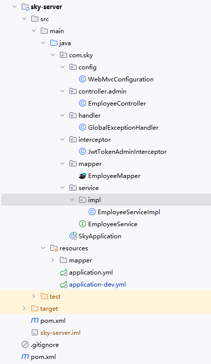
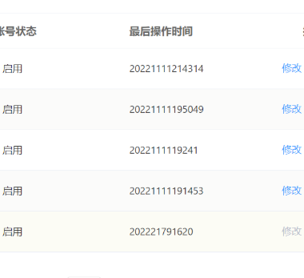
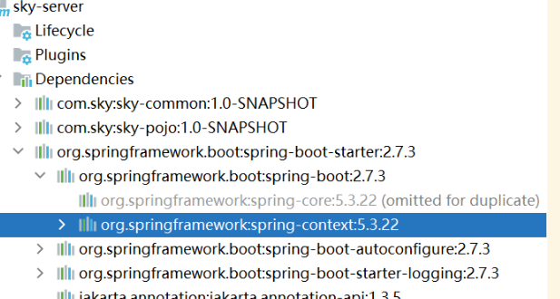
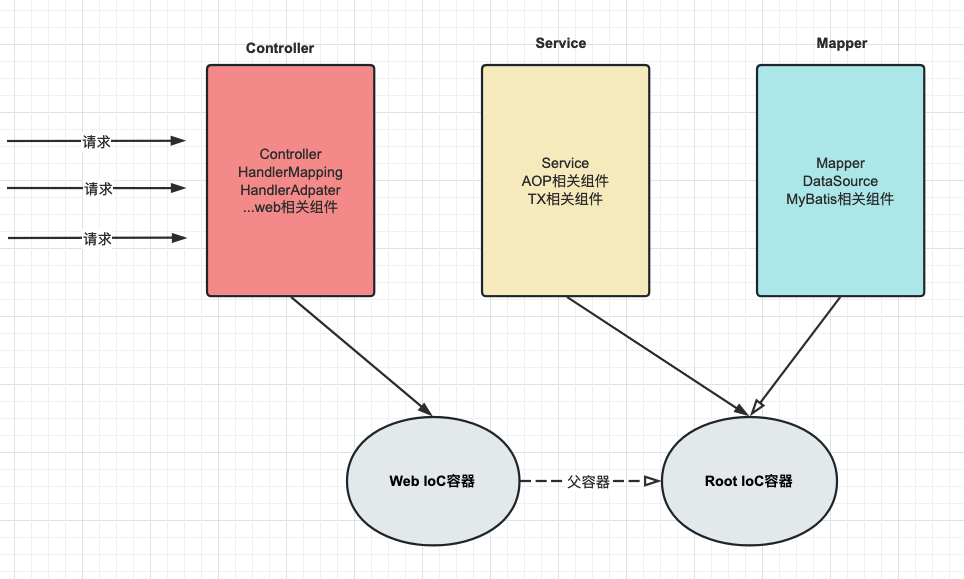
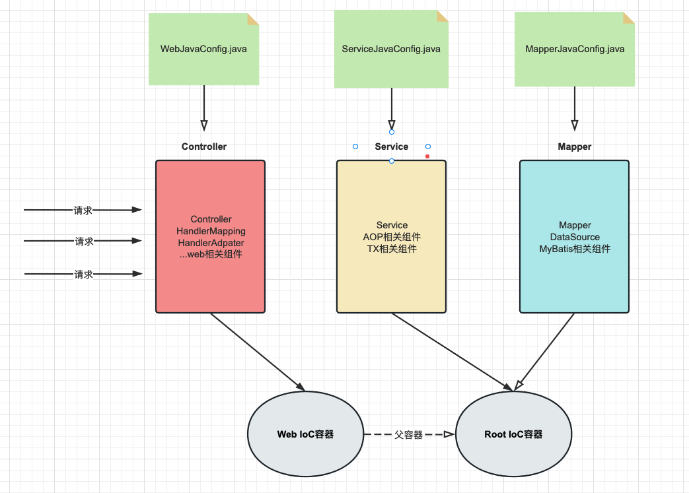
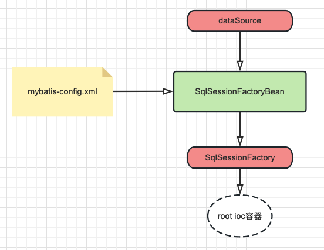
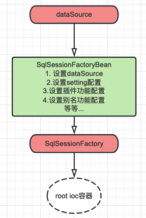
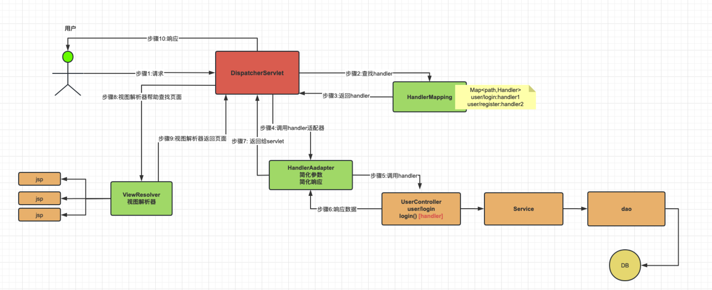
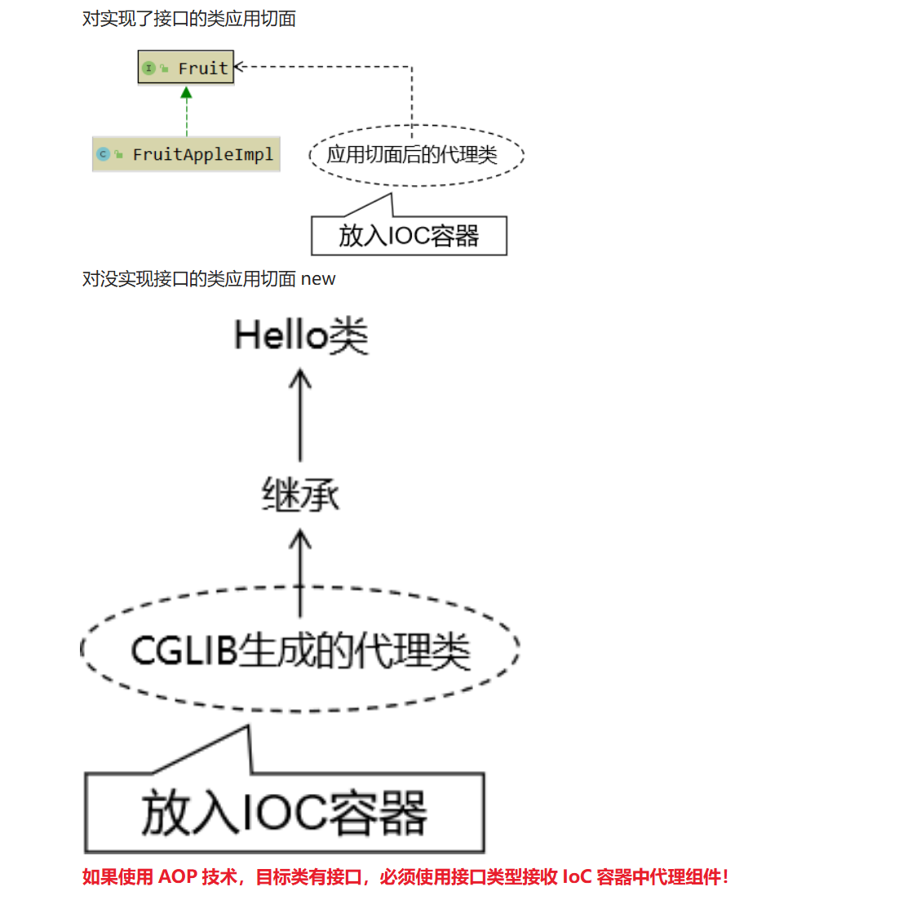

[苍穹外卖技术总结（适用于还没做项目、刚做完项目、技术学习）-CSDN博客.html](https://www.yuque.com/attachments/yuque/0/2025/html/34548170/1753867659001-ec584d94-d586-44c7-822c-ffd0daddf07e.html)

[【苍穹外卖 | 项目日记】第九天 万字总结-CSDN博客](https://liyuanxin.blog.csdn.net/article/details/134044210)

## 架构



## 开发步骤
  
需求分析和设计->查看产品原型->分析

接口设计->项目接口文档->查看接口设计

表设计->查看数据库表结构

代码开发->

### 新增员工
#### SQL语句编写
<font style="color:rgba(0, 0, 0, 0.9);background-color:rgb(252, 252, 252);">MySQL 抛出 </font>`<font style="color:rgba(0, 0, 0, 0.9);background-color:rgb(252, 252, 252);">Col</font><font style="color:rgba(0, 0, 0, 0.9);background-color:rgb(252, 252, 252);">u</font><font style="color:rgba(0, 0, 0, 0.9);background-color:rgb(252, 252, 252);">mn count doesn't match value count at row 1</font>`<font style="color:rgba(0, 0, 0, 0.9);background-color:rgb(252, 252, 252);"> 错误。</font>

<font style="color:rgba(0, 0, 0, 0.9);background-color:rgb(252, 252, 252);">原因:</font>

```plain
@Insert("INSERT INTO employee (name, username, password, phone, sex, id_number, status, " +
        "create_time, update_time, create_user, update_user) " +
        "VALUES (#{name},#{username},#{password},#{phone},#{sex},#{idNumber},#{createTime},#{updateTime},#{createUser},#{updateUser})")
void addEmployee(Employee employee);
```

语句中value缺少status,

虽然<font style="color:rgba(0, 0, 0, 0.9);background-color:rgb(252, 252, 252);">在数据库设计中，某些列可以设置 </font>**<font style="color:rgba(0, 0, 0, 0.9);background-color:rgb(252, 252, 252);">默认值（DEFAULT）</font>**

<font style="color:rgba(0, 0, 0, 0.9);background-color:rgb(252, 252, 252);">数据库默认值 </font>**<font style="color:rgba(0, 0, 0, 0.9);background-color:rgb(252, 252, 252);">仅在以下情况生效</font>**<font style="color:rgba(0, 0, 0, 0.9);background-color:rgb(252, 252, 252);">：</font>

+ **<font style="color:rgba(0, 0, 0, 0.9);background-color:rgb(252, 252, 252);">INSERT 语句未指定该列</font>**<font style="color:rgba(0, 0, 0, 0.9);background-color:rgb(252, 252, 252);">（完全忽略该列）。</font>
+ **<font style="color:rgba(0, 0, 0, 0.9);background-color:rgb(252, 252, 252);">显式使用</font>****<font style="color:rgba(0, 0, 0, 0.9);background-color:rgb(252, 252, 252);"> </font>**`**<font style="color:rgba(0, 0, 0, 0.9);background-color:rgb(252, 252, 252);">DEFAULT</font>**`**<font style="color:rgba(0, 0, 0, 0.9);background-color:rgb(252, 252, 252);"> </font>****<font style="color:rgba(0, 0, 0, 0.9);background-color:rgb(252, 252, 252);">关键字</font>**<font style="color:rgba(0, 0, 0, 0.9);background-color:rgb(252, 252, 252);">（如</font><font style="color:rgba(0, 0, 0, 0.9);background-color:rgb(252, 252, 252);"> </font>`<font style="color:rgba(0, 0, 0, 0.9);background-color:rgb(252, 252, 252);">INSERT INTO ... VALUES (..., DEFAULT)</font>`<font style="color:rgba(0, 0, 0, 0.9);background-color:rgb(252, 252, 252);">）。</font>

**<font style="color:rgba(0, 0, 0, 0.9);background-color:rgb(252, 252, 252);">如果你的 SQL 语句包含了该列，但未提供值，数据库不会自动填充默认值，而是报错！</font>**

#### BeanUtils库


```java
<dependency>
    <groupId>commons-beanutils</groupId>
    <artifactId>commons-beanutils</artifactId>
    <version>1.9.4</version>
</dependency>

```

#### <font style="color:rgb(79, 79, 79);">复制所有属性</font>
<font style="color:rgb(77, 77, 77);">要复制一个JavaBean的所有属性到另一个JavaBean，你可以使用</font>`<font style="color:rgb(199, 37, 78);background-color:rgb(249, 242, 244);">BeanUtils</font>`<font style="color:rgb(77, 77, 77);">类的</font>`<font style="color:rgb(199, 37, 78);background-color:rgb(249, 242, 244);">copyProperties</font>`<font style="color:rgb(77, 77, 77);">方法。</font>

:::tip
可以用于DTO对象属性拷贝到对应的实体类对象,需要属性名一致

<font style="color:rgb(0, 0, 0);">BeanUtils</font><font style="color:rgb(153, 153, 153);">.</font><font style="color:rgb(221, 74, 104);">copyProperties</font><font style="color:rgb(153, 153, 153);">(</font><font style="color:rgb(0, 0, 0);background-color:rgb(250, 250, 250);">destination</font><font style="color:rgb(153, 153, 153);">,</font><font style="color:rgb(0, 0, 0);background-color:rgb(250, 250, 250);"> source</font><font style="color:rgb(153, 153, 153);">);</font>

:::

[【Java 进阶篇】Java BeanUtils 使用详解-CSDN博客](https://blog.csdn.net/qq_21484461/article/details/134129489)

### 
#### Jwt令牌技术 <font style="color:rgb(25, 27, 31);">登录校验</font>
<font style="color:rgb(25, 27, 31);">服务器在登陆成功后生成一个令牌，jwt字符串，前端程序接收到存储在本地，后续的每一次请求通过token字段传递给服务端</font>

<font style="color:rgb(25, 27, 31);">JWT的组成： （JWT令牌由三个部分组成，三个部分之间</font>**<font style="color:rgb(25, 27, 31);">使用英文的点来分割</font>**<font style="color:rgb(25, 27, 31);">）</font>

+ <font style="color:rgb(25, 27, 31);">第一部分：</font>**<font style="color:#DF2A3F;">Header(头）</font>**<font style="color:rgb(25, 27, 31);">， 记录令牌类型、签名算法等。 例如：{"alg":"HS256","type":"JWT"}  
</font>
+ <font style="color:rgb(25, 27, 31);">第二部分：</font>**<font style="color:#DF2A3F;">Payload(有效载荷）</font>**<font style="color:rgb(25, 27, 31);">，携带一些自定义信息、默认信息等。 例如：{"id":"1","username":"Tom"}  
</font>
+ <font style="color:rgb(25, 27, 31);">第三部分：</font>**<font style="color:#DF2A3F;">Signature(签名）</font>**<font style="color:rgb(25, 27, 31);">，防止Token被篡改、确保安全性。将header、payload，并加入指定秘钥，通过指定签名算法计算而来。  
</font>

<font style="color:rgb(25, 27, 31);">JWT令牌最典型的应用场景就是登录认证：</font>

1. <font style="color:rgb(25, 27, 31);">在浏览器发起请求来执行登录操作，此时会访问登录的接口，如果登录成功之后，我们需要生成一个jwt令牌，将生成的 jwt令牌返回给前端。</font>
2. <font style="color:rgb(25, 27, 31);">前端拿到jwt令牌之后，会将jwt令牌存储起来。在后续的每一次请求中都会将jwt令牌携带到服务端。</font>
3. <font style="color:rgb(25, 27, 31);">服务端统一拦截请求之后，先来判断一下这次请求有没有把令牌带过来，如果没有带过来，直接拒绝访问，如果带过来了，还要校验一下令牌是否是有效。如果有效，就直接放行进行请求的处理。</font>

#### <font style="color:rgb(25, 27, 31);">ThreadLocal</font>
**介绍：**

<font style="color:rgb(25, 27, 31);">ThreadLocal 并不是一个Thread，而是Thread的局部变量。  
</font><font style="color:rgb(25, 27, 31);">ThreadLocal为每个线程提供单独一份存储空间，具有线程隔离的效果，只有在线程内才能获取到对应的值，线程外则不能访问。</font>

:::tip
<font style="color:rgb(25, 27, 31);">我们在客户端发起的每一次请求都是对应的一个单独的线程</font>

:::

**常用方法：**

+ <font style="color:rgb(25, 27, 31);">public void set(T value) 	设置当前线程的线程局部变量的值</font>
+ <font style="color:rgb(25, 27, 31);">public T get() 		返回当前线程所对应的线程局部变量的值</font>
+ <font style="color:rgb(25, 27, 31);">public void remove()        移除当前线程的线程局部变量</font>

### 员工分页查询
#### param参数接收
@RequestParam

<font style="color:rgb(0, 0, 0);">使用 </font>`<font style="color:rgb(204, 51, 51);background-color:rgb(245, 245, 245);">@RequestParam</font>`<font style="color:rgb(0, 0, 0);"> 注解来接收客户端参数。</font>

<font style="color:rgb(0, 0, 0);">!!!!!实体对象接受 </font>

<font style="color:rgb(0, 0, 0);">允许开发者使用实体对象来接收 HTTP 请求中的参数  </font>

#### <font style="color:rgb(0, 0, 0);">Mybatis分页插件 Pagehelper</font>
```java
启动器包含
<dependency>
   <groupId>com.github.pagehelper</groupId>
   <artifactId>pagehelper-spring-boot-starter</artifactId>
   <version>${pagehelper}</version>
</dependency>

```

具体来说，MyBatis 的插件机制包括以下三个组件：

1. `Interceptor`（拦截器）：定义一个拦截方法 `intercept`，该方法在执行 SQL 语句、执行查询、查询结果的映射时会被调用。
2. `Invocation`（调用）：实际上是对被拦截的方法的封装，封装了 `Object target`、`Method method` 和 `Object[] args` 这三个字段。
3. `InterceptorChain`（拦截器链）：对所有的拦截器进行管理，包括将所有的 Interceptor 链接成一条链，并在执行 SQL 语句时按顺序调用。

```java
// 使用
pagehelper 使用简单方便 ，只需要在查询语句之前使用
PageHelper.startPage(pageNum, pageSize, orderBy)

//orderBy 为String 填写 排序字段 

//查询之后将信息装入
PageInfo<Employee> pageInfo=new PageInfo<>(list);
pageInfo.getList()//获取列表信息

//直接在Sql语句返回Page<>对象

```

#### sql语句编写:
使用mybatis mapper.xml来编写对应的语句

使用标签 <if>添加动态的判断

查询 姓名 使用 like动态判断

使用通配符来模糊查询

#### 时间信息处理:


时间格式混乱不清晰

方法一使用 注解 @JsonFormat (parttern=<font style="color:#080808;background-color:#ffffff;">"yyyy-MM-dd HH:mm:ss"</font>)

方法二 SpringMVC消息转换器

代码格式固定

```java
// 在Web MvC配置文件中 重写

    /**
     * 扩展Spring MVC框架的消息转化器
     * @param converters
     */
    @Override
    protected void extendMessageConverters(List<HttpMessageConverter<?>> converters) {
        log.info("扩展消息转换器...");
        //创建一个消息转换器对象
        MappingJackson2HttpMessageConverter converter = new MappingJackson2HttpMessageConverter();
        //需要为消息转换器设置一个对象转换器，对象转换器可以将Java对象序列化为json数据
        converter.setObjectMapper(new JacksonObjectMapper());
        //将自己的消息转化器加入容器中 ,设置优先级为最高级别0
        converters.add(0,converter);
    }

//新建一个自己的对象转换器


package com.sky.json;

import com.fasterxml.jackson.databind.DeserializationFeature;
import com.fasterxml.jackson.databind.ObjectMapper;
import com.fasterxml.jackson.databind.module.SimpleModule;
import com.fasterxml.jackson.datatype.jsr310.deser.LocalDateDeserializer;
import com.fasterxml.jackson.datatype.jsr310.deser.LocalDateTimeDeserializer;
import com.fasterxml.jackson.datatype.jsr310.deser.LocalTimeDeserializer;
import com.fasterxml.jackson.datatype.jsr310.ser.LocalDateSerializer;
import com.fasterxml.jackson.datatype.jsr310.ser.LocalDateTimeSerializer;
import com.fasterxml.jackson.datatype.jsr310.ser.LocalTimeSerializer;

import java.time.LocalDate;
import java.time.LocalDateTime;
import java.time.LocalTime;
import java.time.format.DateTimeFormatter;

import static com.fasterxml.jackson.databind.DeserializationFeature.FAIL_ON_UNKNOWN_PROPERTIES;

/**
 * 对象映射器:基于jackson将Java对象转为json，或者将json转为Java对象
 * 将JSON解析为Java对象的过程称为 [从JSON反序列化Java对象]
 * 从Java对象生成JSON的过程称为 [序列化Java对象到JSON]
 */
public class JacksonObjectMapper extends ObjectMapper {

    public static final String DEFAULT_DATE_FORMAT = "yyyy-MM-dd";
    //public static final String DEFAULT_DATE_TIME_FORMAT = "yyyy-MM-dd HH:mm:ss";
    public static final String DEFAULT_DATE_TIME_FORMAT = "yyyy-MM-dd HH:mm";
    public static final String DEFAULT_TIME_FORMAT = "HH:mm:ss";

    public JacksonObjectMapper() {
        super();
        //收到未知属性时不报异常
        this.configure(FAIL_ON_UNKNOWN_PROPERTIES, false);

        //反序列化时，属性不存在的兼容处理
        this.getDeserializationConfig().withoutFeatures(DeserializationFeature.FAIL_ON_UNKNOWN_PROPERTIES);

        SimpleModule simpleModule = new SimpleModule()
                .addDeserializer(LocalDateTime.class, new LocalDateTimeDeserializer(DateTimeFormatter.ofPattern(DEFAULT_DATE_TIME_FORMAT)))
                .addDeserializer(LocalDate.class, new LocalDateDeserializer(DateTimeFormatter.ofPattern(DEFAULT_DATE_FORMAT)))
                .addDeserializer(LocalTime.class, new LocalTimeDeserializer(DateTimeFormatter.ofPattern(DEFAULT_TIME_FORMAT)))
                .addSerializer(LocalDateTime.class, new LocalDateTimeSerializer(DateTimeFormatter.ofPattern(DEFAULT_DATE_TIME_FORMAT)))
                .addSerializer(LocalDate.class, new LocalDateSerializer(DateTimeFormatter.ofPattern(DEFAULT_DATE_FORMAT)))
                .addSerializer(LocalTime.class, new LocalTimeSerializer(DateTimeFormatter.ofPattern(DEFAULT_TIME_FORMAT)));

        //注册功能模块 例如，可以添加自定义序列化器和反序列化器
        this.registerModule(simpleModule);
    }
}

```


## 公共字段自动填充
:::tip
使用AOP切面编程，实现功能增强，来完成公共字段自动填充功能。

:::

### 自定义注解
元注解的作用就是负责注解其他注解，java定义了4个标准的meta-annotation元注解类型，他们被用来对其他annotation类型做说明。

<1>:`<font style="color:#DF2A3F;">@Target</font>` :用来描述注解的使用范围，ElementType 枚举选择，可以看到，很多类型有，class，method等作用域。

**<font style="color:rgb(77, 77, 77);"><2>:</font>**`<font style="color:rgb(199, 37, 78);background-color:rgb(249, 242, 244);">@Retention</font>`<font style="color:rgb(77, 77, 77);">表示需要在什么级别保存到该注解信息，用于描述注解的生命周期，通过</font>`<font style="color:rgb(199, 37, 78);background-color:rgb(249, 242, 244);">RetentionPolicy</font>`<font style="color:rgb(77, 77, 77);"> 枚举进行选择，（</font>`<font style="color:rgb(199, 37, 78);background-color:rgb(249, 242, 244);">SOURCE<CLASS<RUNTIME</font>`<font style="color:rgb(77, 77, 77);">），默认为</font>`<font style="color:rgb(199, 37, 78);background-color:rgb(249, 242, 244);">RUNTIME</font>`

```java
public enum RetentionPolicy {
    /**
     * Annotations are to be discarded by the compiler.
     */
    SOURCE,

    /**
     * Annotations are to be recorded in the class file by the compiler
     * but need not be retained by the VM at run time.  This is the default
     * behavior.
     */
    CLASS,

    /**
     * Annotations are to be recorded in the class file by the compiler and
     * retained by the VM at run time, so they may be read reflectively.
     *
     * @see java.lang.reflect.AnnotatedElement
     */
    RUNTIME
}

```

| <font style="color:rgba(0, 0, 0, 0.9);">保留策略</font> | <font style="color:rgba(0, 0, 0, 0.9);">保留阶段</font> | <font style="color:rgba(0, 0, 0, 0.9);">是否可通过反射获取</font> | <font style="color:rgba(0, 0, 0, 0.9);">常见应用场景</font> |
| :---: | :---: | :---: | :---: |
| `<font style="color:rgba(0, 0, 0, 0.9);">SOURCE</font>` | <font style="color:rgba(0, 0, 0, 0.9);">源码阶段</font> | <font style="color:rgba(0, 0, 0, 0.9);">❌</font> | <font style="color:rgba(0, 0, 0, 0.9);">编译器提示、代码生成工具</font> |
| `<font style="color:rgba(0, 0, 0, 0.9);">CLASS</font>` | <font style="color:rgba(0, 0, 0, 0.9);">源码 + 字节码阶段</font> | <font style="color:rgba(0, 0, 0, 0.9);">❌</font> | <font style="color:rgba(0, 0, 0, 0.9);">字节码增强、AOP 预处理</font> |
| `<font style="color:rgba(0, 0, 0, 0.9);">RUNTIME</font>` | <font style="color:rgba(0, 0, 0, 0.9);">源码 + 字节码 + 运行时</font> | <font style="color:rgba(0, 0, 0, 0.9);">✅</font> | <font style="color:rgba(0, 0, 0, 0.9);">框架配置、运行时动态处理</font> |


**<font style="color:rgb(77, 77, 77);"><3>:</font>**`<font style="color:rgb(199, 37, 78);background-color:rgb(249, 242, 244);">@Document</font>`<font style="color:rgb(77, 77, 77);">说明该注解被说明在javadoc中</font>

**<font style="color:rgb(77, 77, 77);"><4>:</font>**`<font style="color:rgb(199, 37, 78);background-color:rgb(249, 242, 244);">@Inherited</font>`<font style="color:rgb(77, 77, 77);">:说明子类可以继承父类中的该注解。</font>

### <font style="color:rgb(77, 77, 77);">AOP 面向切面的编程</font>
<font style="color:#000000;">在Spring Boot应用中，通常通过</font>`<font style="color:#000000;">@SpringBootApplication</font>`<font style="color:#000000;">注解启动应用，该注解包含了</font>`<font style="color:#000000;">@EnableAspectJAutoProxy</font>`<font style="color:#000000;">，因此默认情况下Spring Boot应用是支持AOP的。</font>

#### <font style="color:#000000;">切点（Pointcut）</font>
<font style="color:#000000;">Spring AOP支持使用AspectJ切入点表达式来指定切点。这些表达式可以非常灵活地定义需要拦截的方法集合。以下是一些常用的切点指示符和示例：</font>

##### <font style="color:#000000;">execution</font>
`<font style="color:rgb(232, 62, 140);">execution</font>`<font style="color:rgb(102, 102, 102);">是最常用的切入点指示符，用于匹配方法执行的连接点。其语法结构如下：</font>


**<font style="color:rgb(102, 102, 102);">示例</font>**

+ <font style="color:rgb(102, 102, 102);">匹配任意类的任意方法：</font>`<font style="color:rgb(232, 62, 140);">execution(* *(..))</font>`
+ <font style="color:rgb(102, 102, 102);">匹配</font>`<font style="color:rgb(232, 62, 140);">com.example.service</font>`<font style="color:rgb(102, 102, 102);">包下所有类的所有方法：</font>`<font style="color:rgb(232, 62, 140);">execution(* com.example.service..*.*(..))</font>`
+ <font style="color:rgb(102, 102, 102);">匹配</font>`<font style="color:rgb(232, 62, 140);">MyService</font>`<font style="color:rgb(102, 102, 102);">类中的</font>`<font style="color:rgb(232, 62, 140);">doSomething</font>`<font style="color:rgb(102, 102, 102);">方法：</font>`<font style="color:rgb(232, 62, 140);">execution(* com.example.service.MyService.doSomething(..))</font>`
+ <font style="color:rgb(102, 102, 102);">匹配任意类的</font>`<font style="color:rgb(232, 62, 140);">save</font>`<font style="color:rgb(102, 102, 102);">方法，且方法参数为</font>`<font style="color:rgb(232, 62, 140);">java.lang.String</font>`<font style="color:rgb(102, 102, 102);">类型：</font>`<font style="color:rgb(232, 62, 140);">execution(* *.save(java.lang.String))</font>`

##### <font style="color:rgb(102, 102, 102);">within</font>
`<font style="color:rgb(232, 62, 140);">within</font>`<font style="color:rgb(102, 102, 102);">用于匹配指定类型内的方法执行，包括指定的接口、类或包。</font>

**<font style="color:rgb(102, 102, 102);">示例</font>**

+ <font style="color:rgb(102, 102, 102);">匹配</font>`<font style="color:rgb(232, 62, 140);">com.example.dao</font>`<font style="color:rgb(102, 102, 102);">包下的所有类的所有方法：</font>`<font style="color:rgb(232, 62, 140);">within(com.example.dao.*)</font>`
+ <font style="color:rgb(102, 102, 102);">匹配</font>`<font style="color:rgb(232, 62, 140);">com.example.dao</font>`<font style="color:rgb(102, 102, 102);">包及其子包中所有类中的所有方法：</font>`<font style="color:rgb(232, 62, 140);">within(com.example.dao..*)</font>`
+ <font style="color:rgb(102, 102, 102);">匹配实现了</font>`<font style="color:rgb(232, 62, 140);">UserService</font>`<font style="color:rgb(102, 102, 102);">接口的类的所有方法：</font>`<font style="color:rgb(232, 62, 140);">within(com.example.service.UserService+)</font>`

##### <font style="color:#000000;">this & target</font>
+ **<font style="color:#000000;">this</font>**<font style="color:#000000;">：用于匹配当前AOP代理对象类型的执行方法，注意是AOP代理对象的类型匹配。</font>
+ **<font style="color:#000000;">target</font>**<font style="color:#000000;">：用于匹配当前目标对象类型的执行方法，注意是目标对象的类型匹配。</font>

##### <font style="color:#000000;">args & @args</font>
+ **<font style="color:#000000;">args</font>**<font style="color:#000000;">：用于匹配当前执行的方法传入的参数为指定类型的执行方法，参数类型列表中的参数必须是类型全限定名，通配符不支持。</font>
+ **<font style="color:#000000;">@args</font>**<font style="color:#000000;">：匹配方法传入的参数所属类上拥有指定的注解的情况。</font>

##### <font style="color:#000000;">@within & @target & @annotation</font>
+ **<font style="color:#000000;">@within</font>**<font style="color:#000000;">：匹配类级别上应用了特定注解的类中的所有方法。</font>
+ **<font style="color:#000000;">@target</font>**<font style="color:#000000;">：匹配运行时目标对象（代理对象）的类型上应用了特定注解的方法（在Spring AOP中常用于代理对象的切点定义）。</font>
+ **<font style="color:#000000;">@annotation</font>**<font style="color:#000000;">：匹配方法级别上应用了特定注解的方法。</font>

**<font style="color:#000000;">示例</font>**

+ <font style="color:#000000;">匹配所有类上具体指定了</font>`<font style="color:#000000;">@MyAnnotation</font>`<font style="color:#000000;">注解的类内的所有方法：</font>`<font style="color:#000000;">@within(com.example.MyAnnotation)</font>`
+ <font style="color:#000000;">匹配当前目标对象类型持有</font>`<font style="color:#000000;">@MyAnnotation</font>`<font style="color:#000000;">注解的方法：</font>`<font style="color:#000000;">@target(com.example.MyAnnotation)</font>`
+ <font style="color:#000000;">匹配所有拥有</font>`<font style="color:#000000;">@MyAnnotation</font>`<font style="color:#000000;">注解的外部调用方法：</font>`<font style="color:#000000;">@annotation(com.example.MyAnnotation)</font>`


#### Joint Point
:::tip
JointPoint是程序运行过程中可识别的点，这个点可以用来作为AOP切入点。JointPoint对象则包含了和切入相关的很多信息。比如切入点的对象，方法，属性等。我们可以通过反射的方式获取这些点的状态和信息，用于追踪tracing和记录logging应用信息。

:::

Pointcut

pointcut 是一种程序结构和规则，它用于选取join point并收集这些point的上下文信息。

pointcut通常包含了一系列的Joint Point，我们可以通过pointcut来同时操作jointpoint。单从概念上，可以把Pointcut当做jointpoint的集合。


**JointPoint和ProceedingJoinPoint区别**

JointPoint

通过JointPoint对象可以获取到下面信息\

```java
# 返回目标对象，即被代理的对象
Object getTarget();

# 返回切入点的参数
Object[] getArgs();

# 返回切入点的Signature
Signature getSignature();

# 返回切入的类型，比如method-call，field-get等等，感觉不重要 
 String getKind();

```

<font style="color:rgb(79, 79, 79);">ProceedingJoinPoint</font>

<font style="color:rgb(77, 77, 77);">Proceedingjoinpoint 继承了 JoinPoint。是在JoinPoint的基础上暴露出 proceed 这个方法。proceed很重要，这个是aop代理链执行的方法。</font>

```java
环绕通知=前置+目标方法执行+后置通知，proceed方法就是用于启动目标方法执行的

// 使用@Around注解标明环绕通知方法
@Around(value = "com.atguigu.aop.aspect.AtguiguPointCut.transactionPointCut()")
public Object manageTransaction(
    
        // 通过在通知方法形参位置声明ProceedingJoinPoint类型的形参，
        // Spring会将这个类型的对象传给我们
        ProceedingJoinPoint joinPoint) {
    
    // 通过ProceedingJoinPoint对象获取外界调用目标方法时传入的实参数组
    Object[] args = joinPoint.getArgs();
    
    // 通过ProceedingJoinPoint对象获取目标方法的签名对象
    Signature signature = joinPoint.getSignature();
    
    // 通过签名对象获取目标方法的方法名
    String methodName = signature.getName();
    
    // 声明变量用来存储目标方法的返回值
    Object targetMethodReturnValue = null;
    
    try {
    
        // 在目标方法执行前：开启事务（模拟）
        log.debug("[AOP 环绕通知] 开启事务，方法名：" + methodName + "，参数列表：" + Arrays.asList(args));
    
        // 通过ProceedingJoinPoint对象调用目标方法
        // 目标方法的返回值一定要返回给外界调用者
        targetMethodReturnValue = joinPoint.proceed(args);
    
        // 在目标方法成功返回后：提交事务（模拟）
        log.debug("[AOP 环绕通知] 提交事务，方法名：" + methodName + "，方法返回值：" + targetMethodReturnValue);
    
    }catch (Throwable e){
    
        // 在目标方法抛异常后：回滚事务（模拟）
        log.debug("[AOP 环绕通知] 回滚事务，方法名：" + methodName + "，异常：" + e.getClass().getName());
    
    }finally {
    
        // 在目标方法最终结束后：释放数据库连接
        log.debug("[AOP 环绕通知] 释放数据库连接，方法名：" + methodName);
    
    }
    
    return targetMethodReturnValue;
}
```

**JointPoint使用详解**

这里详细介绍JointPoint的方法，这部分很重要是coding核心参考部分。开始之前我们思考一下，我们到底需要获取切入点的那些信息。我的思考如下

+ 切入点的方法名字及其参数
+ 切入点方法标注的注解对象（通过该对象可以获取注解信息）
+ 切入点目标对象（可以通过反射获取对象的类名，属性和方法名）

<font style="color:#DF2A3F;">注：有一点非常重要，Spring的AOP只能支持到方法级别的切入。换句话说，切入点只能是某个方法。</font>


## 新增菜品


自增长类型主键

Mapper.xml中的语句设置自增长主键

useGeneratedKeys 属性 和   keyProperty 属性

Foreach 批量语句的标签使用

```java
<!--
    collection属性：要遍历的集合 也就是传进来需要便利的对象名字
    item属性：遍历集合的过程中能得到每一个具体对象，命名可以自由:在item属性中设置一个名字，将来通过这个名字引用遍历出来的对象
    separator属性：指定当foreach标签的标签体重复拼接字符串时，各个标签体字符串之间的分隔符
    open属性：指定整个最外面循环把字符串拼好后，字符串整体的前面要添加的字符串
    close属性：指定整个最外面循环把字符串拼好后，字符串整体的后面要添加的字符串
    index属性：这里起一个名字，便于后面引用
        遍历List集合，这里能够得到List集合的索引值
        遍历Map集合，这里能够得到Map集合的key
 -->
<foreach collection="empList" item="emp" separator="," open="values" index="myIndex">
    <!-- 在foreach标签内部如果需要引用遍历得到的具体的一个对象，需要使用item属性声明的名称 -->
    (#{emp.empName},#{myIndex},#{emp.empSalary},#{emp.empGender})
</foreach>
```


## Spring Cache
Spring Cache 是一个框架，实现了基于注解的缓存功能，只需要简单地加一个注解，就能实现缓存功能。

Spring Cache 提供了一层抽象，底层可以切换不同的缓存实现，例如：

+ EHCache
+ Caffeine
+ Redis(常用)

```python
<dependency>
	<groupId>org.springframework.boot</groupId>
	<artifactId>spring-boot-starter-cache</artifactId>  		            		       	 <version>2.7.3</version> 
</dependency>

```

#### 常用注解
在SpringCache中提供了很多缓存操作的注解，常见的是以下的几个：

| **注解** | **说明** |
| --- | --- |
| @EnableCaching | 开启缓存注解功能，通常加在启动类上 |
| @Cacheable | 在方法执行前先查询缓存中是否有数据，如果有数据，则直接返回缓存数据；如果没有缓存数据，调用方法并将方法返回值放到缓存中 |
| @CachePut | 将方法的返回值放到缓存中 |
| @CacheEvict | 将一条或多条数据从缓存中删除 |


在spring boot项目中，使用缓存技术只需在项目中导入相关缓存技术的依赖包，并在启动类上使用@EnableCaching开启缓存支持即可。

例如，使用Redis作为缓存技术，只需要导入Spring data Redis的maven坐标即可。


## Spring Task使用步骤
1). 导入maven坐标 spring-context（已存在）



2). 启动类添加注解 @EnableScheduling 开启任务调度

3). 自定义定时任务类


## swagger
Swagger 是一个规范和完整的框架，用于生成、描述、调用和可视化 RESTful 风格的 Web 服务([https://swagger.io/](https://swagger.io/))。 它的主要作用是：

1. 使得前后端分离开发更加方便，有利于团队协作
2. 接口的文档在线自动生成，降低后端开发人员编写接口文档的负担
3. **功能测试**

Spring已经将Swagger纳入自身的标准，建立了Spring-swagger项目，现在叫Springfox。通过在项目中引入Springfox ，即可非常简单快捷的使用Swagger。

knife4j是为Java MVC框架集成Swagger生成Api文档的增强解决方案,

:::tip
主要是固定的配置,可以直接复制

:::

```java
<dependency>
   <groupId>com.github.xiaoymin</groupId>
   <artifactId>knife4j-spring-boot-starter</artifactId>
</dependency>

------------------------------------------------------------

//在MvxConfiguration中添加Bean组件
    /**
     * 通过knife4j生成接口文档
     * @return
     */
    @Bean
    public Docket docket() {
        ApiInfo apiInfo = new ApiInfoBuilder()
                .title("苍穹外卖项目接口文档")
                .version("2.0")
                .description("苍穹外卖项目接口文档")
                .build();
        Docket docket = new Docket(DocumentationType.SWAGGER_2)
                .apiInfo(apiInfo)
                .select()
                //生成接口文档需要扫描的包
                .apis(RequestHandlerSelectors.basePackage("com.sky.controller"))
                .paths(PathSelectors.any())
                .build();
        return docket;
    }


//设置静态资源映射，否则接口文档页面无法访问
/**
     * 设置静态资源映射
     * @param registry
*/
protected void addResourceHandlers(ResourceHandlerRegistry registry) {
        registry.addResourceHandler("/doc.html").addResourceLocations("classpath:/META-INF/resources/");
        registry.addResourceHandler("/webjars/**").addResourceLocations("classpath:/META-INF/resources/webjars/");
}


```

#### 错误:<font style="color:rgba(0, 0, 0, 0.9);background-color:rgb(252, 252, 252);">Failed to start bean 'documentationPluginsBootstrapper'</font>
在创建test测试方法的时候出现java.lang.IllegalStateException: Failed to load ApplicationContext错误

在测试类注解中添加properties 来解决

**<font style="color:rgba(0, 0, 0, 0.9);background-color:rgb(252, 252, 252);">作用</font>**<font style="color:rgba(0, 0, 0, 0.9);background-color:rgb(252, 252, 252);">：跳过 SpringFox 初始化，避免启动失败</font>

```plain
@SpringBootTest(properties = "springfox.documentation.enabled=false")
public class SpringDataRedisTest {
```

<font style="color:rgba(0, 0, 0, 0.9);background-color:rgb(252, 252, 252);">直接原因是：</font>

+ **<font style="color:rgba(0, 0, 0, 0.9);background-color:rgb(252, 252, 252);">NullPointerException</font>**<font style="color:rgba(0, 0, 0, 0.9);background-color:rgb(252, 252, 252);">：</font>`<font style="color:rgba(0, 0, 0, 0.9);background-color:rgb(252, 252, 252);">PatternsRequestCondition</font>`<font style="color:rgba(0, 0, 0, 0.9);background-color:rgb(252, 252, 252);"> </font><font style="color:rgba(0, 0, 0, 0.9);background-color:rgb(252, 252, 252);">对象为</font><font style="color:rgba(0, 0, 0, 0.9);background-color:rgb(252, 252, 252);"> </font>`<font style="color:rgba(0, 0, 0, 0.9);background-color:rgb(252, 252, 252);">null</font>`
+ **<font style="color:rgba(0, 0, 0, 0.9);background-color:rgb(252, 252, 252);">版本冲突</font>**<font style="color:rgba(0, 0, 0, 0.9);background-color:rgb(252, 252, 252);">：Spring Boot 2.6+ 默认使用 </font>`<font style="color:rgba(0, 0, 0, 0.9);background-color:rgb(252, 252, 252);">PathPatternParser</font>`<font style="color:rgba(0, 0, 0, 0.9);background-color:rgb(252, 252, 252);"> 路径匹配策略，而 SpringFox 3.0.0 依赖旧的 </font>`<font style="color:rgba(0, 0, 0, 0.9);background-color:rgb(252, 252, 252);">AntPathMatcher</font>`<font style="color:rgba(0, 0, 0, 0.9);background-color:rgb(252, 252, 252);">，导致初始化失败 。</font>


## maven工程基本配置
GAVP四属性

GroupID：com.公司.业务线.子业务线

ArtifactID: 产品线名-模块名

Version版本号:

1） 主版本号：当做了不兼容的 API 修改，或者增加了能改变产品方向的新功能。

2） 次版本号：当做了向下兼容的功能性新增（新增类、接口等）。

3） 修订号：修复 bug，没有修改方法签名的功能加强，保持 API 兼容性。

Package:

### <font style="color:rgb(34, 34, 38);">父类与子类pom.xml的关联</font>
+ <font style="color:rgb(79, 79, 79);">父类 POM 是一个聚合工程（</font>`<font style="color:#DF2A3F;">packaging</font>`<font style="color:#DF2A3F;"> 为 </font>`<font style="color:#DF2A3F;">pom</font>`<font style="color:rgb(79, 79, 79);">），它通过 </font>`<font style="color:rgb(79, 79, 79);"><modules></font>`<font style="color:rgb(79, 79, 79);"> 标签声明子模块，并通过 </font>`<font style="color:rgb(79, 79, 79);"><dependencyManagement></font>`<font style="color:rgb(79, 79, 79);"> 管理依赖版本。</font>

<font style="color:rgb(79, 79, 79);"></font>

## <font style="color:rgb(79, 79, 79);">整合ssm(非SpringBoot)情况下</font>


本质上说，整合就是将三层架构和框架核心API组件交给SpringIoC容器管理！

一个容器可能就够了，但是我们常见的操作是创建两个IoC容器（web容器和root容器）**，组件分类管理！**

| 容器名 | 盛放组件 |
| --- | --- |
| web容器 | web相关组件（controller,springmvc核心组件） |
| root容器 | 业务和持久层相关组件（service,aop,tx,dataSource,mybatis,mapper等） |


### 配置类相关


<font style="color:rgba(0, 0, 0, 0.85);">配置类的数量不是固定的，但是至少要两个，为了方便编写，我们可以三层架构每层对应一个配置类，分别指定两个容器加载即可！</font>

| <font style="color:rgba(0, 0, 0, 0.85);">配置名</font> | <font style="color:rgba(0, 0, 0, 0.85);">对应内容</font> | <font style="color:rgba(0, 0, 0, 0.85);">对应容器</font> |
| --- | --- | --- |
| <font style="color:rgba(0, 0, 0, 0.85);">WebJavaConfig</font> | <font style="color:rgba(0, 0, 0, 0.85);">controller,springmvc相关</font> | <font style="color:rgba(0, 0, 0, 0.85);">web容器</font> |
| <font style="color:rgba(0, 0, 0, 0.85);">ServiceJavaConfig</font> | <font style="color:rgba(0, 0, 0, 0.85);">service,aop,tx相关</font> | <font style="color:rgba(0, 0, 0, 0.85);">root容器</font> |
| <font style="color:rgba(0, 0, 0, 0.85);">MapperJavaConfig</font> | <font style="color:rgba(0, 0, 0, 0.85);">mapper,datasource,mybatis相关</font> | <font style="color:rgba(0, 0, 0, 0.85);">root容器</font> |


#### IOC容器的初始化方式和配置的位置
 在web项目下，我们可以选择<font style="color:#DF2A3F;">web.xml</font>和<font style="color:#DF2A3F;">配置类</font>俩种<font style="color:#262626;">方式进</font>行ioc配置，推荐配置类。  

图解配置类和容器配置：


```java
public class MyWebAppInitializer extends AbstractAnnotationConfigDispatcherServletInitializer {

  //指定root容器对应的配置类
  //root容器的配置类
  @Override
  protected Class<?>[] getRootConfigClasses() {
    return new Class<?>[] { ServiceJavaConfig.class,MapperJavaConfig.class };
  }
  
  //指定web容器对应的配置类 webioc容器的配置类
  @Override
  protected Class<?>[] getServletConfigClasses() {
    return new Class<?>[] { WebJavaConfig.class };
  }
  
  //指定dispatcherServlet处理路径，通常为 / 
  @Override
  protected String[] getServletMappings() {
    return new String[] { "/" };
  }
}
```

#### 各层配置
1. logback.xml    日志输出相关配置设置

```java
<?xml version="1.0" encoding="UTF-8"?>
<configuration debug="true">
    <!-- 指定日志输出的位置，ConsoleAppender表示输出到控制台 -->
    <appender name="STDOUT"
              class="ch.qos.logback.core.ConsoleAppender">
        <encoder>
            <!-- 日志输出的格式 -->
            <!-- 按照顺序分别是：时间、日志级别、线程名称、打印日志的类、日志主体内容、换行 -->
            <pattern>[%d{HH:mm:ss.SSS}] [%-5level] [%thread] [%logger] [%msg]%n</pattern>
            <charset>UTF-8</charset>
        </encoder>
    </appender>

    <!-- 设置全局日志级别。日志级别按顺序分别是：TRACE、DEBUG、INFO、WARN、ERROR -->
    <!-- 指定任何一个日志级别都只打印当前级别和后面级别的日志。 -->
    <root level="DEBUG">
        <!-- 指定打印日志的appender，这里通过“STDOUT”引用了前面配置的appender -->
        <appender-ref ref="STDOUT" />
    </root>

    <!-- 根据特殊需求指定局部日志级别，可也是包名或全类名。 -->
    <logger name="com.atguigu.mybatis" level="DEBUG" />

</configuration>
```

2. 控制层配置

  主要实现controller,springmvc相关组件的配置

```java
/**
 * projectName: com.atguigu.config
 * 
 * 1.要实现Springmvc组件声明标准化接口WebMvcConfigurer 提供了各种组件对应的方法
 * 2.添加配置类注解@Configuration
 * 3.添加mvc复合功能开关@EnableWebMvc
 * 4.添加controller层扫描注解
 * 5.开启默认处理器,支持静态资源处理
 */
@Configuration
@EnableWebMvc
@ComponentScan("com.atguigu.controller")
public class WebJavaConfig implements WebMvcConfigurer {

    //开启静态资源
    @Override
    public void configureDefaultServletHandling(DefaultServletHandlerConfigurer configurer) {
        configurer.enable(); 
    }
}

```

3. 业务层配置

主要实现service配置,注解AOP和申明事务相关配置

```java
/**
 * projectName: com.atguigu.config
 * 
 * 1. 声明@Configuration注解,代表配置类
 * 2. 声明@EnableTransactionManagement注解,开启事务注解支持
 * 3. 声明@EnableAspectJAutoProxy注解,开启aspect aop注解支持
 * 4. 声明@ComponentScan("com.atguigu.service")注解,进行业务组件扫描
 * 5. 声明transactionManager(DataSource dataSource)方法,指定具体的事务管理器
 */
@EnableTransactionManagement
@EnableAspectJAutoProxy
@Configuration
@ComponentScan("com.atguigu.service")
public class ServiceJavaConfig {
    
    @Bean
    public DataSourceTransactionManager transactionManager(DataSource dataSource){
        DataSourceTransactionManager transactionManager = new DataSourceTransactionManager();
        transactionManager.setDataSource(dataSource);
        return transactionManager;
    }
    
}
```

4. 持久层配置

主要配置Mapper代理对象,连接池和Mybatis组件相关配置

mabatis 的api实例化需要复杂的过程  

本来	 要实现sqlSessionFactory=>  读取配置=>实例化sqlSession=>获取Mapper代理对象

↓

优化    官方的sqlSessionFactoryBean 封装SqlSessionFactory和Mapper实例化的逻辑  

先准备外部配置文件

```java
#数据库连接信息
jdbc.user=root
jdbc.password=root
jdbc.url=jdbc:mysql:///mybatis-example
jdbc.driver=com.mysql.cj.jdbc.Driver
```

整合1:



 数据库信息以及mapper扫描包设置使用Java配置类处理  

 mybatis其他的功能（别名、settings、插件等信息）依然在mybatis-config.xml配置！  

```java
<?xml version="1.0" encoding="UTF-8" ?>
<!DOCTYPE configuration
        PUBLIC "-//mybatis.org//DTD Config 3.0//EN"
        "http://mybatis.org/dtd/mybatis-3-config.dtd">
<configuration>
    <settings>
        <!-- 开启驼峰式映射-->
        <setting name="mapUnderscoreToCamelCase" value="true"/>
        <!-- 开启logback日志输出-->
        <setting name="logImpl" value="SLF4J"/>
        <!--开启resultMap自动映射 -->
        <setting name="autoMappingBehavior" value="FULL"/>
    </settings>

    <typeAliases>
        <!-- 给实体类起别名 -->
        <package name="com.atguigu.pojo"/>
    </typeAliases>

    <plugins>
        <plugin interceptor="com.github.pagehelper.PageInterceptor">
            <!--
                helperDialect：分页插件会自动检测当前的数据库链接，自动选择合适的分页方式。
                你可以配置helperDialect属性来指定分页插件使用哪种方言。配置时，可以使用下面的缩写值：
                oracle,mysql,mariadb,sqlite,hsqldb,postgresql,db2,sqlserver,informix,h2,sqlserver2012,derby
                （完整内容看 PageAutoDialect） 特别注意：使用 SqlServer2012 数据库时，
                https://github.com/pagehelper/Mybatis-PageHelper/blob/master/wikis/zh/HowToUse.md#%E5%A6%82%E4%BD%95%E9%85%8D%E7%BD%AE%E6%95%B0%E6%8D%AE%E5%BA%93%E6%96%B9%E8%A8%80
             -->
            <property name="helperDialect" value="mysql"/>
        </plugin>
    </plugins>
</configuration>
```

 	mybatis和持久层配置类  	

需要拆分成数据库配置类和  持久层Mapper以及Mybatis配置  

避免 @Value注解读取不到值为null的问题  

```java
//拆分数据库配置

@Configuration
@PropertySource("classpath:jdbc.properties")
public class DataSourceJavaConfig {


    @Value("${jdbc.user}")
    private String user;
    @Value("${jdbc.password}")
    private String password;
    @Value("${jdbc.url}")
    private String url;
    @Value("${jdbc.driver}")
    private String driver;


    //数据库连接池配置
    @Bean
    public DataSource dataSource(){
        DruidDataSource dataSource = new DruidDataSource();
        dataSource.setUsername(user);
        dataSource.setPassword(password);
        dataSource.setUrl(url);
        dataSource.setDriverClassName(driver);
        return dataSource;
    }

}
```

```java
@Configuration
public class MapperJavaConfig {

    /**
     * 配置SqlSessionFactoryBean,指定连接池对象和外部配置文件即可
     * @param dataSource 需要注入连接池对象
     * @return 工厂Bean
     */
    @Bean
    public SqlSessionFactoryBean sqlSessionFactoryBean(DataSource dataSource){
        //实例化SqlSessionFactory工厂
        SqlSessionFactoryBean sqlSessionFactoryBean = new SqlSessionFactoryBean();

        //设置连接池
        sqlSessionFactoryBean.setDataSource(dataSource);

        //设置配置文件
        //包裹外部配置文件地址对象
        Resource resource = new ClassPathResource("mybatis-config.xml");
        sqlSessionFactoryBean.setConfigLocation(resource);

        return sqlSessionFactoryBean;
    }

    /**
     * 配置Mapper实例扫描工厂,配置 <mapper <package 对应接口和mapperxml文件所在的包
     * @return
     */
    @Bean
    public MapperScannerConfigurer mapperScannerConfigurer(){
        MapperScannerConfigurer mapperScannerConfigurer = new MapperScannerConfigurer();
        //设置mapper接口和xml文件所在的共同包
        mapperScannerConfigurer.setBasePackage("com.atguigu.mapper");
        return mapperScannerConfigurer;
    }

}
```

 整合方式2（完全配置类 去掉mybatis-config.xml）  :

 不在保留mybatis的外部配置文件（xml）, 所有配置信息（settings、插件、别名等）全部在声明SqlSessionFactoryBean的代码中指定！数据库信息依然使用DruidDataSource实例替代！  



```java
/**
 * projectName: com.atguigu.config
 *
 * description: 持久层配置和Druid和Mybatis配置 使用一个配置文件
 */
@Configuration
public class MapperJavaConfigNew {

    /**
     * 配置SqlSessionFactoryBean,指定连接池对象和外部配置文件即可
     * @param dataSource 需要注入连接池对象
     * @return 工厂Bean
     */
    @Bean
    public SqlSessionFactoryBean sqlSessionFactoryBean(DataSource dataSource){
        //实例化SqlSessionFactory工厂
        SqlSessionFactoryBean sqlSessionFactoryBean = new SqlSessionFactoryBean();

        //设置连接池
        sqlSessionFactoryBean.setDataSource(dataSource);

        //TODO: 替代xml文件的java配置
        /*

            <settings>
                <!-- 开启驼峰式映射-->
                <setting name="mapUnderscoreToCamelCase" value="true"/>
                <!-- 开启logback日志输出-->
                <setting name="logImpl" value="SLF4J"/>
                <!--开启resultMap自动映射 -->
                <setting name="autoMappingBehavior" value="FULL"/>
            </settings>

            <typeAliases>
                <!-- 给实体类起别名 -->
                <package name="com.atguigu.pojo"/>
            </typeAliases>

            <plugins>
                <plugin interceptor="com.github.pagehelper.PageInterceptor">
                    <!--
                        helperDialect：分页插件会自动检测当前的数据库链接，自动选择合适的分页方式。
                        你可以配置helperDialect属性来指定分页插件使用哪种方言。配置时，可以使用下面的缩写值：
                        oracle,mysql,mariadb,sqlite,hsqldb,postgresql,db2,sqlserver,informix,h2,sqlserver2012,derby
                        （完整内容看 PageAutoDialect） 特别注意：使用 SqlServer2012 数据库时，
                        https://github.com/pagehelper/Mybatis-PageHelper/blob/master/wikis/zh/HowToUse.md#%E5%A6%82%E4%BD%95%E9%85%8D%E7%BD%AE%E6%95%B0%E6%8D%AE%E5%BA%93%E6%96%B9%E8%A8%80
                     -->
                    <property name="helperDialect" value="mysql"/>
                </plugin>
            </plugins>

         */

        //settings [包裹到一个configuration对象,切记别倒错包]
        org.apache.ibatis.session.Configuration configuration = new org.apache.ibatis.session.Configuration();
        configuration.setMapUnderscoreToCamelCase(true);
        configuration.setLogImpl(Slf4jImpl.class);
        configuration.setAutoMappingBehavior(AutoMappingBehavior.FULL);
        sqlSessionFactoryBean.setConfiguration(configuration);

        //typeAliases
        sqlSessionFactoryBean.setTypeAliasesPackage("com.atguigu.pojo");

        //分页插件配置
        PageInterceptor pageInterceptor = new PageInterceptor();

        Properties properties = new Properties();
        properties.setProperty("helperDialect","mysql");
        pageInterceptor.setProperties(properties);
        sqlSessionFactoryBean.addPlugins(pageInterceptor);

        return sqlSessionFactoryBean;
    }

    /**
     * 配置Mapper实例扫描工厂,配置 <mapper <package 对应接口和mapperxml文件所在的包
     * @return
     */
    @Bean
    public MapperScannerConfigurer mapperScannerConfigurer(){
        MapperScannerConfigurer mapperScannerConfigurer = new MapperScannerConfigurer();
        //设置mapper接口和xml文件所在的共同包
        mapperScannerConfigurer.setBasePackage("com.atguigu.mapper");
        return mapperScannerConfigurer;
    }

}
```

## SpringBoot整合
:::tip
<font style="color:rgba(0, 0, 0, 0.9);">Spring Boot 的核心特性之一就是 </font>**<font style="color:rgba(0, 0, 0, 0.9);">自动装配</font>**<font style="color:rgba(0, 0, 0, 0.9);">，它可以根据项目的依赖（如 </font>`<font style="color:rgba(0, 0, 0, 0.9);">druid-spring-boot-starter</font>`<font style="color:rgba(0, 0, 0, 0.9);">）自动配置 Bean，而无需手动编写大量 XML 或 Java 配置代码。</font>

<font style="color:rgba(0, 0, 0, 0.9);">例如：</font>

+ <font style="color:rgba(0, 0, 0, 0.9);">当你引入</font><font style="color:rgba(0, 0, 0, 0.9);"> </font>`<font style="color:rgba(0, 0, 0, 0.9);">spring-boot-starter-jdbc</font>`<font style="color:rgba(0, 0, 0, 0.9);">，Spring Boot 会自动配置</font><font style="color:rgba(0, 0, 0, 0.9);"> </font>`<font style="color:rgba(0, 0, 0, 0.9);">DataSource</font>`<font style="color:rgba(0, 0, 0, 0.9);">。</font>
+ <font style="color:rgba(0, 0, 0, 0.9);">当你引入 </font>`<font style="color:rgba(0, 0, 0, 0.9);">druid-spring-boot-starter</font>`<font style="color:rgba(0, 0, 0, 0.9);">，Druid 会自动替换默认的 </font>`<font style="color:rgba(0, 0, 0, 0.9);">DataSource</font>`<font style="color:rgba(0, 0, 0, 0.9);"> 实现，并加载相关配置。</font>

:::

### 依赖
  在Spring Boot提供了一个名为spring-boot-starter-parent的工程  以这个项目为父工程，这样我们就不用操心依赖的版本问题了，需要什么依赖，直接引入坐标(不需要添加版本)即可！  

```java
<!--所有springboot项目都必须继承自 spring-boot-starter-parent-->
<parent>
    <groupId>org.springframework.boot</groupId>
    <artifactId>spring-boot-starter-parent</artifactId>
    <version>3.0.5</version>
</parent>
```

 为了让Spring Boot帮我们完成各种自动配置，我们必须引**入Spring Boot提供的自动配置依赖**，我们称为**启动器**。  

```java
<dependencies>
<!--web开发的场景启动器-->
    <dependency>
        <groupId>org.springframework.boot</groupId>
        <artifactId>spring-boot-starter-web</artifactId>
    </dependency>
</dependencies>
```


```java
package com.atguigu;

import org.springframework.boot.SpringApplication;
import org.springframework.boot.autoconfigure.SpringBootApplication;

/**
 * @SpringBootApplication是一个特殊的注解，用于标识一个Spring Boot应用程序的入口类。它的主要作用是将三个常用注解组合在一起，简化了配置的过程。
 *
 * 具体而言，@SpringBootApplication注解包含以下三个注解的功能：
 *     @Configuration：将该类标识为应用程序的配置类。它允许使用Java代码定义和配置Bean。
 *     @EnableAutoConfiguration：启用Spring Boot的自动配置机制。它根据项目的依赖项自动配置Spring应用程序的行为。自动配置根据类路径、注解和配置属性等条件来决定要使用的功能和配置。
 *     @ComponentScan：自动扫描并加载应用程序中的组件，如控制器、服务、存储库等。它默认扫描@SpringBootApplication注解所在类的包及其子包中的组件。
 *
 * 使用@SpringBootApplication注解，可以将上述三个注解的功能集中在一个注解上，简化了配置文件的编写和组件的加载和扫描过程。它是Spring Boot应用程序的入口点，标识了应用程序的主类，
 * 并告诉Spring Boot在启动时应如何配置和加载应用程序。
 */
@SpringBootApplication
public class MainApplication {

    //SpringApplication.run() 方法是启动 Spring Boot 应用程序的关键步骤。它创建应用程序上下文、
    // 自动配置应用程序、启动应用程序，并处理命令行参数，使应用程序能够运行和提供所需的功能
    public static void main(String[] args) {
        SpringApplication.run(MainApplication.class,args);
    }
}
```

### springboot统一配置管理
   想设置的  任何参数  集中到一个固定位置和命名的配置文件（application.properties或application.yml）中！  

 	配置文件应该放置在Spring Boot工程的**src/main/resources**目录下。这是因为src/main/resources目录**是Spring Boot默认的类路径（classpath）**，配置文件会被自动加载并可供应用程序访问。  


####  @ConfigurationProperties  批量配置文件注入
 可以将一些配置属性批量注入到bean对象。  

在类上通过@ConfigurationProperties注解声明该类要读取属性配置

prefix="spring.jdbc.datasource" 读取属性文件中前缀为spring.jdbc.datasource的值。前缀和属性名称和配置文件中的key必须要保持一致才可以注入成功

### 各层整合
#### MVC
引入依赖 =>创建启动类=>编写 controller 

```java
<?xml version="1.0" encoding="UTF-8"?>
<project xmlns="http://maven.apache.org/POM/4.0.0"
         xmlns:xsi="http://www.w3.org/2001/XMLSchema-instance"
         xsi:schemaLocation="http://maven.apache.org/POM/4.0.0 http://maven.apache.org/xsd/maven-4.0.0.xsd">
    <modelVersion>4.0.0</modelVersion>

    <parent>
        <groupId>org.springframework.boot</groupId>
        <artifactId>spring-boot-starter-parent</artifactId>
        <version>3.0.5</version>
    </parent>

    <groupId>com.atguigu</groupId>
    <artifactId>springboot-starter-springmvc-03</artifactId>
    <version>1.0-SNAPSHOT</version>

    <properties>
        <maven.compiler.source>17</maven.compiler.source>
        <maven.compiler.target>17</maven.compiler.target>
        <project.build.sourceEncoding>UTF-8</project.build.sourceEncoding>
    </properties>

    <dependencies>
        <!--        web开发的场景启动器 -->
        <dependency>
            <groupId>org.springframework.boot</groupId>
            <artifactId>spring-boot-starter-web</artifactId>
        </dependency>
    </dependencies>

</project>
```

##### web相关的yml文件配置
```java
# web相关的配置
# https://docs.spring.io/spring-boot/docs/current/reference/html/application-properties.html#appendix.application-properties.server
server:
  # 端口号设置
  port: 80
  # 项目根路径
  servlet:
    context-path: /boot
spring:
  web:
    resources:
      # 配置静态资源地址,如果设置,会覆盖默认值
      static-locations: classpath:/webapp
    
```

**默认的静态资源路径为：**

**· classpath:/META-INF/resources/**

**· classpath:/resources/**

**· classpath:/static/**

**· classpath:/public/**

##### 拦截器:
```java
package com.atguigu.interceptor;

import jakarta.servlet.http.HttpServletRequest;
import jakarta.servlet.http.HttpServletResponse;
import org.springframework.stereotype.Component;
import org.springframework.web.servlet.HandlerInterceptor;
import org.springframework.web.servlet.ModelAndView;

@Component
public class MyInterceptor implements HandlerInterceptor {
    @Override
    public boolean preHandle(HttpServletRequest request, HttpServletResponse response, Object handler) throws Exception {
        System.out.println("MyInterceptor拦截器的preHandle方法执行....");
        return true;
    }

    @Override
    public void postHandle(HttpServletRequest request, HttpServletResponse response, Object handler, ModelAndView modelAndView) throws Exception {
        System.out.println("MyInterceptor拦截器的postHandle方法执行....");
    }

    @Override
    public void afterCompletion(HttpServletRequest request, HttpServletResponse response, Object handler, Exception ex) throws Exception {
        System.out.println("MyInterceptor拦截器的afterCompletion方法执行....");
    }
}
```

 正常使用配置类，只要保证，配置类要在启动类的同包或者子包方可生效！  

```java
package com.atguigu.config;

import com.atguigu.interceptor.MyInterceptor;
import org.springframework.beans.factory.annotation.Autowired;
import org.springframework.context.annotation.Configuration;
import org.springframework.web.servlet.config.annotation.InterceptorRegistry;
import org.springframework.web.servlet.config.annotation.WebMvcConfigurer;

@Configuration
public class MvcConfig implements WebMvcConfigurer {

    @Autowired
    private MyInterceptor myInterceptor ;

    /**
     * /**  拦截当前目录及子目录下的所有路径 /user/**   /user/findAll  /user/order/findAll
     * /*   拦截当前目录下的以及子路径   /user/*     /user/findAll
     * @param registry
     */
    @Override
    public void addInterceptors(InterceptorRegistry registry) {
        registry.addInterceptor(myInterceptor).addPathPatterns("/**");
    }
}
```

### Druid数据源
```java
<?xml version="1.0" encoding="UTF-8"?>
<project xmlns="http://maven.apache.org/POM/4.0.0"
         xmlns:xsi="http://www.w3.org/2001/XMLSchema-instance"
         xsi:schemaLocation="http://maven.apache.org/POM/4.0.0 http://maven.apache.org/xsd/maven-4.0.0.xsd">
    <modelVersion>4.0.0</modelVersion>

    <parent>
        <groupId>org.springframework.boot</groupId>
        <artifactId>spring-boot-starter-parent</artifactId>
        <version>3.0.5</version>
    </parent>
    <groupId>com.atguigu</groupId>
    <artifactId>springboot-starter-druid-04</artifactId>
    <version>1.0-SNAPSHOT</version>

    <properties>
        <maven.compiler.source>17</maven.compiler.source>
        <maven.compiler.target>17</maven.compiler.target>
        <project.build.sourceEncoding>UTF-8</project.build.sourceEncoding>
    </properties>


    <dependencies>
        <!--  web开发的场景启动器 -->
        <dependency>
            <groupId>org.springframework.boot</groupId>
            <artifactId>spring-boot-starter-web</artifactId>
        </dependency>

        <!-- 数据库相关配置启动器 jdbctemplate 事务相关-->
        <dependency>
            <groupId>org.springframework.boot</groupId>
            <artifactId>spring-boot-starter-jdbc</artifactId>
        </dependency>

        <!-- druid启动器的依赖  -->
        <dependency>
            <groupId>com.alibaba</groupId>
            <artifactId>druid-spring-boot-3-starter</artifactId>
            <version>1.2.18</version>
        </dependency>

        <!-- 驱动类-->
        <dependency>
            <groupId>mysql</groupId>
            <artifactId>mysql-connector-java</artifactId>
            <version>8.0.28</version>
        </dependency>

        <dependency>
            <groupId>org.projectlombok</groupId>
            <artifactId>lombok</artifactId>
            <version>1.18.28</version>
        </dependency>

    </dependencies>

    <!--    SpringBoot应用打包插件-->
    <build>
        <plugins>
            <plugin>
                <groupId>org.springframework.boot</groupId>
                <artifactId>spring-boot-maven-plugin</artifactId>
            </plugin>
        </plugins>
    </build>

</project>
```

使用springboot的<font style="color:rgba(0, 0, 0, 0.9);background-color:rgb(252, 252, 252);">自动装配</font>

```java
spring:
  datasource:
    # 连接池类型 
    type: com.alibaba.druid.pool.DruidDataSource

    # Druid的其他属性配置 springboot3整合情况下,数据库连接信息必须在Druid属性下!
    druid:
      url: jdbc:mysql://localhost:3306/day01
      username: root
      password: root
      driver-class-name: com.mysql.cj.jdbc.Driver
      # 初始化时建立物理连接的个数
      initial-size: 5
      # 连接池的最小空闲数量
      min-idle: 5
      # 连接池最大连接数量
      max-active: 20
      # 获取连接时最大等待时间，单位毫秒
      max-wait: 60000
      # 申请连接的时候检测，如果空闲时间大于timeBetweenEvictionRunsMillis，执行validationQuery检测连接是否有效。
      test-while-idle: true
      # 既作为检测的间隔时间又作为testWhileIdel执行的依据
      time-between-eviction-runs-millis: 60000
      # 销毁线程时检测当前连接的最后活动时间和当前时间差大于该值时，关闭当前连接(配置连接在池中的最小生存时间)
      min-evictable-idle-time-millis: 30000
      # 用来检测数据库连接是否有效的sql 必须是一个查询语句(oracle中为 select 1 from dual)
      validation-query: select 1
      # 申请连接时会执行validationQuery检测连接是否有效,开启会降低性能,默认为true
      test-on-borrow: false
      # 归还连接时会执行validationQuery检测连接是否有效,开启会降低性能,默认为true
      test-on-return: false
      # 是否缓存preparedStatement, 也就是PSCache,PSCache对支持游标的数据库性能提升巨大，比如说oracle,在mysql下建议关闭。
      pool-prepared-statements: false
      # 要启用PSCache，必须配置大于0，当大于0时，poolPreparedStatements自动触发修改为true。在Druid中，不会存在Oracle下PSCache占用内存过多的问题，可以把这个数值配置大一些，比如说100
      max-pool-prepared-statement-per-connection-size: -1
      # 合并多个DruidDataSource的监控数据
      use-global-data-source-stat: true

logging:
  level:
    root: debug
```

  druid-spring-boot-3-starter  需要手动在resources目录下创建META-INF/spring/org.springframework.boot.autoconfigure.AutoConfiguration.imports，文件内容如下!  

```java
com.alibaba.druid.spring.boot3.autoconfigure.DruidDataSourceAutoConfigure
```

### Mybatis整合
1. 导入依赖：在您的Spring Boot项目的构建文件（如pom.xml）中添加MyBatis和数据库驱动的相关依赖。例如，如果使用MySQL数据库，您需要添加MyBatis和MySQL驱动的依赖。
2. 配置数据源：在`application.properties`或`application.yml`中配置数据库连接信息，包括数据库URL、用户名、密码、mybatis的功能配置等。
3. 创建实体类：创建与数据库表对应的实体类。
4. 创建Mapper接口：创建与数据库表交互的Mapper接口。
5. 创建Mapper接口SQL实现： 可以使用mapperxml文件或者注解方式

```java
<?xml version="1.0" encoding="UTF-8" ?>
<!DOCTYPE mapper
        PUBLIC "-//mybatis.org//DTD Mapper 3.0//EN"
        "https://mybatis.org/dtd/mybatis-3-mapper.dtd">
<!-- namespace = 接口的全限定符 -->
<mapper namespace="com.atguigu.mapper.UserMapper">

    <select id="queryAll" resultType="user">
        select * from users
    </select>

</mapper>
```

6. 创建程序启动类
7. 注解扫描：在Spring Boot的主应用类上添加`@MapperScan`注解，用于扫描和注册Mapper接口。
8. 使用Mapper接口：在需要使用数据库操作的地方，通过依赖注入或直接实例化Mapper接口，并调用其中的方法进行数据库操作。

声明式事务:

```java
 <dependency>
    <groupId>org.springframework.boot</groupId>
    <artifactId>spring-boot-starter-jdbc</artifactId>
</dependency>
```

 注：SpringBoot项目会自动配置一个 DataSourceTransactionManager，所以我们只需在方法（或者类）加上` @Transactional` 注解，就自动纳入 Spring 的事务管理了  

AOP整合配置:

```java
<dependency>
    <groupId>org.springframework.boot</groupId>
    <artifactId>spring-boot-starter-aop</artifactId>
</dependency>
```

 直接使用aop注解即可: 


打包插件:

```java
<!--    SpringBoot应用打包插件-->
<build>
    <plugins>
        <plugin>
            <groupId>org.springframework.boot</groupId>
            <artifactId>spring-boot-maven-plugin</artifactId>
        </plugin>
    </plugins>
</build>
```


## Mybatis  持久层框架
```xml
<dependencies>
  <!-- mybatis依赖 -->
  <dependency>
      <groupId>org.mybatis</groupId>
      <artifactId>mybatis</artifactId>
      <version>3.5.11</version>
  </dependency>

  <!-- MySQL驱动 mybatis底层依赖jdbc驱动实现,本次不需要导入连接池,mybatis自带! -->
  <dependency>
      <groupId>mysql</groupId>
      <artifactId>mysql-connector-java</artifactId>
      <version>8.0.25</version>
  </dependency>
  </dependency>
</dependencies>
```

:::tip
 Mybatis 中的 Mapper 接口相当于以前的 Dao。

但是区别在于，Mapper 仅仅只是建接口即可,接口只规定方法,参数和返回值! 

我们不需要提供实现类，具体的SQL写到对应的Mapper文件  .

:::

### SQL语句使用相关
#### xml文件方式:
```xml
<?xml version="1.0" encoding="UTF-8" ?>
<!DOCTYPE mapper
        PUBLIC "-//mybatis.org//DTD Mapper 3.0//EN"
        "https://mybatis.org/dtd/mybatis-3-mapper.dtd">
<!-- namespace等于mapper接口类的全限定名,这样实现对应 -->
<mapper namespace="com.atguigu.mapper.EmployeeMapper">
    
    <!-- 查询使用 select标签
            id = 方法名
            resultType = 返回值类型
            标签内编写SQL语句
     -->
    <select id="selectEmployee" resultType="com.atguigu.pojo.Employee">
        <!-- #{empId}代表动态传入的参数,并且进行赋值!后面详细讲解 -->
        select emp_id empId,emp_name empName, emp_salary empSalary from 
           t_emp where emp_id = #{empId}
    </select>
</mapper>
```


### mybatis配置相关
:::tip
 mybatis框架配置文件： 数据库连接信息，性能配置，mapper.xml配置等！

 习惯上命名为 mybatis-config.xml，这个文件名仅仅只是建议，并非强制要求。将来整合 Spring 之后，这个配置文件可以省略，所以大家操作时可以直接复制、粘贴。    

:::

#### xml方式
```xml
<?xml version="1.0" encoding="UTF-8" ?>
<!DOCTYPE configuration
  PUBLIC "-//mybatis.org//DTD Config 3.0//EN"
  "http://mybatis.org/dtd/mybatis-3-config.dtd">
<configuration>

  <!-- environments表示配置Mybatis的开发环境，可以配置多个环境，在众多具体环境中，使用default属性指定实际运行时使用的环境。default属性的取值是environment标签的id属性的值。 -->
  <environments default="development">
    <!-- environment表示配置Mybatis的一个具体的环境 -->
    <environment id="development">
      <!-- Mybatis的内置的事务管理器 -->
      <transactionManager type="JDBC"/>
      <!-- 配置数据源 -->
      <dataSource type="POOLED">
        <!-- 建立数据库连接的具体信息 -->
        <property name="driver" value="com.mysql.cj.jdbc.Driver"/>
        <property name="url" value="jdbc:mysql://localhost:3306/mybatis-example"/>
        <property name="username" value="root"/>
        <property name="password" value="root"/>
      </dataSource>
    </environment>
  </environments>

  <mappers>
    <!-- Mapper注册：指定Mybatis映射文件的具体位置 -->
    <!-- mapper标签：配置一个具体的Mapper映射文件 -->
    <!-- resource属性：指定Mapper映射文件的实际存储位置，这里需要使用一个以类路径根目录为基准的相对路径 -->
    <!--    对Maven工程的目录结构来说，resources目录下的内容会直接放入类路径，所以这里我们可以以resources目录为基准 -->
    <mapper resource="mappers/EmployeeMapper.xml"/>
  </mappers>

</configuration>
```

```java
<!-- 在全局范围内对Mybatis进行配置 -->
<settings>

  <!-- 具体配置 -->
  <!-- 从org.apache.ibatis.session.Configuration类中可以查看能使用的配置项 -->
  <!-- 将mapUnderscoreToCamelCase属性配置为true，表示开启自动映射驼峰式命名规则 -->
  <!-- 规则要求数据库表字段命名方式：单词_单词 -->
  <!-- 规则要求Java实体类属性名命名方式：首字母小写的驼峰式命名 -->
  <setting name="mapUnderscoreToCamelCase" value="true"/>

</settings>

<!-- 使用settings对Mybatis全局进行设置 -->
<settings>

  <!-- 将xxx_xxx这样的列名自动映射到xxXxx这样驼峰式命名的属性名 -->
  <setting name="mapUnderscoreToCamelCase" value="true"/>

</settings>
```

##### 使用
+ SqlSession：代表Java程序和数据库之间的会话。（HttpSession是Java程序和浏览器之间的会话）
+ SqlSessionFactory：是“生产”SqlSession的“工厂”。
+ 工厂模式：如果创建某一个对象，使用的过程基本固定，那么我们就可以把创建这个对象的相关代码封装到一个“工厂类”中，以后都使用这个工厂类来“生产”我们需要的对象。

```java
/**
 * projectName: com.atguigu.test
 *
 * description: 测试类
 */
public class MyBatisTest {

    @Test
    public void testSelectEmployee() throws IOException {

        // 1.创建SqlSessionFactory对象
        // ①声明Mybatis全局配置文件的路径
        String mybatisConfigFilePath = "mybatis-config.xml";

        // ②以输入流的形式加载Mybatis配置文件
        InputStream inputStream = Resources.getResourceAsStream(mybatisConfigFilePath);

        // ③基于读取Mybatis配置文件的输入流创建SqlSessionFactory对象
        SqlSessionFactory sessionFactory = new SqlSessionFactoryBuilder().build(inputStream);

        // 2.使用SqlSessionFactory对象开启一个会话
        SqlSession session = sessionFactory.openSession();

        // 3.根据EmployeeMapper接口的Class对象获取Mapper接口类型的对象(动态代理技术)
        EmployeeMapper employeeMapper = session.getMapper(EmployeeMapper.class);

        // 4. 调用代理类方法既可以触发对应的SQL语句
        Employee employee = employeeMapper.selectEmployee(1);

        System.out.println("employee = " + employee);

        // 4.关闭SqlSession
        session.commit(); //提交事务 [DQL不需要,其他需要]
        session.close(); //关闭会话

    }
}
```

### ORM 与MybatisX插件
:::tip
<font style="color:rgba(0, 0, 0, 0.85);"> MyBatis 的逆向工程是一种自动化生成持久层代码和映射文件的工具，它可以根据数据库表结构和设置的参数生成对应的实体类、Mapper.xml 文件、Mapper 接口等代码文件，简化了开发者手动生成的过程。</font>

<font style="color:rgba(0, 0, 0, 0.85);"> 注意：逆向工程只能生成单表crud的操作，多表查询依然需要我们自己编写！  </font>

:::


## MVC
### SPring MVC核心组件:
1. DispatcherServlet :  SpringMVC提供，我们需要使用web.xml配置使其生效，它是整个流程处理的核心，所有请求都经过它的处理和分发！[ CEO ]

2. HandlerMapping :  SpringMVC提供，我们需要进行IoC配置使其加入IoC容器方可生效，它内部缓存handler(controller方法)和handler访问路径数据，被DispatcherServlet调用，用于查找路径对应的handler！[秘书]

3. HandlerAdapter : SpringMVC提供，我们需要进行IoC配置使其加入IoC容器方可生效，它可以处理请求参数和处理响应数据数据，每次DispatcherServlet都是通过handlerAdapter间接调用handler，他是handler和DispatcherServlet之间的适配器！[经理]

4. Handler : handler又称处理器，他是Controller类内部的方法简称，是由我们自己定义，用来接收参数，向后调用业务，最终返回响应结果！[打工人]



```java
<properties>
    <spring.version>6.0.6</spring.version>
    <servlet.api>9.1.0</servlet.api>
    <maven.compiler.source>17</maven.compiler.source>
    <maven.compiler.target>17</maven.compiler.target>
    <project.build.sourceEncoding>UTF-8</project.build.sourceEncoding>
</properties>

<dependencies>
    <!-- springioc相关依赖  -->
    <dependency>
        <groupId>org.springframework</groupId>
        <artifactId>spring-context</artifactId>
        <version>${spring.version}</version>
    </dependency>

    <!-- web相关依赖  -->
    <!-- 在 pom.xml 中引入 Jakarta EE Web API 的依赖 -->
    <!--
        在 Spring Web MVC 6 中，Servlet API 迁移到了 Jakarta EE API，因此在配置 DispatcherServlet 时需要使用
         Jakarta EE 提供的相应类库和命名空间。错误信息 “‘org.springframework.web.servlet.DispatcherServlet’
         is not assignable to ‘javax.servlet.Servlet,jakarta.servlet.Servlet’” 表明你使用了旧版本的
         Servlet API，没有更新到 Jakarta EE 规范。
    -->
    <dependency>
        <groupId>jakarta.platform</groupId>
        <artifactId>jakarta.jakartaee-web-api</artifactId>
        <version>${servlet.api}</version>
        <scope>provided</scope>
    </dependency>

    <!-- springwebmvc相关依赖  -->
    <dependency>
        <groupId>org.springframework</groupId>
        <artifactId>spring-webmvc</artifactId>
        <version>${spring.version}</version>
    </dependency>

</dependencies>
```

#### 配置分析
1. DispatcherServlet，设置处理所有请求！

2. HandlerMapping,HandlerAdapter,Handler需要加入到IoC容器，供DS调用！

3. Handler自己声明（Controller）需要配置到HandlerMapping中供DS查找！

#### @RequestMapping
注解的作用就是将请求的 URL 地址和处理请求的方式（handler方法）关联起来，建立映射关系。

还有 `@RequestMapping` 的 HTTP 方法特定快捷方式变体：

+ `@GetMapping`
+ `@PostMapping`
+ `@PutMapping`
+ `@DeleteMapping`
+ `@PatchMapping`

```java
@RequestMapping(value="/login",method=RequestMethod.GET)
||
@GetMapping(value="/login")
```

#### @RequestParam
可以使用 @RequestParam注释将 Servlet 请求参数（即查询参数或表单数据）绑定到控制器中的方法参数。	

#### @PathVariable
注解允许将 URL 中的占位符映射到控制器方法中的参数。

```java
 /**
 * 动态路径设计: /user/{动态部分}/{动态部分}   动态部分使用{}包含即可! {}内部动态标识!
 * 形参列表取值: @PathVariable Long id  如果形参名 = {动态标识} 自动赋值!
 *              @PathVariable("动态标识") Long id  如果形参名 != {动态标识} 可以通过指定动态标识赋值!
 *
 * 访问测试:  /param/user/1/root  -> id = 1  uname = root
 */
@GetMapping("/user/{id}/{name}")
@ResponseBody
public String getUser(@PathVariable Long id, 
                      @PathVariable("name") String uname) {
    System.out.println("id = " + id + ", uname = " + uname);
    return "user_detail";
}
```

#### @RequestBody
 前端传递 JSON 数据时，Spring MVC 框架可以使用 @RequestBody 注解来将 JSON 数据转换为 Java 对象。@RequestBody 注解表示当前方法参数的值应该从请求体中获取，并且需要指定 value 属性来指示请求体应该映射到哪个参数上。其使用方式和示例代码如下：  

#### @EnableWebMvc
@EnableWebMvc注解效果等同于在 XML 配置中，可以使用 `<mvc:annotation-driven>` 元素！我们来解析`<mvc:annotation-driven>`对应的解析工作！

```java
..............
相当于自动添加了handlerMapping和handlerAdapter容器
@Override
  @Nullable
  public BeanDefinition parse(Element element, ParserContext context) {
    //handlerMapping加入到ioc容器
    readerContext.getRegistry().registerBeanDefinition(HANDLER_MAPPING_BEAN_NAME, handlerMappingDef);

    //添加jackson转化器
    addRequestBodyAdvice(handlerAdapterDef);
    addResponseBodyAdvice(handlerAdapterDef);

    //handlerAdapter加入到ioc容器
    readerContext.getRegistry().registerBeanDefinition(HANDLER_ADAPTER_BEAN_NAME, handlerAdapterDef);
    return null;
  }

  //具体添加jackson转化对象方法
  protected void addRequestBodyAdvice(RootBeanDefinition beanDef) {
    if (jackson2Present) {
      beanDef.getPropertyValues().add("requestBodyAdvice",
          new RootBeanDefinition(JsonViewRequestBodyAdvice.class));
    }
  }

  protected void addResponseBodyAdvice(RootBeanDefinition beanDef) {
    if (jackson2Present) {
      beanDef.getPropertyValues().add("responseBodyAdvice",
          new RootBeanDefinition(JsonViewResponseBodyAdvice.class));
    }
  }
```

####  redirect 或者 forward 关键字来实现重定向。  
### 理解handler方法的作用和组成：
/**

+ TODO: 一个controller的方法是控制层的一个处理器,我们称为handler
+ TODO: handler需要使用@RequestMapping/@GetMapping系列,声明路径,在HandlerMapping中注册,供DS查找!
+ TODO: handler作用总结:

```plain
  1.接收请求参数(param,json,pathVariable,共享域等) 
  2.调用业务逻辑 
  3.响应前端数据(页面（不讲解模版页面跳转）,json,转发和重定向等)
```

+ TODO: handler如何处理呢

```plain
  1.接收参数: handler(形参列表: 主要的作用就是用来接收参数)
```

```plain
  2.调用业务: { 方法体  可以向后调用业务方法 service.xx() }
```

```plain
  3.响应数据: return 返回结果,可以快速响应前端数据
```

总结： 请求数据接收，我们都是通过handler的形参列表

  		前端数据响应，我们都是通过handler的return关键字快速处理！

 springmvc简化了参数接收和响应！


### Json数据返回
```java
<dependency>
    <groupId>com.fasterxml.jackson.core</groupId>
    <artifactId>jackson-databind</artifactId>
    <version>2.15.0</version>
</dependency>
```

 @EnableWebMvc //json数据处理,必须使用此注解,因为他会加入json处理器  

可以在方法上使用 `@ResponseBody`注解，用于将方法返回的对象序列化为 JSON 或 XML 格式的数据，并发送给客户端。在前后端分离的项目中使用！

测试方法：

```plain
@GetMapping("/accounts/{id}")
@ResponseBody
public Object handle() {
  // ...
  return obj;
}
```

具体来说，`@ResponseBody` 注解可以用来标识方法或者方法返回值，**表示方法的返回值是要直接返回给客户端的数据**，而不是由视图解析器来解析并渲染生成响应体（viewResolver没用）。

#### @ResponseBody
 类上的 @ResponseBody 注解可以和 @Controller 注解合并为 @RestController 注解。所以使用了 @RestController 注解就相当于给类中的每个方法都加了 @ResponseBody 注解  


### 全局异常处理机制
对于异常的处理，一般分为两种方式：

+ 编程式异常处理：是指在代码中显式地编写处理异常的逻辑。它通常涉及到对异常类型的检测及其处理，例如使用 try-catch 块来捕获异常，然后在 catch 块中编写特定的处理代码，或者在 finally 块中执行一些清理操作。在编程式异常处理中，开发人员需要显式地进行异常处理，异常处理代码混杂在业务代码中，导致代码可读性较差。
+ 声明式异常处理：则是将异常处理的逻辑从具体的业务逻辑中分离出来，通过配置等方式进行统一的管理和处理。在声明式异常处理中，开发人员只需要为方法或类标注相应的注解（如 `@Throws` 或 `@ExceptionHandler`），就可以处理特定类型的异常。相较于编程式异常处理，声明式异常处理可以使代码更加简洁、易于维护和扩展。

<font style="color:#DF2A3F;">站在宏观角度来看待声明式事务处理：</font>

  整个项目从架构这个层面设计的异常处理的统一机制和规范。

  一个项目中会包含很多个模块，各个模块需要分工完成。如果张三负责的模块按照 A 方案处理异常，李四负责的模块按照 B 方案处理异常……各个模块处理异常的思路、代码、命名细节都不一样，那么就会让整个项目非常混乱。

  使用声明式异常处理，可以统一项目处理异常思路，项目更加清晰明了！

**基于注解异常声明异常处理:**

```java
    /**
 * projectName: com.atguigu.execptionhandler
 * 
 * description: 全局异常处理器,内部可以定义异常处理Handler!
 */

/**
 * @RestControllerAdvice = @ControllerAdvice + @ResponseBody
 * @ControllerAdvice 代表当前类是异常处理controller! 
 */
@RestControllerAdvice
public class GlobalExceptionHandler {

  
}
```

1. 声明异常处理hander方法 异常处理handler方法和普通的handler方法参数接收和响应都一致！ 只不过异常处理handler方法要映射异常，发生对应的异常会调用！ 普通的handler方法要使用@RequestMapping注解映射路径，发生对应的路径调用！

```java
/**
 * 异常处理handler 
 * @ExceptionHandler(HttpMessageNotReadableException.class) 
 * 该注解标记异常处理Handler,并且指定发生异常调用该方法!
 * 
 * 
 * @param e 获取异常对象!
 * @return 返回handler处理结果!
 */
@ExceptionHandler(HttpMessageNotReadableException.class)
public Object handlerJsonDateException(HttpMessageNotReadableException e){

return null;
}

/**
 * 当发生空指针异常会触发此方法!
 * @param e
 * @return
 */
@ExceptionHandler(NullPointerException.class)
public Object handlerNullException(NullPointerException e){

return null;
}

/**
 * 所有异常都会触发此方法!但是如果有具体的异常处理Handler! 
 * 具体异常处理Handler优先级更高!
 * 例如: 发生NullPointerException异常!
 *       会触发handlerNullException方法,不会触发handlerException方法!
 * @param e
 * @return
 */
@ExceptionHandler(Exception.class)
public Object handlerException(Exception e){

return null;
}
```

配置文件扫描控制器类配置 确保异常处理控制类被扫描

```plain
 <!-- 扫描controller对应的包,将handler加入到ioc-->
 @ComponentScan(basePackages = {"com.atguigu.controller",
 "com.atguigu.exceptionhandler"})
```

## IOC容器
###  标记IoC注解：@Component,@Service,@Controller,@Repository  
## 自动装配  相关
前提:

    参与自动装配的组件（需要装配、被装配）全部都必须在IoC容器中。

    注意：不区分IoC的方式！XML和注解都可以！

#### @Bean
 @Bean 注解支持指定任意初始化和销毁回调方法，非常类似于 Spring XML 在 bean 元素上的 init-method 和 destroy-method 属性  

####   @Scope作用域  


####  @Autowired注解  
 成员变量上直接标记@Autowired注解即可，不需要提供setXxx()方法  

 成员变量上来标注是最主要的使用方式  

 根据 @Autowired 标记位置成员变量的变量名作为 bean 的 id 进行匹配  

####  @Qualifier 注解  
<font style="color:rgba(0, 0, 0, 0.85);">根据 @Qualifier 注解中指定的名称作为 bean 的id进行匹配</font>

#### <font style="color:rgba(0, 0, 0, 0.85);"> 扩展JSR-250中的注解 @Resource  </font>
 @Resource: 标识一个需要注入的资源，是实现Java EE组件之间依赖关系的一种方式。  

 @Resource注解是JDK扩展包中的，也就是说属于JDK的一部分。所以该注解是标准注解，更加具有通用性。(JSR-250标准中制定的  

** @Resource注解默认根据Bean名称装配，未指定name时，使用属性名作为name。通过name找不到的话会自动启动通过类型装配。  **

** @Autowired注解默认根据类型装配，如果想根据名称装配，需要配合@Qualifier注解一起用。  **

****

```xml
@Resource注解属于JDK扩展包，所以不在JDK当中，需要额外引入以下依赖：【高于JDK11或低于JDK8需要引入以下依赖】
<dependency>
  <groupId>jakarta.annotation</groupId>
  <artifactId>jakarta.annotation-api</artifactId>
  <version>2.1.1</version>
</dependency>
```

####  @Value 
通常用于注入外部化属性  

 @Value("${catalog:hahaha}")  

通过外部配置文件中的字段catalog:hahaha注入 格式为${path}

## 配置相关
###  外部配置文件  
####  application.properties  
xml方式引入

```xml
<!-- 引入外部配置文件-->
<context:property-placeholder location="application.properties" />
```

### 配置类
:::tip
<font style="color:rgba(0, 0, 0, 0.85);">Spring 完全注解配置（Fully Annotation-based Configuration）是指通过 Java配置类 代码来配置 Spring 应用程序，使用注解来替代原本在 XML 配置文件中的配置。</font>

:::

 配合IoC/DI注解，可以进行完整注解开发！  

 第三方类使用配置类声明方法+@Bean方式处理  

 第三方类使用配置类声明方法+@Bean方式处理  

####  @Configuration  
 标注当前类是配置类，替代application.xml  

####  @PropertySource("classpath:application.properties")  
使用注解读取外部配置，替代 <context:property-placeholder标签

#### @ComponentScan(basePackages = {"com.atguigu.components"})
//使用@ComponentScan注解,可以配置扫描包,替代<context:component-scan标签

#### <font style="color:rgb(85, 142, 218);background-color:rgba(188, 188, 188, 0.2);">@Import</font><font style="color:rgba(0, 0, 0, 0.85);"> </font>
<font style="color:rgba(0, 0, 0, 0.85);">允许从另一个配置类加载 </font><font style="color:rgb(85, 142, 218);background-color:rgba(188, 188, 188, 0.2);">@Bean</font><font style="color:rgba(0, 0, 0, 0.85);"> 定义，如以下示例所示：</font>


## AOP面向切面编程
:::tip
<font style="color:rgba(0, 0, 0, 0.85);">应用了切面后，真正放在IOC容器中的是代理类的对象</font>

<font style="color:rgba(0, 0, 0, 0.85);">目标类并没有被放到IOC容器中，所以根据目标类的类型从IOC容器中是找不到的</font>



:::

###  声明切面类  
####  @Aspect  
 // @Aspect表示这个类是一个切面类

#### 通知方法
 // @Before注解：声明当前方法是前置通知方法 // value属性：指定切入点表达式，由切入点表达式控制当前通知方法要作用在哪一个目标方法上 

@Before(value = "execution(public int com.atguigu.proxy.CalculatorPureImpl.add(int,int))") public void printLogBeforeCore() { System.out.println("[AOP前置通知] 方法开始了"); }  

等等......类似配置

##### @Pointcut   优化
切点表达式提取

使用引用

```xml
// 切入点表达式重用
@Pointcut("execution(public int com.atguigu.aop.api.Calculator.add(int,int)))")
public void declarPointCut() {}
提取切点注解使用@Pointcut(切点表达式) ， 需要添加到一个无参数无返回值方法上即可！
---------------------------------------------------------------
引用
@Before(value = "declarPointCut()")
public void printLogBeforeCoreOperation(JoinPoint joinPoint) {
```

### 通知细节获取
###  开启aspectj注解支持  
####  @EnableAspectJAutoProxy  
用于配置类上开启 Aspectj注解支持!  

//作用等于 使用xml方式时的 <aop:aspectj-autoproxy />    

## 声明式事务


## 测试框架
### Junit测试
```java
private SqlSession session;
//junit5会在每一个@Test方法前执行@BeforeEach方法
@BeforeEach
public void init() throws IOException {
    session = new SqlSessionFactoryBuilder()
            .build(
                    Resources.getResourceAsStream("mybatis-config.xml"))
            .openSession();
}

@Test
public void testUpdateEmpNameByMap() {
  EmployeeMapper mapper = session.getMapper(EmployeeMapper.class);
  Map<String, Object> paramMap = new HashMap<>();
  paramMap.put("empSalaryKey", 999.99);
  paramMap.put("empIdKey", 5);
  int result = mapper.updateEmployeeByMap(paramMap);
  log.info("result = " + result);
}

//junit5会在每一个@Test方法后执行@@AfterEach方法
@AfterEach
public void clear() {
    session.commit();
    session.close();
}

```


 @SpringJUnitConfig  


builder()构造

+ JWt
    - 

