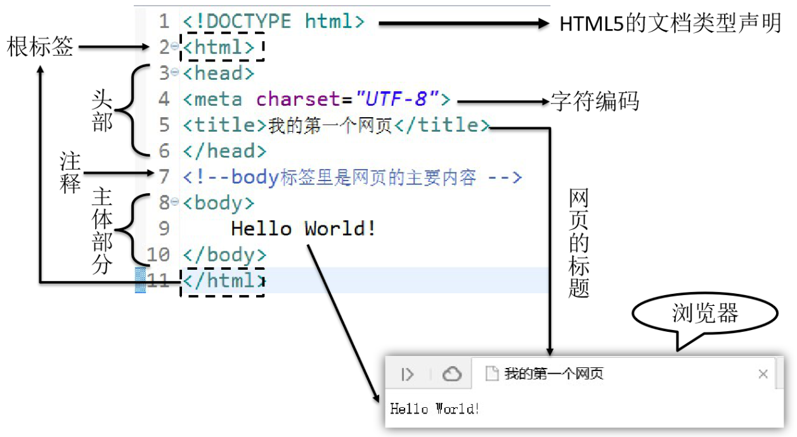
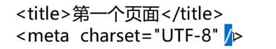
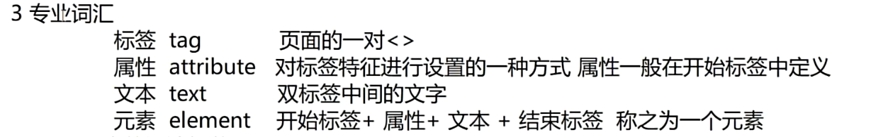
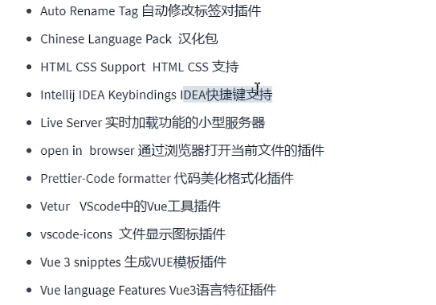
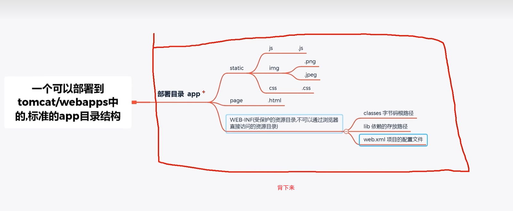
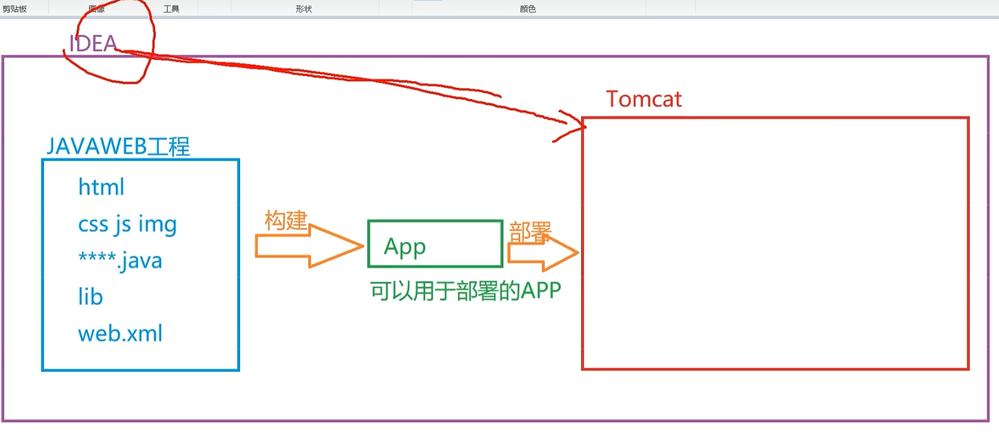
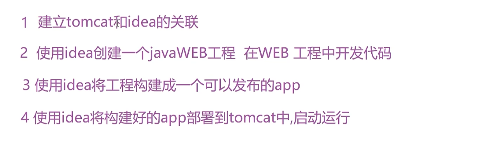

HTML基础结构：

```java
首航主要是文档的基本信息，最重要的是文档遵循的语法标准：
HTML5版本申明为：<!DOCTYPE html>
> 2根标签
+ html标签是整个文档的根标签，所有其他标签都必须放在html标签里面。
```



## HTML的语法规则
+ 1 根标签有且只能有一个
+ 2 无论是双标签还是单标签都需要正确关闭
+ 3 标签可以嵌套但不能交叉嵌套
+ 4 注释语法为`<!--  内容  -->`  ,注意不能嵌套
+ 5 属性必须有值，值必须加引号,H5中属性名和值相同时可以省略属性值
+ 6 HTML中不严格区分字符串使用单双引号
+ 7 HTML标签不严格区分大小写,但是不能大小写混用
+ 8 HTML中不允许自定义标签名,强行自定义则无效



vscode插件：




## Tomcat




