# <font style="background-color:rgba(255, 255, 255, 0);"> 语法</font>
<font style="background-color:rgba(255, 255, 255, 0);">字面量：</font><font style="color:rgba(0, 0, 0, 0.7);background-color:rgba(255, 255, 255, 0);">字面量是直接出现在代码中的固定值，比如int a=42 等号右侧的部分</font>

## <font style="background-color:rgba(255, 255, 255, 0);">关键字</font>
<font style="background-color:rgba(255, 255, 255, 0);">小写</font>

<font style="background-color:rgba(255, 255, 255, 0);">Object</font>

<font style="background-color:rgba(255, 255, 255, 0);">fin</font><font style="color:rgb(51, 51, 51);background-color:rgba(255, 255, 255, 0);">static 修饰符，用来修饰类方法和类变量。</font>

<font style="color:rgb(51, 51, 51);background-color:rgba(255, 255, 255, 0);">final 修饰符，用来修饰类、方法和变量，final 修饰的类不能够被继承，修饰的方法不能被继承类重新定义，修饰的变量为常量，是不可修改的。</font>

<font style="color:rgb(51, 51, 51);background-color:rgba(255, 255, 255, 0);">abstract 修饰符，用来创建抽象类和抽象方法。</font>

<font style="color:rgb(51, 51, 51);background-color:rgba(255, 255, 255, 0);">synchronized 和 volatile 修饰符，主要用于线程的编程</font>

### <font style="background-color:rgba(255, 255, 255, 0);">修饰符</font>
<font style="color:rgb(51, 51, 51);background-color:rgba(255, 255, 255, 0);">Java语言提供了很多修饰符，主要分为以下两类：</font>

<font style="color:rgb(51, 51, 51);background-color:rgba(255, 255, 255, 0);">访问修饰符</font>

+ <font style="color:rgb(51, 51, 51);background-color:rgba(255, 255, 255, 0);">非访问修饰符</font>

#### <font style="background-color:rgba(255, 255, 255, 0);">访问修饰符</font>


| <font style="color:rgb(255, 255, 255);background-color:rgba(255, 255, 255, 0);">修饰符</font> | <font style="color:rgb(255, 255, 255);background-color:rgba(255, 255, 255, 0);">当前类</font> | <font style="color:rgb(255, 255, 255);background-color:rgba(255, 255, 255, 0);">同一包内</font> | <font style="color:rgb(255, 255, 255);background-color:rgba(255, 255, 255, 0);">子孙类(同一包)</font> | <font style="color:rgb(255, 255, 255);background-color:rgba(255, 255, 255, 0);">子孙类(不同包)</font> | <font style="color:rgb(255, 255, 255);background-color:rgba(255, 255, 255, 0);">其他包</font> |
| --- | --- | --- | --- | --- | --- |
| `<font style="color:rgb(51, 51, 51);background-color:rgba(255, 255, 255, 0);">public</font>` | <font style="color:rgb(51, 51, 51);background-color:rgba(255, 255, 255, 0);">Y</font> | <font style="color:rgb(51, 51, 51);background-color:rgba(255, 255, 255, 0);">Y</font> | <font style="color:rgb(51, 51, 51);background-color:rgba(255, 255, 255, 0);">Y</font> | <font style="color:rgb(51, 51, 51);background-color:rgba(255, 255, 255, 0);">Y</font> | <font style="color:rgb(51, 51, 51);background-color:rgba(255, 255, 255, 0);">Y</font> |
| `<font style="color:rgb(51, 51, 51);background-color:rgba(255, 255, 255, 0);">protected</font>` | <font style="color:rgb(51, 51, 51);background-color:rgba(255, 255, 255, 0);">Y</font> | <font style="color:rgb(51, 51, 51);background-color:rgba(255, 255, 255, 0);">Y</font> | <font style="color:rgb(51, 51, 51);background-color:rgba(255, 255, 255, 0);">Y</font> | <font style="color:rgb(51, 51, 51);background-color:rgba(255, 255, 255, 0);">Y/N（</font>[<font style="color:rgb(0, 102, 0);background-color:rgba(255, 255, 255, 0);">说明</font>](https://www.runoob.com/java/java-modifier-types.html#protected-desc)<br/><font style="color:rgb(51, 51, 51);background-color:rgba(255, 255, 255, 0);">）</font> | <font style="color:rgb(51, 51, 51);background-color:rgba(255, 255, 255, 0);">N</font> |
| `<font style="color:rgb(51, 51, 51);background-color:rgba(255, 255, 255, 0);">default</font>` | <font style="color:rgb(51, 51, 51);background-color:rgba(255, 255, 255, 0);">Y</font> | <font style="color:rgb(51, 51, 51);background-color:rgba(255, 255, 255, 0);">Y</font> | <font style="color:rgb(51, 51, 51);background-color:rgba(255, 255, 255, 0);">Y</font> | <font style="color:rgb(51, 51, 51);background-color:rgba(255, 255, 255, 0);">N</font> | <font style="color:rgb(51, 51, 51);background-color:rgba(255, 255, 255, 0);">N</font> |
| `<font style="color:rgb(51, 51, 51);background-color:rgba(255, 255, 255, 0);">private</font>` | <font style="color:rgb(51, 51, 51);background-color:rgba(255, 255, 255, 0);">Y</font> | <font style="color:rgb(51, 51, 51);background-color:rgba(255, 255, 255, 0);">N</font> | <font style="color:rgb(51, 51, 51);background-color:rgba(255, 255, 255, 0);">N</font> | <font style="color:rgb(51, 51, 51);background-color:rgba(255, 255, 255, 0);">N</font> | <font style="color:rgb(51, 51, 51);background-color:rgba(255, 255, 255, 0);">N</font> |


+ <font style="color:rgb(51, 51, 51);background-color:rgba(255, 255, 255, 0);">类和接口不能声明为 </font>**<font style="color:rgb(51, 51, 51);background-color:rgba(255, 255, 255, 0);">private</font>**
+ <font style="color:rgb(51, 51, 51);background-color:rgba(255, 255, 255, 0);">声明为私有访问类型的变量只能通过类中公共的 getter 方法被外部类访问</font>

<font style="background-color:rgba(255, 255, 255, 0);">protect：</font>

+ **<font style="color:rgb(51, 51, 51);background-color:rgba(255, 255, 255, 0);">子类与基类在同一包中</font>**<font style="color:rgb(51, 51, 51);background-color:rgba(255, 255, 255, 0);">：被声明为 protected 的变量、方法和构造器能被同一个包中的任何其他类访问；</font>
+ **<font style="color:rgb(51, 51, 51);background-color:rgba(255, 255, 255, 0);">子类与基类不在同一包中</font>**<font style="color:rgb(51, 51, 51);background-color:rgba(255, 255, 255, 0);">：那么在子类中，必须</font>**<font style="background-color:rgba(255, 255, 255, 0);">使用子类的实例对象来访问父类的 </font>**`**<font style="background-color:rgba(255, 255, 255, 0);">protected</font>**`**<font style="background-color:rgba(255, 255, 255, 0);"> 方法</font>**<font style="color:rgb(51, 51, 51);background-color:rgba(255, 255, 255, 0);">，而不能直接访问基类实例的protected方法。</font>

```plain
package p1;
public class Father1 {
    protected void f() {}    // 父类Father1中的protected方法
}
 
package p1;
public class Son1 extends Father1 {}
 
package p11;
public class Son11 extends Father1{}
 
package p1;
public class Test1 {
    public static void main(String[] args) {
        Son1 son1 = new Son1();
        son1.f(); // Compile OK     ----（1）
        son1.clone(); // Compile Error     ----（2）
 
        Son11 son = new Son11();    
        son11.f(); // Compile OK     ----（3）
        son11.clone(); // Compile Error     ----（4）
    }
}

其中的clone()方法的可见性是java.lang包及其所有子类，对于语句"son1.clone();"和"son11.clone();"，二者的clone()在类Son1、Son11中是可见的，但对Test1是不可见的，因此（2）(4)处编译不通过。
java.lang.Object 是所有 Java 类的父类，clone() 方法是 Object 类中的一个 受保护 方法，所以根据protect的访问权限，Test1不能访问不属于她的继承链条上的类的clone方法，只有在树枝脸链上的类才能相互访问

```

```plain
package p2;
class MyObject2 {
    protected Object clone() throws CloneNotSupportedException{
       return super.clone();
    }
}
 
package p22;
public class Test2 extends MyObject2 {
    public static void main(String args[]) {
       MyObject2 obj = new MyObject2();
       obj.clone(); // Compile Error         ----（1）
 
       Test2 tobj = new Test2();
       tobj.clone(); // Complie OK         ----（2）
    }
}

（1）错误原因：clone直接访问基类实例的protect方法
```

[<font style="background-color:rgba(255, 255, 255, 0);">https://www.runoob.com/w3cnote/java-protected-keyword-detailed-explanation.html</font>](https://www.runoob.com/w3cnote/java-protected-keyword-detailed-explanation.html)

+ <font style="color:rgb(51, 51, 51);background-color:rgba(255, 255, 255, 0);">protected 可以修饰数据成员，构造方法，方法成员，</font>**<font style="color:rgb(51, 51, 51);background-color:rgba(255, 255, 255, 0);">不能修饰类（内部类除外）</font>**
+ <font style="color:rgb(51, 51, 51);background-color:rgba(255, 255, 255, 0);">接口及接口的成员变量和成员方法不能声明为 protected</font>

#### <font style="color:rgb(51, 51, 51);background-color:rgba(255, 255, 255, 0);">访问控制和继承</font>
+ <font style="color:rgb(51, 51, 51);background-color:rgba(255, 255, 255, 0);">父类中声明为 public 的方法在子类中也必须为 public。</font>
+ <font style="color:rgb(51, 51, 51);background-color:rgba(255, 255, 255, 0);">父类中声明为 protected 的方法在子类中要么声明为 protected，要么声明为 public，不能声明为 private。</font>
+ <font style="color:rgb(51, 51, 51);background-color:rgba(255, 255, 255, 0);">父类中声明为 private 的方法，不能够被子类继承。</font>

#### <font style="color:rgb(51, 51, 51);background-color:rgba(255, 255, 255, 0);">非访问修饰符</font>
<font style="color:rgb(51, 51, 51);background-color:rgba(255, 255, 255, 0);">static 修饰符，用来修饰类方法和类变量。</font>

<font style="color:rgb(51, 51, 51);background-color:rgba(255, 255, 255, 0);">final 修饰符，用来修饰类、方法和变量，final 修饰的类不能够被继承，修饰的方法不能被继承类重新定义，修饰的变量为常量，是不可修改的。</font>

<font style="color:rgb(51, 51, 51);background-color:rgba(255, 255, 255, 0);">abstract 修饰符，用来创建抽象类和抽象方法。</font>

<font style="color:rgb(51, 51, 51);background-color:rgba(255, 255, 255, 0);">synchronized 和 volatile 修饰符，主要用于线程的编程。</font>

##### <font style="color:rgb(51, 51, 51);background-color:rgba(255, 255, 255, 0);">static修饰符</font>
**<font style="color:rgb(51, 51, 51);background-color:rgba(255, 255, 255, 0);">静态变量：</font>**


**<font style="color:rgb(51, 51, 51);background-color:rgba(255, 255, 255, 0);">静态方法：</font>**<font style="color:rgb(51, 51, 51);background-color:rgba(255, 255, 255, 0);">static 关键字用来声明独立于对象的静态方法。</font><font style="color:#DF2A3F;background-color:rgba(255, 255, 255, 0);">静态方法不能使用类的非静态变量</font><font style="color:rgb(51, 51, 51);background-color:rgba(255, 255, 255, 0);">。静态方法从参数列表得到数据，然后计算这些数据。</font>

:::tip
<font style="color:rgb(51, 51, 51);background-color:rgba(255, 255, 255, 0);">在JDK7之后，</font>**<font style="color:rgb(77, 77, 77);">静态成员变量迁移到了堆中</font>**

:::

##### <font style="color:rgb(51, 51, 51);background-color:rgba(255, 255, 255, 0);">final 修饰符  
</font>
**<font style="color:rgb(51, 51, 51);background-color:rgba(255, 255, 255, 0);">final 变量：</font>**<font style="color:rgb(51, 51, 51);background-color:rgba(255, 255, 255, 0);">final 修饰符通常和 static 修饰符一起使用来创建类常量，被 final 修饰的实例变量必须显式指定初始值</font>

**<font style="color:rgb(51, 51, 51);background-color:rgba(255, 255, 255, 0);">final 方法：</font>**<font style="color:rgb(51, 51, 51);background-color:rgba(255, 255, 255, 0);">父类中的 final 方法可以被子类继承，但是不能被子类重写。</font>

<font style="color:rgb(51, 51, 51);background-color:rgba(255, 255, 255, 0);">声明 final 方法的主要目的是防止该方法的内容被修改。</font>

<font style="color:rgb(51, 51, 51);background-color:rgba(255, 255, 255, 0);">如下所示，使用 final 修饰符声明方法。</font>

```plain
public class Test{
    public final void changeName(){
       // 方法体
    }
}
```

##### <font style="color:rgb(51, 51, 51);background-color:rgba(255, 255, 255, 0);">abstract 修饰符</font>
**<font style="color:rgb(51, 51, 51);background-color:rgba(255, 255, 255, 0);">抽象类：</font>**

<font style="color:rgb(51, 51, 51);background-color:rgba(255, 255, 255, 0);">抽象类不能用来实例化对象，声明抽象类的唯一目的是为了将来对该类进行扩充。</font>

**<font style="color:rgb(51, 51, 51);background-color:rgba(255, 255, 255, 0);">一个类不能同时被 abstract 和 final 修饰</font>**<font style="color:rgb(51, 51, 51);background-color:rgba(255, 255, 255, 0);">。如果一个类</font><font style="color:#DF2A3F;background-color:rgba(255, 255, 255, 0);">包含抽象方法，那么该类一定要声明为抽象</font><font style="color:rgb(51, 51, 51);background-color:rgba(255, 255, 255, 0);">类，否则将出现编译错误。</font>

<font style="color:rgb(51, 51, 51);background-color:rgba(255, 255, 255, 0);">抽象类可以包含抽象方法和非抽象方法。</font>

<font style="color:rgb(51, 51, 51);background-color:rgba(255, 255, 255, 0);"></font>

**<font style="color:rgb(51, 51, 51);background-color:rgba(255, 255, 255, 0);">抽象方法：</font>**

<font style="color:rgb(51, 51, 51);background-color:rgba(255, 255, 255, 0);">抽象方法是一种没有任何实现的方法，该方法的具体实现由子类提供。</font>

<font style="color:rgb(51, 51, 51);background-color:rgba(255, 255, 255, 0);">抽象方法不能被声明成 final 和 static</font>

<font style="color:rgb(51, 51, 51);background-color:rgba(255, 255, 255, 0);">任何继承抽象类的</font><font style="color:#DF2A3F;background-color:rgba(255, 255, 255, 0);">子类必须实现父类的所有抽象</font><font style="color:rgb(51, 51, 51);background-color:rgba(255, 255, 255, 0);">方法，</font><font style="color:#DF2A3F;background-color:rgba(255, 255, 255, 0);">除非</font><font style="color:rgb(51, 51, 51);background-color:rgba(255, 255, 255, 0);">该子类也是抽象类</font>

```plain
public abstract class SuperClass{
    abstract void m(); //抽象方法
}
 
class SubClass extends SuperClass{
     //实现抽象方法
      void m(){
          .........
      }
}
```

##### <font style="color:rgb(51, 51, 51);background-color:rgba(255, 255, 255, 0);">synchronized 修饰符</font>
<font style="color:rgb(51, 51, 51);background-color:rgba(255, 255, 255, 0);">synchronized 关键字</font><font style="color:#DF2A3F;background-color:rgba(255, 255, 255, 0);">声明的方法同一时间只能被一个线程访问</font><font style="color:rgb(51, 51, 51);background-color:rgba(255, 255, 255, 0);">。synchronized 修饰符可以应用于四个访问修饰符。</font>

##### <font style="color:rgb(51, 51, 51);background-color:rgba(255, 255, 255, 0);">volatile 修饰符</font>
<font style="color:rgb(51, 51, 51);background-color:rgba(255, 255, 255, 0);">volatile 修饰的成员变量在每次被线程访问时，都强制从共享内存中重新读取该成员变量的值。而且，当成员变量发生变化时，会强制线程将变化值回写到共享内存。这样在任何时刻，两个不同的线程总是看到某个成员变量的同一个值。</font>

<font style="color:rgb(51, 51, 51);background-color:rgba(255, 255, 255, 0);">一个 volatile 对象引用可能是 null。</font>

##### <font style="color:rgb(51, 51, 51);background-color:rgba(255, 255, 255, 0);">transient 修饰符</font>
<font style="color:rgb(51, 51, 51);background-color:rgba(255, 255, 255, 0);">被 transient 修饰的实例变量时，java 虚拟机(JVM)在序列化时会跳过该特定的变量</font>

<font style="background-color:rgba(255, 255, 255, 0);">在某些情况下，我们希望在序列化对象时排除掉某些不需要被持久化的数据。比如：</font>

+ <font style="color:rgb(51, 51, 51);background-color:rgba(255, 255, 255, 0);">某些字段可能是 </font>**<font style="background-color:rgba(255, 255, 255, 0);">临时的</font>**<font style="color:rgb(51, 51, 51);background-color:rgba(255, 255, 255, 0);">，不需要被持久化。</font>
+ <font style="color:rgb(51, 51, 51);background-color:rgba(255, 255, 255, 0);">有些字段可能包含敏感数据（如密码），为了安全考虑不希望它们被序列化。</font>
+ <font style="color:rgb(51, 51, 51);background-color:rgba(255, 255, 255, 0);">一些不必要的字段（如某些计算中间结果）可能在对象的持久化和恢复过程中没有意义。</font>

## <font style="background-color:rgba(255, 255, 255, 0);">字面量</font>
<font style="background-color:rgba(255, 255, 255, 0);">数据在程序中的书写格式</font>


<font style="background-color:rgba(255, 255, 255, 0);">特殊字符：‘\n’换行符			'\t' 缩进字符</font>

<font style="background-color:rgba(255, 255, 255, 0);"></font>

## <font style="background-color:rgba(255, 255, 255, 0);">源文件声明规则</font>
<font style="background-color:rgba(255, 255, 255, 0);">当在一个源文件中定义多个类，并且还有import语句和package语句时，要特别注意这些规则。</font>

+ <font style="background-color:rgba(255, 255, 255, 0);">一个源文件中只能有一个 public 类</font>
+ <font style="background-color:rgba(255, 255, 255, 0);">一个源文件可以有多个非 public 类</font>
+ <font style="background-color:rgba(255, 255, 255, 0);">源文件的名称应该和 public 类的类名保持一致。例如：源文件中 public 类的类名是 Employee，那么源文件应该命名为Employee.java。</font>
+ <font style="background-color:rgba(255, 255, 255, 0);">如果一个类定义在某个包中，那么 package 语句应该在源文件的首行。</font>
+ <font style="background-color:rgba(255, 255, 255, 0);">如果源文件包含 import 语句，那么应该放在 package 语句和类定义之间。如果没有 package 语句，那么 import 语句应该在源文件中最前面。</font>
+ <font style="background-color:rgba(255, 255, 255, 0);">import 语句和 package 语句对源文件中定义的所有类都有效。在同一源文件中，不能给不同的类不同的包声明。</font>

<font style="background-color:rgba(255, 255, 255, 0);">类有若干种访问级别，并且类也分不同的类型：抽象类和 final 类等。这些将在访问控制章节介绍。</font>

<font style="background-color:rgba(255, 255, 255, 0);">除了上面提到的几种类型，Java 还有一些特殊的类，如：</font>[<font style="background-color:rgba(255, 255, 255, 0);">内部类</font>](https://www.runoob.com/java/java-inner-class.html)<font style="background-color:rgba(255, 255, 255, 0);">、</font>[<font style="background-color:rgba(255, 255, 255, 0);">匿名类</font>](https://www.runoob.com/java/java-anonymous-class.html)<font style="background-color:rgba(255, 255, 255, 0);">。</font>

## <font style="background-color:rgba(255, 255, 255, 0);">内存分配</font>


## <font style="background-color:rgba(255, 255, 255, 0);">import 语句</font>
<font style="background-color:rgba(255, 255, 255, 0);">在 Java 中，如果给出一个完整的限定名，包括包名、类名，那么 Java 编译器就可以很容易地定位到源代码或者类。import 语句就是用来提供一个合理的路径，使得编译器可以找到某个类。</font>

<font style="background-color:rgba(255, 255, 255, 0);">例如，下面的命令行将会命令编译器载入 java_installation/java/io 路径下的所有类</font>

<font style="background-color:rgba(255, 255, 255, 0);">import java.io.*;</font>

## <font style="color:rgb(0, 0, 0);background-color:rgba(255, 255, 255, 0);">基本数据类型</font>
:::tip
<font style="background-color:rgba(255, 255, 255, 0);">Java 的两大数据类型:</font>

+ <font style="background-color:rgba(255, 255, 255, 0);">内置数据类型</font>
+ <font style="background-color:rgba(255, 255, 255, 0);">引用数据类型</font>

:::

### <font style="color:rgb(51, 51, 51);background-color:rgba(255, 255, 255, 0);">内置数据类型</font>
<font style="background-color:rgba(255, 255, 255, 0);">Java语言提供了八种基本类型。六种数字类型（四个整数型，两个浮点型），一种字符类型，还有一种布尔型。</font>

<font style="background-color:rgba(255, 255, 255, 0);">byte：8位有符号补码表示的整数  -128~127</font>

<font style="background-color:rgba(255, 255, 255, 0);">short：16位有符号补码表示的整数</font>

<font style="background-color:rgba(255, 255, 255, 0);">int：32位</font>

<font style="background-color:rgba(255, 255, 255, 0);">long：64位</font>

<font style="background-color:rgba(255, 255, 255, 0);">float：单精度32位</font>

<font style="background-color:rgba(255, 255, 255, 0);">double：64位双精度</font>

<font style="background-color:rgba(255, 255, 255, 0);">boolean：布尔值</font>

<font style="background-color:rgba(255, 255, 255, 0);">char：单一的16位unicode字符</font>


### <font style="background-color:rgba(255, 255, 255, 0);">引用类型</font>
+ <font style="background-color:rgba(255, 255, 255, 0);">引用类型指向一个对象，指向对象的变量是引用变量。这些变量在声明时被指定为一个特定的类型，比如 Employee、Puppy 等。变量一旦声明后，类型就不能被改变了。</font>
+ <font style="background-color:rgba(255, 255, 255, 0);">对象、数组、字符串都是引用数据类型。</font>
+ <font style="background-color:rgba(255, 255, 255, 0);">所有引用类型的默认值都是null。</font>

### <font style="background-color:rgba(255, 255, 255, 0);">常量</font>
<font style="background-color:rgba(255, 255, 255, 0);">Java 中使用 final 关键字来修饰常量，声明方式和变量类似：</font>

<font style="background-color:rgba(255, 255, 255, 0);">final double PI = 3.1415927;</font>

<font style="background-color:rgba(255, 255, 255, 0);">虽然常量名也可以用小写，但为了便于识别，通常使用大写字母表示常量</font>

#### <font style="background-color:rgba(255, 255, 255, 0);">转义字符</font>
| <font style="background-color:rgba(255, 255, 255, 0);">\n</font> | <font style="background-color:rgba(255, 255, 255, 0);">换行 (0x0a)</font> |
| --- | --- |
| <font style="background-color:rgba(255, 255, 255, 0);">\r</font> | <font style="background-color:rgba(255, 255, 255, 0);">回车 (0x0d)</font> |
| <font style="background-color:rgba(255, 255, 255, 0);">\f</font> | <font style="background-color:rgba(255, 255, 255, 0);">换页符(0x0c)</font> |
| <font style="background-color:rgba(255, 255, 255, 0);">\b</font> | <font style="background-color:rgba(255, 255, 255, 0);">退格 (0x08)</font> |
| <font style="background-color:rgba(255, 255, 255, 0);">\0</font> | <font style="background-color:rgba(255, 255, 255, 0);">空字符 (0x0)</font> |
| <font style="background-color:rgba(255, 255, 255, 0);">\s</font> | <font style="background-color:rgba(255, 255, 255, 0);">空格 (0x20)</font> |
| <font style="background-color:rgba(255, 255, 255, 0);">\t</font> | <font style="background-color:rgba(255, 255, 255, 0);">制表符</font> |


### <font style="background-color:rgba(255, 255, 255, 0);">自动类型转换</font>
:::tip
<font style="background-color:rgba(255, 255, 255, 0);">整型、实型（常量）、字符型数据可以混合运算。运算中，不同类型的数据先转化为同一类型，然后进行运算。</font>

:::

<font style="color:rgb(51, 51, 51);background-color:rgba(255, 255, 255, 0);">规则：</font>

1. <font style="color:rgb(51, 51, 51);background-color:rgba(255, 255, 255, 0);">转换从低级到高级，自动将低级的（取值范围小的）转化为高级的。</font>
2. <font style="color:rgb(51, 51, 51);background-color:rgba(255, 255, 255, 0);">byte，short，char三者进行计算时，都会转化为int再进行计算</font>

```plain
低  ------------------------------------>  高

byte,short,char—> int —> long—> float —> double
```

<font style="background-color:rgba(255, 255, 255, 0);">必须满足如下规则：</font>

1. <font style="background-color:rgba(255, 255, 255, 0);">不能对boolean类型进行类型转换。</font>
2. <font style="background-color:rgba(255, 255, 255, 0);">不能把对象类型转换成不相关类的对象。</font>
3. <font style="color:#DF2A3F;background-color:rgba(255, 255, 255, 0);">在把容量大的类型转换为容量小的类型时必须使用强制类型转换*****。</font>
4. <font style="background-color:rgba(255, 255, 255, 0);">转换过程中可能导致溢出或损失精度</font>
5. <font style="background-color:rgba(255, 255, 255, 0);">浮点数到整数的转换是通过舍弃小数得到，而不是四舍五入</font>

#### <font style="color:rgb(51, 51, 51);background-color:rgba(255, 255, 255, 0);">自动类型转换</font>
<font style="background-color:rgba(255, 255, 255, 0);">必须满足转换前的数据类型的位数要低于转换后的数据类型</font>

```python
            char c1='a';//定义一个char类型
            int i1 = c1;//char自动类型转换为int
```

#### <font style="background-color:rgba(255, 255, 255, 0);">强制类型转换</font>
1. <font style="background-color:rgba(255, 255, 255, 0);">条件是转换的数据类型必须是兼容的。</font>
2. <font style="background-color:rgba(255, 255, 255, 0);">格式：</font>`<font style="background-color:rgba(255, 255, 255, 0);">(type)value type</font>`<font style="background-color:rgba(255, 255, 255, 0);">是要强制类型转换后的数据类型</font>

#### <font style="background-color:rgba(255, 255, 255, 0);">隐含强制类型转换</font>
+ <font style="background-color:rgba(255, 255, 255, 0);">1、 整数的默认类型是 int。</font>
+ <font style="background-color:rgba(255, 255, 255, 0);">2、 小数默认是 double 类型浮点型，在定义 float 类型时必须在数字后面跟上 F 或者 f。</font>

## <font style="background-color:rgba(255, 255, 255, 0);">Java 变量类型</font>
+ <font style="background-color:rgba(255, 255, 255, 0);">局部变量（L</font><font style="background-color:rgba(255, 255, 255, 0);">ocal Variables）：局部变量是在方法、构造函数或块内部声明的变量，它们在声明的方法、构造函数或块执行结束后被销毁，局部变量未初始化不会被赋予默认值，</font>**<font style="color:#DF2A3F;background-color:rgba(255, 255, 255, 0);">局部变量在声明时需要初始化</font>**<font style="color:#DF2A3F;background-color:rgba(255, 255, 255, 0);">，</font><font style="background-color:rgba(255, 255, 255, 0);">否则会导致编译错误。</font>

<font style="background-color:rgba(255, 255, 255, 0);"></font>

+ **<font style="color:rgb(51, 51, 51);background-color:rgba(255, 255, 255, 0);">实例变量/成员变量（Instance Variables）：</font>**<font style="color:rgb(51, 51, 51);background-color:rgba(255, 255, 255, 0);">实例变量是在类中声明，但在方法、构造函数或块之外，它们</font><font style="color:#DF2A3F;background-color:rgba(255, 255, 255, 0);">属于类的实例</font><font style="color:rgb(51, 51, 51);background-color:rgba(255, 255, 255, 0);">，每个类的实例都有自己的副本，</font><font style="color:#DF2A3F;background-color:rgba(255, 255, 255, 0);">如果不明确初始化，实例变量会被赋予默认值</font><font style="color:rgb(51, 51, 51);background-color:rgba(255, 255, 255, 0);">（数值类型为0，boolean类型为false，对象引用类型为null）。</font><font style="color:#DF2A3F;background-color:rgba(255, 255, 255, 0);"></font>
    - <font style="background-color:rgba(255, 255, 255, 0);">在Java中，</font>**<font style="color:#DF2A3F;background-color:rgba(255, 255, 255, 0);">成员变量</font>**<font style="color:#DF2A3F;background-color:rgba(255, 255, 255, 0);">（也称为实例变量）对于类中的代码是</font>**<font style="color:#DF2A3F;background-color:rgba(255, 255, 255, 0);">可见的</font>**<font style="background-color:rgba(255, 255, 255, 0);">，无论其访问修饰符是</font>`<font style="background-color:rgba(255, 255, 255, 0);">private</font>`<font style="background-color:rgba(255, 255, 255, 0);">、</font>`<font style="background-color:rgba(255, 255, 255, 0);">protected</font>`<font style="background-color:rgba(255, 255, 255, 0);">还是</font>`<font style="background-color:rgba(255, 255, 255, 0);">public</font>`<font style="background-color:rgba(255, 255, 255, 0);">。</font><font style="color:rgb(51, 51, 51);background-color:rgba(255, 255, 255, 0);">一般情况下应该把成员变量设为私有。通过使用访问修饰符可以使成员变量对子类可见。</font>
    - <font style="color:rgb(51, 51, 51);background-color:rgba(255, 255, 255, 0);">成员变量具有默认值。数值型变量的默认值是0，布尔型变量的默认值是 false，引用类型变量的默认值是 null。变量的值可以在声明时指定，也可以在构造方法中指定；</font>
    - <font style="color:rgb(51, 51, 51);background-color:rgba(255, 255, 255, 0);">成员变量可以直接通过变量名访问。但在静态方法以及其他类中，就应该使用完全限定名：</font>**<font style="color:rgb(51, 51, 51);background-color:rgba(255, 255, 255, 0);">ObjectReference.VariableName</font>**<font style="color:rgb(51, 51, 51);background-color:rgba(255, 255, 255, 0);">。</font>

```plain
public class ExampleClass {
    int instanceVar; // 实例变量/成员变量
}
```

<font style="background-color:rgba(255, 255, 255, 0);"></font>

+ **<font style="color:rgb(51, 51, 51);background-color:rgba(255, 255, 255, 0);">静态变量或类变量（Class Variables）：</font>**<font style="color:rgb(51, 51, 51);background-color:rgba(255, 255, 255, 0);">类变量是在类中用</font>**<font style="color:#DF2A3F;background-color:rgba(255, 255, 255, 0);"> static 关键字</font>**<font style="color:rgb(51, 51, 51);background-color:rgba(255, 255, 255, 0);">声明的变量，它们</font><font style="color:#DF2A3F;background-color:rgba(255, 255, 255, 0);">属于类而不是实例</font><font style="color:rgb(51, 51, 51);background-color:rgba(255, 255, 255, 0);">，所有</font><font style="color:#DF2A3F;background-color:rgba(255, 255, 255, 0);">该类的实例共享同一个类变量的值</font><font style="color:rgb(51, 51, 51);background-color:rgba(255, 255, 255, 0);">，类变量在类加载时被初始化，而且只初始化一次。</font>
    - <font style="color:rgb(51, 51, 51);background-color:rgba(255, 255, 255, 0);">静态变量的生命周期与程序的生命周期一样长，即它们在类加载时被创建，在整个程序运行期间都存在，直到程序结束才会被销毁。因此，静态变量可以用来存储整个程序都需要使用的数据，如配置信息、全局变量等。</font>
    - <font style="color:rgb(51, 51, 51);background-color:rgba(255, 255, 255, 0);">初始化时机：</font><font style="color:rgb(51, 51, 51);background-color:rgba(255, 255, 255, 0);">静态变量在类加载时被初始化，其初始化顺序与定义顺序有关。</font><font style="color:#DF2A3F;background-color:rgba(255, 255, 255, 0);">如果一个静态变量依赖于另一个静态变量，那么它必须在后面定义</font>
    - <font style="color:rgb(51, 51, 51);background-color:rgba(255, 255, 255, 0);">静态变量的值可以在运行时改变</font>

**<font style="color:rgb(51, 51, 51);background-color:rgba(255, 255, 255, 0);"></font>**

+ **<font style="color:rgb(51, 51, 51);background-color:rgba(255, 255, 255, 0);">参数变量（Parameters）：</font>**<font style="color:rgb(51, 51, 51);background-color:rgba(255, 255, 255, 0);">参数是方法或构造函数声明中的变量，用于接收调用该方法或构造函数时传递的值，参数变量的作用域只限于方法内部。</font>

<font style="background-color:rgba(255, 255, 255, 0);"></font>

**<font style="color:rgb(51, 51, 51);background-color:rgba(255, 255, 255, 0);">内存管理</font>**<font style="color:rgb(51, 51, 51);background-color:rgba(255, 255, 255, 0);">：</font>

+ <font style="color:rgb(51, 51, 51);background-color:rgba(255, 255, 255, 0);">局部变量存储在 Java 虚拟机（JVM）的栈上</font>
+ <font style="color:rgb(51, 51, 51);background-color:rgba(255, 255, 255, 0);">实例变量或对象存储在堆上</font>

<font style="background-color:rgba(255, 255, 255, 0);"></font>

<font style="color:rgb(51, 51, 51);background-color:rgba(255, 255, 255, 0);">静态变量的线程安全性：</font>

<font style="color:rgb(51, 51, 51);background-color:rgba(255, 255, 255, 0);">Java 中的静态变量是属于类的，而不是对象的实例。因此，当多个线程同时访问一个包含静态变量的类时，需要考虑其线程安全性。</font>

<font style="color:rgb(51, 51, 51);background-color:rgba(255, 255, 255, 0);">静态变量在内存中只有一份拷贝，被所有实例共享。因此，如果一个线程修改了静态变量的值，那么其他线程在访问该静态变量时也会看到修改后的值。这可能会导致并发访问的问题，因为多个线程可能同时修改静态变量，导致不确定的结果或数据一致性问题。</font>

<font style="color:rgb(51, 51, 51);background-color:rgba(255, 255, 255, 0);">为了确保静态变量的线程安全性，需要采取适当的同步措施，如同步机制、原子类或 volatile 关键字，以便在多线程环境中正确地读取和修改静态变量的值。</font>

## <font style="color:rgb(51, 51, 51);background-color:rgba(255, 255, 255, 0);">运算符</font>
### <font style="color:rgb(51, 51, 51);background-color:rgba(255, 255, 255, 0);">位置运算符</font>
<font style="color:rgb(51, 51, 51);background-color:rgba(255, 255, 255, 0);">假设整数变量 A 的值为 60 和变量 B 的值为 13</font>

| <font style="color:rgb(255, 255, 255);background-color:rgba(255, 255, 255, 0);">操作符</font> | <font style="color:rgb(255, 255, 255);background-color:rgba(255, 255, 255, 0);">描述</font> | <font style="color:rgb(255, 255, 255);background-color:rgba(255, 255, 255, 0);">例子</font> |
| --- | --- | --- |
| <font style="color:rgb(51, 51, 51);background-color:rgba(255, 255, 255, 0);">＆</font> | <font style="color:rgb(51, 51, 51);background-color:rgba(255, 255, 255, 0);">如果相对应位都是1，则结果为1，否则为0</font> | <font style="color:rgb(51, 51, 51);background-color:rgba(255, 255, 255, 0);">（A＆B），得到12，即0000 1100</font> |
| <font style="color:rgb(51, 51, 51);background-color:rgba(255, 255, 255, 0);">|</font> | <font style="color:rgb(51, 51, 51);background-color:rgba(255, 255, 255, 0);">如果相对应位都是 0，则结果为 0，否则为 1</font> | <font style="color:rgb(51, 51, 51);background-color:rgba(255, 255, 255, 0);">（A | B）得到61，即 0011 1101</font> |
| <font style="color:rgb(51, 51, 51);background-color:rgba(255, 255, 255, 0);">^</font> | <font style="color:rgb(51, 51, 51);background-color:rgba(255, 255, 255, 0);">如果相对应位值相同，则结果为0，否则为1</font> | <font style="color:rgb(51, 51, 51);background-color:rgba(255, 255, 255, 0);">（A ^ B）得到49，即 0011 0001</font> |
| <font style="color:rgb(51, 51, 51);background-color:rgba(255, 255, 255, 0);">〜</font> | <font style="color:rgb(51, 51, 51);background-color:rgba(255, 255, 255, 0);">按位取反运算符翻转操作数的每一位，即0变成1，1变成0。</font> | <font style="color:rgb(51, 51, 51);background-color:rgba(255, 255, 255, 0);">（〜A）得到-61，即1100 0011</font> |
| <font style="color:rgb(51, 51, 51);background-color:rgba(255, 255, 255, 0);"><< </font> | <font style="color:rgb(51, 51, 51);background-color:rgba(255, 255, 255, 0);">按位左移运算符。左操作数按位左移右操作数指定的位数。</font> | <font style="color:rgb(51, 51, 51);background-color:rgba(255, 255, 255, 0);">A << 2得到240，即 1111 0000</font> |
| <font style="color:rgb(51, 51, 51);background-color:rgba(255, 255, 255, 0);">>> </font> | <font style="color:rgb(51, 51, 51);background-color:rgba(255, 255, 255, 0);">按位右移运算符。左操作数按位右移右操作数指定的位数。</font> | <font style="color:rgb(51, 51, 51);background-color:rgba(255, 255, 255, 0);">A >> 2得到15即 1111</font> |
| <font style="color:rgb(51, 51, 51);background-color:rgba(255, 255, 255, 0);">>>> </font> | <font style="color:rgb(51, 51, 51);background-color:rgba(255, 255, 255, 0);">按位右移补零操作符。左操作数的值按右操作数指定的位数右移，移动得到的空位以零填充。</font> | <font style="color:rgb(51, 51, 51);background-color:rgba(255, 255, 255, 0);">A>>>2得到15即0000 1111</font> |


### <font style="color:rgb(51, 51, 51);background-color:rgba(255, 255, 255, 0);">逻辑运算符</font>
<font style="color:rgb(51, 51, 51);background-color:rgba(255, 255, 255, 0);">下表列出了逻辑运算符的基本运算，假设布尔变量A为真，变量B为假</font>

| <font style="color:rgb(255, 255, 255);background-color:rgba(255, 255, 255, 0);">操作符</font> | <font style="color:rgb(255, 255, 255);background-color:rgba(255, 255, 255, 0);">描述</font> | <font style="color:rgb(255, 255, 255);background-color:rgba(255, 255, 255, 0);">例子</font> |
| --- | --- | --- |
| <font style="color:rgb(51, 51, 51);background-color:rgba(255, 255, 255, 0);">&&  </font> | <font style="color:rgb(51, 51, 51);background-color:rgba(255, 255, 255, 0);">称为逻辑与运算符，当且仅当两个操作数都为真，条件才为真。</font><br/><font style="color:rgb(51, 51, 51);background-color:rgba(255, 255, 255, 0);">&&是</font><font style="color:#DF2A3F;background-color:rgba(255, 255, 255, 0);">短路逻辑运算符</font> | <font style="color:rgb(51, 51, 51);background-color:rgba(255, 255, 255, 0);">（A && B）为假。</font> |
| <font style="color:rgb(51, 51, 51);background-color:rgba(255, 255, 255, 0);">| |</font> | <font style="color:rgb(51, 51, 51);background-color:rgba(255, 255, 255, 0);">称为逻辑或操作符。如果任何两个操作数任何一个为真，条件为真。</font> | <font style="color:rgb(51, 51, 51);background-color:rgba(255, 255, 255, 0);">（A | | B）为真。</font> |
| <font style="color:rgb(51, 51, 51);background-color:rgba(255, 255, 255, 0);">！</font> | <font style="color:rgb(51, 51, 51);background-color:rgba(255, 255, 255, 0);">称为逻辑非运算符。用来反转操作数的逻辑状态。如果条件为true，则逻辑非运算符将得到false。</font> | <font style="background-color:rgba(255, 255, 255, 0);"></font> |


<font style="color:rgb(51, 51, 51);background-color:rgba(255, 255, 255, 0);">当使用与逻辑运算符时，在两个操作数都为true时，结果才为true，但是当得到第一个操作为false时，其结果就必定是false，这时候就不会再判断第二个操作了。</font>

```plain
public class LuoJi{
    public static void main(String[] args){
        int a = 5;//定义一个变量；
        boolean b = (a<4)&&(a++<10);
        System.out.println("使用短路逻辑运算符的结果为"+b);
        System.out.println("a的结果为"+a);
    }
}
a的结果为5
该程序使用到了短路逻辑运算符(&&)，首先判断 a<4 的结果为 false，则 b 的结果必定是 false，所以不再执行第二个操作 a++<10 的判断，所以 a 的值为 5。
```

### <font style="color:rgb(51, 51, 51);background-color:rgba(255, 255, 255, 0);">instanceof 运算符</font>
<font style="color:rgb(51, 51, 51);background-color:rgba(255, 255, 255, 0);">该运算符用于操作对象实例，检查该对象是否是一个特定类型（类类型或接口类型）。</font>

<font style="color:rgb(51, 51, 51);background-color:rgba(255, 255, 255, 0);">instanceof运算符使用格式如下：</font>

`<font style="background-color:rgba(255, 255, 255, 0);">( Object reference variable ) instanceof  (class/interface type)</font>`

<font style="color:rgb(51, 51, 51);background-color:rgba(255, 255, 255, 0);">如果运算符左侧变量所指的对象，是操作符右侧类或接口(class/interface)的一个对象，那么结果为真</font>

<font style="color:rgb(51, 51, 51);background-color:rgba(255, 255, 255, 0);">如果被比较的对象兼容于右侧类型，该运算符仍然返回 true。</font>

<font style="color:rgb(51, 51, 51);background-color:rgba(255, 255, 255, 0);"></font>

## <font style="color:rgb(51, 51, 51);background-color:rgba(255, 255, 255, 0);">Java Number &Math类</font>
<font style="color:rgb(51, 51, 51);background-color:rgba(255, 255, 255, 0);">Java 语言为每一个内置数据类型提供了对应的包装类。</font>

<font style="color:rgb(51, 51, 51);background-color:rgba(255, 255, 255, 0);">所有的包装类</font>**<font style="color:rgb(51, 51, 51);background-color:rgba(255, 255, 255, 0);">（Integer、Long、Byte、Double、Float、Short）</font>**<font style="color:rgb(51, 51, 51);background-color:rgba(255, 255, 255, 0);">都是抽象类 Number 的子类。</font>


<font style="color:rgb(51, 51, 51);background-color:rgba(255, 255, 255, 0);">这种由编译器特别支持的包装称为装箱，所以当内置数据类型被当作对象使用的时候，编译器会把内置类型装箱为包装类。相似的，编译器也可以把一个对象拆箱为内置类型。Number 类属于 java.lang 包。</font>

```plain
public class Test{
 
   public static void main(String[] args){
      Integer x = 5;
      x =  x + 10;
      System.out.println(x); 
   }
}
当 x 被赋为整型值时，由于x是一个对象，所以编译器要对x进行装箱。然后，为了使x能进行加运算，所以要对x进行拆箱。
```

<font style="color:rgb(51, 51, 51);background-color:rgba(255, 255, 255, 0);">Java语言为内置数据类型char提供了包装类Character类。</font>

<font style="color:rgb(51, 51, 51);background-color:rgba(255, 255, 255, 0);">Character类提供了一系列方法来操纵字符。你可以使用Character的构造方法创建一个Character类对象，例如：</font>

<font style="color:rgb(0, 85, 170);background-color:rgba(255, 255, 255, 0);">Characterch</font><font style="color:gray;background-color:rgba(255, 255, 255, 0);"> = </font><font style="color:green;background-color:rgba(255, 255, 255, 0);">new</font><font style="color:rgb(0, 85, 170);background-color:rgba(255, 255, 255, 0);">Character</font><font style="color:olive;background-color:rgba(255, 255, 255, 0);">(</font><font style="color:rgb(139, 0, 0);background-color:rgba(255, 255, 255, 0);">'</font><font style="color:rgb(170, 17, 17);background-color:rgba(255, 255, 255, 0);">a</font><font style="color:rgb(139, 0, 0);background-color:rgba(255, 255, 255, 0);">'</font><font style="color:olive;background-color:rgba(255, 255, 255, 0);">)</font><font style="color:gray;background-color:rgba(255, 255, 255, 0);">;</font>

<font style="color:rgb(51, 51, 51);background-color:rgba(255, 255, 255, 0);">下面是Character类的方法：</font>

| <font style="color:rgb(255, 255, 255);background-color:rgba(255, 255, 255, 0);">序号</font> | <font style="color:rgb(255, 255, 255);background-color:rgba(255, 255, 255, 0);">方法与描述</font> |
| --- | --- |
| <font style="color:rgb(51, 51, 51);background-color:rgba(255, 255, 255, 0);">1</font> | [<font style="color:rgb(0, 102, 0);background-color:rgba(255, 255, 255, 0);">isLetter()</font>](https://www.runoob.com/java/character-isletter.html)<br/><font style="color:rgb(51, 51, 51);background-color:rgba(255, 255, 255, 0);">   </font><font style="color:rgb(51, 51, 51);background-color:rgba(255, 255, 255, 0);">是否是一个字母</font> |
| <font style="color:rgb(51, 51, 51);background-color:rgba(255, 255, 255, 0);">2</font> | [<font style="color:rgb(0, 102, 0);background-color:rgba(255, 255, 255, 0);">isDigit()</font>](https://www.runoob.com/java/character-isdigit.html)<br/><font style="color:rgb(51, 51, 51);background-color:rgba(255, 255, 255, 0);">   </font><font style="color:rgb(51, 51, 51);background-color:rgba(255, 255, 255, 0);">是否是一个数字字符</font> |
| <font style="color:rgb(51, 51, 51);background-color:rgba(255, 255, 255, 0);">3</font> | [<font style="color:rgb(0, 102, 0);background-color:rgba(255, 255, 255, 0);">isWhitespace()</font>](https://www.runoob.com/java/character-iswhitespace.html)<br/><font style="color:rgb(51, 51, 51);background-color:rgba(255, 255, 255, 0);">   </font><font style="color:rgb(51, 51, 51);background-color:rgba(255, 255, 255, 0);">是否是一个空白字符</font> |
| <font style="color:rgb(51, 51, 51);background-color:rgba(255, 255, 255, 0);">4</font> | [<font style="color:rgb(0, 102, 0);background-color:rgba(255, 255, 255, 0);">isUpperCase()</font>](https://www.runoob.com/java/character-isuppercase.html)<br/><font style="color:rgb(51, 51, 51);background-color:rgba(255, 255, 255, 0);">   </font><font style="color:rgb(51, 51, 51);background-color:rgba(255, 255, 255, 0);">是否是大写字母</font> |
| <font style="color:rgb(51, 51, 51);background-color:rgba(255, 255, 255, 0);">5</font> | [<font style="color:rgb(0, 102, 0);background-color:rgba(255, 255, 255, 0);">isLowerCase()</font>](https://www.runoob.com/java/character-islowercase.html)<br/><font style="color:rgb(51, 51, 51);background-color:rgba(255, 255, 255, 0);">   </font><font style="color:rgb(51, 51, 51);background-color:rgba(255, 255, 255, 0);">是否是小写字母</font> |
| <font style="color:rgb(51, 51, 51);background-color:rgba(255, 255, 255, 0);">6</font> | [<font style="color:rgb(0, 102, 0);background-color:rgba(255, 255, 255, 0);">toUpperCase()</font>](https://www.runoob.com/java/character-touppercase.html)<br/><font style="color:rgb(51, 51, 51);background-color:rgba(255, 255, 255, 0);">   </font><font style="color:rgb(51, 51, 51);background-color:rgba(255, 255, 255, 0);">指定字母的大写形式</font> |
| <font style="color:rgb(51, 51, 51);background-color:rgba(255, 255, 255, 0);">7</font> | [<font style="color:rgb(0, 102, 0);background-color:rgba(255, 255, 255, 0);">toLowerCase</font>](https://www.runoob.com/java/character-tolowercase.html)<br/><font style="color:rgb(51, 51, 51);background-color:rgba(255, 255, 255, 0);">()   </font><font style="color:rgb(51, 51, 51);background-color:rgba(255, 255, 255, 0);">指定字母的小写形式</font> |
| <font style="color:rgb(51, 51, 51);background-color:rgba(255, 255, 255, 0);">8</font> | [<font style="color:rgb(0, 102, 0);background-color:rgba(255, 255, 255, 0);">toString</font>](https://www.runoob.com/java/character-tostring.html)<br/><font style="color:rgb(51, 51, 51);background-color:rgba(255, 255, 255, 0);">()   </font><font style="color:rgb(51, 51, 51);background-color:rgba(255, 255, 255, 0);">返回字符的字符串形式，字符串的长度仅为1</font> |


<font style="color:rgb(51, 51, 51);background-color:rgba(255, 255, 255, 0);">下面的表中列出的是 Number & Math 类常用的一些方法：</font>

| <font style="color:rgb(255, 255, 255);background-color:rgba(255, 255, 255, 0);">序号</font> | <font style="color:rgb(255, 255, 255);background-color:rgba(255, 255, 255, 0);">方法与描述</font> |
| --- | --- |
| <font style="color:rgb(51, 51, 51);background-color:rgba(255, 255, 255, 0);">1</font> | [<font style="color:rgb(0, 102, 0);background-color:rgba(255, 255, 255, 0);">xxxValue()</font>](https://www.runoob.com/java/number-xxxvalue.html)<font style="color:rgb(51, 51, 51);background-color:rgba(255, 255, 255, 0);">   </font><font style="color:rgb(51, 51, 51);background-color:rgba(255, 255, 255, 0);">将 Number 对象转换为xxx数据类型的值并返回。</font> |
| <font style="color:rgb(51, 51, 51);background-color:rgba(255, 255, 255, 0);">2</font> | [<font style="color:rgb(0, 102, 0);background-color:rgba(255, 255, 255, 0);">compareTo()</font>](https://www.runoob.com/java/number-compareto.html)<br/><font style="color:rgb(51, 51, 51);background-color:rgba(255, 255, 255, 0);">   </font><font style="color:rgb(51, 51, 51);background-color:rgba(255, 255, 255, 0);">将number对象与参数比较。</font> |
| <font style="color:rgb(51, 51, 51);background-color:rgba(255, 255, 255, 0);">3</font> | [<font style="color:rgb(0, 102, 0);background-color:rgba(255, 255, 255, 0);">equals()</font>](https://www.runoob.com/java/number-equals.html)<br/><font style="color:rgb(51, 51, 51);background-color:rgba(255, 255, 255, 0);">   </font><font style="color:rgb(51, 51, 51);background-color:rgba(255, 255, 255, 0);">判断number对象是否与参数相等。</font> |
| <font style="color:rgb(51, 51, 51);background-color:rgba(255, 255, 255, 0);">4</font> | [<font style="color:rgb(0, 102, 0);background-color:rgba(255, 255, 255, 0);">valueOf()</font>](https://www.runoob.com/java/number-valueof.html)<br/><font style="color:rgb(51, 51, 51);background-color:rgba(255, 255, 255, 0);">   </font><font style="color:rgb(51, 51, 51);background-color:rgba(255, 255, 255, 0);">返回一个 Number 对象指定的内置数据类型</font> |
| <font style="color:rgb(51, 51, 51);background-color:rgba(255, 255, 255, 0);">5</font> | [<font style="color:rgb(0, 102, 0);background-color:rgba(255, 255, 255, 0);">toString()</font>](https://www.runoob.com/java/number-tostring.html)<br/><font style="color:rgb(51, 51, 51);background-color:rgba(255, 255, 255, 0);">   </font><font style="color:rgb(51, 51, 51);background-color:rgba(255, 255, 255, 0);">以字符串形式返回值。</font> |
| <font style="color:rgb(51, 51, 51);background-color:rgba(255, 255, 255, 0);">6</font> | [<font style="color:rgb(0, 102, 0);background-color:rgba(255, 255, 255, 0);">parseInt()</font>](https://www.runoob.com/java/number-parseInt.html)<br/><font style="color:rgb(51, 51, 51);background-color:rgba(255, 255, 255, 0);">   </font><font style="color:rgb(51, 51, 51);background-color:rgba(255, 255, 255, 0);">将字符串解析为int类型。</font> |
| <font style="color:rgb(51, 51, 51);background-color:rgba(255, 255, 255, 0);">7</font> | [<font style="color:rgb(0, 102, 0);background-color:rgba(255, 255, 255, 0);">abs()</font>](https://www.runoob.com/java/number-abs.html)<br/><font style="color:rgb(51, 51, 51);background-color:rgba(255, 255, 255, 0);">   </font><font style="color:rgb(51, 51, 51);background-color:rgba(255, 255, 255, 0);">返回参数的绝对值。</font> |
| <font style="color:rgb(51, 51, 51);background-color:rgba(255, 255, 255, 0);">8</font> | [<font style="color:rgb(0, 102, 0);background-color:rgba(255, 255, 255, 0);">ceil()</font>](https://www.runoob.com/java/number-ceil.html)<br/><font style="color:rgb(51, 51, 51);background-color:rgba(255, 255, 255, 0);">   </font><font style="color:rgb(51, 51, 51);background-color:rgba(255, 255, 255, 0);">返回大于等于( >= )给定参数的的最小整数，类型为双精度浮点型。</font> |
| <font style="color:rgb(51, 51, 51);background-color:rgba(255, 255, 255, 0);">9</font> | [<font style="color:rgb(0, 102, 0);background-color:rgba(255, 255, 255, 0);">floor()</font>](https://www.runoob.com/java/number-floor.html)<br/><font style="color:rgb(51, 51, 51);background-color:rgba(255, 255, 255, 0);">   </font><font style="color:rgb(51, 51, 51);background-color:rgba(255, 255, 255, 0);">返回小于等于（<=）给定参数的最大整数 。</font> |
| <font style="color:rgb(51, 51, 51);background-color:rgba(255, 255, 255, 0);">10</font> | [<font style="color:rgb(0, 102, 0);background-color:rgba(255, 255, 255, 0);">rint()</font>](https://www.runoob.com/java/number-rint.html)<br/><font style="color:rgb(51, 51, 51);background-color:rgba(255, 255, 255, 0);">   </font><font style="color:rgb(51, 51, 51);background-color:rgba(255, 255, 255, 0);">返回与参数最接近的整数。返回类型为double。</font> |
| <font style="color:rgb(51, 51, 51);background-color:rgba(255, 255, 255, 0);">11</font> | [<font style="color:rgb(0, 102, 0);background-color:rgba(255, 255, 255, 0);">round()</font>](https://www.runoob.com/java/number-round.html)<br/><font style="color:rgb(51, 51, 51);background-color:rgba(255, 255, 255, 0);">   </font><font style="color:rgb(51, 51, 51);background-color:rgba(255, 255, 255, 0);">它表示</font>**<font style="color:rgb(51, 51, 51);background-color:rgba(255, 255, 255, 0);">四舍五入</font>**<font style="color:rgb(51, 51, 51);background-color:rgba(255, 255, 255, 0);">，算法为</font><font style="color:rgb(51, 51, 51);background-color:rgba(255, 255, 255, 0);"> </font>**<font style="color:rgb(51, 51, 51);background-color:rgba(255, 255, 255, 0);">Math.floor(x+0.5)</font>**<font style="color:rgb(51, 51, 51);background-color:rgba(255, 255, 255, 0);">，即将原来的数字加上 0.5 后再向下取整，所以，Math.round(11.5) 的结果为12，Math.round(-11.5) 的结果为-11。</font> |
| <font style="color:rgb(51, 51, 51);background-color:rgba(255, 255, 255, 0);">12</font> | [<font style="color:rgb(0, 102, 0);background-color:rgba(255, 255, 255, 0);">min()</font>](https://www.runoob.com/java/number-min.html)<br/><font style="color:rgb(51, 51, 51);background-color:rgba(255, 255, 255, 0);">   </font><font style="color:rgb(51, 51, 51);background-color:rgba(255, 255, 255, 0);">返回两个参数中的最小值。</font> |
| <font style="color:rgb(51, 51, 51);background-color:rgba(255, 255, 255, 0);">13</font> | [<font style="color:rgb(0, 102, 0);background-color:rgba(255, 255, 255, 0);">max()</font>](https://www.runoob.com/java/number-max.html)<br/><font style="color:rgb(51, 51, 51);background-color:rgba(255, 255, 255, 0);">   </font><font style="color:rgb(51, 51, 51);background-color:rgba(255, 255, 255, 0);">返回两个参数中的最大值。</font> |
| <font style="color:rgb(51, 51, 51);background-color:rgba(255, 255, 255, 0);">14</font> | [<font style="color:rgb(0, 102, 0);background-color:rgba(255, 255, 255, 0);">exp()</font>](https://www.runoob.com/java/number-exp.html)<br/><font style="color:rgb(51, 51, 51);background-color:rgba(255, 255, 255, 0);">   </font><font style="color:rgb(51, 51, 51);background-color:rgba(255, 255, 255, 0);">返回自然数底数e的参数次方。</font> |
| <font style="color:rgb(51, 51, 51);background-color:rgba(255, 255, 255, 0);">15</font> | [<font style="color:rgb(0, 102, 0);background-color:rgba(255, 255, 255, 0);">log()</font>](https://www.runoob.com/java/number-log.html)<br/><font style="color:rgb(51, 51, 51);background-color:rgba(255, 255, 255, 0);">   </font><font style="color:rgb(51, 51, 51);background-color:rgba(255, 255, 255, 0);">返回参数的自然数底数的对数值。</font> |
| <font style="color:rgb(51, 51, 51);background-color:rgba(255, 255, 255, 0);">16</font> | [<font style="color:rgb(0, 102, 0);background-color:rgba(255, 255, 255, 0);">pow()</font>](https://www.runoob.com/java/number-pow.html)<br/><font style="color:rgb(51, 51, 51);background-color:rgba(255, 255, 255, 0);">   </font><font style="color:rgb(51, 51, 51);background-color:rgba(255, 255, 255, 0);">返回第一个参数的第二个参数次方。</font> |
| <font style="color:rgb(51, 51, 51);background-color:rgba(255, 255, 255, 0);">17</font> | [<font style="color:rgb(0, 102, 0);background-color:rgba(255, 255, 255, 0);">sqrt()</font>](https://www.runoob.com/java/number-sqrt.html)<br/><font style="color:rgb(51, 51, 51);background-color:rgba(255, 255, 255, 0);">   </font><font style="color:rgb(51, 51, 51);background-color:rgba(255, 255, 255, 0);">求参数的算术平方根。</font> |
| <font style="color:rgb(51, 51, 51);background-color:rgba(255, 255, 255, 0);">18</font> | [<font style="color:rgb(0, 102, 0);background-color:rgba(255, 255, 255, 0);">sin()</font>](https://www.runoob.com/java/number-sin.html)<br/><font style="color:rgb(51, 51, 51);background-color:rgba(255, 255, 255, 0);">   </font><font style="color:rgb(51, 51, 51);background-color:rgba(255, 255, 255, 0);">求指定double类型参数的正弦值。</font> |
| <font style="color:rgb(51, 51, 51);background-color:rgba(255, 255, 255, 0);">19</font> | [<font style="color:rgb(0, 102, 0);background-color:rgba(255, 255, 255, 0);">cos()</font>](https://www.runoob.com/java/number-cos.html)<br/><font style="color:rgb(51, 51, 51);background-color:rgba(255, 255, 255, 0);">   </font><font style="color:rgb(51, 51, 51);background-color:rgba(255, 255, 255, 0);">求指定double类型参数的余弦值。</font> |
| <font style="color:rgb(51, 51, 51);background-color:rgba(255, 255, 255, 0);">20</font> | [<font style="color:rgb(0, 102, 0);background-color:rgba(255, 255, 255, 0);">tan()</font>](https://www.runoob.com/java/number-tan.html)<br/><font style="color:rgb(51, 51, 51);background-color:rgba(255, 255, 255, 0);">   </font><font style="color:rgb(51, 51, 51);background-color:rgba(255, 255, 255, 0);">求指定double类型参数的正切值。</font> |
| <font style="color:rgb(51, 51, 51);background-color:rgba(255, 255, 255, 0);">21</font> | [<font style="color:rgb(0, 102, 0);background-color:rgba(255, 255, 255, 0);">asin()</font>](https://www.runoob.com/java/number-asin.html)<br/><font style="color:rgb(51, 51, 51);background-color:rgba(255, 255, 255, 0);">   </font><font style="color:rgb(51, 51, 51);background-color:rgba(255, 255, 255, 0);">求指定double类型参数的反正弦值。</font> |
| <font style="color:rgb(51, 51, 51);background-color:rgba(255, 255, 255, 0);">22</font> | [<font style="color:rgb(0, 102, 0);background-color:rgba(255, 255, 255, 0);">acos()</font>](https://www.runoob.com/java/number-acos.html)<br/><font style="color:rgb(51, 51, 51);background-color:rgba(255, 255, 255, 0);">   </font><font style="color:rgb(51, 51, 51);background-color:rgba(255, 255, 255, 0);">求指定double类型参数的反余弦值。</font> |
| <font style="color:rgb(51, 51, 51);background-color:rgba(255, 255, 255, 0);">23</font> | [<font style="color:rgb(0, 102, 0);background-color:rgba(255, 255, 255, 0);">atan()</font>](https://www.runoob.com/java/number-atan.html)<br/><font style="color:rgb(51, 51, 51);background-color:rgba(255, 255, 255, 0);">   </font><font style="color:rgb(51, 51, 51);background-color:rgba(255, 255, 255, 0);">求指定double类型参数的反正切值。</font> |
| <font style="color:rgb(51, 51, 51);background-color:rgba(255, 255, 255, 0);">24</font> | [<font style="color:rgb(0, 102, 0);background-color:rgba(255, 255, 255, 0);">atan2()</font>](https://www.runoob.com/java/number-atan2.html)<br/><font style="color:rgb(51, 51, 51);background-color:rgba(255, 255, 255, 0);">   </font><font style="color:rgb(51, 51, 51);background-color:rgba(255, 255, 255, 0);">将笛卡尔坐标转换为极坐标，并返回极坐标的角度值。</font> |
| <font style="color:rgb(51, 51, 51);background-color:rgba(255, 255, 255, 0);">25</font> | [<font style="color:rgb(0, 102, 0);background-color:rgba(255, 255, 255, 0);">toDegrees()</font>](https://www.runoob.com/java/number-todegrees.html)<br/><font style="color:rgb(51, 51, 51);background-color:rgba(255, 255, 255, 0);">   </font><font style="color:rgb(51, 51, 51);background-color:rgba(255, 255, 255, 0);">将参数转化为角度。</font> |
| <font style="color:rgb(51, 51, 51);background-color:rgba(255, 255, 255, 0);">26</font> | [<font style="color:rgb(0, 102, 0);background-color:rgba(255, 255, 255, 0);">toRadians()</font>](https://www.runoob.com/java/number-toradians.html)<br/><font style="color:rgb(51, 51, 51);background-color:rgba(255, 255, 255, 0);">   </font><font style="color:rgb(51, 51, 51);background-color:rgba(255, 255, 255, 0);">将角度转换为弧度。</font> |
| <font style="color:rgb(51, 51, 51);background-color:rgba(255, 255, 255, 0);">27</font> | [<font style="color:rgb(0, 102, 0);background-color:rgba(255, 255, 255, 0);">random()</font>](https://www.runoob.com/java/number-random.html)<br/><font style="color:rgb(51, 51, 51);background-color:rgba(255, 255, 255, 0);">   </font><font style="color:rgb(51, 51, 51);background-color:rgba(255, 255, 255, 0);">返回一个随机数。</font> |


## 常用语句
### switch语句：
  
<font style="color:rgb(25, 27, 31);">Java 12 中的 </font>`<font style="color:rgb(25, 27, 31);background-color:rgb(248, 248, 250);">switch</font>`<font style="color:rgb(25, 27, 31);"> 表达式</font>

<font style="color:rgb(25, 27, 31);">Java 12 引入了一种新的 </font>`<font style="color:rgb(25, 27, 31);background-color:rgb(248, 248, 250);">switch</font>`<font style="color:rgb(25, 27, 31);"> 表达式，它允许使用更简洁的语法。</font>`<font style="color:rgb(25, 27, 31);background-color:rgb(248, 248, 250);">switch</font>`<font style="color:rgb(25, 27, 31);"> 表达式可以返回一个值，因此可以直接将其结果赋值给一个变量。此外，</font>`<font style="color:rgb(25, 27, 31);background-color:rgb(248, 248, 250);">switch</font>`<font style="color:rgb(25, 27, 31);"> 表达式支持使用逗号分隔的 </font>`<font style="color:rgb(25, 27, 31);background-color:rgb(248, 248, 250);">case</font>`<font style="color:rgb(25, 27, 31);"> 标签，以及使用 </font>`<font style="color:rgb(25, 27, 31);background-color:rgb(248, 248, 250);">-></font>`<font style="color:rgb(25, 27, 31);"> 分隔 </font>`<font style="color:rgb(25, 27, 31);background-color:rgb(248, 248, 250);">case</font>`<font style="color:rgb(25, 27, 31);"> 标签和代码块。</font>

```plain

        String day = switch (dayNumber) {
            case 1 -> "星期一";
            case 2 -> "星期二";
            case 3 -> "星期三";
            case 4 -> "星期四";
            case 5 -> "星期五";
            case 6 -> "星期六";
            case 7 -> "星期日";
            default -> "无效数字";
        };
        
        不再需要使用 break 语句，因为每个 case 的代码块在遇到 -> 之后会自动结束。
```

<font style="color:rgb(25, 27, 31);">此外，还可以使用 </font>`<font style="color:rgb(25, 27, 31);background-color:rgb(248, 248, 250);">yield</font>`<font style="color:rgb(25, 27, 31);"> 语句返回 </font>`<font style="color:rgb(25, 27, 31);background-color:rgb(248, 248, 250);">switch</font>`<font style="color:rgb(25, 27, 31);"> 表达式的值。以下是一个使用 </font>`<font style="color:rgb(25, 27, 31);background-color:rgb(248, 248, 250);">yield</font>`<font style="color:rgb(25, 27, 31);"> 语句的示例：</font>

```java
String day = switch (dayNumber) {
            case 1:
                yield "星期一";
            case 2:
                yield "星期二";
            case 3:
                yield "星期三";
            case 4:
                yield "星期四";
            case 5:
                yield "星期五";
            case 6:
                yield "星期六";
            case 7:
                yield "星期日";
            default:
                yield "无效数字";
        };
```

<font style="color:rgb(25, 27, 31);">在这个示例中，我们使用了 </font>`<font style="color:rgb(25, 27, 31);background-color:rgb(248, 248, 250);">yield</font>`<font style="color:rgb(25, 27, 31);"> 语句返回 </font>`<font style="color:rgb(25, 27, 31);background-color:rgb(248, 248, 250);">switch</font>`<font style="color:rgb(25, 27, 31);"> 表达式的值。这允许我们在 </font>`<font style="color:rgb(25, 27, 31);background-color:rgb(248, 248, 250);">case</font>`<font style="color:rgb(25, 27, 31);"> 代码块中包含更复杂的逻辑，然后使用 </font>`<font style="color:rgb(25, 27, 31);background-color:rgb(248, 248, 250);">yield</font>`<font style="color:rgb(25, 27, 31);"> 语句返回最终结果。</font>

### <font style="color:rgb(25, 27, 31);">标签Label</font>
<font style="color:rgb(51, 51, 51);background-color:rgb(250, 252, 253);">Java 中，标签（Label）是一种用于标识代码块的标识符，通常与循环语句（如for、while、do-while）和分支语句（如if-else、switch）一起使用。</font>

<font style="color:rgb(51, 51, 51);background-color:rgb(250, 252, 253);">标签的语法形式为在代码块之前加上标识符并以冒号结尾，例如：</font>

`labelName:`

:::tip
可以跳出指定循环

:::


## <font style="background-color:rgba(255, 255, 255, 0);">String类</font>
:::tip
<font style="color:rgb(51, 51, 51);background-color:rgba(255, 255, 255, 0);">String 创建的字符串存储在公共池中，而 new 创建的字符串对象在堆上</font>

:::


```plain
String s1 = "Runoob";              // String 直接创建
String s2 = "Runoob";              // String 直接创建
String s3 = s1;                    // 相同引用
String s4 = new String("Runoob");   // String 对象创建
String s5 = new String("Runoob");   // String 对象创建

/无参构造
Stringstr=new String（）；
//通过字符数组构造
char chars[]={'a','b','c'};
String str2=new String(chars);
//通过字节数组构造
byte bytes[]={97,98,99};
String str3=new String(bytes);
```


**<font style="color:rgb(51, 51, 51);background-color:rgba(255, 255, 255, 0);">注意:</font>**<font style="color:#DF2A3F;background-color:rgba(255, 255, 255, 0);">String 类是不可改变的</font><font style="color:rgb(51, 51, 51);background-color:rgba(255, 255, 255, 0);">，所以你一旦创建了 String 对象，那它的值就无法改变了（详看笔记部分解析）。</font>

<font style="color:rgb(51, 51, 51);background-color:rgba(255, 255, 255, 0);">String 是被 final 修饰的，他的长度是不可变的，就算调用 String 的 concat 方法，那也是把字符串拼接起来并重新创建一个对象</font>

<font style="color:rgb(51, 51, 51);background-color:rgba(255, 255, 255, 0);">如果需要对字符串做很多修改，那么应该选择使用 </font>[<font style="color:rgb(0, 102, 0);background-color:rgba(255, 255, 255, 0);">StringBuffer & StringBuilder 类</font>](https://www.runoob.com/java/java-stringbuffer.html)<font style="color:rgb(51, 51, 51);background-color:rgba(255, 255, 255, 0);">。</font>

<font style="color:rgb(51, 51, 51);background-color:rgba(255, 255, 255, 0);"></font>

### <font style="color:rgb(51, 51, 51);background-color:rgba(255, 255, 255, 0);">创建格式化字符串</font>
<font style="color:rgb(51, 51, 51);background-color:rgba(255, 255, 255, 0);">String 类使用静态方法 format() 返回一个String 对象而不是 PrintStream 对象。</font>

<font style="color:rgb(51, 51, 51);background-color:rgba(255, 255, 255, 0);">String 类的静态方法 format() 能用来创建可复用的格式化字符串，而不仅仅是用于一次打印输出。</font>

```plain
String fs;
fs = String.format("浮点型变量的值为 " +
                   "%f, 整型变量的值为 " +
                   " %d, 字符串变量的值为 " +
                   " %s", floatVar, intVar, stringVar);
```

### 字符串原理


JDK7及以前的字符串：


JDK8之后：


对于变量之间的＋，会先预估最后的字符串的长度（消耗时间），然后创建一个数组

总结：


  


### <font style="background-color:rgba(255, 255, 255, 0);">String类提供的方法</font>
`<font style="background-color:rgba(255, 255, 255, 0);">public String intern()</font>`<font style="color:rgb(51, 51, 51);background-color:rgba(255, 255, 255, 0);">：在运行时将字符串</font><font style="color:#DF2A3F;background-color:rgba(255, 255, 255, 0);">添加到内部的字符串池中</font><font style="color:rgb(51, 51, 51);background-color:rgba(255, 255, 255, 0);">，并返回字符串池中的引用</font>

<font style="color:rgb(51, 51, 51);background-color:rgba(255, 255, 255, 0);">遵循以下规则：对于任意两个字符串 s 和 t，当且仅当 s.equals(t) 为 true 时，s.intern() == t.intern() 才为 true。</font>

<font style="color:rgb(51, 51, 51);background-color:rgba(255, 255, 255, 0);"></font>

<font style="color:rgb(51, 51, 51);background-color:rgba(255, 255, 255, 0);"></font>

<font style="color:rgb(51, 51, 51);background-color:rgba(255, 255, 255, 0);"></font>

<font style="background-color:rgba(255, 255, 255, 0);"></font>

#### <font style="background-color:rgba(255, 255, 255, 0);">string的相等 equals（）方法与==</font>
<font style="color:rgb(51, 51, 51);background-color:rgba(255, 255, 255, 0);">使用</font><font style="color:rgb(51, 51, 51);background-color:rgba(255, 255, 255, 0);"> </font>**<font style="color:rgb(51, 51, 51);background-color:rgba(255, 255, 255, 0);">==</font>**<font style="color:rgb(51, 51, 51);background-color:rgba(255, 255, 255, 0);"> </font><font style="color:rgb(51, 51, 51);background-color:rgba(255, 255, 255, 0);">和</font><font style="color:rgb(51, 51, 51);background-color:rgba(255, 255, 255, 0);"> </font>**<font style="color:rgb(51, 51, 51);background-color:rgba(255, 255, 255, 0);">equals()</font>**<font style="color:rgb(51, 51, 51);background-color:rgba(255, 255, 255, 0);"> </font><font style="color:rgb(51, 51, 51);background-color:rgba(255, 255, 255, 0);">比较字符串。</font>

**<font style="color:rgb(51, 51, 51);background-color:rgba(255, 255, 255, 0);">String 中 == 比较引用地址是否相同，equals() 比较字符串的内容是否相同</font>**

```plain
String s1 = "Hello";              // String 直接创建
String s2 = "Hello";              // String 直接创建
String s3 = s1;                   // 相同引用
String s4 = new String("Hello");  // String 对象创建
String s5 = new String("Hello");  // String 对象创建
 
s1 == s1;         // true, 相同引用
s1 == s2;         // true, s1 和 s2 都在公共池中，引用相同
s1 == s3;         // true, s3 与 s1 引用相同
s1 == s4;         // false, 不同引用地址
s4 == s5;         // false, 堆中不同引用地址
 
s1.equals(s3);    // true, 相同内容
s1.equals(s4);    // true, 相同内容
s4.equals(s5);    // true, 相同内容
```


## <font style="background-color:rgba(255, 255, 255, 0);">StringBuffer &StingBuilder类</font>


:::info
<font style="color:rgb(51, 51, 51);background-color:rgba(255, 255, 255, 0);">StringBuffer 和 StringBuilder 类的对象能够被多次的修改，并且不产生新的未使用对象</font>

:::

<font style="color:rgb(51, 51, 51);background-color:rgba(255, 255, 255, 0);">StringBuilder 类在 Java 5 中被提出，它和 StringBuffer 之间的最大不同在于</font><font style="color:#DF2A3F;background-color:rgba(255, 255, 255, 0);"> StringBuilder 的方法不是线程安全的</font><font style="color:rgb(51, 51, 51);background-color:rgba(255, 255, 255, 0);">（不能同步访问）。</font>

<font style="color:rgb(51, 51, 51);background-color:rgba(255, 255, 255, 0);">由于 </font><font style="color:#DF2A3F;background-color:rgba(255, 255, 255, 0);">StringBuilder 相较于 StringBuffer 有速度优势</font><font style="color:rgb(51, 51, 51);background-color:rgba(255, 255, 255, 0);">，所以多数情况下建议使用 StringBuilder 类。</font>

#### <font style="color:rgb(51, 51, 51);background-color:rgba(255, 255, 255, 0);">JAVA 中的 StringBuilder 和 StringBuffer 适用的场景是什么？</font>
<font style="color:rgb(51, 51, 51);background-color:rgba(255, 255, 255, 0);">最简单的回答是，stringbuffer 基本没有适用场景，你应该在所有的情况下选择使用 stringbuiler，除非你真的遇到了一个需要线程安全的场景，如果遇到了，请务必在这里留言通知我。</font>

<font style="color:rgb(51, 51, 51);background-color:rgba(255, 255, 255, 0);">然后，补充一点，关于线程安全，即使你真的遇到了这样的场景，很不幸的是，恐怕你仍然有 99.99....99% 的情况下没有必要选择 stringbuffer，因为 stringbuffer 的线程安全，仅仅是保证 jvm 不抛出异常顺利的往下执行而已，它可不保证逻辑正确和调用顺序正确。大多数时候，我们需要的不仅仅是线程安全，而是锁。</font>

<font style="color:rgb(51, 51, 51);background-color:rgba(255, 255, 255, 0);">javac 好像大概也是从在 jdk1.5 的时候开始，把所有用加号连接的 string 运算都隐式的改写成 stringbuilder，也就是说，从 jdk1.5 开始，用加号拼接字符串已经没有任何性能损失了。</font>

<font style="color:rgb(51, 51, 51);background-color:rgba(255, 255, 255, 0);">如诸多评论所指出的，我上面说，"用加号拼接字符串已经没有任何性能损失了"并不严谨，严格的说，如果没有循环的情况下，单行用加号拼接字符串是没有性能损失的，java 编译器会隐式的替换成 stringbuilder，但在有循环的情况下，编译器没法做到足够智能的替换，仍然会有不必要的性能损耗，因此，用循环拼接字符串的时候，还是老老实实的用 stringbuilder 吧。</font>

```plain
public class RunoobTest{
    public static void main(String[] args){
        StringBuilder sb = new StringBuilder(10);
        sb.append("Runoob..");
        System.out.println(sb);  
        sb.append("!");
        System.out.println(sb); 
        sb.insert(8, "Java");
        System.out.println(sb); 
        sb.delete(5,8);
        System.out.println(sb);  
    }
}
```


### StringBuilder原理：


## <font style="background-color:rgba(255, 255, 255, 0);">数组</font>
**<font style="background-color:rgba(255, 255, 255, 0);">声明数组变量：</font>**

```plain
dataType[] arrayRefVar;   // 首选的方法
 
或
 
dataType arrayRefVar[];  // 效果相同，但不是首选方法
```

**<font style="color:rgb(51, 51, 51);background-color:rgba(255, 255, 255, 0);">创建数组：</font>**

<font style="color:rgb(51, 51, 51);background-color:rgba(255, 255, 255, 0);">Java语言使用new操作符来创建数组，语法如下：</font>

<font style="background-color:rgba(255, 255, 255, 0);">arrayRefVar = new dataType[arraySize];</font>

**<font style="color:rgb(51, 51, 51);background-color:rgba(255, 255, 255, 0);">处理数组：</font>**

<font style="color:rgb(51, 51, 51);background-color:rgba(255, 255, 255, 0);">数组的元素类型和数组的大小都是确定的，所以当处理数组元素时候，我们通常使用基本循环或者 For-Each 循环。</font>

**<font style="color:rgb(51, 51, 51);background-color:rgba(255, 255, 255, 0);">For-Each 循环：</font>**

<font style="color:rgb(51, 51, 51);background-color:rgba(255, 255, 255, 0);">JDK 1.5 引进了一种新的循环类型，被称为 For-Each 循环或者加强型循环，它能在不使用下标的情况下遍历数组。</font>

```plain
for(type element: array)
{
    System.out.println(element);
}
```

```plain
public class TestArray {
   public static void main(String[] args) {
      double[] myList = {1.9, 2.9, 3.4, 3.5};
 
      // 打印所有数组元素
      for (double element: myList) {
         System.out.println(element);
      }
   }
}
1.9
2.9
3.4
3.5
```

**<font style="color:rgb(51, 51, 51);background-color:rgba(255, 255, 255, 0);">多维数组的动态初始化（以二维数组为例）</font>**

<font style="color:rgb(51, 51, 51);background-color:rgba(255, 255, 255, 0);">1. 直接为每一维分配空间，格式如下：</font>

```plain
type[][]typeName = newtype[typeLength1][typeLength2];
```

2. <font style="background-color:rgba(255, 255, 255, 0);">从最高维开始，分别为每一维分配空间，例如：</font>

```plain
String[][] s = new String[2][];
s[0] = new String[2];
s[1] = new String[3];
s[0][0] = new String("Good");
s[0][1] = new String("Luck");
s[1][0] = new String("to");
s[1][1] = new String("you");
s[1][2] = new String("!");
```

**<font style="color:rgb(51, 51, 51);background-color:rgba(255, 255, 255, 0);">Arrays 类：</font>**

<font style="color:rgb(51, 51, 51);background-color:rgba(255, 255, 255, 0);">java.util.Arrays 类能方便地操作数组，它提供的所有方法都是静态的。</font>

<font style="color:rgb(51, 51, 51);background-color:rgba(255, 255, 255, 0);">具有以下功能：</font>

+ <font style="color:rgb(51, 51, 51);background-color:rgba(255, 255, 255, 0);">给数组赋值：通过 fill 方法。</font>
+ <font style="color:rgb(51, 51, 51);background-color:rgba(255, 255, 255, 0);">对数组排序：通过 sort 方法,按升序。</font>
+ <font style="color:rgb(51, 51, 51);background-color:rgba(255, 255, 255, 0);">比较数组：通过 equals 方法比较数组中元素值是否相等。</font>
+ <font style="color:rgb(51, 51, 51);background-color:rgba(255, 255, 255, 0);">查找数组元素：通过 binarySearch 方法能对排序好的数组进行二分查找法操作。</font>

<font style="background-color:rgba(255, 255, 255, 0);"></font>

## <font style="background-color:rgba(255, 255, 255, 0);">日期 </font><font style="color:rgb(51, 51, 51);background-color:rgba(255, 255, 255, 0);">Date 类</font>
:::info
<font style="color:rgb(51, 51, 51);background-color:rgba(255, 255, 255, 0);">java.util 包提供了 Date 类来封装当前的日期和时间。 Date 类提供两个构造函数来实例化 Date 对象。</font>

:::

<font style="color:rgb(51, 51, 51);background-color:rgba(255, 255, 255, 0);">第一个构造函数使用当前日期和时间来初始化对象。</font>

`<font style="color:rgb(0, 85, 170);background-color:rgba(255, 255, 255, 0);">Date</font><font style="color:olive;background-color:rgba(255, 255, 255, 0);">()</font>`

<font style="color:rgb(51, 51, 51);background-color:rgba(255, 255, 255, 0);">第二个构造函数接收一个参数，该参数是从 1970 年 1 月 1 日起的毫秒数。</font>

`<font style="color:rgb(0, 85, 170);background-color:rgba(255, 255, 255, 0);">Date</font><font style="color:olive;background-color:rgba(255, 255, 255, 0);">(</font><font style="color:rgb(0, 0, 0);background-color:rgba(255, 255, 255, 0);">long  </font><font style="color:rgb(0, 85, 170);background-color:rgba(255, 255, 255, 0);">millisec</font><font style="color:olive;background-color:rgba(255, 255, 255, 0);">)</font>`

<font style="background-color:rgba(255, 255, 255, 0);"></font>

**<font style="color:rgb(51, 51, 51);background-color:rgba(255, 255, 255, 0);">获取当前日期时间</font>**

<font style="color:rgb(51, 51, 51);background-color:rgba(255, 255, 255, 0);">Java中获取当前日期和时间很简单，使用 Date 对象的 </font>`<font style="color:rgb(51, 51, 51);background-color:rgba(255, 255, 255, 0);">toString() </font>`<font style="color:rgb(51, 51, 51);background-color:rgba(255, 255, 255, 0);">方法来打印当前日期和时间</font>

```plain
import java.util.Date;
  
public class DateDemo {
   public static void main(String[] args) {
       // 初始化 Date 对象
       Date date = new Date();
        
       // 使用 toString() 函数显示日期时间
       System.out.println(date.toString());
   }
}
//Mon May 04 09:51:52 CDT 2013
```

## <font style="background-color:rgba(255, 255, 255, 0);">Java正则表达式</font>
:::info
<font style="color:rgb(51, 51, 51);background-color:rgba(255, 255, 255, 0);">正则表达式并不仅限于某一种语言，但是在每种语言中有细微的差别。</font>

<font style="color:rgb(51, 51, 51);background-color:rgba(255, 255, 255, 0);">Java 提供了 java.util.regex 包，它包含了 Pattern 和 Matcher 类，用于处理正则表达式的匹配操作。</font>

:::

### <font style="color:rgb(51, 51, 51);background-color:rgba(255, 255, 255, 0);">正则表达式语法</font>
<font style="color:rgb(51, 51, 51);background-color:rgba(255, 255, 255, 0);">在其他语言中，</font>**<font style="color:rgb(51, 51, 51);background-color:rgba(255, 255, 255, 0);">\\</font>**<font style="color:rgb(51, 51, 51);background-color:rgba(255, 255, 255, 0);"> </font><font style="color:rgb(51, 51, 51);background-color:rgba(255, 255, 255, 0);">表示：</font>**<font style="color:rgb(51, 51, 51);background-color:rgba(255, 255, 255, 0);">我想要在正则表达式中插入一个普通的（字面上的）反斜杠，请不要给它任何特殊的意义。</font>**

<font style="color:rgb(51, 51, 51);background-color:rgba(255, 255, 255, 0);">在 Java 中，</font>**<font style="color:rgb(51, 51, 51);background-color:rgba(255, 255, 255, 0);">\\</font>**<font style="color:rgb(51, 51, 51);background-color:rgba(255, 255, 255, 0);"> </font><font style="color:rgb(51, 51, 51);background-color:rgba(255, 255, 255, 0);">表示：</font>**<font style="color:rgb(51, 51, 51);background-color:rgba(255, 255, 255, 0);">我要插入一个正则表达式的反斜线，所以其后的字符具有特殊的意义。</font>**

<font style="color:rgb(51, 51, 51);background-color:rgba(255, 255, 255, 0);">所以，在其他的语言中（如 Perl），一个反斜杠</font><font style="color:rgb(51, 51, 51);background-color:rgba(255, 255, 255, 0);"> </font>**<font style="color:rgb(51, 51, 51);background-color:rgba(255, 255, 255, 0);">\</font>**<font style="color:rgb(51, 51, 51);background-color:rgba(255, 255, 255, 0);"> </font><font style="color:rgb(51, 51, 51);background-color:rgba(255, 255, 255, 0);">就足以具有转义的作用，而在 Java 中正则表达式中则需要有两个反斜杠才能被解析为其他语言中的转义作用。也可以简单的理解在 Java 的正则表达式中，两个</font><font style="color:rgb(51, 51, 51);background-color:rgba(255, 255, 255, 0);"> </font>**<font style="color:rgb(51, 51, 51);background-color:rgba(255, 255, 255, 0);">\\</font>**<font style="color:rgb(51, 51, 51);background-color:rgba(255, 255, 255, 0);"> </font><font style="color:rgb(51, 51, 51);background-color:rgba(255, 255, 255, 0);">代表其他语言中的一个</font><font style="color:rgb(51, 51, 51);background-color:rgba(255, 255, 255, 0);"> </font>**<font style="color:rgb(51, 51, 51);background-color:rgba(255, 255, 255, 0);">\</font>**<font style="color:rgb(51, 51, 51);background-color:rgba(255, 255, 255, 0);">，这也就是为什么表示一位数字的正则表达式是</font><font style="color:rgb(51, 51, 51);background-color:rgba(255, 255, 255, 0);"> </font>**<font style="color:rgb(51, 51, 51);background-color:rgba(255, 255, 255, 0);">\\d</font>**<font style="color:rgb(51, 51, 51);background-color:rgba(255, 255, 255, 0);">，而表示一个普通的反斜杠是</font><font style="color:rgb(51, 51, 51);background-color:rgba(255, 255, 255, 0);"> </font>**<font style="color:rgb(51, 51, 51);background-color:rgba(255, 255, 255, 0);">\\</font>**<font style="color:rgb(51, 51, 51);background-color:rgba(255, 255, 255, 0);">。</font>

```plain
System.out.print("\\");    // 输出为 \
System.out.print("\\\\");  // 输出为 \\
```

| <font style="color:rgb(255, 255, 255);background-color:rgba(255, 255, 255, 0);">字符</font> | <font style="color:rgb(255, 255, 255);background-color:rgba(255, 255, 255, 0);">说明</font> |
| --- | --- |
| <font style="color:rgb(51, 51, 51);background-color:rgba(255, 255, 255, 0);">\</font> | <font style="color:rgb(51, 51, 51);background-color:rgba(255, 255, 255, 0);">将下一字符标记为特殊字符、文本、反向引用或八进制转义符。例如，</font><font style="color:rgb(51, 51, 51);background-color:rgba(255, 255, 255, 0);"> </font>**<font style="color:rgb(51, 51, 51);background-color:rgba(255, 255, 255, 0);">n</font>**<font style="color:rgb(51, 51, 51);background-color:rgba(255, 255, 255, 0);">匹配字符</font><font style="color:rgb(51, 51, 51);background-color:rgba(255, 255, 255, 0);"> </font>**<font style="color:rgb(51, 51, 51);background-color:rgba(255, 255, 255, 0);">n</font>**<font style="color:rgb(51, 51, 51);background-color:rgba(255, 255, 255, 0);">。</font>**<font style="color:rgb(51, 51, 51);background-color:rgba(255, 255, 255, 0);">\n</font>**<font style="color:rgb(51, 51, 51);background-color:rgba(255, 255, 255, 0);"> </font><font style="color:rgb(51, 51, 51);background-color:rgba(255, 255, 255, 0);">匹配换行符。序列</font><font style="color:rgb(51, 51, 51);background-color:rgba(255, 255, 255, 0);"> </font>**<font style="color:rgb(51, 51, 51);background-color:rgba(255, 255, 255, 0);">\\\\</font>**<font style="color:rgb(51, 51, 51);background-color:rgba(255, 255, 255, 0);"> </font><font style="color:rgb(51, 51, 51);background-color:rgba(255, 255, 255, 0);">匹配</font><font style="color:rgb(51, 51, 51);background-color:rgba(255, 255, 255, 0);"> </font>**<font style="color:rgb(51, 51, 51);background-color:rgba(255, 255, 255, 0);">\\</font>**<font style="color:rgb(51, 51, 51);background-color:rgba(255, 255, 255, 0);"> </font><font style="color:rgb(51, 51, 51);background-color:rgba(255, 255, 255, 0);">，</font>**<font style="color:rgb(51, 51, 51);background-color:rgba(255, 255, 255, 0);">\\(</font>**<font style="color:rgb(51, 51, 51);background-color:rgba(255, 255, 255, 0);"> </font><font style="color:rgb(51, 51, 51);background-color:rgba(255, 255, 255, 0);">匹配</font><font style="color:rgb(51, 51, 51);background-color:rgba(255, 255, 255, 0);"> </font>**<font style="color:rgb(51, 51, 51);background-color:rgba(255, 255, 255, 0);">(</font>**<font style="color:rgb(51, 51, 51);background-color:rgba(255, 255, 255, 0);">。</font> |
| <font style="color:rgb(51, 51, 51);background-color:rgba(255, 255, 255, 0);">^</font> | <font style="color:#DF2A3F;background-color:rgba(255, 255, 255, 0);">匹配输入字符串开始的位置</font><font style="color:rgb(51, 51, 51);background-color:rgba(255, 255, 255, 0);">。如果设置了 </font>**<font style="color:rgb(51, 51, 51);background-color:rgba(255, 255, 255, 0);">RegExp</font>**<font style="color:rgb(51, 51, 51);background-color:rgba(255, 255, 255, 0);"> 对象的 </font>**<font style="color:rgb(51, 51, 51);background-color:rgba(255, 255, 255, 0);">Multiline</font>**<font style="color:rgb(51, 51, 51);background-color:rgba(255, 255, 255, 0);"> 属性，^ 还会与"\n"或"\r"之后的位置匹配。</font> |
| <font style="color:rgb(51, 51, 51);background-color:rgba(255, 255, 255, 0);">$</font> | <font style="color:#DF2A3F;background-color:rgba(255, 255, 255, 0);">匹配输入字符串结尾的位置</font><font style="color:rgb(51, 51, 51);background-color:rgba(255, 255, 255, 0);">。如果设置了 </font>**<font style="color:rgb(51, 51, 51);background-color:rgba(255, 255, 255, 0);">RegExp</font>**<font style="color:rgb(51, 51, 51);background-color:rgba(255, 255, 255, 0);"> 对象的 </font>**<font style="color:rgb(51, 51, 51);background-color:rgba(255, 255, 255, 0);">Multiline</font>**<font style="color:rgb(51, 51, 51);background-color:rgba(255, 255, 255, 0);"> 属性，$ 还会与"\n"或"\r"之前的位置匹配。</font> |
| <font style="color:rgb(51, 51, 51);background-color:rgba(255, 255, 255, 0);">*</font> | <font style="color:#DF2A3F;background-color:rgba(255, 255, 255, 0);">零次或多次匹配前面的</font><font style="color:rgb(51, 51, 51);background-color:rgba(255, 255, 255, 0);">字符或子表达式。例如，zo* 匹配"z"和"zoo"。* 等效于 {0,}。</font> |
| <font style="color:rgb(51, 51, 51);background-color:rgba(255, 255, 255, 0);">+</font> | <font style="color:#DF2A3F;background-color:rgba(255, 255, 255, 0);">一次或多次匹配前面的</font><font style="color:rgb(51, 51, 51);background-color:rgba(255, 255, 255, 0);">字符或子表达式。例如，"zo+"与"zo"和"zoo"匹配，但与"z"不匹配。+ 等效于 {1,}。</font> |
| <font style="color:rgb(51, 51, 51);background-color:rgba(255, 255, 255, 0);">?</font> | <font style="color:#DF2A3F;background-color:rgba(255, 255, 255, 0);">零次或一次匹配</font><font style="color:rgb(51, 51, 51);background-color:rgba(255, 255, 255, 0);">前面的字符或子表达式。例如，"do(es)?"匹配"do"或"does"中的"do"。? 等效于 {0,1}。</font> |
| <font style="color:rgb(51, 51, 51);background-color:rgba(255, 255, 255, 0);">{</font>_<font style="color:rgb(51, 51, 51);background-color:rgba(255, 255, 255, 0);">n</font>_<font style="color:rgb(51, 51, 51);background-color:rgba(255, 255, 255, 0);">}</font> | _<font style="color:rgb(51, 51, 51);background-color:rgba(255, 255, 255, 0);">n </font>_<font style="color:rgb(51, 51, 51);background-color:rgba(255, 255, 255, 0);">是非负整数。</font><font style="color:#DF2A3F;background-color:rgba(255, 255, 255, 0);">正好匹配 </font>_<font style="color:#DF2A3F;background-color:rgba(255, 255, 255, 0);">n</font>_<font style="color:#DF2A3F;background-color:rgba(255, 255, 255, 0);"> 次</font><font style="color:rgb(51, 51, 51);background-color:rgba(255, 255, 255, 0);">。例如，"o{2}"与"Bob"中的"o"不匹配，但与"food"中的两个"o"匹配。</font> |
| <font style="color:rgb(51, 51, 51);background-color:rgba(255, 255, 255, 0);">{</font>_<font style="color:rgb(51, 51, 51);background-color:rgba(255, 255, 255, 0);">n</font>_<font style="color:rgb(51, 51, 51);background-color:rgba(255, 255, 255, 0);">,}</font> | _<font style="color:rgb(51, 51, 51);background-color:rgba(255, 255, 255, 0);">n </font>_<font style="color:rgb(51, 51, 51);background-color:rgba(255, 255, 255, 0);">是非负整数。</font><font style="color:#DF2A3F;background-color:rgba(255, 255, 255, 0);">至少匹配 </font>_<font style="color:#DF2A3F;background-color:rgba(255, 255, 255, 0);">n </font>_<font style="color:#DF2A3F;background-color:rgba(255, 255, 255, 0);">次</font><font style="color:rgb(51, 51, 51);background-color:rgba(255, 255, 255, 0);">。例如，"o{2,}"不匹配"Bob"中的"o"，而匹配"foooood"中的所有 o。"o{1,}"等效于"o+"。"o{0,}"等效于"o*"。</font> |
| <font style="color:rgb(51, 51, 51);background-color:rgba(255, 255, 255, 0);">{</font>_<font style="color:rgb(51, 51, 51);background-color:rgba(255, 255, 255, 0);">n</font>_<font style="color:rgb(51, 51, 51);background-color:rgba(255, 255, 255, 0);">,</font>_<font style="color:rgb(51, 51, 51);background-color:rgba(255, 255, 255, 0);">m</font>_<font style="color:rgb(51, 51, 51);background-color:rgba(255, 255, 255, 0);">}</font> | _<font style="color:rgb(51, 51, 51);background-color:rgba(255, 255, 255, 0);">m</font>_<font style="color:rgb(51, 51, 51);background-color:rgba(255, 255, 255, 0);"> 和 </font>_<font style="color:rgb(51, 51, 51);background-color:rgba(255, 255, 255, 0);">n</font>_<font style="color:rgb(51, 51, 51);background-color:rgba(255, 255, 255, 0);"> 是非负整数，其中 </font>_<font style="color:rgb(51, 51, 51);background-color:rgba(255, 255, 255, 0);">n</font>_<font style="color:rgb(51, 51, 51);background-color:rgba(255, 255, 255, 0);"> <= </font>_<font style="color:rgb(51, 51, 51);background-color:rgba(255, 255, 255, 0);">m</font>_<font style="color:rgb(51, 51, 51);background-color:rgba(255, 255, 255, 0);">。</font><font style="color:#DF2A3F;background-color:rgba(255, 255, 255, 0);">匹配至少 </font>_<font style="color:#DF2A3F;background-color:rgba(255, 255, 255, 0);">n</font>_<font style="color:#DF2A3F;background-color:rgba(255, 255, 255, 0);"> 次，至多 </font>_<font style="color:#DF2A3F;background-color:rgba(255, 255, 255, 0);">m</font>_<font style="color:#DF2A3F;background-color:rgba(255, 255, 255, 0);"> 次</font><font style="color:rgb(51, 51, 51);background-color:rgba(255, 255, 255, 0);">。例如，"o{1,3}"匹配"fooooood"中的头三个 o。'o{0,1}' 等效于 'o?'。注意：您不能将空格插入逗号和数字之间。</font> |
| <font style="color:rgb(51, 51, 51);background-color:rgba(255, 255, 255, 0);">?</font> | <font style="color:rgb(51, 51, 51);background-color:rgba(255, 255, 255, 0);">当此字符</font><font style="color:#DF2A3F;background-color:rgba(255, 255, 255, 0);">紧随任何其他限定符（*、+、?、{</font>_<font style="color:#DF2A3F;background-color:rgba(255, 255, 255, 0);">n</font>_<font style="color:#DF2A3F;background-color:rgba(255, 255, 255, 0);">}、{</font>_<font style="color:#DF2A3F;background-color:rgba(255, 255, 255, 0);">n</font>_<font style="color:#DF2A3F;background-color:rgba(255, 255, 255, 0);">,}、{</font>_<font style="color:#DF2A3F;background-color:rgba(255, 255, 255, 0);">n</font>_<font style="color:#DF2A3F;background-color:rgba(255, 255, 255, 0);">,</font>_<font style="color:#DF2A3F;background-color:rgba(255, 255, 255, 0);">m</font>_<font style="color:#DF2A3F;background-color:rgba(255, 255, 255, 0);">}）之后时，匹配模式是"非贪心的"。</font><font style="color:rgb(51, 51, 51);background-color:rgba(255, 255, 255, 0);">"非贪心的"模式匹配搜索到的、尽可能短的字符串，而默认的"贪心的"模式匹配搜索到的、尽可能长的字符串。例如，在字符串"oooo"中，"o+?"只匹配单个"o"，而"o+"匹配所有"o"。</font> |
| <font style="color:rgb(51, 51, 51);background-color:rgba(255, 255, 255, 0);">.</font> | <font style="color:#DF2A3F;background-color:rgba(255, 255, 255, 0);">匹配除"\r\n"之外的任何单个字符</font><font style="color:rgb(51, 51, 51);background-color:rgba(255, 255, 255, 0);">。</font>**<font style="color:#DF2A3F;background-color:rgba(255, 255, 255, 0);">若要匹配包括"\r\n"在内的任意字符，请使用诸如"[\s\S]"之类的模式。</font>** |
| <font style="color:rgb(51, 51, 51);background-color:rgba(255, 255, 255, 0);">(</font>_<font style="color:rgb(51, 51, 51);background-color:rgba(255, 255, 255, 0);">pattern</font>_<font style="color:rgb(51, 51, 51);background-color:rgba(255, 255, 255, 0);">)</font> | <font style="color:rgb(51, 51, 51);background-color:rgba(255, 255, 255, 0);">匹配</font><font style="color:rgb(51, 51, 51);background-color:rgba(255, 255, 255, 0);"> </font>_<font style="color:rgb(51, 51, 51);background-color:rgba(255, 255, 255, 0);">pattern</font>_<font style="color:rgb(51, 51, 51);background-color:rgba(255, 255, 255, 0);"> </font><font style="color:rgb(51, 51, 51);background-color:rgba(255, 255, 255, 0);">并捕获该匹配的子表达式。可以使用</font><font style="color:rgb(51, 51, 51);background-color:rgba(255, 255, 255, 0);"> </font>**<font style="color:rgb(51, 51, 51);background-color:rgba(255, 255, 255, 0);">$0…$9</font>**<font style="color:rgb(51, 51, 51);background-color:rgba(255, 255, 255, 0);"> </font><font style="color:rgb(51, 51, 51);background-color:rgba(255, 255, 255, 0);">属性从结果"匹配"集合中检索捕获的匹配。若要匹配括号字符 ( )，请使用"\("或者"\)"。</font> |
| <font style="color:rgb(51, 51, 51);background-color:rgba(255, 255, 255, 0);">(?:</font>_<font style="color:rgb(51, 51, 51);background-color:rgba(255, 255, 255, 0);">pattern</font>_<font style="color:rgb(51, 51, 51);background-color:rgba(255, 255, 255, 0);">)</font> | <font style="color:rgb(51, 51, 51);background-color:rgba(255, 255, 255, 0);">匹配</font><font style="color:rgb(51, 51, 51);background-color:rgba(255, 255, 255, 0);"> </font>_<font style="color:rgb(51, 51, 51);background-color:rgba(255, 255, 255, 0);">pattern</font>_<font style="color:rgb(51, 51, 51);background-color:rgba(255, 255, 255, 0);"> </font><font style="color:rgb(51, 51, 51);background-color:rgba(255, 255, 255, 0);">但不捕获该匹配的子表达式，即它是一个非捕获匹配，不存储供以后使用的匹配。这对于用"or"字符 (|) 组合模式部件的情况很有用。例如，'industr(?:y|ies) 是比 'industry|industries' 更经济的表达式。</font> |
| <font style="color:rgb(51, 51, 51);background-color:rgba(255, 255, 255, 0);">(?=</font>_<font style="color:rgb(51, 51, 51);background-color:rgba(255, 255, 255, 0);">pattern</font>_<font style="color:rgb(51, 51, 51);background-color:rgba(255, 255, 255, 0);">)</font> | <font style="color:rgb(51, 51, 51);background-color:rgba(255, 255, 255, 0);">执行正向预测先行搜索的子表达式，该表达式匹配处于匹配</font><font style="color:rgb(51, 51, 51);background-color:rgba(255, 255, 255, 0);"> </font>_<font style="color:rgb(51, 51, 51);background-color:rgba(255, 255, 255, 0);">pattern</font>_<font style="color:rgb(51, 51, 51);background-color:rgba(255, 255, 255, 0);"> </font><font style="color:rgb(51, 51, 51);background-color:rgba(255, 255, 255, 0);">的字符串的起始点的字符串。它是一个非捕获匹配，即不能捕获供以后使用的匹配。例如，'Windows (?=95|98|NT|2000)' 匹配"Windows 2000"中的"Windows"，但不匹配"Windows 3.1"中的"Windows"。预测先行不占用字符，即发生匹配后，下一匹配的搜索紧随上一匹配之后，而不是在组成预测先行的字符后。</font> |
| <font style="color:rgb(51, 51, 51);background-color:rgba(255, 255, 255, 0);">(?!</font>_<font style="color:rgb(51, 51, 51);background-color:rgba(255, 255, 255, 0);">pattern</font>_<font style="color:rgb(51, 51, 51);background-color:rgba(255, 255, 255, 0);">)</font> | <font style="color:rgb(51, 51, 51);background-color:rgba(255, 255, 255, 0);">执行反向预测先行搜索的子表达式，该表达式匹配不处于匹配</font><font style="color:rgb(51, 51, 51);background-color:rgba(255, 255, 255, 0);"> </font>_<font style="color:rgb(51, 51, 51);background-color:rgba(255, 255, 255, 0);">pattern</font>_<font style="color:rgb(51, 51, 51);background-color:rgba(255, 255, 255, 0);"> </font><font style="color:rgb(51, 51, 51);background-color:rgba(255, 255, 255, 0);">的字符串的起始点的搜索字符串。它是一个非捕获匹配，即不能捕获供以后使用的匹配。例如，'Windows (?!95|98|NT|2000)' 匹配"Windows 3.1"中的 "Windows"，但不匹配"Windows 2000"中的"Windows"。预测先行不占用字符，即发生匹配后，下一匹配的搜索紧随上一匹配之后，而不是在组成预测先行的字符后。</font> |


:::info
<font style="background-color:rgba(255, 255, 255, 0);">❓</font><font style="background-color:rgba(255, 255, 255, 0);">前加任意限定符表示的非贪心匹配是代表整个pattern的，他是在满足整个pattern模式的前提下的非贪心匹配，所以他会查找满足模式的最短匹配</font>

:::

:::info
<font style="color:rgb(51, 51, 51);background-color:rgba(255, 255, 255, 0);">(</font>_<font style="color:rgb(51, 51, 51);background-color:rgba(255, 255, 255, 0);">pattern</font>_<font style="color:rgb(51, 51, 51);background-color:rgba(255, 255, 255, 0);">)具有的的存储并捕获的性质是，在表达式中中匹配(</font>_<font style="color:rgb(51, 51, 51);background-color:rgba(255, 255, 255, 0);">pattern</font>_<font style="color:rgb(51, 51, 51);background-color:rgba(255, 255, 255, 0);">)中，会存储匹配到的字符串并存储，如果表达式后续出现了\1~\9 就是表示匹配第几个(</font>_<font style="color:rgb(51, 51, 51);background-color:rgba(255, 255, 255, 0);">pattern</font>_<font style="color:rgb(51, 51, 51);background-color:rgba(255, 255, 255, 0);">)表达式匹配到的字符串 （不是表达式）   </font>

`**<font style="background-color:rgba(255, 255, 255, 0);">$1</font>**`**<font style="background-color:rgba(255, 255, 255, 0);"> 主要用于字符串替换</font>**<font style="background-color:rgba(255, 255, 255, 0);">，比如 </font>`<font style="background-color:rgba(255, 255, 255, 0);">replace()</font>`<font style="background-color:rgba(255, 255, 255, 0);">、</font>`<font style="background-color:rgba(255, 255, 255, 0);">sed</font>`<font style="background-color:rgba(255, 255, 255, 0);">、</font>`<font style="background-color:rgba(255, 255, 255, 0);">Perl</font>`<font style="background-color:rgba(255, 255, 255, 0);">、</font>`<font style="background-color:rgba(255, 255, 255, 0);">JavaScript</font>`<font style="background-color:rgba(255, 255, 255, 0);"> 等函数里  </font>

`<font style="background-color:rgba(255, 255, 255, 0);">\1</font>`<font style="background-color:rgba(255, 255, 255, 0);">主要用于</font>**<font style="background-color:rgba(255, 255, 255, 0);">正则表达式本身</font>**<font style="background-color:rgba(255, 255, 255, 0);">，即</font>**<font style="background-color:rgba(255, 255, 255, 0);">在同一个正则表达式内引用前面捕获的内容</font>**<font style="background-color:rgba(255, 255, 255, 0);">。  </font>

:::

| _<font style="color:rgb(51, 51, 51);background-color:rgba(255, 255, 255, 0);">x</font>_<font style="color:rgb(51, 51, 51);background-color:rgba(255, 255, 255, 0);">|</font>_<font style="color:rgb(51, 51, 51);background-color:rgba(255, 255, 255, 0);">y</font>_ | <font style="color:rgb(51, 51, 51);background-color:rgba(255, 255, 255, 0);">匹配</font><font style="color:rgb(51, 51, 51);background-color:rgba(255, 255, 255, 0);"> </font>_<font style="color:rgb(51, 51, 51);background-color:rgba(255, 255, 255, 0);">x</font>_<font style="color:rgb(51, 51, 51);background-color:rgba(255, 255, 255, 0);"> </font><font style="color:rgb(51, 51, 51);background-color:rgba(255, 255, 255, 0);">或</font><font style="color:rgb(51, 51, 51);background-color:rgba(255, 255, 255, 0);"> </font>_<font style="color:rgb(51, 51, 51);background-color:rgba(255, 255, 255, 0);">y</font>_<font style="color:rgb(51, 51, 51);background-color:rgba(255, 255, 255, 0);">。例如，'z|food' 匹配"z"或"food"。'(z|f)ood' 匹配"zood"或"food"。</font> |
| --- | --- |
| <font style="color:rgb(51, 51, 51);background-color:rgba(255, 255, 255, 0);">[</font>_<font style="color:rgb(51, 51, 51);background-color:rgba(255, 255, 255, 0);">xyz</font>_<font style="color:rgb(51, 51, 51);background-color:rgba(255, 255, 255, 0);">]</font> | <font style="color:rgb(51, 51, 51);background-color:rgba(255, 255, 255, 0);">字符集。匹配包含的任一字符。例如，"[abc]"匹配"plain"中的"a"。</font> |
| <font style="color:rgb(51, 51, 51);background-color:rgba(255, 255, 255, 0);">[^</font>_<font style="color:rgb(51, 51, 51);background-color:rgba(255, 255, 255, 0);">xyz</font>_<font style="color:rgb(51, 51, 51);background-color:rgba(255, 255, 255, 0);">]</font> | <font style="color:rgb(51, 51, 51);background-color:rgba(255, 255, 255, 0);">反向字符集。匹配未包含的任何字符。例如，"[^abc]"匹配"plain"中"p"，"l"，"i"，"n"。</font> |
| <font style="color:rgb(51, 51, 51);background-color:rgba(255, 255, 255, 0);">[</font>_<font style="color:rgb(51, 51, 51);background-color:rgba(255, 255, 255, 0);">a-z</font>_<font style="color:rgb(51, 51, 51);background-color:rgba(255, 255, 255, 0);">]</font> | <font style="color:rgb(51, 51, 51);background-color:rgba(255, 255, 255, 0);">字符范围。匹配指定范围内的任何字符。例如，"[a-z]"匹配"a"到"z"范围内的任何小写字母。</font> |
| <font style="color:rgb(51, 51, 51);background-color:rgba(255, 255, 255, 0);">[^</font>_<font style="color:rgb(51, 51, 51);background-color:rgba(255, 255, 255, 0);">a-z</font>_<font style="color:rgb(51, 51, 51);background-color:rgba(255, 255, 255, 0);">]</font> | <font style="color:rgb(51, 51, 51);background-color:rgba(255, 255, 255, 0);">反向范围字符。匹配不在指定的范围内的任何字符。例如，"[^a-z]"匹配任何不在"a"到"z"范围内的任何字符。</font> |
| <font style="color:rgb(51, 51, 51);background-color:rgba(255, 255, 255, 0);">\b</font> | <font style="color:#DF2A3F;background-color:rgba(255, 255, 255, 0);">匹配一个字边界，即字与空格间的位置</font><font style="color:rgb(51, 51, 51);background-color:rgba(255, 255, 255, 0);">。例如，"er\b"匹配"never"中的"er"，但不匹配"verb"中的"er"。</font> |
| <font style="color:rgb(51, 51, 51);background-color:rgba(255, 255, 255, 0);">\B</font> | <font style="color:#DF2A3F;background-color:rgba(255, 255, 255, 0);">非字边界匹配</font><font style="color:rgb(51, 51, 51);background-color:rgba(255, 255, 255, 0);">。"er\B"匹配"verb"中的"er"，但不匹配"never"中的"er"。</font> |
| <font style="color:rgb(51, 51, 51);background-color:rgba(255, 255, 255, 0);">\c</font>_<font style="color:rgb(51, 51, 51);background-color:rgba(255, 255, 255, 0);">x</font>_ | <font style="color:rgb(51, 51, 51);background-color:rgba(255, 255, 255, 0);">匹配</font><font style="color:rgb(51, 51, 51);background-color:rgba(255, 255, 255, 0);"> </font>_<font style="color:rgb(51, 51, 51);background-color:rgba(255, 255, 255, 0);">x</font>_<font style="color:rgb(51, 51, 51);background-color:rgba(255, 255, 255, 0);"> </font><font style="color:rgb(51, 51, 51);background-color:rgba(255, 255, 255, 0);">指示的控制字符。例如，\cM 匹配 Control-M 或回车符。</font>_<font style="color:rgb(51, 51, 51);background-color:rgba(255, 255, 255, 0);">x</font>_<font style="color:rgb(51, 51, 51);background-color:rgba(255, 255, 255, 0);"> </font><font style="color:rgb(51, 51, 51);background-color:rgba(255, 255, 255, 0);">的值必须在 A-Z 或 a-z 之间。如果不是这样，则假定 c 就是"c"字符本身。</font> |
| <font style="color:rgb(51, 51, 51);background-color:rgba(255, 255, 255, 0);">\d</font> | <font style="color:rgb(51, 51, 51);background-color:rgba(255, 255, 255, 0);">数字字符匹配。等效于 [0-9]。</font> |
| <font style="color:rgb(51, 51, 51);background-color:rgba(255, 255, 255, 0);">\D</font> | <font style="color:rgb(51, 51, 51);background-color:rgba(255, 255, 255, 0);">非数字字符匹配。等效于 [^0-9]。</font> |
| <font style="color:rgb(51, 51, 51);background-color:rgba(255, 255, 255, 0);">\f</font> | <font style="color:rgb(51, 51, 51);background-color:rgba(255, 255, 255, 0);">换页符匹配。等效于 \x0c 和 \cL。</font> |
| <font style="color:rgb(51, 51, 51);background-color:rgba(255, 255, 255, 0);">\n</font> | <font style="color:rgb(51, 51, 51);background-color:rgba(255, 255, 255, 0);">换行符匹配。等效于 \x0a 和 \cJ。</font> |
| <font style="color:rgb(51, 51, 51);background-color:rgba(255, 255, 255, 0);">\r</font> | <font style="color:rgb(51, 51, 51);background-color:rgba(255, 255, 255, 0);">匹配一个回车符。等效于 \x0d 和 \cM。</font> |
| <font style="color:rgb(51, 51, 51);background-color:rgba(255, 255, 255, 0);">\s</font> | <font style="color:rgb(51, 51, 51);background-color:rgba(255, 255, 255, 0);">匹配任何空白字符，包括空格、制表符、换页符等。与 [ \f\n\r\t\v] 等效。</font> |
| <font style="color:rgb(51, 51, 51);background-color:rgba(255, 255, 255, 0);">\S</font> | <font style="color:rgb(51, 51, 51);background-color:rgba(255, 255, 255, 0);">匹配任何非空白字符。与 [^ \f\n\r\t\v] 等效。</font> |
| <font style="color:rgb(51, 51, 51);background-color:rgba(255, 255, 255, 0);">\t</font> | <font style="color:rgb(51, 51, 51);background-color:rgba(255, 255, 255, 0);">制表符匹配。与 \x09 和 \cI 等效。</font> |
| <font style="color:rgb(51, 51, 51);background-color:rgba(255, 255, 255, 0);">\v</font> | <font style="color:rgb(51, 51, 51);background-color:rgba(255, 255, 255, 0);">垂直制表符匹配。与 \x0b 和 \cK 等效。</font> |
| <font style="color:rgb(51, 51, 51);background-color:rgba(255, 255, 255, 0);">\w</font> | <font style="color:rgb(51, 51, 51);background-color:rgba(255, 255, 255, 0);">匹配任何字类字符，包括下划线。与"[A-Za-z0-9_]"等效。</font> |
| <font style="color:rgb(51, 51, 51);background-color:rgba(255, 255, 255, 0);">\W</font> | <font style="color:rgb(51, 51, 51);background-color:rgba(255, 255, 255, 0);">与任何非单词字符匹配。与"[^A-Za-z0-9_]"等效。</font> |
| <font style="color:rgb(51, 51, 51);background-color:rgba(255, 255, 255, 0);">\x</font>_<font style="color:rgb(51, 51, 51);background-color:rgba(255, 255, 255, 0);">n</font>_ | <font style="color:rgb(51, 51, 51);background-color:rgba(255, 255, 255, 0);">匹配</font><font style="color:rgb(51, 51, 51);background-color:rgba(255, 255, 255, 0);"> </font>_<font style="color:rgb(51, 51, 51);background-color:rgba(255, 255, 255, 0);">n</font>_<font style="color:rgb(51, 51, 51);background-color:rgba(255, 255, 255, 0);">，此处的</font><font style="color:rgb(51, 51, 51);background-color:rgba(255, 255, 255, 0);"> </font>_<font style="color:rgb(51, 51, 51);background-color:rgba(255, 255, 255, 0);">n</font>_<font style="color:rgb(51, 51, 51);background-color:rgba(255, 255, 255, 0);"> </font><font style="color:rgb(51, 51, 51);background-color:rgba(255, 255, 255, 0);">是一个十六进制转义码。十六进制转义码必须正好是两位数长。例如，"\x41"匹配"A"。"\x041"与"\x04"&"1"等效。允许在正则表达式中使用 ASCII 代码。</font> |
| <font style="color:rgb(51, 51, 51);background-color:rgba(255, 255, 255, 0);">\</font>_<font style="color:rgb(51, 51, 51);background-color:rgba(255, 255, 255, 0);">num</font>_ | <font style="color:rgb(51, 51, 51);background-color:rgba(255, 255, 255, 0);">匹配</font><font style="color:rgb(51, 51, 51);background-color:rgba(255, 255, 255, 0);"> </font>_<font style="color:rgb(51, 51, 51);background-color:rgba(255, 255, 255, 0);">num</font>_<font style="color:rgb(51, 51, 51);background-color:rgba(255, 255, 255, 0);">，此处的</font><font style="color:rgb(51, 51, 51);background-color:rgba(255, 255, 255, 0);"> </font>_<font style="color:rgb(51, 51, 51);background-color:rgba(255, 255, 255, 0);">num</font>_<font style="color:rgb(51, 51, 51);background-color:rgba(255, 255, 255, 0);"> </font><font style="color:rgb(51, 51, 51);background-color:rgba(255, 255, 255, 0);">是一个正整数。到捕获匹配的反向引用。例如，"(.)\1"匹配两个连续的相同字符。</font> |
| <font style="color:rgb(51, 51, 51);background-color:rgba(255, 255, 255, 0);">\</font>_<font style="color:rgb(51, 51, 51);background-color:rgba(255, 255, 255, 0);">n</font>_ | <font style="color:rgb(51, 51, 51);background-color:rgba(255, 255, 255, 0);">标识一个八进制转义码或反向引用。如果 \</font>_<font style="color:rgb(51, 51, 51);background-color:rgba(255, 255, 255, 0);">n</font>_<font style="color:rgb(51, 51, 51);background-color:rgba(255, 255, 255, 0);"> </font><font style="color:rgb(51, 51, 51);background-color:rgba(255, 255, 255, 0);">前面至少有</font><font style="color:rgb(51, 51, 51);background-color:rgba(255, 255, 255, 0);"> </font>_<font style="color:rgb(51, 51, 51);background-color:rgba(255, 255, 255, 0);">n</font>_<font style="color:rgb(51, 51, 51);background-color:rgba(255, 255, 255, 0);"> </font><font style="color:rgb(51, 51, 51);background-color:rgba(255, 255, 255, 0);">个捕获子表达式，那么</font><font style="color:rgb(51, 51, 51);background-color:rgba(255, 255, 255, 0);"> </font>_<font style="color:rgb(51, 51, 51);background-color:rgba(255, 255, 255, 0);">n</font>_<font style="color:rgb(51, 51, 51);background-color:rgba(255, 255, 255, 0);"> </font><font style="color:rgb(51, 51, 51);background-color:rgba(255, 255, 255, 0);">是反向引用。否则，如果</font><font style="color:rgb(51, 51, 51);background-color:rgba(255, 255, 255, 0);"> </font>_<font style="color:rgb(51, 51, 51);background-color:rgba(255, 255, 255, 0);">n</font>_<font style="color:rgb(51, 51, 51);background-color:rgba(255, 255, 255, 0);"> </font><font style="color:rgb(51, 51, 51);background-color:rgba(255, 255, 255, 0);">是八进制数 (0-7)，那么</font><font style="color:rgb(51, 51, 51);background-color:rgba(255, 255, 255, 0);"> </font>_<font style="color:rgb(51, 51, 51);background-color:rgba(255, 255, 255, 0);">n</font>_<font style="color:rgb(51, 51, 51);background-color:rgba(255, 255, 255, 0);"> </font><font style="color:rgb(51, 51, 51);background-color:rgba(255, 255, 255, 0);">是八进制转义码。</font> |
| <font style="color:rgb(51, 51, 51);background-color:rgba(255, 255, 255, 0);">\</font>_<font style="color:rgb(51, 51, 51);background-color:rgba(255, 255, 255, 0);">nm</font>_ | <font style="color:rgb(51, 51, 51);background-color:rgba(255, 255, 255, 0);">标识一个八进制转义码或反向引用。如果 \</font>_<font style="color:rgb(51, 51, 51);background-color:rgba(255, 255, 255, 0);">nm</font>_<font style="color:rgb(51, 51, 51);background-color:rgba(255, 255, 255, 0);"> </font><font style="color:rgb(51, 51, 51);background-color:rgba(255, 255, 255, 0);">前面至少有</font><font style="color:rgb(51, 51, 51);background-color:rgba(255, 255, 255, 0);"> </font>_<font style="color:rgb(51, 51, 51);background-color:rgba(255, 255, 255, 0);">nm</font>_<font style="color:rgb(51, 51, 51);background-color:rgba(255, 255, 255, 0);"> </font><font style="color:rgb(51, 51, 51);background-color:rgba(255, 255, 255, 0);">个捕获子表达式，那么</font><font style="color:rgb(51, 51, 51);background-color:rgba(255, 255, 255, 0);"> </font>_<font style="color:rgb(51, 51, 51);background-color:rgba(255, 255, 255, 0);">nm</font>_<font style="color:rgb(51, 51, 51);background-color:rgba(255, 255, 255, 0);"> </font><font style="color:rgb(51, 51, 51);background-color:rgba(255, 255, 255, 0);">是反向引用。如果 \</font>_<font style="color:rgb(51, 51, 51);background-color:rgba(255, 255, 255, 0);">nm</font>_<font style="color:rgb(51, 51, 51);background-color:rgba(255, 255, 255, 0);"> </font><font style="color:rgb(51, 51, 51);background-color:rgba(255, 255, 255, 0);">前面至少有</font><font style="color:rgb(51, 51, 51);background-color:rgba(255, 255, 255, 0);"> </font>_<font style="color:rgb(51, 51, 51);background-color:rgba(255, 255, 255, 0);">n</font>_<font style="color:rgb(51, 51, 51);background-color:rgba(255, 255, 255, 0);"> </font><font style="color:rgb(51, 51, 51);background-color:rgba(255, 255, 255, 0);">个捕获，则</font><font style="color:rgb(51, 51, 51);background-color:rgba(255, 255, 255, 0);"> </font>_<font style="color:rgb(51, 51, 51);background-color:rgba(255, 255, 255, 0);">n</font>_<font style="color:rgb(51, 51, 51);background-color:rgba(255, 255, 255, 0);"> </font><font style="color:rgb(51, 51, 51);background-color:rgba(255, 255, 255, 0);">是反向引用，后面跟有字符</font><font style="color:rgb(51, 51, 51);background-color:rgba(255, 255, 255, 0);"> </font>_<font style="color:rgb(51, 51, 51);background-color:rgba(255, 255, 255, 0);">m</font>_<font style="color:rgb(51, 51, 51);background-color:rgba(255, 255, 255, 0);">。如果两种前面的情况都不存在，则 \</font>_<font style="color:rgb(51, 51, 51);background-color:rgba(255, 255, 255, 0);">nm</font>_<font style="color:rgb(51, 51, 51);background-color:rgba(255, 255, 255, 0);"> </font><font style="color:rgb(51, 51, 51);background-color:rgba(255, 255, 255, 0);">匹配八进制值</font><font style="color:rgb(51, 51, 51);background-color:rgba(255, 255, 255, 0);"> </font>_<font style="color:rgb(51, 51, 51);background-color:rgba(255, 255, 255, 0);">nm</font>_<font style="color:rgb(51, 51, 51);background-color:rgba(255, 255, 255, 0);">，其中</font><font style="color:rgb(51, 51, 51);background-color:rgba(255, 255, 255, 0);"> </font>_<font style="color:rgb(51, 51, 51);background-color:rgba(255, 255, 255, 0);">n</font>__<font style="color:rgb(51, 51, 51);background-color:rgba(255, 255, 255, 0);"> </font>_<font style="color:rgb(51, 51, 51);background-color:rgba(255, 255, 255, 0);">和</font><font style="color:rgb(51, 51, 51);background-color:rgba(255, 255, 255, 0);"> </font>_<font style="color:rgb(51, 51, 51);background-color:rgba(255, 255, 255, 0);">m</font>_<font style="color:rgb(51, 51, 51);background-color:rgba(255, 255, 255, 0);"> </font><font style="color:rgb(51, 51, 51);background-color:rgba(255, 255, 255, 0);">是八进制数字 (0-7)。</font> |
| <font style="color:rgb(51, 51, 51);background-color:rgba(255, 255, 255, 0);">\</font><font style="color:rgb(51, 51, 51);background-color:rgba(255, 255, 255, 0);">nml</font> | <font style="color:rgb(51, 51, 51);background-color:rgba(255, 255, 255, 0);">当</font><font style="color:rgb(51, 51, 51);background-color:rgba(255, 255, 255, 0);"> </font>_<font style="color:rgb(51, 51, 51);background-color:rgba(255, 255, 255, 0);">n</font>_<font style="color:rgb(51, 51, 51);background-color:rgba(255, 255, 255, 0);"> </font><font style="color:rgb(51, 51, 51);background-color:rgba(255, 255, 255, 0);">是八进制数 (0-3)，</font>_<font style="color:rgb(51, 51, 51);background-color:rgba(255, 255, 255, 0);">m</font>_<font style="color:rgb(51, 51, 51);background-color:rgba(255, 255, 255, 0);"> </font><font style="color:rgb(51, 51, 51);background-color:rgba(255, 255, 255, 0);">和</font><font style="color:rgb(51, 51, 51);background-color:rgba(255, 255, 255, 0);"> </font>_<font style="color:rgb(51, 51, 51);background-color:rgba(255, 255, 255, 0);">l</font>_<font style="color:rgb(51, 51, 51);background-color:rgba(255, 255, 255, 0);"> </font><font style="color:rgb(51, 51, 51);background-color:rgba(255, 255, 255, 0);">是八进制数 (0-7) 时，匹配八进制转义码</font><font style="color:rgb(51, 51, 51);background-color:rgba(255, 255, 255, 0);"> </font>_<font style="color:rgb(51, 51, 51);background-color:rgba(255, 255, 255, 0);">nml</font>_<font style="color:rgb(51, 51, 51);background-color:rgba(255, 255, 255, 0);">。</font> |
| <font style="color:rgb(51, 51, 51);background-color:rgba(255, 255, 255, 0);">\u</font>_<font style="color:rgb(51, 51, 51);background-color:rgba(255, 255, 255, 0);">n</font>_ | <font style="color:rgb(51, 51, 51);background-color:rgba(255, 255, 255, 0);">匹配</font><font style="color:rgb(51, 51, 51);background-color:rgba(255, 255, 255, 0);"> </font>_<font style="color:rgb(51, 51, 51);background-color:rgba(255, 255, 255, 0);">n</font>_<font style="color:rgb(51, 51, 51);background-color:rgba(255, 255, 255, 0);">，其中</font><font style="color:rgb(51, 51, 51);background-color:rgba(255, 255, 255, 0);"> </font>_<font style="color:rgb(51, 51, 51);background-color:rgba(255, 255, 255, 0);">n</font>_<font style="color:rgb(51, 51, 51);background-color:rgba(255, 255, 255, 0);"> </font><font style="color:rgb(51, 51, 51);background-color:rgba(255, 255, 255, 0);">是以四位十六进制数表示的 Unicode 字符。例如，\u00A9 匹配版权符号 (</font><font style="color:rgb(51, 51, 51);background-color:rgba(255, 255, 255, 0);">©</font><font style="color:rgb(51, 51, 51);background-color:rgba(255, 255, 255, 0);">)。</font> |


_<font style="color:rgb(51, 51, 51);background-color:rgba(255, 255, 255, 0);">根据 Java Language Specification 的要求，Java 源代码的字符串中的反斜线被解释为 Unicode 转义或其他字符转义。因此必须在字符串字面值中使用两个反斜线，表示正则表达式受到保护，不被 Java 字节码编译器解释。例如，当解释为正则表达式时，字符串字面值 "\b" 与单个退格字符匹配，而 "\\b" 与单词边界匹配。字符串字面值 "\(hello\)" 是非法的，将导致编译时错误；要与字符串 (hello) 匹配，必须使用字符串字面值 "\\(hello\\)"。</font>_

### <font style="color:rgb(51, 51, 51);background-color:rgba(255, 255, 255, 0);">java.util.regex 包</font>
**<font style="color:rgb(51, 51, 51);background-color:rgba(255, 255, 255, 0);">java.util.regex</font>**<font style="color:rgb(51, 51, 51);background-color:rgba(255, 255, 255, 0);"> 包是 Java 标准库中用于支持正则表达式操作的包。</font>

<font style="color:rgb(51, 51, 51);background-color:rgba(255, 255, 255, 0);">java.util.regex 包主要包括以下三个类：</font>

+ **<font style="color:rgb(51, 51, 51);background-color:rgba(255, 255, 255, 0);">Pattern 类：</font>**

<font style="color:rgb(51, 51, 51);background-color:rgba(255, 255, 255, 0);">pattern 对象是一个正则表达式的编译表示。Pattern 类没有公共构造方法。要创建一个 Pattern 对象，你必须首先调用其公共静态编译方法，它返回一个 Pattern 对象。该方法接受一个正则表达式作为它的第一个参数。</font>

+ **<font style="color:rgb(51, 51, 51);background-color:rgba(255, 255, 255, 0);">Matcher 类：</font>**

<font style="color:rgb(51, 51, 51);background-color:rgba(255, 255, 255, 0);">Matcher 对象是对输入字符串进行解释和匹配操作的引擎。与Pattern 类一样，Matcher 也没有公共构造方法。你需要调用 Pattern 对象的 matcher 方法来获得一个 Matcher 对象。</font>

+ **<font style="color:rgb(51, 51, 51);background-color:rgba(255, 255, 255, 0);">PatternSyntaxException：</font>**

<font style="color:rgb(51, 51, 51);background-color:rgba(255, 255, 255, 0);">PatternSyntaxException 是一个非强制异常类，它表示一个正则表达式模式中的语法错误。</font>

```java
      String pattern = "(\\D*)(\\d+)(.*)";
 
      // 创建 Pattern 对象
      Pattern r = Pattern.compile(pattern);
 
      // 现在创建 matcher 对象
      Matcher m = r.matcher(line);
```

### <font style="color:rgb(51, 51, 51);background-color:rgba(255, 255, 255, 0);">捕获组</font>
<font style="color:rgb(51, 51, 51);background-color:rgba(255, 255, 255, 0);">捕获组是把多个字符当一个单独单元进行处理的方法，它通过对括号内的字符分组来创建</font>

<font style="color:rgb(51, 51, 51);background-color:rgba(255, 255, 255, 0);">捕获组是通过从左至右计算</font>

<font style="color:rgb(51, 51, 51);background-color:rgba(255, 255, 255, 0);">调用 matcher 对象的 groupCount 方法来查看表达式有多少个分组。groupCount 方法返回一个 int 值，表示matcher对象当前有多个捕获组。</font>

<font style="color:rgb(51, 51, 51);background-color:rgba(255, 255, 255, 0);">特殊的组（group(0)），它总是代表整个表达式。该组不包括在 groupCount 的返回值中。</font>

```java
import java.util.regex.Matcher;
import java.util.regex.Pattern;

public class RegexMatches
{
    public static void main( String[] args ){

        // 按指定模式在字符串查找
        String line = "This order was placed for QT3000! OK?";
        String pattern = "(\\D*)(\\d+)(.*)";

        // 创建 Pattern 对象
        Pattern r = Pattern.compile(pattern);

        // 现在创建 matcher 对象
        Matcher m = r.matcher(line);
        if (m.find( )) {
            System.out.println("Found value: " + m.group(0) );
            System.out.println("Found value: " + m.group(1) );
            System.out.println("Found value: " + m.group(2) );
            System.out.println("Found value: " + m.group(3) ); 
        } else {
            System.out.println("NO MATCH");
        }
    }
}


Found value: This order was placed for QT3000! OK?
Found value: This order was placed for QT
Found value: 3000
Found value: ! OK?
```

### <font style="color:rgb(51, 51, 51);background-color:rgba(255, 255, 255, 0);">matches 和 lookingAt 方法</font>
| <font style="background-color:rgba(255, 255, 255, 0);">方法</font> | <font style="background-color:rgba(255, 255, 255, 0);">是否需要整个字符串匹配</font> | <font style="background-color:rgba(255, 255, 255, 0);">只匹配开头即可</font> | <font style="background-color:rgba(255, 255, 255, 0);">示例 </font>`<font style="background-color:rgba(255, 255, 255, 0);">"1234"</font>`<br/><font style="background-color:rgba(255, 255, 255, 0);"> 是否匹配 </font>`<font style="background-color:rgba(255, 255, 255, 0);">\d{3}</font>` |
| --- | --- | --- | --- |


| `<font style="background-color:rgba(255, 255, 255, 0);">matches()</font>` | <font style="background-color:rgba(255, 255, 255, 0);">✅</font><font style="background-color:rgba(255, 255, 255, 0);"> </font>**<font style="background-color:rgba(255, 255, 255, 0);">是</font>**<font style="background-color:rgba(255, 255, 255, 0);">（必须整个匹配）</font> | <font style="background-color:rgba(255, 255, 255, 0);">❌</font><font style="background-color:rgba(255, 255, 255, 0);"> 否</font> | <font style="background-color:rgba(255, 255, 255, 0);">❌</font><font style="background-color:rgba(255, 255, 255, 0);"> </font>`<font style="background-color:rgba(255, 255, 255, 0);">false</font>` |
| --- | --- | --- | --- |


| `<font style="background-color:rgba(255, 255, 255, 0);">lookingAt()</font>` | <font style="background-color:rgba(255, 255, 255, 0);">❌</font><font style="background-color:rgba(255, 255, 255, 0);"> 否（不需要完全匹配）</font> | <font style="background-color:rgba(255, 255, 255, 0);">✅</font><font style="background-color:rgba(255, 255, 255, 0);"> </font>**<font style="background-color:rgba(255, 255, 255, 0);">是</font>** | <font style="background-color:rgba(255, 255, 255, 0);">✅</font><font style="background-color:rgba(255, 255, 255, 0);"> </font>`<font style="background-color:rgba(255, 255, 255, 0);">true</font>` |
| --- | --- | --- | --- |


### <font style="color:rgb(51, 51, 51);background-color:rgba(255, 255, 255, 0);">replaceFirst 和 replaceAll 方法</font>
<font style="color:rgb(51, 51, 51);background-color:rgba(255, 255, 255, 0);">replaceFirst 和 replaceAll 方法用来替换匹配正则表达式的文本。</font>

<font style="color:rgb(51, 51, 51);background-color:rgba(255, 255, 255, 0);">不同的是，replaceFirst 替换首次匹配，replaceAll 替换所有匹配。</font>

<font style="background-color:rgba(255, 255, 255, 0);"></font>

### <font style="color:rgb(51, 51, 51);background-color:rgba(255, 255, 255, 0);">appendReplacement 和 appendTail 方法</font>
| <font style="background-color:rgba(255, 255, 255, 0);">方法</font> | <font style="background-color:rgba(255, 255, 255, 0);">作用</font> | <font style="background-color:rgba(255, 255, 255, 0);">适用场景</font><br/><font style="background-color:rgba(255, 255, 255, 0);"></font> |
| --- | --- | --- |
| `<font style="background-color:rgba(255, 255, 255, 0);">appendReplacement()</font>` | **<font style="background-color:rgba(255, 255, 255, 0);">逐个</font>**<font style="background-color:rgba(255, 255, 255, 0);">匹配并替换</font> | <font style="background-color:rgba(255, 255, 255, 0);">复杂替换、动态生成替换内容</font> |
| `<font style="background-color:rgba(255, 255, 255, 0);">appendTail()</font>` | <font style="background-color:rgba(255, 255, 255, 0);">追加</font>**<font style="background-color:rgba(255, 255, 255, 0);">剩余未匹配</font>**<font style="background-color:rgba(255, 255, 255, 0);">的部分</font> | <font style="background-color:rgba(255, 255, 255, 0);">完成整个字符串替换</font> |
| **<font style="background-color:rgba(255, 255, 255, 0);">与 </font>**`**<font style="background-color:rgba(255, 255, 255, 0);">replaceAll()</font>**`<br/>**<font style="background-color:rgba(255, 255, 255, 0);"> 的区别</font>** | **<font style="background-color:rgba(255, 255, 255, 0);">更灵活</font>**<font style="background-color:rgba(255, 255, 255, 0);">（可以动态替换，基于上下文处理）</font> | <font style="background-color:rgba(255, 255, 255, 0);">适用于简单的全局替换</font> |


`**<font style="background-color:rgba(255, 255, 255, 0);">appendReplacement()</font>**`**<font style="background-color:rgba(255, 255, 255, 0);"> 的执行过程</font>**

1. **<font style="background-color:rgba(255, 255, 255, 0);">定位当前匹配项</font>**<font style="background-color:rgba(255, 255, 255, 0);">（即 </font>`<font style="background-color:rgba(255, 255, 255, 0);">matcher.find()</font>`<font style="background-color:rgba(255, 255, 255, 0);"> 找到的部分）。</font>
2. **<font style="background-color:rgba(255, 255, 255, 0);">将匹配项之前的文本</font>**<font style="background-color:rgba(255, 255, 255, 0);">追加到 </font>`<font style="background-color:rgba(255, 255, 255, 0);">sb</font>`<font style="background-color:rgba(255, 255, 255, 0);"> 中（保留未匹配部分）。</font>
3. **<font style="background-color:rgba(255, 255, 255, 0);">将匹配项替换为 </font>**`**<font style="background-color:rgba(255, 255, 255, 0);">replaceContent</font>**`<font style="background-color:rgba(255, 255, 255, 0);"> 并追加到 </font>`<font style="background-color:rgba(255, 255, 255, 0);">sb</font>`<font style="background-color:rgba(255, 255, 255, 0);"> 中。</font>
4. **<font style="background-color:rgba(255, 255, 255, 0);">光标移动到匹配项之后的位置</font>**<font style="background-color:rgba(255, 255, 255, 0);">，为下一个匹配做准备。</font>

<font style="background-color:rgba(255, 255, 255, 0);"></font>

## <font style="color:rgb(51, 51, 51);background-color:rgba(255, 255, 255, 0);">命令行参数的使用</font>
<font style="color:rgb(51, 51, 51);background-color:rgba(255, 255, 255, 0);">有时候你希望运行一个程序时候再传递给它消息。这要靠传递命令行参数给main()函数实现。</font>

<font style="color:rgb(51, 51, 51);background-color:rgba(255, 255, 255, 0);">命令行参数是在执行程序时候紧跟在程序名字后面的信息。</font>

### <font style="color:rgb(51, 51, 51);background-color:rgba(255, 255, 255, 0);">实例</font>
<font style="color:rgb(51, 51, 51);background-color:rgba(255, 255, 255, 0);">下面的程序打印所有的命令行参数：</font>

```java
public class CommandLine {
   public static void main(String[] args){ 
      for(int i=0; i<args.length; i++){
         System.out.println("args[" + i + "]: " + args[i]);
      }
   }
}
```

<font style="color:rgb(51, 51, 51);background-color:rgba(255, 255, 255, 0);">如下所示，运行这个程序：</font>

```plain
$ javac CommandLine.java 
$ java CommandLine this is a command line 200 -100
args[0]: this
args[1]: is
args[2]: a
args[3]: command
args[4]: line
args[5]: 200
args[6]: -100
```

## <font style="color:rgb(51, 51, 51);background-color:rgba(255, 255, 255, 0);">构造方法</font>
<font style="color:rgb(51, 51, 51);background-color:rgba(255, 255, 255, 0);">构造方法（Constructor）是用于创建类的对象的特殊方法。当使用 new 关键字创建对象时，构造方法会自动调用，用来初始化对象的属性。</font>

**<font style="color:rgb(51, 51, 51);background-color:rgba(255, 255, 255, 0);">构造方法特点：</font>**

+ **<font style="color:rgb(51, 51, 51);background-color:rgba(255, 255, 255, 0);">方法名与类名相同</font>**<font style="color:rgb(51, 51, 51);background-color:rgba(255, 255, 255, 0);">：构造方法的名字必须和类名一致。</font>
+ **<font style="color:rgb(51, 51, 51);background-color:rgba(255, 255, 255, 0);">没有返回类型</font>**<font style="color:rgb(51, 51, 51);background-color:rgba(255, 255, 255, 0);">：构造方法没有返回类型，连</font><font style="color:rgb(51, 51, 51);background-color:rgba(255, 255, 255, 0);"> </font>`<font style="color:rgb(51, 51, 51);background-color:rgba(255, 255, 255, 0);">void</font>`<font style="color:rgb(51, 51, 51);background-color:rgba(255, 255, 255, 0);"> </font><font style="color:rgb(51, 51, 51);background-color:rgba(255, 255, 255, 0);">也不能写。</font>
+ **<font style="color:rgb(51, 51, 51);background-color:rgba(255, 255, 255, 0);">在创建对象时自动调用</font>**<font style="color:rgb(51, 51, 51);background-color:rgba(255, 255, 255, 0);">：每次使用</font><font style="color:rgb(51, 51, 51);background-color:rgba(255, 255, 255, 0);"> </font>`<font style="color:rgb(51, 51, 51);background-color:rgba(255, 255, 255, 0);">new</font>`<font style="color:rgb(51, 51, 51);background-color:rgba(255, 255, 255, 0);"> </font><font style="color:rgb(51, 51, 51);background-color:rgba(255, 255, 255, 0);">创建对象时，都会自动调用构造方法。</font>
+ **<font style="color:rgb(51, 51, 51);background-color:rgba(255, 255, 255, 0);">可以重载</font>**<font style="color:rgb(51, 51, 51);background-color:rgba(255, 255, 255, 0);">：可以为同一个类定义多个构造方法，但这些构造方法的参数列表必须不同（即构成重载）。</font>
+ `**<font style="color:rgb(51, 51, 51);background-color:rgba(255, 255, 255, 0);">this</font>**`**<font style="color:rgb(51, 51, 51);background-color:rgba(255, 255, 255, 0);"> 关键字的使用</font>**<font style="color:rgb(51, 51, 51);background-color:rgba(255, 255, 255, 0);">：在</font><font style="color:#DF2A3F;background-color:rgba(255, 255, 255, 0);">构造方法中可以使用 </font>`<font style="color:#DF2A3F;background-color:rgba(255, 255, 255, 0);">this</font>`<font style="color:#DF2A3F;background-color:rgba(255, 255, 255, 0);"> 来引用当前对象的属性、方法</font><font style="color:rgb(51, 51, 51);background-color:rgba(255, 255, 255, 0);">，或调用另一个构造方法（必须是构造方法的第一行），以避免重复代码。</font>

```java
public Person(String name) {
    this(name, 0); // 调用另一个双参数的构造方法
}

public Person(String name, int age) {
    this.name = name;
    this.age = age;
}
```

+ **<font style="color:rgb(51, 51, 51);background-color:rgba(255, 255, 255, 0);">不能被继承，但可以被调用</font>**<font style="color:rgb(51, 51, 51);background-color:rgba(255, 255, 255, 0);">：构造方法不能被子类继承，但子类可以使用 </font>`<font style="color:rgb(51, 51, 51);background-color:rgba(255, 255, 255, 0);">super()</font>`<font style="color:rgb(51, 51, 51);background-color:rgba(255, 255, 255, 0);"> 来调用父类的构造方法，以便初始化继承的属性。</font>
+ **<font style="color:rgb(51, 51, 51);background-color:rgba(255, 255, 255, 0);">对象初始化保障</font>**<font style="color:rgb(51, 51, 51);background-color:rgba(255, 255, 255, 0);">：构造方法</font><font style="color:rgb(51, 51, 51);background-color:rgba(255, 255, 255, 0);">的主要作用是初始化对象的属性和状态，保证对象在创建时处于一个合法的初始状态。</font>

## <font style="color:rgb(51, 51, 51);background-color:rgba(255, 255, 255, 0);">可变参数</font>
<font style="color:rgb(51, 51, 51);background-color:rgba(255, 255, 255, 0);">JDK 1.5 开始，Java支持传递同类型的可变数量参数给一个方法。</font>

<font style="color:rgb(51, 51, 51);background-color:rgba(255, 255, 255, 0);">方法的可变参数的声明如下所示：</font>

`<font style="color:rgb(0, 85, 170);background-color:rgba(255, 255, 255, 0);">typeName</font><font style="color:gray;background-color:rgba(255, 255, 255, 0);">... </font><font style="color:rgb(0, 85, 170);background-color:rgba(255, 255, 255, 0);">parameterName</font>`

<font style="color:rgb(51, 51, 51);background-color:rgba(255, 255, 255, 0);">在方法声明中，在指定参数类型后加一个省略号(...) 。</font>

<font style="color:rgb(51, 51, 51);background-color:rgba(255, 255, 255, 0);">一个方法中</font><font style="color:#DF2A3F;background-color:rgba(255, 255, 255, 0);">只能指定一个可变参数</font><font style="color:rgb(51, 51, 51);background-color:rgba(255, 255, 255, 0);">，</font>**<font style="color:rgb(51, 51, 51);background-color:rgba(255, 255, 255, 0);">它必须是方法的最后一个参数</font>**<font style="color:rgb(51, 51, 51);background-color:rgba(255, 255, 255, 0);">。任何普通的参数必须在它之前声明。</font>

```java
public class VarargsDemo {
    public static void main(String[] args) {
        // 调用可变参数的方法
        printMax(34, 3, 3, 2, 56.5);
        printMax(new double[]{1, 2, 3});
    }
 
    public static void printMax( double... numbers) {
        if (numbers.length == 0) {
            System.out.println("No argument passed");
            return;
        }
 
        double result = numbers[0];
 
        for (int i = 1; i <  numbers.length; i++){
            if (numbers[i] >  result) {
                result = numbers[i];
            }
        }
        System.out.println("The max value is " + result);
    }
}
```

## <font style="color:rgb(0, 0, 0);background-color:rgba(255, 255, 255, 0);">Java 流(Stream)、文件(File)和IO</font>
:::info
<font style="color:rgb(51, 51, 51);background-color:rgba(255, 255, 255, 0);">java.io 包是 Java 标准库中的一个核心包，提供了用于系统输入和输出的类，它包含了处理数据流（字节流和字符流）、文件读写、序列化以及数据格式化的工具。</font>

<font style="color:rgb(51, 51, 51);background-color:rgba(255, 255, 255, 0);">java.io 是处理文件操作、流操作以及低级别 IO 操作的基础包。</font>

<font style="color:rgb(51, 51, 51);background-color:rgba(255, 255, 255, 0);">java.io 包中的流支持很多种格式，比如：基本类型、对象、本地化字符集等等。</font>

<font style="color:rgb(51, 51, 51);background-color:rgba(255, 255, 255, 0);">一个流可以理解为一个数据的序列。输入流表示从一个源读取数据，输出流表示向一个目标写数据。</font>

:::

### <font style="color:rgb(51, 51, 51);background-color:rgba(255, 255, 255, 0);">读取控制台输入</font>
:::info
<font style="color:rgb(51, 51, 51);background-color:rgba(255, 255, 255, 0);">Java 的控制台输入由 System.in 完成。</font>

:::

<font style="color:rgb(51, 51, 51);background-color:rgba(255, 255, 255, 0);">为了获得一个绑定到控制台的字符流，你可以把 System.in 包装在一个 BufferedReader 对象中来创建一个字符流。</font>

<font style="color:rgb(51, 51, 51);background-color:rgba(255, 255, 255, 0);">下面是创建 BufferedReader 的基本语法：</font>

`<font style="color:rgb(0, 85, 170);background-color:rgba(255, 255, 255, 0);">BufferedReaderbr</font><font style="color:gray;background-color:rgba(255, 255, 255, 0);"> = </font><font style="color:green;background-color:rgba(255, 255, 255, 0);">new </font><font style="color:rgb(0, 85, 170);background-color:rgba(255, 255, 255, 0);">BufferedReader</font><font style="color:olive;background-color:rgba(255, 255, 255, 0);">(</font><font style="color:green;background-color:rgba(255, 255, 255, 0);">new </font><font style="color:rgb(0, 85, 170);background-color:rgba(255, 255, 255, 0);">InputStreamReader</font><font style="color:olive;background-color:rgba(255, 255, 255, 0);">(</font><font style="color:rgb(0, 85, 170);background-color:rgba(255, 255, 255, 0);">System</font><font style="color:gray;background-color:rgba(255, 255, 255, 0);">.</font><font style="color:rgb(0, 85, 170);background-color:rgba(255, 255, 255, 0);">in</font><font style="color:olive;background-color:rgba(255, 255, 255, 0);">))</font><font style="color:gray;background-color:rgba(255, 255, 255, 0);">;</font>`

<font style="color:rgb(51, 51, 51);background-color:rgba(255, 255, 255, 0);">BufferedReader 对象创建后，我们便可以使用 read() 方法从控制台读取一个字符，或者用 readLine() 方法读取一个字符串。</font>

```java
//使用 BufferedReader 在控制台读取字符
 
import java.io.*;
 
public class BRRead {
    public static void main(String[] args) throws IOException {
        char c;
        // 使用 System.in 创建 BufferedReader
        BufferedReader br = new BufferedReader(new InputStreamReader(System.in));
        System.out.println("输入字符, 按下 'q' 键退出。");
        // 读取字符
        do {
            c = (char) br.read();
            System.out.println(c);
        } while (c != 'q');
    }
}
输入字符, 按下 'q' 键退出。
runoob
r
u
n
o
o
b


q
q
```

### Scanner 键盘录入


### <font style="color:rgb(51, 51, 51);background-color:rgba(255, 255, 255, 0);">控制台输出</font>
<font style="color:rgb(51, 51, 51);background-color:rgba(255, 255, 255, 0);">在此前已经介绍过，控制台的输出由 print( ) 和 println() 完成。这些方法都由类 PrintStream 定义，System.out 是该类对象的一个引用。</font>

<font style="color:rgb(51, 51, 51);background-color:rgba(255, 255, 255, 0);">PrintStream 继承了 OutputStream类，并且实现了方法 write()。这样，write() 也可以用来往控制台写操作。</font>

<font style="color:rgb(51, 51, 51);background-color:rgba(255, 255, 255, 0);">PrintStream 定义 write() 的最简单格式如下所示：</font>

`<font style="color:rgb(0, 0, 0);background-color:rgba(255, 255, 255, 0);">void </font><font style="color:rgb(0, 85, 170);background-color:rgba(255, 255, 255, 0);">write</font><font style="color:olive;background-color:rgba(255, 255, 255, 0);">(</font><font style="color:rgb(0, 0, 0);background-color:rgba(255, 255, 255, 0);">int </font><font style="color:rgb(0, 85, 170);background-color:rgba(255, 255, 255, 0);">byteval</font><font style="color:olive;background-color:rgba(255, 255, 255, 0);">)</font>`

<font style="color:rgb(51, 51, 51);background-color:rgba(255, 255, 255, 0);">该方法将 byteval 的低八位字节写到流中。</font>

**<font style="color:rgb(51, 51, 51);background-color:rgba(255, 255, 255, 0);">注意：</font>**<font style="color:rgb(51, 51, 51);background-color:rgba(255, 255, 255, 0);">write() 方法不经常使用，因为 print() 和 println() 方法用起来更为方便。</font>

### <font style="color:rgb(51, 51, 51);background-color:rgba(255, 255, 255, 0);">读写文件</font>
<font style="color:rgb(51, 51, 51);background-color:rgba(255, 255, 255, 0);">如前所述，一个流被定义为一个数据序列。输入流用于从源读取数据，输出流用于向目标写数据。</font>

<font style="color:rgb(51, 51, 51);background-color:rgba(255, 255, 255, 0);">下图是一个描述输入流和输出流的类层次图。</font>

### 
#### <font style="color:rgb(51, 51, 51);background-color:rgba(255, 255, 255, 0);">字节流（处理二进制数据）</font>
<font style="color:rgb(51, 51, 51);background-color:rgba(255, 255, 255, 0);">字节流用于处理二进制数据，例如文件、图像、视频等。</font>

| <font style="color:rgb(255, 255, 255);background-color:rgba(255, 255, 255, 0);">类名</font> | <font style="color:rgb(255, 255, 255);background-color:rgba(255, 255, 255, 0);">类型</font> | <font style="color:rgb(255, 255, 255);background-color:rgba(255, 255, 255, 0);">描述</font> |
| --- | --- | --- |
| `<font style="color:rgb(51, 51, 51);background-color:rgba(255, 255, 255, 0);">InputStream</font>` | <font style="color:rgb(51, 51, 51);background-color:rgba(255, 255, 255, 0);">抽象类 (输入流)</font> | <font style="color:rgb(51, 51, 51);background-color:rgba(255, 255, 255, 0);">所有字节输入流的超类，处理字节的输入操作。</font> |
| `<font style="color:rgb(51, 51, 51);background-color:rgba(255, 255, 255, 0);">OutputStream</font>` | <font style="color:rgb(51, 51, 51);background-color:rgba(255, 255, 255, 0);">抽象类 (输出流)</font> | <font style="color:rgb(51, 51, 51);background-color:rgba(255, 255, 255, 0);">所有字节输出流的超类，处理字节的输出操作。</font> |
| `<font style="color:rgb(51, 51, 51);background-color:rgba(255, 255, 255, 0);">FileInputStream</font>` | <font style="color:rgb(51, 51, 51);background-color:rgba(255, 255, 255, 0);">输入流</font> | <font style="color:rgb(51, 51, 51);background-color:rgba(255, 255, 255, 0);">从文件中读取字节数据。</font> |
| `<font style="color:rgb(51, 51, 51);background-color:rgba(255, 255, 255, 0);">FileOutputStream</font>` | <font style="color:rgb(51, 51, 51);background-color:rgba(255, 255, 255, 0);">输出流</font> | <font style="color:rgb(51, 51, 51);background-color:rgba(255, 255, 255, 0);">将字节数据写入文件。</font> |
| `<font style="color:rgb(51, 51, 51);background-color:rgba(255, 255, 255, 0);">BufferedInputStream</font>` | <font style="color:rgb(51, 51, 51);background-color:rgba(255, 255, 255, 0);">输入流</font> | <font style="color:rgb(51, 51, 51);background-color:rgba(255, 255, 255, 0);">为字节输入流提供缓冲功能，提高读取效率。</font> |
| `<font style="color:rgb(51, 51, 51);background-color:rgba(255, 255, 255, 0);">BufferedOutputStream</font>` | <font style="color:rgb(51, 51, 51);background-color:rgba(255, 255, 255, 0);">输出流</font> | <font style="color:rgb(51, 51, 51);background-color:rgba(255, 255, 255, 0);">为字节输出流提供缓冲功能，提高写入效率。</font> |
| `<font style="color:rgb(51, 51, 51);background-color:rgba(255, 255, 255, 0);">ByteArrayInputStream</font>` | <font style="color:rgb(51, 51, 51);background-color:rgba(255, 255, 255, 0);">输入流</font> | <font style="color:rgb(51, 51, 51);background-color:rgba(255, 255, 255, 0);">将内存中的字节数组作为输入源。</font> |
| `<font style="color:rgb(51, 51, 51);background-color:rgba(255, 255, 255, 0);">ByteArrayOutputStream</font>` | <font style="color:rgb(51, 51, 51);background-color:rgba(255, 255, 255, 0);">输出流</font> | <font style="color:rgb(51, 51, 51);background-color:rgba(255, 255, 255, 0);">将数据写入到内存中的字节数组。</font> |
| `<font style="color:rgb(51, 51, 51);background-color:rgba(255, 255, 255, 0);">DataInputStream</font>` | <font style="color:rgb(51, 51, 51);background-color:rgba(255, 255, 255, 0);">输入流</font> | <font style="color:rgb(51, 51, 51);background-color:rgba(255, 255, 255, 0);">允许从输入流中读取 Java 原生数据类型（如</font><font style="color:rgb(51, 51, 51);background-color:rgba(255, 255, 255, 0);"> </font>`<font style="color:rgb(51, 51, 51);background-color:rgba(255, 255, 255, 0);">int</font>`<br/><font style="color:rgb(51, 51, 51);background-color:rgba(255, 255, 255, 0);">、</font>`<font style="color:rgb(51, 51, 51);background-color:rgba(255, 255, 255, 0);">float</font>`<br/><font style="color:rgb(51, 51, 51);background-color:rgba(255, 255, 255, 0);">、</font>`<font style="color:rgb(51, 51, 51);background-color:rgba(255, 255, 255, 0);">boolean</font>`<br/><font style="color:rgb(51, 51, 51);background-color:rgba(255, 255, 255, 0);">）。</font> |
| `<font style="color:rgb(51, 51, 51);background-color:rgba(255, 255, 255, 0);">DataOutputStream</font>` | <font style="color:rgb(51, 51, 51);background-color:rgba(255, 255, 255, 0);">输出流</font> | <font style="color:rgb(51, 51, 51);background-color:rgba(255, 255, 255, 0);">允许向输出流中写入 Java 原生数据类型。</font> |
| `<font style="color:rgb(51, 51, 51);background-color:rgba(255, 255, 255, 0);">ObjectInputStream</font>` | <font style="color:rgb(51, 51, 51);background-color:rgba(255, 255, 255, 0);">输入流</font> | <font style="color:rgb(51, 51, 51);background-color:rgba(255, 255, 255, 0);">从输入流中读取序列化对象。</font> |
| `<font style="color:rgb(51, 51, 51);background-color:rgba(255, 255, 255, 0);">ObjectOutputStream</font>` | <font style="color:rgb(51, 51, 51);background-color:rgba(255, 255, 255, 0);">输出流</font> | <font style="color:rgb(51, 51, 51);background-color:rgba(255, 255, 255, 0);">将对象序列化并写入输出流中。</font> |
| `<font style="color:rgb(51, 51, 51);background-color:rgba(255, 255, 255, 0);">PipedInputStream</font>` | <font style="color:rgb(51, 51, 51);background-color:rgba(255, 255, 255, 0);">输入流</font> | <font style="color:rgb(51, 51, 51);background-color:rgba(255, 255, 255, 0);">用于在管道中读取字节数据，通常与</font><font style="color:rgb(51, 51, 51);background-color:rgba(255, 255, 255, 0);"> </font>`<font style="color:rgb(51, 51, 51);background-color:rgba(255, 255, 255, 0);">PipedOutputStream</font>`<br/><font style="color:rgb(51, 51, 51);background-color:rgba(255, 255, 255, 0);"> </font><font style="color:rgb(51, 51, 51);background-color:rgba(255, 255, 255, 0);">配合使用。</font> |
| `<font style="color:rgb(51, 51, 51);background-color:rgba(255, 255, 255, 0);">PipedOutputStream</font>` | <font style="color:rgb(51, 51, 51);background-color:rgba(255, 255, 255, 0);">输出流</font> | <font style="color:rgb(51, 51, 51);background-color:rgba(255, 255, 255, 0);">用于在管道中写入字节数据，通常与</font><font style="color:rgb(51, 51, 51);background-color:rgba(255, 255, 255, 0);"> </font>`<font style="color:rgb(51, 51, 51);background-color:rgba(255, 255, 255, 0);">PipedInputStream</font>`<br/><font style="color:rgb(51, 51, 51);background-color:rgba(255, 255, 255, 0);"> </font><font style="color:rgb(51, 51, 51);background-color:rgba(255, 255, 255, 0);">配合使用。</font> |
| `<font style="color:rgb(51, 51, 51);background-color:rgba(255, 255, 255, 0);">FilterInputStream</font>` | <font style="color:rgb(51, 51, 51);background-color:rgba(255, 255, 255, 0);">输入流</font> | <font style="color:rgb(51, 51, 51);background-color:rgba(255, 255, 255, 0);">字节输入流的包装类，用于对其他输入流进行过滤处理。</font> |
| `<font style="color:rgb(51, 51, 51);background-color:rgba(255, 255, 255, 0);">FilterOutputStream</font>` | <font style="color:rgb(51, 51, 51);background-color:rgba(255, 255, 255, 0);">输出流</font> | <font style="color:rgb(51, 51, 51);background-color:rgba(255, 255, 255, 0);">字节输出流的包装类，用于对其他输出流进行过滤处理。</font> |
| `<font style="color:rgb(51, 51, 51);background-color:rgba(255, 255, 255, 0);">SequenceInputStream</font>` | <font style="color:rgb(51, 51, 51);background-color:rgba(255, 255, 255, 0);">输入流</font> | <font style="color:rgb(51, 51, 51);background-color:rgba(255, 255, 255, 0);">将多个输入流串联为一个输入流进行处理。</font> |


#### <font style="color:rgb(51, 51, 51);background-color:rgba(255, 255, 255, 0);">字符流（处理文本数据）</font>
<font style="color:rgb(51, 51, 51);background-color:rgba(255, 255, 255, 0);">字符流用于处理文本数据，例如读取和写入字符串或文件。</font>

| <font style="color:rgb(255, 255, 255);background-color:rgba(255, 255, 255, 0);">类名</font> | <font style="color:rgb(255, 255, 255);background-color:rgba(255, 255, 255, 0);">类型</font> | <font style="color:rgb(255, 255, 255);background-color:rgba(255, 255, 255, 0);">描述</font> |
| --- | --- | --- |
| `<font style="color:rgb(51, 51, 51);background-color:rgba(255, 255, 255, 0);">Reader</font>` | <font style="color:rgb(51, 51, 51);background-color:rgba(255, 255, 255, 0);">抽象类 (输入流)</font> | <font style="color:rgb(51, 51, 51);background-color:rgba(255, 255, 255, 0);">所有字符输入流的超类，处理字符的输入操作。</font> |
| `<font style="color:rgb(51, 51, 51);background-color:rgba(255, 255, 255, 0);">Writer</font>` | <font style="color:rgb(51, 51, 51);background-color:rgba(255, 255, 255, 0);">抽象类 (输出流)</font> | <font style="color:rgb(51, 51, 51);background-color:rgba(255, 255, 255, 0);">所有字符输出流的超类，处理字符的输出操作。</font> |
| `<font style="color:rgb(51, 51, 51);background-color:rgba(255, 255, 255, 0);">FileReader</font>` | <font style="color:rgb(51, 51, 51);background-color:rgba(255, 255, 255, 0);">输入流</font> | <font style="color:rgb(51, 51, 51);background-color:rgba(255, 255, 255, 0);">从文件中读取字符数据。</font> |
| `<font style="color:rgb(51, 51, 51);background-color:rgba(255, 255, 255, 0);">FileWriter</font>` | <font style="color:rgb(51, 51, 51);background-color:rgba(255, 255, 255, 0);">输出流</font> | <font style="color:rgb(51, 51, 51);background-color:rgba(255, 255, 255, 0);">将字符数据写入文件。</font> |
| `<font style="color:rgb(51, 51, 51);background-color:rgba(255, 255, 255, 0);">BufferedReader</font>` | <font style="color:rgb(51, 51, 51);background-color:rgba(255, 255, 255, 0);">输入流</font> | <font style="color:rgb(51, 51, 51);background-color:rgba(255, 255, 255, 0);">为字符输入流提供缓冲功能，支持按行读取，提高读取效率。</font> |
| `<font style="color:rgb(51, 51, 51);background-color:rgba(255, 255, 255, 0);">BufferedWriter</font>` | <font style="color:rgb(51, 51, 51);background-color:rgba(255, 255, 255, 0);">输出流</font> | <font style="color:rgb(51, 51, 51);background-color:rgba(255, 255, 255, 0);">为字符输出流提供缓冲功能，支持按行写入，提高写入效率。</font> |
| `<font style="color:rgb(51, 51, 51);background-color:rgba(255, 255, 255, 0);">CharArrayReader</font>` | <font style="color:rgb(51, 51, 51);background-color:rgba(255, 255, 255, 0);">输入流</font> | <font style="color:rgb(51, 51, 51);background-color:rgba(255, 255, 255, 0);">将字符数组作为输入源。</font> |
| `<font style="color:rgb(51, 51, 51);background-color:rgba(255, 255, 255, 0);">CharArrayWriter</font>` | <font style="color:rgb(51, 51, 51);background-color:rgba(255, 255, 255, 0);">输出流</font> | <font style="color:rgb(51, 51, 51);background-color:rgba(255, 255, 255, 0);">将数据写入到字符数组。</font> |
| `<font style="color:rgb(51, 51, 51);background-color:rgba(255, 255, 255, 0);">StringReader</font>` | <font style="color:rgb(51, 51, 51);background-color:rgba(255, 255, 255, 0);">输入流</font> | <font style="color:rgb(51, 51, 51);background-color:rgba(255, 255, 255, 0);">将字符串作为输入源。</font> |
| `<font style="color:rgb(51, 51, 51);background-color:rgba(255, 255, 255, 0);">StringWriter</font>` | <font style="color:rgb(51, 51, 51);background-color:rgba(255, 255, 255, 0);">输出流</font> | <font style="color:rgb(51, 51, 51);background-color:rgba(255, 255, 255, 0);">将数据写入到字符串缓冲区。</font> |
| `<font style="color:rgb(51, 51, 51);background-color:rgba(255, 255, 255, 0);">PrintWriter</font>` | <font style="color:rgb(51, 51, 51);background-color:rgba(255, 255, 255, 0);">输出流</font> | <font style="color:rgb(51, 51, 51);background-color:rgba(255, 255, 255, 0);">便捷的字符输出流，支持自动刷新和格式化输出。</font> |
| `<font style="color:rgb(51, 51, 51);background-color:rgba(255, 255, 255, 0);">PipedReader</font>` | <font style="color:rgb(51, 51, 51);background-color:rgba(255, 255, 255, 0);">输入流</font> | <font style="color:rgb(51, 51, 51);background-color:rgba(255, 255, 255, 0);">用于在管道中读取字符数据，通常与</font><font style="color:rgb(51, 51, 51);background-color:rgba(255, 255, 255, 0);"> </font>`<font style="color:rgb(51, 51, 51);background-color:rgba(255, 255, 255, 0);">PipedWriter</font>`<br/><font style="color:rgb(51, 51, 51);background-color:rgba(255, 255, 255, 0);"> </font><font style="color:rgb(51, 51, 51);background-color:rgba(255, 255, 255, 0);">配合使用。</font> |
| `<font style="color:rgb(51, 51, 51);background-color:rgba(255, 255, 255, 0);">PipedWriter</font>` | <font style="color:rgb(51, 51, 51);background-color:rgba(255, 255, 255, 0);">输出流</font> | <font style="color:rgb(51, 51, 51);background-color:rgba(255, 255, 255, 0);">用于在管道中写入字符数据，通常与</font><font style="color:rgb(51, 51, 51);background-color:rgba(255, 255, 255, 0);"> </font>`<font style="color:rgb(51, 51, 51);background-color:rgba(255, 255, 255, 0);">PipedReader</font>`<br/><font style="color:rgb(51, 51, 51);background-color:rgba(255, 255, 255, 0);"> </font><font style="color:rgb(51, 51, 51);background-color:rgba(255, 255, 255, 0);">配合使用。</font> |
| `<font style="color:rgb(51, 51, 51);background-color:rgba(255, 255, 255, 0);">LineNumberReader</font>` | <font style="color:rgb(51, 51, 51);background-color:rgba(255, 255, 255, 0);">输入流</font> | <font style="color:rgb(51, 51, 51);background-color:rgba(255, 255, 255, 0);">带行号的缓冲字符输入流，允许跟踪读取的行号。</font> |
| `<font style="color:rgb(51, 51, 51);background-color:rgba(255, 255, 255, 0);">PushbackReader</font>` | <font style="color:rgb(51, 51, 51);background-color:rgba(255, 255, 255, 0);">输入流</font> | <font style="color:rgb(51, 51, 51);background-color:rgba(255, 255, 255, 0);">允许在读取字符后将字符推回流中，以便再次读取。</font> |


#### <font style="color:rgb(51, 51, 51);background-color:rgba(255, 255, 255, 0);">辅助类（其他重要类）</font>
<font style="color:rgb(51, 51, 51);background-color:rgba(255, 255, 255, 0);">辅助类提供对文件、目录以及随机文件访问的支持。</font>

| <font style="color:rgb(255, 255, 255);background-color:rgba(255, 255, 255, 0);">类名</font> | <font style="color:rgb(255, 255, 255);background-color:rgba(255, 255, 255, 0);">类型</font> | <font style="color:rgb(255, 255, 255);background-color:rgba(255, 255, 255, 0);">描述</font> |
| --- | --- | --- |
| `<font style="color:rgb(51, 51, 51);background-color:rgba(255, 255, 255, 0);">File</font>` | <font style="color:rgb(51, 51, 51);background-color:rgba(255, 255, 255, 0);">文件和目录操作</font> | <font style="color:rgb(51, 51, 51);background-color:rgba(255, 255, 255, 0);">用于表示文件或目录，并提供文件操作，如创建、删除、重命名等。</font> |
| `<font style="color:rgb(51, 51, 51);background-color:rgba(255, 255, 255, 0);">RandomAccessFile</font>` | <font style="color:rgb(51, 51, 51);background-color:rgba(255, 255, 255, 0);">随机访问文件</font> | <font style="color:rgb(51, 51, 51);background-color:rgba(255, 255, 255, 0);">支持文件的随机访问，可以从文件的任意位置读写数据。</font> |
| `<font style="color:rgb(51, 51, 51);background-color:rgba(255, 255, 255, 0);">Console</font>` | <font style="color:rgb(51, 51, 51);background-color:rgba(255, 255, 255, 0);">控制台输入输出</font> | <font style="color:rgb(51, 51, 51);background-color:rgba(255, 255, 255, 0);">提供对系统控制台的输入和输出支持。</font> |


<font style="color:rgb(51, 51, 51);background-color:rgba(255, 255, 255, 0);">下面将要讨论的两个重要的流是 </font>**<font style="color:rgb(51, 51, 51);background-color:rgba(255, 255, 255, 0);">FileInputStream</font>**<font style="color:rgb(51, 51, 51);background-color:rgba(255, 255, 255, 0);"> 和 </font>**<font style="color:rgb(51, 51, 51);background-color:rgba(255, 255, 255, 0);">FileOutputStream</font>**<font style="color:rgb(51, 51, 51);background-color:rgba(255, 255, 255, 0);">。</font>

<font style="color:rgb(51, 51, 51);background-color:rgba(255, 255, 255, 0);"></font>

<font style="color:rgb(51, 51, 51);background-color:rgba(255, 255, 255, 0);"></font>

## <font style="color:rgb(0, 0, 0);background-color:rgba(255, 255, 255, 0);">Java 异常处理</font>
<font style="color:rgb(51, 51, 51);background-color:rgba(255, 255, 255, 0);">异常是程序中的一些错误，但并不是所有的错误都是异常，并且错误有时候是可以避免的。</font>

<font style="color:rgb(51, 51, 51);background-color:rgba(255, 255, 255, 0);">你需要掌握以下</font>**<font style="color:rgb(51, 51, 51);background-color:rgba(255, 255, 255, 0);">三种类型的异常</font>**<font style="color:rgb(51, 51, 51);background-color:rgba(255, 255, 255, 0);">：</font>

1. **<font style="color:rgb(51, 51, 51);background-color:rgba(255, 255, 255, 0);">检查性异常：</font>**<font style="color:rgb(51, 51, 51);background-color:rgba(255, 255, 255, 0);">最具代表的检查性异常是用户错误或问题引起的异常，这些异常在编译时强制要求程序员处理。例如要打开一个不存在文件时，一个异常就发生了，这些异常在编译时不能被简单地忽略。</font>

<font style="color:rgb(51, 51, 51);background-color:rgba(255, 255, 255, 0);">这类异常通常使用</font><font style="color:#DF2A3F;background-color:rgba(255, 255, 255, 0);"> </font>**<font style="color:#DF2A3F;background-color:rgba(255, 255, 255, 0);">try-catch</font>**<font style="color:#DF2A3F;background-color:rgba(255, 255, 255, 0);"> 块来捕获并处理异常</font><font style="color:rgb(51, 51, 51);background-color:rgba(255, 255, 255, 0);">，或者在</font><font style="color:#DF2A3F;background-color:rgba(255, 255, 255, 0);">方法声明中使用 </font>**<font style="color:#DF2A3F;background-color:rgba(255, 255, 255, 0);">throws</font>**<font style="color:#DF2A3F;background-color:rgba(255, 255, 255, 0);"> 子句声明方法可能抛出的异常</font><font style="color:rgb(51, 51, 51);background-color:rgba(255, 255, 255, 0);">。</font>

```plain
try {
    // 可能会抛出异常的代码
} catch (IOException e) {
    // 处理异常的代码
}
```

<font style="color:rgb(51, 51, 51);background-color:rgba(255, 255, 255, 0);">或者：</font>

```plain
public void readFile() throws IOException {
    // 可能会抛出IOException的代码
}
```

2. **<font style="color:rgb(51, 51, 51);background-color:rgba(255, 255, 255, 0);">运行时异常：</font>**<font style="color:rgb(51, 51, 51);background-color:rgba(255, 255, 255, 0);"> 这些异常在编译时不强制要求处理，通常是由程序中的错误引起的，例如 NullPointerException、ArrayIndexOutOfBoundsException 等，这类异常可以选择处理，但并非强制要求。</font>

```plain
try {
    // 可能会抛出异常的代码
} catch (NullPointerException e) {
    // 处理异常的代码
}
```


3. **<font style="color:rgb(51, 51, 51);background-color:rgba(255, 255, 255, 0);">错误：</font>**<font style="color:rgb(51, 51, 51);background-color:rgba(255, 255, 255, 0);"> 错误不是异常，而是脱离程序员控制的问题，错误在代码中通常被忽略。例如，当栈溢出时，一个错误就发生了，它们在编译也检查不到的。</font>

<font style="color:rgb(51, 51, 51);background-color:rgba(255, 255, 255, 0);"></font>

<font style="color:rgb(51, 51, 51);background-color:rgba(255, 255, 255, 0);">Java 提供了以下关键字和类来支持异常处理：</font>

+ **<font style="color:rgb(51, 51, 51);background-color:rgba(255, 255, 255, 0);">try</font>**<font style="color:rgb(51, 51, 51);background-color:rgba(255, 255, 255, 0);">：用于包裹可能会抛出异常的代码块。</font>
+ **<font style="color:rgb(51, 51, 51);background-color:rgba(255, 255, 255, 0);">catch</font>**<font style="color:rgb(51, 51, 51);background-color:rgba(255, 255, 255, 0);">：用于捕获异常并处理异常的代码块。</font>
+ **<font style="color:rgb(51, 51, 51);background-color:rgba(255, 255, 255, 0);">finally</font>**<font style="color:rgb(51, 51, 51);background-color:rgba(255, 255, 255, 0);">：用于包含无论是否发生异常都需要执行的代码块。</font>
+ **<font style="color:rgb(51, 51, 51);background-color:rgba(255, 255, 255, 0);">throw</font>**<font style="color:rgb(51, 51, 51);background-color:rgba(255, 255, 255, 0);">：用于手动抛出异常。</font>
+ **<font style="color:rgb(51, 51, 51);background-color:rgba(255, 255, 255, 0);">throws</font>**<font style="color:rgb(51, 51, 51);background-color:rgba(255, 255, 255, 0);">：用于在方法声明中指定方法可能抛出的异常。</font>
+ **<font style="color:rgb(51, 51, 51);background-color:rgba(255, 255, 255, 0);">Exception</font>**<font style="color:rgb(51, 51, 51);background-color:rgba(255, 255, 255, 0);">类：是所有异常类的父类，它提供了一些方法来获取异常信息，如 </font>**<font style="color:rgb(51, 51, 51);background-color:rgba(255, 255, 255, 0);">getMessage()、printStackTrace()</font>**<font style="color:rgb(51, 51, 51);background-color:rgba(255, 255, 255, 0);"> 等。</font>

### <font style="color:rgb(51, 51, 51);background-color:rgba(255, 255, 255, 0);">多重捕获块</font>
<font style="color:rgb(51, 51, 51);background-color:rgba(255, 255, 255, 0);">一个 try 代码块后面跟随多个 catch 代码块的情况就叫多重捕获。</font>


<font style="color:rgb(51, 51, 51);background-color:rgba(255, 255, 255, 0);">多重捕获块的语法如下所示：</font>

```plain

try{
   // 程序代码
}catch(异常类型1 异常的变量名1){
  // 程序代码
}catch(异常类型2 异常的变量名2){
  // 程序代码
}catch(异常类型3 异常的变量名3){
  // 程序代码
}
```

### <font style="color:rgb(51, 51, 51);background-color:rgba(255, 255, 255, 0);">throws/throw 关键字</font>
:::tip
**<font style="color:rgb(51, 51, 51);background-color:rgba(255, 255, 255, 0);">throw</font>**<font style="color:rgb(51, 51, 51);background-color:rgba(255, 255, 255, 0);"> 关键字用于在代码中抛出异常，而 </font>**<font style="color:rgb(51, 51, 51);background-color:rgba(255, 255, 255, 0);">throws</font>**<font style="color:rgb(51, 51, 51);background-color:rgba(255, 255, 255, 0);"> 关键字用于在方法声明中指定可能会抛出的异常类型。</font>

:::


#### <font style="color:rgb(51, 51, 51);background-color:rgba(255, 255, 255, 0);">throw 关键字</font>
**<font style="color:rgb(51, 51, 51);background-color:rgba(255, 255, 255, 0);">throw</font>**<font style="color:rgb(51, 51, 51);background-color:rgba(255, 255, 255, 0);"> </font><font style="color:rgb(51, 51, 51);background-color:rgba(255, 255, 255, 0);">关键字用于在当前方法中抛出一个异常。</font>

<font style="color:rgb(51, 51, 51);background-color:rgba(255, 255, 255, 0);">通常情况下，当代码执行到某个条件下无法继续正常执行时，可以使用</font><font style="color:rgb(51, 51, 51);background-color:rgba(255, 255, 255, 0);"> </font>**<font style="color:rgb(51, 51, 51);background-color:rgba(255, 255, 255, 0);">throw</font>**<font style="color:rgb(51, 51, 51);background-color:rgba(255, 255, 255, 0);"> </font><font style="color:rgb(51, 51, 51);background-color:rgba(255, 255, 255, 0);">关键字抛出异常，以告知调用者当前代码的执行状态。</font>

<font style="color:rgb(51, 51, 51);background-color:rgba(255, 255, 255, 0);">例如，下面的代码中，在方法中判断 num 是否小于 0，如果是，则抛出一个 IllegalArgumentException 异常。</font>

```java
public void checkNumber(int num) {
if (num < 0) {
    throw new IllegalArgumentException("Number must be positive");
}
}
```

#### <font style="color:rgb(51, 51, 51);background-color:rgba(255, 255, 255, 0);">throws 关键字</font>
:::tip
**<font style="color:rgb(51, 51, 51);background-color:rgba(255, 255, 255, 0);">throws</font>**<font style="color:rgb(51, 51, 51);background-color:rgba(255, 255, 255, 0);"> 关键字用于</font><font style="color:#DF2A3F;background-color:rgba(255, 255, 255, 0);">在方法声明中</font><font style="color:rgb(51, 51, 51);background-color:rgba(255, 255, 255, 0);">指定该方法可能抛出的异常。当方法内部抛出指定类型的异常时，该异常会被传递给调用该方法的代码，并在该代码中处理异常。</font>

:::

<font style="color:rgb(51, 51, 51);background-color:rgba(255, 255, 255, 0);">例如，下面的代码中，当 readFile 方法内部发生 IOException 异常时，会将该异常传递给调用该方法的代码。</font><font style="color:#DF2A3F;background-color:rgba(255, 255, 255, 0);">在调用该方法的代码中，</font>**<font style="color:#DF2A3F;background-color:rgba(255, 255, 255, 0);">必须</font>**<font style="color:#DF2A3F;background-color:rgba(255, 255, 255, 0);">捕获或声明处理 IOException 异常。</font>

<font style="color:rgb(51, 51, 51);background-color:rgba(255, 255, 255, 0);">一个方法可以声明抛出多个异常，多个异常之间用逗号隔开。</font>

```java
public void readFile(String filePath) throws IOException {
  BufferedReader reader = new BufferedReader(new FileReader(filePath));
  String line = reader.readLine();
  while (line != null) {
    System.out.println(line);
    line = reader.readLine();
  }
  reader.close();
}
```

#### <font style="color:rgb(51, 51, 51);background-color:rgba(255, 255, 255, 0);">finally关键字</font>
<font style="color:rgb(51, 51, 51);background-color:rgba(255, 255, 255, 0);">finally 关键字用来创建在 try 代码块后面执行的代码块。</font>

<font style="color:rgb(51, 51, 51);background-color:rgba(255, 255, 255, 0);">无论是否发生异常，finally 代码块中的代码总会被执行。</font>

<font style="color:rgb(51, 51, 51);background-color:rgba(255, 255, 255, 0);">在 finally 代码块中，</font><font style="color:#DF2A3F;background-color:rgba(255, 255, 255, 0);">可以运行清理类型等收尾善后性质的语句。</font>

```java
try{
  // 程序代码
}catch(异常类型1 异常的变量名1){
  // 程序代码
}catch(异常类型2 异常的变量名2){
  // 程序代码
}finally{
  // 程序代码
}
```

#### <font style="color:rgb(51, 51, 51);background-color:rgba(255, 255, 255, 0);">try-with-resources</font>


```java
try (资源对象1; 资源对象2; ...) {
    // 使用资源的代码
} catch (异常类型 e) {
    // 处理异常
}
```

+ **<font style="background-color:rgba(255, 255, 255, 0);">资源对象必须实现 </font>**`**<font style="background-color:rgba(255, 255, 255, 0);">AutoCloseable</font>**`**<font style="background-color:rgba(255, 255, 255, 0);"> 或 </font>**`**<font style="background-color:rgba(255, 255, 255, 0);">Closeable</font>**`**<font style="background-color:rgba(255, 255, 255, 0);"> 接口</font>**<font style="background-color:rgba(255, 255, 255, 0);">（如 </font>`<font style="background-color:rgba(255, 255, 255, 0);">FileInputStream</font>`<font style="background-color:rgba(255, 255, 255, 0);">、</font>`<font style="background-color:rgba(255, 255, 255, 0);">BufferedReader</font>`<font style="background-color:rgba(255, 255, 255, 0);">）。</font>
+ <font style="background-color:rgba(255, 255, 255, 0);">代码块执行完毕后，</font>`<font style="background-color:rgba(255, 255, 255, 0);">try</font>`<font style="background-color:rgba(255, 255, 255, 0);"> 语句会自动调用 </font>`<font style="background-color:rgba(255, 255, 255, 0);">close()</font>`<font style="background-color:rgba(255, 255, 255, 0);"> 方法</font>**<font style="background-color:rgba(255, 255, 255, 0);">释放资源</font>**<font style="background-color:rgba(255, 255, 255, 0);">，即使 </font>`<font style="background-color:rgba(255, 255, 255, 0);">try</font>`<font style="background-color:rgba(255, 255, 255, 0);"> 块发生异常。</font>

##### <font style="background-color:rgba(255, 255, 255, 0);">多个资源自动管理</font>
`<font style="background-color:rgba(255, 255, 255, 0);">try-with-resources</font>`<font style="background-color:rgba(255, 255, 255, 0);"> 语句可以管理</font>**<font style="background-color:rgba(255, 255, 255, 0);">多个资源</font>**<font style="background-color:rgba(255, 255, 255, 0);">，只需用 </font>`<font style="background-color:rgba(255, 255, 255, 0);">;</font>`<font style="background-color:rgba(255, 255, 255, 0);"> 分隔：</font>

```plain

try (
    FileInputStream fis = new FileInputStream("input.txt");
    FileOutputStream fos = new FileOutputStream("output.txt")
) {
    int data;
    while ((data = fis.read()) != -1) {
        fos.write(data);
    }
} catch (IOException e) {
    e.printStackTrace();
}
```

<font style="background-color:rgba(255, 255, 255, 0);">🧐</font><font style="background-color:rgba(255, 255, 255, 0);"> 解析</font>

+ `<font style="background-color:rgba(255, 255, 255, 0);">fis</font>`<font style="background-color:rgba(255, 255, 255, 0);"> 和 </font>`<font style="background-color:rgba(255, 255, 255, 0);">fos</font>`**<font style="background-color:rgba(255, 255, 255, 0);">都会被 </font>**`**<font style="background-color:rgba(255, 255, 255, 0);">try</font>**`**<font style="background-color:rgba(255, 255, 255, 0);"> 语句自动关闭</font>**<font style="background-color:rgba(255, 255, 255, 0);">，无论是否发生异常。</font>
+ **<font style="background-color:rgba(255, 255, 255, 0);">多个资源的 </font>**`**<font style="background-color:rgba(255, 255, 255, 0);">close()</font>**`**<font style="background-color:rgba(255, 255, 255, 0);"> 调用顺序是"</font>****<font style="color:#DF2A3F;background-color:rgba(255, 255, 255, 0);">后声明的先关闭"</font>**<font style="background-color:rgba(255, 255, 255, 0);">。</font>

##### `<font style="background-color:rgba(255, 255, 255, 0);">AutoCloseable</font>`<font style="background-color:rgba(255, 255, 255, 0);"> 和 </font>`<font style="background-color:rgba(255, 255, 255, 0);">Closeable</font>`<font style="background-color:rgba(255, 255, 255, 0);"> 的区别</font>
| <font style="background-color:rgba(255, 255, 255, 0);">接口</font> | <font style="background-color:rgba(255, 255, 255, 0);">说明</font> | <font style="background-color:rgba(255, 255, 255, 0);">适用场景</font> |
| --- | --- | --- |
| `<font style="background-color:rgba(255, 255, 255, 0);">AutoCloseable</font>` | `<font style="background-color:rgba(255, 255, 255, 0);">try-with-resources</font>`<br/><font style="background-color:rgba(255, 255, 255, 0);"> 自动关闭的基础接口，</font>`<font style="background-color:rgba(255, 255, 255, 0);">close()</font>`<br/><font style="background-color:rgba(255, 255, 255, 0);"> 可抛 </font>`<font style="background-color:rgba(255, 255, 255, 0);">Exception</font>` | **<font style="background-color:rgba(255, 255, 255, 0);">所有资源</font>**<font style="background-color:rgba(255, 255, 255, 0);">（</font>`<font style="background-color:rgba(255, 255, 255, 0);">JDBC Connection</font>`<font style="background-color:rgba(255, 255, 255, 0);">、自定义资源等）</font> |
| `<font style="background-color:rgba(255, 255, 255, 0);">Closeable</font>` | <font style="background-color:rgba(255, 255, 255, 0);">继承 </font>`<font style="background-color:rgba(255, 255, 255, 0);">AutoCloseable</font>`<br/><font style="background-color:rgba(255, 255, 255, 0);">，但 </font>`<font style="background-color:rgba(255, 255, 255, 0);">close()</font>`<br/><font style="background-color:rgba(255, 255, 255, 0);"> 只能抛 </font>`<font style="background-color:rgba(255, 255, 255, 0);">IOException</font>` | **<font style="background-color:rgba(255, 255, 255, 0);">IO 相关资源</font>**<font style="background-color:rgba(255, 255, 255, 0);">（</font>`<font style="background-color:rgba(255, 255, 255, 0);">FileInputStream</font>`<br/><font style="background-color:rgba(255, 255, 255, 0);">、</font>`<font style="background-color:rgba(255, 255, 255, 0);">BufferedReader</font>`<br/><font style="background-color:rgba(255, 255, 255, 0);"> 等）</font> |


**<font style="background-color:rgba(255, 255, 255, 0);">🔹</font>****<font style="background-color:rgba(255, 255, 255, 0);"> </font>**`**<font style="background-color:rgba(255, 255, 255, 0);">AutoCloseable</font>**`**<font style="background-color:rgba(255, 255, 255, 0);"> 适用于所有资源，而 </font>**`**<font style="background-color:rgba(255, 255, 255, 0);">Closeable</font>**`**<font style="background-color:rgba(255, 255, 255, 0);"> 主要用于 IO 相关资源。</font>**

**<font style="background-color:rgba(255, 255, 255, 0);"></font>**

### <font style="color:rgb(51, 51, 51);background-color:rgba(255, 255, 255, 0);">Exception 类的层次</font>
:::info
<font style="color:rgb(51, 51, 51);background-color:rgba(255, 255, 255, 0);">所有的异常类是从 java.lang.Exception 类继承的子类。</font>

:::

<font style="color:rgb(51, 51, 51);background-color:rgba(255, 255, 255, 0);">Exception 类是 Throwable 类的子类。除了Exception类外，Throwable还有一个子类Error 。</font>

<font style="color:rgb(51, 51, 51);background-color:rgba(255, 255, 255, 0);">Java 程序通常不捕获错误。错误一般发生在严重故障时，它们在Java程序处理的范畴之外。</font>

<font style="color:#DF2A3F;background-color:rgba(255, 255, 255, 0);">Error 用来指示运行时环境发生的错误。</font>

<font style="color:rgb(51, 51, 51);background-color:rgba(255, 255, 255, 0);">例如，JVM 内存溢出。一般地，程序不会从错误中恢复。</font>

<font style="color:rgb(51, 51, 51);background-color:rgba(255, 255, 255, 0);">异常类有两个主要的子类：IOException 类和 RuntimeException 类。</font>


### <font style="color:rgb(51, 51, 51);background-color:rgba(255, 255, 255, 0);">声明自定义异常</font>
+ <font style="color:rgb(51, 51, 51);background-color:rgba(255, 255, 255, 0);">所有异常都必须是 Throwable 的子类。</font>
+ <font style="color:rgb(51, 51, 51);background-color:rgba(255, 255, 255, 0);">如果希望写一个检查性异常类，则需要继承 Exception 类。</font>
+ <font style="color:rgb(51, 51, 51);background-color:rgba(255, 255, 255, 0);">如果你想写一个运行时异常类，那么需要继承 RuntimeException 类。</font>

<font style="color:rgb(51, 51, 51);background-color:rgba(255, 255, 255, 0);">可以像下面这样定义自己的异常类：</font>

```plain
class MyException extends Exception{
}
```

<font style="color:rgb(51, 51, 51);background-color:rgba(255, 255, 255, 0);">只继承Exception 类来创建的异常类是检查性异常类。</font>

#### <font style="color:rgb(51, 51, 51);background-color:rgba(255, 255, 255, 0);">实例</font>
<font style="color:rgb(51, 51, 51);background-color:rgba(255, 255, 255, 0);">以下实例是一个银行账户的模拟，通过银行卡的号码完成识别，可以进行存钱和取钱的操作。</font>

<font style="color:rgb(97, 127, 16);background-color:rgba(255, 255, 255, 0);">InsufficientFundsException.java 文件代码：</font>

```java
// 文件名InsufficientFundsException.java
import java.io.*;
 
//自定义异常类，继承Exception类
public class InsufficientFundsException extends Exception
{
  //此处的amount用来储存当出现异常（取出钱多于余额时）所缺乏的钱
  private double amount;
  public InsufficientFundsException(double amount)
  {
    this.amount = amount;
  } 
  public double getAmount()
  {
    return amount;
  }
}
```

<font style="color:rgb(51, 51, 51);background-color:rgba(255, 255, 255, 0);">为了展示如何使用我们自定义的异常类，</font>

<font style="color:rgb(51, 51, 51);background-color:rgba(255, 255, 255, 0);">在下面的 CheckingAccount 类中包含一个 withdraw() 方法抛出一个 InsufficientFundsException 异常。</font>

<font style="color:rgb(97, 127, 16);background-color:rgba(255, 255, 255, 0);">CheckingAccount.java 文件代码：</font>

```java
// 文件名称 CheckingAccount.java
import java.io.*;

//此类模拟银行账户
public class CheckingAccount
{
    //balance为余额，number为卡号
    private double balance;
    private int number;
    public CheckingAccount(int number)
    {
        this.number = number;
    }
    //方法：存钱
    public void deposit(double amount)
    {
        balance += amount;
    }
    //方法：取钱
    public void withdraw(double amount) throws
    InsufficientFundsException
    {
        if(amount <= balance)
        {
            balance -= amount;
        }
        else
        {
            double needs = amount - balance;
            throw new InsufficientFundsException(needs);
        }
    }
    //方法：返回余额
    public double getBalance()
    {
        return balance;
    }
    //方法：返回卡号
    public int getNumber()
    {
        return number;
    }
}
```

<font style="color:rgb(51, 51, 51);background-color:rgba(255, 255, 255, 0);">下面的 BankDemo 程序示范了如何调用 CheckingAccount 类的 deposit() 和 withdraw() 方法。</font>

<font style="color:rgb(97, 127, 16);background-color:rgba(255, 255, 255, 0);">BankDemo.java 文件代码：</font>

```java
//文件名称 BankDemo.java
public class BankDemo
{
    public static void main(String [] args)
    {
        CheckingAccount c = new CheckingAccount(101);
        System.out.println("Depositing $500...");
        c.deposit(500.00);
        try
            {
                System.out.println("\nWithdrawing $100...");
                c.withdraw(100.00);
                System.out.println("\nWithdrawing $600...");
                c.withdraw(600.00);
            }catch(InsufficientFundsException e)
            {
                System.out.println("Sorry, but you are short $"
                                   + e.getAmount());
                e.printStackTrace();
            }
    }
}
```

<font style="color:rgb(51, 51, 51);background-color:rgba(255, 255, 255, 0);">编译上面三个文件，并运行程序 BankDemo，得到结果如下所示：</font>

```plain
Depositing $500...

Withdrawing $100...

Withdrawing $600...
Sorry, but you are short $200.0
InsufficientFundsException
        at CheckingAccount.withdraw(CheckingAccount.java:25)
        at BankDemo.main(BankDemo.java:13)
```

<font style="color:rgb(51, 51, 51);background-color:rgba(255, 255, 255, 0);"> </font><font style="background-color:rgba(255, 255, 255, 0);">🔹</font><font style="color:rgb(51, 51, 51);background-color:rgba(255, 255, 255, 0);"> </font>`<font style="color:rgb(51, 51, 51);background-color:rgba(255, 255, 255, 0);">throws</font>`<font style="color:rgb(51, 51, 51);background-color:rgba(255, 255, 255, 0);"> 和 </font>`<font style="color:rgb(51, 51, 51);background-color:rgba(255, 255, 255, 0);">throw</font>`<font style="color:rgb(51, 51, 51);background-color:rgba(255, 255, 255, 0);"> 的区别    
</font><font style="background-color:rgba(255, 255, 255, 0);">在 </font>`<font style="background-color:rgba(255, 255, 255, 0);">withdraw(double amount)</font>`<font style="background-color:rgba(255, 255, 255, 0);"> 方法中，同时使用了 </font>`**<font style="background-color:rgba(255, 255, 255, 0);">throws</font>**`**<font style="background-color:rgba(255, 255, 255, 0);"> 和 </font>**`**<font style="background-color:rgba(255, 255, 255, 0);">throw</font>**`<font style="background-color:rgba(255, 255, 255, 0);">，它们的作用不同：</font>

+ `**<font style="background-color:rgba(255, 255, 255, 0);">throws InsufficientFundsException</font>**`<font style="color:rgb(51, 51, 51);background-color:rgba(255, 255, 255, 0);">（方法声明）：表示</font>**<font style="background-color:rgba(255, 255, 255, 0);">这个方法可能会抛出 </font>**`**<font style="background-color:rgba(255, 255, 255, 0);">InsufficientFundsException</font>**`<font style="color:rgb(51, 51, 51);background-color:rgba(255, 255, 255, 0);">，调用这个方法的代码需要</font>**<font style="background-color:rgba(255, 255, 255, 0);">处理</font>**<font style="color:rgb(51, 51, 51);background-color:rgba(255, 255, 255, 0);">这个异常（要么 </font>`<font style="color:rgb(51, 51, 51);background-color:rgba(255, 255, 255, 0);">try-catch</font>`<font style="color:rgb(51, 51, 51);background-color:rgba(255, 255, 255, 0);"> 捕获，要么继续 </font>`<font style="color:rgb(51, 51, 51);background-color:rgba(255, 255, 255, 0);">throws</font>`<font style="color:rgb(51, 51, 51);background-color:rgba(255, 255, 255, 0);"> 抛出）。</font>
+ `**<font style="background-color:rgba(255, 255, 255, 0);">throw new InsufficientFundsException(needs);</font>**`<font style="color:rgb(51, 51, 51);background-color:rgba(255, 255, 255, 0);">（方法体内）：</font>**<font style="background-color:rgba(255, 255, 255, 0);">实际抛出异常</font>**<font style="color:rgb(51, 51, 51);background-color:rgba(255, 255, 255, 0);">，当余额不足时，</font>`<font style="color:rgb(51, 51, 51);background-color:rgba(255, 255, 255, 0);">withdraw</font>`<font style="color:rgb(51, 51, 51);background-color:rgba(255, 255, 255, 0);"> 方法内部创建并抛出了 </font>`<font style="color:rgb(51, 51, 51);background-color:rgba(255, 255, 255, 0);">InsufficientFundsException</font>`<font style="color:rgb(51, 51, 51);background-color:rgba(255, 255, 255, 0);">。</font>

**<font style="background-color:rgba(255, 255, 255, 0);">总结</font>**

1. `<font style="color:rgb(51, 51, 51);background-color:rgba(255, 255, 255, 0);">throws</font>`<font style="color:rgb(51, 51, 51);background-color:rgba(255, 255, 255, 0);"> 只是告诉调用者 </font>**<font style="background-color:rgba(255, 255, 255, 0);">“我可能会抛异常”</font>**<font style="color:rgb(51, 51, 51);background-color:rgba(255, 255, 255, 0);">，但</font>**<font style="background-color:rgba(255, 255, 255, 0);">不会实际抛出</font>**<font style="color:rgb(51, 51, 51);background-color:rgba(255, 255, 255, 0);">。</font>
2. `<font style="color:rgb(51, 51, 51);background-color:rgba(255, 255, 255, 0);">throw</font>`**<font style="background-color:rgba(255, 255, 255, 0);">才是真正的抛异常</font>**<font style="color:rgb(51, 51, 51);background-color:rgba(255, 255, 255, 0);">，</font>`<font style="color:rgb(51, 51, 51);background-color:rgba(255, 255, 255, 0);">throws</font>`<font style="color:rgb(51, 51, 51);background-color:rgba(255, 255, 255, 0);"> 只是提前声明而已。</font>
3. `**<font style="background-color:rgba(255, 255, 255, 0);">throws</font>**`**<font style="background-color:rgba(255, 255, 255, 0);"> + </font>**`**<font style="background-color:rgba(255, 255, 255, 0);">throw</font>**`**<font style="background-color:rgba(255, 255, 255, 0);"> 结合</font>**<font style="color:rgb(51, 51, 51);background-color:rgba(255, 255, 255, 0);">，调用者才知道要处理异常。</font>

<font style="color:rgb(51, 51, 51);background-color:rgba(255, 255, 255, 0);"> </font>

## <font style="color:rgb(50, 52, 53);background-color:rgba(255, 255, 255, 0);">Java 增强 for 循环</font>
<font style="color:rgb(50, 52, 53);background-color:rgba(255, 255, 255, 0);">Java5 引入了一种主要用于数组的增强型 for 循环。</font>

<font style="color:rgb(50, 52, 53);background-color:rgba(255, 255, 255, 0);">Java 增强 for 循环语法格式如下:</font>

```java
for(声明语句 : 表达式){//代码句子}
```

**<font style="color:rgb(50, 52, 53);background-color:rgba(255, 255, 255, 0);">声明语句：</font>**<font style="color:rgb(50, 52, 53);background-color:rgba(255, 255, 255, 0);">声明新的局部变量，该变量的类型必须和数组元素的类型匹配。其作用域限定在循环语句块，其值与此时数组元素的值相等。</font>

**<font style="color:rgb(50, 52, 53);background-color:rgba(255, 255, 255, 0);">表达式：</font>**<font style="color:rgb(50, 52, 53);background-color:rgba(255, 255, 255, 0);">表达式是要访问的数组名，或者是返回值为数组的方法。</font>

# <font style="color:rgb(51, 51, 51);background-color:rgba(255, 255, 255, 0);">JAVA面向对象</font>
## 虚方法表：


## 内存分析工具


## <font style="color:rgb(51, 51, 51);background-color:rgba(255, 255, 255, 0);">类的继承</font>
### <font style="color:rgb(51, 51, 51);background-color:rgba(255, 255, 255, 0);">类的继承格式</font>
<font style="color:rgb(51, 51, 51);background-color:rgba(255, 255, 255, 0);">在 Java 中通过 extends 关键字可以申明一个类是从另外一个类继承而来的，一般形式如下：</font>

```java
class 父类 {
}
 
class 子类 extends 父类 {
}
```

### <font style="color:rgb(51, 51, 51);background-color:rgba(255, 255, 255, 0);">继承类型</font>
:::tip
<font style="color:rgb(51, 51, 51);background-color:rgba(255, 255, 255, 0);">需要注意的是 Java 不支持多继承，但支持多重继承。</font>

:::


### <font style="color:rgb(51, 51, 51);background-color:rgba(255, 255, 255, 0);">继承的特性</font>
+ **<font style="color:rgb(51, 51, 51);background-color:#1DC0C9;">子类拥</font>****<font style="color:#DF2A3F;background-color:#1DC0C9;">有父类非 private 的</font>****<font style="color:rgb(51, 51, 51);background-color:#1DC0C9;">属性、方法。</font>**
+ <font style="color:rgb(51, 51, 51);background-color:rgba(255, 255, 255, 0);">子类可以拥有自己的属性和方法，即子类可以对父类进行扩展。</font>
+ <font style="color:rgb(51, 51, 51);background-color:rgba(255, 255, 255, 0);">子类</font><font style="color:#DF2A3F;background-color:rgba(255, 255, 255, 0);">可以用自己的方式实现父类的方法</font><font style="color:rgb(51, 51, 51);background-color:rgba(255, 255, 255, 0);">。</font>
+ <font style="color:rgb(51, 51, 51);background-color:rgba(255, 255, 255, 0);">Java 的继承是单继承，但是可以多重继承，单继承就是一个子类只能继承一个父类，多重继承就是，例如 B 类继承 A 类，C 类继承 B 类，所以按照关系就是 B 类是 C 类的父类，A 类是 B 类的父类，不支持多继承</font>**<font style="color:#DF2A3F;background-color:rgba(255, 255, 255, 0);">这是 Java 继承区别于 C++ 继承的一个特性。</font>**
+ <font style="color:rgb(51, 51, 51);background-color:rgba(255, 255, 255, 0);">提高了类之间的耦合性（继承的缺点，耦合度高就会造成代码之间的联系越紧密，代码独立性越差）。</font>


### 继承中：构造方法的访问特点


### <font style="color:rgb(51, 51, 51);background-color:rgba(255, 255, 255, 0);">继承关键字  extends 和 implements</font>
<font style="color:rgb(51, 51, 51);background-color:rgba(255, 255, 255, 0);">继承可以使用 extends 和 implements 这两个关键字来实现继承，而且所有的类都是继承于 java.lang.Object，当一个类没有继承的两个关键字，则默认继承 Object（这个类在 </font>**<font style="color:rgb(51, 51, 51);background-color:rgba(255, 255, 255, 0);">java.lang</font>**<font style="color:rgb(51, 51, 51);background-color:rgba(255, 255, 255, 0);"> 包中，所以不需要 </font>**<font style="color:rgb(51, 51, 51);background-color:rgba(255, 255, 255, 0);">import</font>**<font style="color:rgb(51, 51, 51);background-color:rgba(255, 255, 255, 0);">）祖先类。</font>

#### <font style="color:rgb(51, 51, 51);background-color:rgba(255, 255, 255, 0);">implements关键字</font>
<font style="color:rgb(51, 51, 51);background-color:rgba(255, 255, 255, 0);">使用 implements 关键字可以变相的使java具有多继承的特性，使用范围为类继承接口的情况，可以同时继承多个接口（接口跟接口之间采用逗号分隔）。</font>

```java
public interface A {
    public void eat();
    public void sleep();
}
 
public interface B {
    public void show();
}
 
public class C implements A,B {
}
```

#### <font style="color:rgb(51, 51, 51);background-color:rgba(255, 255, 255, 0);">super 与 this 关键字</font>


**<font style="color:rgb(51, 51, 51);background-color:rgba(255, 255, 255, 0);">super 关键字：</font>**<font style="color:rgb(51, 51, 51);background-color:rgba(255, 255, 255, 0);">我们可以通过 super 关键字来实现对父类成员的访问，用来引用当前对象的父类。</font>

**<font style="color:rgb(51, 51, 51);background-color:rgba(255, 255, 255, 0);">this 关键字：</font>**<font style="color:rgb(51, 51, 51);background-color:rgba(255, 255, 255, 0);">指向自己的引用，引用当前对象，即它所在的方法或构造函数所属的对象实例。。</font>

```java
class Animal {
    void eat() {
        System.out.println("animal : eat");
    }
}
 
class Dog extends Animal {
    void eat() {
        System.out.println("dog : eat");
    }
    void eatTest() {
        this.eat();   // this 调用自己的方法
        super.eat();  // super 调用父类方法
    }
}
 
public class Test {
    public static void main(String[] args) {
        Animal a = new Animal();
        a.eat();
        Dog d = new Dog();
        d.eatTest();
    }
}
```

#### this关键字的内存原理


## <font style="color:rgb(0, 0, 0);background-color:rgba(255, 255, 255, 0);">重写(Override)与重载(Overload) </font>
### <font style="color:rgb(51, 51, 51);background-color:rgba(255, 255, 255, 0);">重写(Override)</font>


:::tip
<font style="color:rgb(51, 51, 51);background-color:rgba(255, 255, 255, 0);">重写（Override）是指子类定义了一个与其父类中具有相同名称、参数列表和返回类型的方法，并且子类方法的实现覆盖了父类方法的实现。 </font>**<font style="color:rgb(51, 51, 51);background-color:rgba(255, 255, 255, 0);">即外壳不变，核心重写！</font>**

:::

**<font style="color:rgb(51, 51, 51);background-color:rgba(255, 255, 255, 0);">重写的好处</font>**<font style="color:rgb(51, 51, 51);background-color:rgba(255, 255, 255, 0);">在于子类可以根据需要，定义特定于自己的行为。也就是说子类能够根据需要实现父类的方法。这样，在使用子类对象调用该方法时，将执行子类中的方法而不是父类中的方法。</font>

<font style="color:rgb(51, 51, 51);background-color:rgba(255, 255, 255, 0);">重写方法不能抛出新的检查异常或者比被重写方法申明更加宽泛的异常。例如： 父类的一个方法申明了一个检查异常 IOException，但是在重写这个方法的时候不能抛出 Exception 异常，因为 Exception 是 IOException 的父类，抛出 IOException 异常或者 IOException 的子类异常。</font>


### <font style="color:rgb(51, 51, 51);background-color:rgba(255, 255, 255, 0);">方法的重写规则</font>


+ <font style="color:rgb(51, 51, 51);background-color:rgba(255, 255, 255, 0);">参数列表与被重写方法的参数列表必须完全相同。</font>
+ <font style="color:rgb(51, 51, 51);background-color:rgba(255, 255, 255, 0);">返回类型与被重写方法的返回类型可以不相同，但是必须是父类返回值的派生类（java5 及更早版本返回类型要一样，java7 及更高版本可以不同）。</font>
+ <font style="color:rgb(51, 51, 51);background-color:rgba(255, 255, 255, 0);">访问权限不能比父类中被重写的方法的访问权限更低。例如：如果父类的一个方法被声明为 public，那么在子类中重写该方法就不能声明为 protected。</font>
+ <font style="color:rgb(51, 51, 51);background-color:rgba(255, 255, 255, 0);">父类的成员方法只能被它的子类重写。</font>
+ <font style="color:rgb(51, 51, 51);background-color:rgba(255, 255, 255, 0);">声明为 final 的方法不能被重写。</font>
+ <font style="color:rgb(51, 51, 51);background-color:rgba(255, 255, 255, 0);">声明为 static 的方法不能被重写，但是能够被再次声明（子类可以有自己的和父类同名的static方法）</font>
+ <font style="color:rgb(51, 51, 51);background-color:rgba(255, 255, 255, 0);">子类和父类在同一个包中，那么子类可以重写父类所有方法，除了声明为 private 和 final 的方法。</font>
+ <font style="color:rgb(51, 51, 51);background-color:rgba(255, 255, 255, 0);">子类和父类不在同一个包中，那么子类只能够重写父类的声明为 public 和 protected 的非 final 方法。</font>
+ <font style="color:rgb(51, 51, 51);background-color:rgba(255, 255, 255, 0);">重写的方法能够抛出任何非强制异常，无论被重写的方法是否抛出异常。但是，重写的方法不能抛出新的强制性异常，或者比被重写方法声明的更广泛的强制性异常，反之则可以。</font>
    - <font style="color:rgb(51, 51, 51);background-color:rgba(255, 255, 255, 0);">非强制性异常即运行时异常， 继承自 </font>`<font style="color:rgb(51, 51, 51);background-color:rgba(255, 255, 255, 0);">RuntimeException</font>`<font style="color:rgb(51, 51, 51);background-color:rgba(255, 255, 255, 0);"> 类  </font>
    - <font style="color:rgb(51, 51, 51);background-color:rgba(255, 255, 255, 0);">强制性一场即 继承自 </font>`<font style="color:rgb(51, 51, 51);background-color:rgba(255, 255, 255, 0);">Exception</font>`<font style="color:rgb(51, 51, 51);background-color:rgba(255, 255, 255, 0);"> 类（但不继承 </font>`<font style="color:rgb(51, 51, 51);background-color:rgba(255, 255, 255, 0);">RuntimeException</font>`<font style="color:rgb(51, 51, 51);background-color:rgba(255, 255, 255, 0);">），需要在方法声明中使用 </font>`<font style="color:rgb(51, 51, 51);background-color:rgba(255, 255, 255, 0);">throws</font>`<font style="color:rgb(51, 51, 51);background-color:rgba(255, 255, 255, 0);"> 显式声明。  </font>
+ <font style="color:rgb(51, 51, 51);background-color:rgba(255, 255, 255, 0);">构造方法不能被重写。</font>
+ <font style="color:rgb(51, 51, 51);background-color:rgba(255, 255, 255, 0);">如果不能继承一个类，则不能重写该类的方法。</font>

### <font style="color:rgb(48, 52, 54);background-color:rgba(255, 255, 255, 0);">重载(Overload)</font>
<font style="color:rgb(48, 52, 54);background-color:rgba(255, 255, 255, 0);">重载(overloading) 是在一个类里面，方法名字相同，而参数不同。返回类型可以相同也可以不同。</font>

<font style="color:rgb(48, 52, 54);background-color:rgba(255, 255, 255, 0);">每个重载的方法（或者构造函数）都必须</font><font style="color:#DF2A3F;background-color:rgba(255, 255, 255, 0);">有一个独一无二的参数类型列表</font><font style="color:rgb(48, 52, 54);background-color:rgba(255, 255, 255, 0);">。</font>

<font style="color:rgb(48, 52, 54);background-color:rgba(255, 255, 255, 0);">最常用的地方就是构造器的重载。</font>

**<font style="color:rgb(48, 52, 54);background-color:rgba(255, 255, 255, 0);">重载规则:</font>**

+ <font style="color:rgb(48, 52, 54);background-color:rgba(255, 255, 255, 0);">被重载的方法必须改变参数列表</font><font style="color:#DF2A3F;background-color:rgba(255, 255, 255, 0);">(参数个数或类型不一样或顺序不同)</font><font style="color:rgb(48, 52, 54);background-color:rgba(255, 255, 255, 0);">；</font>
+ <font style="color:rgb(48, 52, 54);background-color:rgba(255, 255, 255, 0);">被重载的方法可以改变返回类型；</font>
+ <font style="color:rgb(48, 52, 54);background-color:rgba(255, 255, 255, 0);">被重载的方法可以改变访问修饰符；</font>
+ <font style="color:rgb(48, 52, 54);background-color:rgba(255, 255, 255, 0);">被重载的方法可以声明新的或更广的检查异常；</font>
+ <font style="color:rgb(48, 52, 54);background-color:rgba(255, 255, 255, 0);">方法能够在同一个类中或者在一个子类中被重载。</font>
+ <font style="color:rgb(48, 52, 54);background-color:rgba(255, 255, 255, 0);">无法以返回值类型作为重载函数的区分标准。</font>

### <font style="color:rgb(48, 52, 54);background-color:rgba(255, 255, 255, 0);">总结</font>
**<font style="color:rgb(48, 52, 54);background-color:rgba(255, 255, 255, 0);">方法的重写(Overriding)和重载(Overloading)是</font>****<font style="color:#DF2A3F;background-color:rgba(255, 255, 255, 0);">java多态性的不同表现</font>**<font style="color:rgb(48, 52, 54);background-color:rgba(255, 255, 255, 0);">，重写是父类与子类之间多态性的一种表现，重载可以理解成多态的具体表现形式。</font>

+ <font style="color:rgb(48, 52, 54);background-color:rgba(255, 255, 255, 0);">(1)方法重载是一个类中定义了多个方法名相同,而他们的参数的数量不同或数量相同而类型和次序不同,则称为方法的重载(Overloading)。</font>
+ <font style="color:rgb(48, 52, 54);background-color:rgba(255, 255, 255, 0);">(2)方法重写是在子类存在方法与父类的方法的名字相同,而且参数的个数与类型一样,返回值也一样的方法,就称为重写(Overriding)。</font>
+ <font style="color:rgb(48, 52, 54);background-color:rgba(255, 255, 255, 0);">(3)方法重载是一个类的多态性表现,而方法重写是子类与父类的一种多态性表现。</font>

## <font style="color:rgb(19, 21, 22);background-color:rgba(255, 255, 255, 0);">Java 多态</font>
:::tip
<font style="color:rgb(48, 52, 54);background-color:rgba(255, 255, 255, 0);"> Java </font>**<font style="background-color:rgba(255, 255, 255, 0);">多态（Polymorphism）</font>**<font style="color:rgb(48, 52, 54);background-color:rgba(255, 255, 255, 0);"> 的核心就是 </font>**<font style="background-color:rgba(255, 255, 255, 0);">父类引用可以指向子类对象</font>**<font style="color:rgb(48, 52, 54);background-color:rgba(255, 255, 255, 0);">，并且调用子类重写的方法。这种机制使得 Java 具有更好的扩展性和灵活性。  </font>

:::

<font style="color:rgb(48, 52, 54);background-color:rgba(255, 255, 255, 0);">多态存在的三个必要条件</font>

+ <font style="color:rgb(48, 52, 54);background-color:rgba(255, 255, 255, 0);">继承</font>
+ <font style="color:rgb(48, 52, 54);background-color:rgba(255, 255, 255, 0);">重写</font>
+ <font style="color:rgb(48, 52, 54);background-color:rgba(255, 255, 255, 0);">父类引用指向子类对象：</font>**<font style="color:rgb(48, 52, 54);background-color:rgba(255, 255, 255, 0);">Parent p = new Child();</font>**

<font style="color:rgb(48, 52, 54);background-color:rgba(255, 255, 255, 0);">多态的好处：可以使程序有良好的扩展，并可以对所有类的对象进行通用处理。</font>


```java
public class Test {
    public static void main(String[] args) {
      show(new Cat());  // 以 Cat 对象调用 show 方法
      show(new Dog());  // 以 Dog 对象调用 show 方法
                
      Animal a = new Cat();  // 向上转型  
      a.eat();               // 调用的是 Cat 的 eat
      Cat c = (Cat)a;        // 向下转型  
      c.work();        // 调用的是 Cat 的 work
  }  
            
    public static void show(Animal a)  {
      a.eat();  
        // 类型判断
        if (a instanceof Cat)  {  // 猫做的事情 
            Cat c = (Cat)a;  
            c.work();  
        } else if (a instanceof Dog) { // 狗做的事情 
            Dog c = (Dog)a;  
            c.work();  
        }  
    }  
}
 
abstract class Animal {  
    abstract void eat();  
}  
  
class Cat extends Animal {  
    public void eat() {  
        System.out.println("吃鱼");  
    }  
    public void work() {  
        System.out.println("抓老鼠");  
    }  
}  
  
class Dog extends Animal {  
    public void eat() {  
        System.out.println("吃骨头");  
    }  
    public void work() {  
        System.out.println("看家");  
    }  
}
```


```java
public class Test {
    public static void main(String[] args) {
        //创建对象
        Animal a = new Dog();
        //编译看左边，运行看右边
        a.eat();

        //多态的弊端
        //不能调用子类的特有功能
        //报错的原因？
        //当调用成员方法的时候，编译看左边，运行看右边
        //那么在编译的时候会先检查左边的父类中有没有这个方法，如果没有直接报错。
        //a.lookHome();


        //解决方案：
        //变回子类类型就可以了
        //细节：转换的时候不能瞎转，如果转成其他类的类型，就会报错
        //Cat c = (Cat) a;
        //c.catchMouse();

        /*if(a instanceof Dog){
            Dog d = (Dog) a;
            d.lookHome();
        }else if(a instanceof Cat){
            Cat c = (Cat) a;
            c.catchMouse();
        }else{
            System.out.println("没有这个类型，无法转换");
        }*/

        //JDK14 新特性
        //先判断a是否为Dog类型，如果是，则强转成Dog类型，转换之后变量名为d
        //如果不是，则不强转，结果直接是false
        if(a instanceof Dog d){
            d.lookHome();
        }else if(a instanceof Cat c){
            c.catchMouse();
        }else{
            System.out.println("没有这个类型，无法转换");
        }

    }
}
```

### <font style="color:rgb(48, 52, 54);background-color:rgba(255, 255, 255, 0);">虚函数</font>
<font style="color:rgb(48, 52, 54);background-color:rgba(255, 255, 255, 0);">Java 中其实没有虚函数的概念，它的普通函数就相当于 C++ 的虚函数，动态绑定是Java的默认行为。如果 Java 中不希望某个函数具有虚函数特性，可以加上 final 关键字变成非虚函数。</font>

#### <font style="color:rgb(48, 52, 54);background-color:rgba(255, 255, 255, 0);">  Java 的动态绑定机制  </font>
```java
/* 文件名 : Employee.java */
public class Employee {
   private String name;
   private String address;
   private int number;
   public Employee(String name, String address, int number) {
      System.out.println("Employee 构造函数");
      this.name = name;
      this.address = address;
      this.number = number;
   }
   public void mailCheck() {
      System.out.println("邮寄支票给： " + this.name
       + " " + this.address);
   }
   public String toString() {
      return name + " " + address + " " + number;
   }
   public String getName() {
      return name;
   }
   public String getAddress() {
      return address;
   }
   public void setAddress(String newAddress) {
      address = newAddress;
   }
   public int getNumber() {
     return number;
   }
}
```

```java
/* 文件名 : Salary.java */
public class Salary extends Employee
{
   private double salary; // 全年工资
   public Salary(String name, String address, int number, double salary) {
       super(name, address, number);
       setSalary(salary);
   }
   public void mailCheck() {
       System.out.println("Salary 类的 mailCheck 方法 ");
       System.out.println("邮寄支票给：" + getName()
       + " ，工资为：" + salary);
   }
   public double getSalary() {
       return salary;
   }
   public void setSalary(double newSalary) {
       if(newSalary >= 0.0) {
          salary = newSalary;
       }
   }
   public double computePay() {
      System.out.println("计算工资，付给：" + getName());
      return salary/52;
   }
}
```

<font style="background-color:rgba(255, 255, 255, 0);"></font>

```java
/* 文件名 : VirtualDemo.java */
public class VirtualDemo {
   public static void main(String [] args) {
      Salary s = new Salary("员工 A", "北京", 3, 3600.00);
      Employee e = new Salary("员工 B", "上海", 2, 2400.00);
      System.out.println("使用 Salary 的引用调用 mailCheck -- ");
      s.mailCheck();
      System.out.println("\n使用 Employee 的引用调用 mailCheck--");
      e.mailCheck();
    }
}
```

<font style="color:rgb(48, 52, 54);background-color:rgba(255, 255, 255, 0);">以上实例编译运行结果如下：</font>

```plain
Employee 构造函数
Employee 构造函数
使用 Salary 的引用调用 mailCheck -- 
Salary 类的 mailCheck 方法 
邮寄支票给：员工 A ，工资为：3600.0

使用 Employee 的引用调用 mailCheck--
Salary 类的 mailCheck 方法 
邮寄支票给：员工 B ，工资为：2400.0
```

#### <font style="color:rgb(48, 52, 54);background-color:rgba(255, 255, 255, 0);">例子解析</font>
+ <font style="color:rgb(48, 52, 54);background-color:rgba(255, 255, 255, 0);">实例中，实例化了两个 Salary 对象：一个使用 Salary 引用 s，另一个使用 Employee 引用 e。</font>
+ <font style="color:rgb(48, 52, 54);background-color:rgba(255, 255, 255, 0);">当调用 s.mailCheck() 时，编译器在编译时会在 Salary 类中找到 mailCheck()，执行过程 JVM 就调用 Salary 类的 mailCheck()。</font>
+ <font style="color:rgb(48, 52, 54);background-color:rgba(255, 255, 255, 0);">e 是 Employee 的引用，但引用 e 最终运行的是 Salary 类的 mailCheck() 方法。</font>
+ **<font style="color:#DF2A3F;background-color:rgba(255, 255, 255, 0);">在编译的时候，编译器使用 Employee 类中的 mailCheck() 方法验证该语句， 但是在运行的时候，Java虚拟机(JVM)调用的是 Salary 类中的 mailCheck() 方法。</font>**

<font style="color:rgb(48, 52, 54);background-color:rgba(255, 255, 255, 0);">以上整个过程被称为虚拟方法调用，该方法被称为虚拟方法。</font>

<font style="color:rgb(48, 52, 54);background-color:rgba(255, 255, 255, 0);">Java中所有的方法都能以这种方式表现，因此，重写的方法能在运行时调用，不管编译的时候源代码中引用变量是什么数据类型。</font>

<font style="background-color:rgba(255, 255, 255, 0);"> </font><font style="background-color:rgba(255, 255, 255, 0);">🔹</font><font style="background-color:rgba(255, 255, 255, 0);">  关键点</font>

#### <font style="background-color:rgba(255, 255, 255, 0);">1. 编译时类型（静态绑定）</font>
<font style="color:rgb(48, 52, 54);background-color:rgba(255, 255, 255, 0);">编译器只看 </font>**<font style="background-color:rgba(255, 255, 255, 0);">引用类型</font>**<font style="color:rgb(48, 52, 54);background-color:rgba(255, 255, 255, 0);">（即 </font>`<font style="color:rgb(48, 52, 54);background-color:rgba(255, 255, 255, 0);">Employee</font>`<font style="color:rgb(48, 52, 54);background-color:rgba(255, 255, 255, 0);">），所以 </font>`<font style="color:rgb(48, 52, 54);background-color:rgba(255, 255, 255, 0);">e.mailCheck();</font>`<font style="color:rgb(48, 52, 54);background-color:rgba(255, 255, 255, 0);"> 通过编译，只要 </font>`<font style="color:rgb(48, 52, 54);background-color:rgba(255, 255, 255, 0);">Employee</font>`<font style="color:rgb(48, 52, 54);background-color:rgba(255, 255, 255, 0);"> 里有 </font>`<font style="color:rgb(48, 52, 54);background-color:rgba(255, 255, 255, 0);">mailCheck()</font>`<font style="color:rgb(48, 52, 54);background-color:rgba(255, 255, 255, 0);"> 方法，编译器就不会报错。</font>

#### <font style="background-color:rgba(255, 255, 255, 0);">2. 运行时类型（动态绑定）</font>
<font style="color:rgb(48, 52, 54);background-color:rgba(255, 255, 255, 0);">程序运行时，JVM 发现 </font>`<font style="color:rgb(48, 52, 54);background-color:rgba(255, 255, 255, 0);">e</font>`<font style="color:rgb(48, 52, 54);background-color:rgba(255, 255, 255, 0);"> 实际上是 </font>`<font style="color:rgb(48, 52, 54);background-color:rgba(255, 255, 255, 0);">Salary</font>`<font style="color:rgb(48, 52, 54);background-color:rgba(255, 255, 255, 0);"> 的对象（因为 </font>`<font style="color:rgb(48, 52, 54);background-color:rgba(255, 255, 255, 0);">new Salary()</font>`<font style="color:rgb(48, 52, 54);background-color:rgba(255, 255, 255, 0);">），所以调用的是 </font>`<font style="color:rgb(48, 52, 54);background-color:rgba(255, 255, 255, 0);">Salary</font>`<font style="color:rgb(48, 52, 54);background-color:rgba(255, 255, 255, 0);"> 重写的 </font>`<font style="color:rgb(48, 52, 54);background-color:rgba(255, 255, 255, 0);">mailCheck()</font>`<font style="color:rgb(48, 52, 54);background-color:rgba(255, 255, 255, 0);"> 方法。</font>

### <font style="color:rgb(48, 52, 54);background-color:rgba(255, 255, 255, 0);">多态的实现方式</font>
#### <font style="color:rgb(48, 52, 54);background-color:rgba(255, 255, 255, 0);">方式一：重写：</font>
<font style="color:rgb(48, 52, 54);background-color:rgba(255, 255, 255, 0);">这个内容已经在上一章节详细讲过，就不再阐述，详细可访问：</font>[<font style="color:rgb(41, 62, 41);background-color:rgba(255, 255, 255, 0);">Java 重写(Override)与重载(Overload)</font>](https://www.runoob.com/java/java-override-overload.html)<font style="color:rgb(48, 52, 54);background-color:rgba(255, 255, 255, 0);">。</font>

#### <font style="color:rgb(48, 52, 54);background-color:rgba(255, 255, 255, 0);">方式二：接口</font>
+ <font style="color:rgb(48, 52, 54);background-color:rgba(255, 255, 255, 0);">1. 生活中的接口最具代表性的就是插座，例如一个三接头的插头都能接在三孔插座中，因为这个是每个国家都有各自规定的接口规则，有可能到国外就不行，那是因为国外自己定义的接口类型。</font>
+ <font style="color:rgb(48, 52, 54);background-color:rgba(255, 255, 255, 0);">2. java中的接口类似于生活中的接口，就是一些方法特征的集合，但没有方法的实现。具体可以看</font><font style="color:rgb(48, 52, 54);background-color:rgba(255, 255, 255, 0);"> </font>[<font style="color:rgb(41, 62, 41);background-color:rgba(255, 255, 255, 0);">java接口</font>](https://www.runoob.com/java/java-interfaces.html)<font style="color:rgb(48, 52, 54);background-color:rgba(255, 255, 255, 0);"> </font><font style="color:rgb(48, 52, 54);background-color:rgba(255, 255, 255, 0);">这一章节的内容。</font>

#### <font style="color:rgb(48, 52, 54);background-color:rgba(255, 255, 255, 0);">方式三：抽象类和抽象方法</font>
<font style="color:rgb(48, 52, 54);background-color:rgba(255, 255, 255, 0);">详情请看 </font>[<font style="color:rgb(41, 62, 41);background-color:rgba(255, 255, 255, 0);">Java抽象类</font>](https://www.runoob.com/java/java-abstraction.html)<font style="color:rgb(48, 52, 54);background-color:rgba(255, 255, 255, 0);"> 章节。</font>

## <font style="color:rgb(48, 52, 54);background-color:rgba(255, 255, 255, 0);">Java 抽象类与方法 abstract</font>


## <font style="color:rgb(48, 52, 54);background-color:rgba(255, 255, 255, 0);">Java封装</font>
### <font style="color:rgb(50, 52, 53);background-color:rgba(255, 255, 255, 0);">封装的优点</font>
+ <font style="color:rgb(50, 52, 53);background-color:rgba(255, 255, 255, 0);">1. 良好的封装能够减少耦合。</font>
+ <font style="color:rgb(50, 52, 53);background-color:rgba(255, 255, 255, 0);">2. 类内部的结构可以自由修改。</font>
+ <font style="color:rgb(50, 52, 53);background-color:rgba(255, 255, 255, 0);">3. 可以对成员变量进行更精确的控制。</font>
+ <font style="color:rgb(50, 52, 53);background-color:rgba(255, 255, 255, 0);">4. 隐藏信息，实现细节。</font>

### <font style="color:rgb(50, 52, 53);background-color:rgba(255, 255, 255, 0);">实现Java封装</font>
<font style="color:rgb(50, 52, 53);background-color:rgba(255, 255, 255, 0);">1. 修改属性的可见性来限制对属性的访问（一般限制为private）。属性设置为私有的，只能本类才能访问，其他类都访问不了，如此就对信息进行了隐藏。</font>

<font style="color:rgb(50, 52, 53);background-color:rgba(255, 255, 255, 0);">2. 对每个值属性提供对外的公共方法访问，也就是创建一对赋取值方法，用于对私有属性的访问</font><font style="background-color:rgba(255, 255, 255, 0);"></font>

```java
public class Person{
    private String name;
    private int age;
​
    public int getAge(){
      return age;
    }
​
    public String getName(){
      return name;
    }
​
    public void setAge(int age){
      this.age = age;
    }
​
    public void setName(String name){
      this.name = name;
    }
}
```

<font style="color:rgb(50, 52, 53);background-color:rgba(255, 255, 255, 0);">以上实例中public方法是外部类访问该类成员变量的入口。</font>

<font style="color:rgb(50, 52, 53);background-color:rgba(255, 255, 255, 0);">通常情况下，这些方法被称为getter和setter方法。因此，任何要访问类中私有成员变量的类都要通过这些getter和setter方法。</font>

## <font style="color:rgb(50, 52, 53);background-color:rgba(255, 255, 255, 0);">JAVA接口</font>
:::tip
<font style="color:rgb(50, 52, 53);background-color:rgba(255, 255, 255, 0);">在JAVA编程语言中是一个抽象类型，是抽象方法的集合。接口通常以interface来声明。</font>

<font style="color:rgb(50, 52, 53);background-color:rgba(255, 255, 255, 0);">一个类通过继承接口的方式，从而来继承接口的抽象方法。</font>

:::

<font style="color:rgb(50, 52, 53);background-color:rgba(255, 255, 255, 0);">除非实现接口的类是抽象类，否则该类要定义接口中的所有方法。</font>

<font style="color:rgb(50, 52, 53);background-color:rgba(255, 255, 255, 0);">另外，在 Java 中，接口类型可用来声明一个变量，他们可以成为一个空指针，或是被绑定在一个以此接口实现的对象。</font>


### <font style="color:rgb(50, 52, 53);background-color:rgba(255, 255, 255, 0);">接口与类的区别：</font>
+ <font style="color:rgb(50, 52, 53);background-color:rgba(255, 255, 255, 0);">接口不能用于实例化对象。</font>
+ <font style="color:rgb(50, 52, 53);background-color:rgba(255, 255, 255, 0);">接口没有构造方法。</font>
+ <font style="color:rgb(50, 52, 53);background-color:rgba(255, 255, 255, 0);">接口中所有的方法必须是抽象方法，Java 8 之后 接口中可以使用 default 关键字修饰的非抽象方法。</font>
+ <font style="color:rgb(50, 52, 53);background-color:rgba(255, 255, 255, 0);">接口不能包含成员变量，除了 static 和 final 变量。</font>
+ <font style="color:rgb(50, 52, 53);background-color:rgba(255, 255, 255, 0);">接口不是被类继承了，而是要被类实现。</font>
+ <font style="color:rgb(50, 52, 53);background-color:rgba(255, 255, 255, 0);">接口支持多继承。</font>

### <font style="color:rgb(50, 52, 53);background-color:rgba(255, 255, 255, 0);">接口特性</font>
+ <font style="color:rgb(50, 52, 53);background-color:rgba(255, 255, 255, 0);">接口中每一个方法也是隐式抽象的,接口中的方法会被隐式的指定为</font><font style="color:rgb(50, 52, 53);background-color:rgba(255, 255, 255, 0);"> </font>**<font style="color:rgb(50, 52, 53);background-color:rgba(255, 255, 255, 0);">public abstract</font>**<font style="color:rgb(50, 52, 53);background-color:rgba(255, 255, 255, 0);">（只能是 public abstract，其他修饰符都会报错）。</font>
+ <font style="color:rgb(50, 52, 53);background-color:rgba(255, 255, 255, 0);">接口中可以含有变量，但是接口中的变量会被隐式的指定为</font><font style="color:rgb(50, 52, 53);background-color:rgba(255, 255, 255, 0);"> </font>**<font style="color:rgb(50, 52, 53);background-color:rgba(255, 255, 255, 0);">public static final</font>**<font style="color:rgb(50, 52, 53);background-color:rgba(255, 255, 255, 0);"> </font><font style="color:rgb(50, 52, 53);background-color:rgba(255, 255, 255, 0);">变量（并且只能是 public，用 private 修饰会报编译错误）。</font>
+ <font style="color:rgb(50, 52, 53);background-color:rgba(255, 255, 255, 0);">接口中的方法是不能在接口中实现的，只能由实现接口的类来实现接口中的方法</font>

<font style="background-color:rgba(255, 255, 255, 0);"></font>

:::tip
_**<font style="color:rgb(50, 52, 53);background-color:rgba(255, 255, 255, 0);">注</font>**__<font style="color:rgb(50, 52, 53);background-color:rgba(255, 255, 255, 0);">：JDK 1.8 以后，接口里可以有静态方法和方法体了。</font>_

_**<font style="color:rgb(50, 52, 53);background-color:rgba(255, 255, 255, 0);">注</font>**__<font style="color:rgb(50, 52, 53);background-color:rgba(255, 255, 255, 0);">：JDK 1.8 以后，接口允许包含具体实现的方法，该方法称为"默认方法"，默认方法使用 default 关键字修饰。更多内容可参考</font>__<font style="color:rgb(50, 52, 53);background-color:rgba(255, 255, 255, 0);"> </font>_[_<font style="color:rgb(48, 59, 48);background-color:rgba(255, 255, 255, 0);">Java 8 默认方法</font>_](https://www.runoob.com/java/java8-default-methods.html)_<font style="color:rgb(50, 52, 53);background-color:rgba(255, 255, 255, 0);">。</font>_

_**<font style="color:rgb(50, 52, 53);background-color:rgba(255, 255, 255, 0);">注</font>**__<font style="color:rgb(50, 52, 53);background-color:rgba(255, 255, 255, 0);">：JDK 1.9 以后，允许将方法定义为 private，使得某些复用的代码不会把方法暴露出去。更多内容可参考 </font>_[_<font style="color:rgb(48, 59, 48);background-color:rgba(255, 255, 255, 0);">Java 9 私有接口方法</font>_](https://www.runoob.com/java/java9-private-interface-methods.html)_<font style="color:rgb(50, 52, 53);background-color:rgba(255, 255, 255, 0);">。</font>_

:::

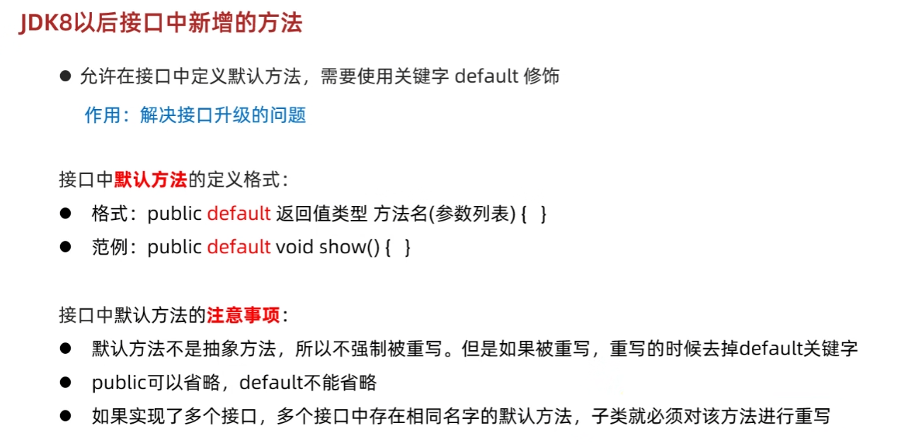


```java
package com.itheima.a08interfacedemo8;

public interface InterA {

    public static void show1(){
        System.out.println("show1方法开始执行了");
        show4();
    }


    public static void show2(){
        System.out.println("show2方法开始执行了");
        show4();
    }


   //普通的私有方法，给默认方法服务的
    private void show3(){
        System.out.println("记录程序在运行过程中的各种细节，这里有100行代码");
    }


    //静态的私有方法，给静态方法服务的
    private static void show4(){
        System.out.println("记录程序在运行过程中的各种细节，这里有100行代码");
    }


}

```

### 接口的多态


### <font style="color:rgb(50, 52, 53);background-color:rgba(255, 255, 255, 0);">接口的声明</font>
<font style="color:rgb(50, 52, 53);background-color:rgba(255, 255, 255, 0);">接口的声明语法格式如下：</font>

```java
[可见度] interface 接口名称 [extends 其他的接口名] {
        // 声明变量
        // 抽象方法
}
```

+ <font style="color:rgb(50, 52, 53);background-color:rgba(255, 255, 255, 0);">接口中每一个方法也是隐式抽象的，声明时同样不需要</font>**<font style="color:rgb(50, 52, 53);background-color:rgba(255, 255, 255, 0);">abstract</font>**<font style="color:rgb(50, 52, 53);background-color:rgba(255, 255, 255, 0);">关键字。</font>
+ <font style="color:rgb(50, 52, 53);background-color:rgba(255, 255, 255, 0);">接口中的方法都是公有的。</font>
+ <font style="color:rgb(50, 52, 53);background-color:rgba(255, 255, 255, 0);">接口是隐式抽象的，当声明一个接口的时候，不必使用</font>**<font style="color:rgb(50, 52, 53);background-color:rgba(255, 255, 255, 0);">abstract</font>**<font style="color:rgb(50, 52, 53);background-color:rgba(255, 255, 255, 0);">关键字。</font>

### <font style="color:rgb(50, 52, 53);background-color:rgba(255, 255, 255, 0);">接口的实现</font>
<font style="color:rgb(50, 52, 53);background-color:rgba(255, 255, 255, 0);">类使用implements关键字实现接口。在类声明中，Implements关键字放在class声明后面。</font>

<font style="color:rgb(50, 52, 53);background-color:rgba(255, 255, 255, 0);">实现一个接口的语法，可以使用这个公式：</font>

```java
...implements 接口名称[, 其他接口名称, 其他接口名称..., ...] ...
```

<font style="color:rgb(50, 52, 53);background-color:rgba(255, 255, 255, 0);">重写接口中声明的方法时，需要注意以下规则：</font>

+ <font style="color:rgb(50, 52, 53);background-color:rgba(255, 255, 255, 0);">类在实现接口的方法时，不能抛出强制性异常，只能在接口中，或者继承接口的抽象类中抛出该强制性异常。</font>
+ <font style="color:rgb(50, 52, 53);background-color:rgba(255, 255, 255, 0);">类在重写方法时要保持一致的方法名，并且应该保持相同或者相兼容的返回值类型。</font>

### <font style="color:rgb(50, 52, 53);background-color:rgba(255, 255, 255, 0);">接口的继承</font>
<font style="color:rgb(50, 52, 53);background-color:rgba(255, 255, 255, 0);">一个接口能继承另一个接口，和类之间的继承方式比较相似。接口的继承使用extends关键字，子接口继承父接口的方法</font>

#### <font style="color:rgb(50, 52, 53);background-color:rgba(255, 255, 255, 0);">接口的多继承</font>
<font style="color:rgb(50, 52, 53);background-color:rgba(255, 255, 255, 0);">在Java中，类的多继承是不合法，但接口允许多继承。</font>

<font style="color:rgb(50, 52, 53);background-color:rgba(255, 255, 255, 0);">在接口的多继承中extends关键字只需要使用一次，在其后跟着继承接口。</font>

```java
public interface Hockey extends Sports, Event
```

## <font style="background-color:rgba(255, 255, 255, 0);">JAVA 包</font>
:::tip
<font style="color:rgb(50, 52, 53);background-color:rgba(255, 255, 255, 0);">Java 使用包（package）这种机制是为了防止命名冲突，访问控制，提供搜索和定位类（class）、接口、枚举（enumerations）和注释（annotation）等。</font>

:::

### <font style="color:rgb(50, 52, 53);background-color:rgba(255, 255, 255, 0);">包的作用</font>
+ <font style="color:rgb(50, 52, 53);background-color:rgba(255, 255, 255, 0);">1、把功能相似或相关的类或接口组织在同一个包中，方便类的查找和使用。</font>
+ <font style="color:rgb(50, 52, 53);background-color:rgba(255, 255, 255, 0);">2、如同文件夹一样，包也采用了树形目录的存储方式。同一个包中的类名字是不同的，不同的包中的类的名字是可以相同的，当同时调用两个不同包中相同类名的类时，应该加上包名加以区别。因此，包可以避免名字冲突。</font>
+ <font style="color:rgb(50, 52, 53);background-color:rgba(255, 255, 255, 0);">3、包也限定了访问权限，拥有包访问权限的类才能访问某个包中的类。</font>

<font style="background-color:rgba(255, 255, 255, 0);"></font>

<font style="color:rgb(50, 52, 53);background-color:rgba(255, 255, 255, 0);">包语句的语法格式为：</font>

```java
packagepkg1[．pkg2[．pkg3…]];
```

```java
package net.java.util;
public class Something{
   ...
}
那么它的路径应该是 net/java/util/Something.java 这样保存的。
```

### <font style="color:rgb(50, 52, 53);background-color:rgba(255, 255, 255, 0);">创建包</font>
<font style="color:rgb(50, 52, 53);background-color:rgba(255, 255, 255, 0);">包声明应该在源文件的第一行，每个源文件只能有一个包声明，这个文件中的每个类型都应用于它。</font>

<font style="color:rgb(50, 52, 53);background-color:rgba(255, 255, 255, 0);">如果一个源文件中没有使用包声明，那么其中的类，函数，枚举，注释等将被放在一个无名的包（unnamed package）中。通常使用小写的字母来命名避免与类、接口名字的冲突。</font>

```java
/* 文件名: Animal.java */
package animals;
 
interface Animal {
   public void eat();
   public void travel();
}
```

<font style="color:rgb(50, 52, 53);background-color:rgba(255, 255, 255, 0);">接下来，在同一个包中加入该接口的实现：</font>

```java
package animals;
 
/* 文件名 : MammalInt.java */
public class MammalInt implements Animal{
 
   public void eat(){
      System.out.println("Mammal eats");
   }
 
   public void travel(){
      System.out.println("Mammal travels");
   } 
 
   public int noOfLegs(){
      return 0;
   }
 
   public static void main(String args[]){
      MammalInt m = new MammalInt();
      m.eat();
      m.travel();
   }
}
```

<font style="color:rgb(50, 52, 53);background-color:rgba(255, 255, 255, 0);">然后，编译这两个文件，并把他们放在一个叫做animals的子目录中</font>

### <font style="color:rgb(50, 52, 53);background-color:rgba(255, 255, 255, 0);">import 关键字</font>
<font style="color:rgb(50, 52, 53);background-color:rgba(255, 255, 255, 0);">在 java 源文件中 import 语句必须位于 Java 源文件的头部，其语法格式为：</font>

```java
import package1[.package2…].(classname|*);
```

<font style="color:rgb(50, 52, 53);background-color:rgba(255, 255, 255, 0);">import 语句位于 package 语句之后</font>

<font style="color:rgb(50, 52, 53);background-color:rgba(255, 255, 255, 0);">如果在一个包中，一个类想要使用本包中的另一个类，那么该包名可以省略。</font>

<font style="color:rgb(50, 52, 53);background-color:rgba(255, 255, 255, 0);">可以使用 import语句来引入一个特定的类：</font>

`<font style="color:rgb(50, 52, 53);background-color:rgba(255, 255, 255, 0);">import com.runoob.MyClass;</font>`<font style="color:rgb(50, 52, 53);background-color:rgba(255, 255, 255, 0);">这样，你就可以在当前源文件中直接使用 MyClass 类的方法、变量或常量。</font>

<font style="color:rgb(50, 52, 53);background-color:rgba(255, 255, 255, 0);">也可以使用通配符 </font>**<font style="color:rgb(50, 52, 53);background-color:rgba(255, 255, 255, 0);">*</font>**<font style="color:rgb(50, 52, 53);background-color:rgba(255, 255, 255, 0);"> 来引入整个包或包的子包 </font>`<font style="color:rgb(50, 52, 53);background-color:rgba(255, 255, 255, 0);">import com.runoob.mypackage.*;</font>`

<font style="color:rgb(50, 52, 53);background-color:rgba(255, 255, 255, 0);">注意，使用通配符 </font>**<font style="color:rgb(50, 52, 53);background-color:rgba(255, 255, 255, 0);">*</font>**<font style="color:rgb(50, 52, 53);background-color:rgba(255, 255, 255, 0);"> 导入整个包时，只会导入包中的类，而不会导入包中的子包。</font>

## <font style="color:rgb(20, 21, 21);background-color:rgba(255, 255, 255, 0);">Java 反射（Reflection）</font>
:::tip
<font style="color:rgb(50, 52, 53);background-color:rgba(255, 255, 255, 0);">它允许程序在运行时查询、访问和修改类、接口、字段和方法的信息。反射提供了一种动态地操作类的能力，这在很多框架和库中被广泛使用，例如Spring框架的依赖注入。</font>

:::

## Java实例


### Javabean类


## 代码块
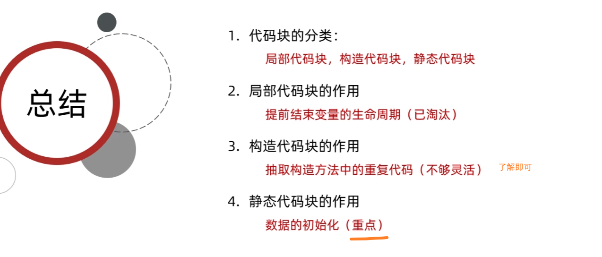


## 常用类
### File类
`java.io.File` 类是文件和目录路径名的抽象表示，主要用于文件和目录的创建、查找和删除等操作。

+ `public File(String pathname) ` ：通过将给定的**路径名字符串**转换为抽象路径名来创建新的 File实例。
+ `public File(String parent, String child) ` ：从**父路径名字符串和子路径名字符串**创建新的 File实例。
+ `public File(File parent, String child)` ：从**父抽象路径名和子路径名字符串**创建新的 File实例。


#### 获取功能的方法


### `<font style="color:#000000;background-color:rgba(255, 255, 255, 0);">java.util.Arrays</font>`<font style="color:#000000;background-color:rgba(255, 255, 255, 0);"> 类</font>
<font style="color:rgb(79, 79, 79);">1.Arrays.toString()方法</font>

<font style="color:rgb(77, 77, 77);">方法作用：快速输出</font><font style="color:rgb(252, 85, 49);">数组</font><font style="color:rgb(77, 77, 77);">内容，可以偷偷懒</font><font style="color:rgb(77, 77, 77);">🌚</font>

<font style="color:rgb(77, 77, 77);"></font>

<font style="color:rgb(79, 79, 79);">2.Arrays.sort()方法</font>

<font style="color:rgb(77, 77, 77);">方法运用:给数组排序---快速排序，默认升序</font>

<font style="color:rgb(77, 77, 77);">两种重载方式：</font>

<font style="color:rgb(77, 77, 77);">①.Arrays.sort(数组名)</font>

<font style="color:rgb(77, 77, 77);">②.Arrays.sort(数组名，起始下标，排序个数)</font>

<font style="color:rgb(77, 77, 77);"></font>

<font style="color:rgb(77, 77, 77);">降序排序：</font><font style="color:#bcbec4;background-color:#1e1f22;">public static <T> void sort(T[] a, Comparator<? super T> c){}</font>


<font style="color:rgb(79, 79, 79);">3.Arrays.binarySearch()</font>

<font style="color:rgb(77, 77, 77);">方法作用：在数组中二分查找元素</font>

`<font style="color:rgb(152, 104, 1);">int</font><font style="color:rgb(56, 58, 66);background-color:rgb(250, 250, 250);"> Arrays.binarySearch( Datatype[], Datatype key)</font>`

<font style="color:rgb(77, 77, 77);">再数组中查找指定值，若找到，则返回此值的下标，</font>

<font style="color:rgb(77, 77, 77);">若没找到，返回</font><font style="color:#DF2A3F;">  -插入点-1</font><font style="color:rgb(77, 77, 77);">；</font>

<font style="color:rgb(77, 77, 77);"></font>

<font style="color:rgb(56, 58, 66);background-color:rgb(250, 250, 250);">4.</font><font style="color:rgb(79, 79, 79);">Arrays.copyOf()</font>

<font style="color:rgb(77, 77, 77);">方法作用：拷贝数组</font>

<font style="color:rgb(77, 77, 77);">源码如下：第一个参数是原数组，第二个参数是拷贝长度，返回值是将原数组拷贝一份返回（它的底层其实是调用了System.arrayCopy()方法）</font>

```java
public static <T> T[] copyOf(T[] original, int newLength) {
      return (T[]) copyOf(original, newLength, original.getClass());
}
```

<font style="color:rgb(77, 77, 77);">返回值是一个新数组，会改变接收这个新数组的引用的一些属性。</font>

<font style="color:rgb(77, 77, 77);"> Arrays.copyOf()的拷贝是从下标0开始的，如果你想从其他下表开始，可以使用Arrays.copyOfRange()方法</font>

```java

// from 表示开始位置， to 表示结束位置  
// 复制下标为 ：[from, to)
Arrays.copyOfRange(int[] original, int from, int to)
```


5.fill（）填充

#### 
### 基本类型包装类 Integer类
+ static int parseInt(string s)将字符串类型的整数转成int类型的整数


基本类型转换为String

+ 转换方式
+ 方式一：直接在数字后加一个空字符串
+ 方式二：通过String类静态方法valueOf()

```java
public class IntegerDemo {
    public static void main(String[] args) {
        //int --- String
        int number = 100;
        //方式1
        String s1 = number + "";
        System.out.println(s1);
        //方式2
        //public static String valueOf(int i)
        String s2 = String.valueOf(number);
        System.out.println(s2);
        System.out.println("--------");
    }
}

```

String转换成基本类型：

所有包装类都具有parseXxx静态方法可以将字符串参数转换为对应的基本类型

### 装箱与拆箱
基本类型与对应的包装类对象之间，来回转换的过程称为”装箱“与”拆箱“：

+ **装箱**：从基本类型转换为对应的包装类对象。
+ **拆箱**：从包装类对象转换为对应的基本类型。

由于我们经常要做基本类型与包装类之间的转换，从Java 5（JDK 1.5）开始，基本类型与包装类的装箱、拆箱动作可以自动完成。例如：

```java
Integer i = 4;//自动装箱。相当于Integer i = Integer.valueOf(4);
i = i + 5;//等号右边：将i对象转成基本数值(自动拆箱) i.intValue() + 5;
//加法运算完成后，再次装箱，把基本数值转成对象。

```

### Date概述
java.util.Date`类 表示特定的瞬间，精确到毫秒。

+ `public Date()`：从运行程序的<font style="color:#DF2A3F;">此时此刻</font>到时间原点经历的毫秒值,转换成Date对象，分配Date对象并初始化此对象，以表示分配它的时间（精确到毫秒）。
+ `public Date(long date)`：将指定参数的毫秒值date,转换成Date对象，分配Date对象并初始化此对象，以表示自从标准基准时间（称为“历元（epoch）”，即<font style="color:#DF2A3F;">1970年1月1日00:00:00 GMT）以来的指定毫秒数。</font>

:::tip
tips: 由于中国处于东八区（GMT+08:00）是比世界协调时间/格林尼治时间（GMT）快8小时的时区，当格林尼治标准时间为0:00时，东八区的标准时间为08:00。

:::

+ `public long getTime()` 把日期对象转换成对应的时间毫秒值。
+ `public void setTime(long time)` 把方法参数给定的毫秒值设置给日期对象

### SimpleDateFormat类
`java.text.SimpleDateFormat` 是<font style="color:#DF2A3F;">日期/时间格式化类</font>，这个类可以帮我们完成日期和文本之间的转换,也就是可以<font style="color:#DF2A3F;">在Date对象与String对象之间进行来回转换</font>。

### Calendar类


### Object类 -----克隆、equals、toString 


### BigInteger类


### BigDecimal类
精确浮点计算

### Date类
java.util.Date`类 表示特定的瞬间，精确到毫秒。

### 内部类


### 内部类分类：


### 成员内部类


```java
package com.itheima.a02innerclassdemo2;

public class Outer {
    String name;

    private class Inner{
        static int a = 10;
    }


    public Inner getInstance(){
        return new Inner();
    }


}

```

```java
package com.itheima.a02innerclassdemo2;

public class Test {
    public static void main(String[] args) {
       /*
        编写成员内部类的注意点：
        1.成员内部类可以被一些修饰符所修饰，比如： private，默认，protected，public，static等
        2.在成员内部类里面，JDK16之前不能定义静态变量，JDK16开始才可以定义静态变量。

        获取成员内部类对象的两种方式：
            方式一：外部类编写方法，对外提供内部类对象（private）

            方式二：直接创建
            格式：外部类名.内部类名 对象名 = 外部类对象.内部类对象;
            范例：Outer.Inner oi = new Outer().new Inner();
        */


        //创建对象的方式：
        //类名 对象名 = new 类名（）；
        //Student s = new Student();

        //我要创建的是谁的对象？
        //内部类的对象

       // Outer.Inner oi = new Outer().new Inner();

        Outer o = new Outer();
        System.out.println(o.getInstance());


    }
}
```

#### 成员内部类获取外部类成员变量：
`Outer.this`

```java

package com.itheima.a03innerclassdemo3;


import java.util.Scanner;

public class Test {
    public static void main(String[] args) {
        //创建内部类的对象，并调用show方法
        Outer.Inner oi = new Outer().new Inner();

        oi.show();


        Scanner sc = new Scanner(System.in);
        sc.next();
    }
}

```

```java
package com.itheima.a03innerclassdemo3;

public class Outer {
    private int a = 10;

    class Inner {
        private int a = 20;

        public void show() {
            int a = 30;
            //Outer.this 获取了外部类对象的地址值
            System.out.println(Outer.this.a);//10
            System.out.println(this.a); //20
            System.out.println(a); //30
        }
    }
}
```


### 静态内部类


### 局部内部类
### 匿名内部类 ****


### Date类
## IO流


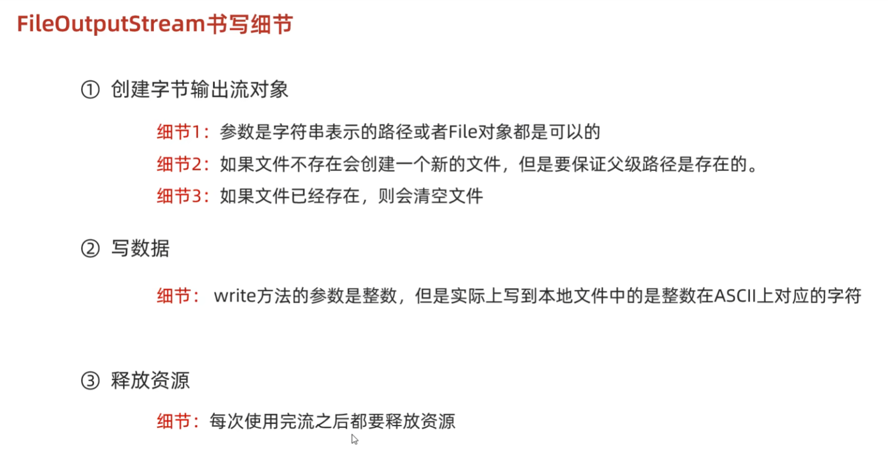


循环读取：


文件拷贝：

最基本小文件：


空参read方法：


有参read方法：


#### 字符输出流


#### 高级流----缓冲流：


拷贝：一次读写一个字节


拷贝：一次读写多个字节


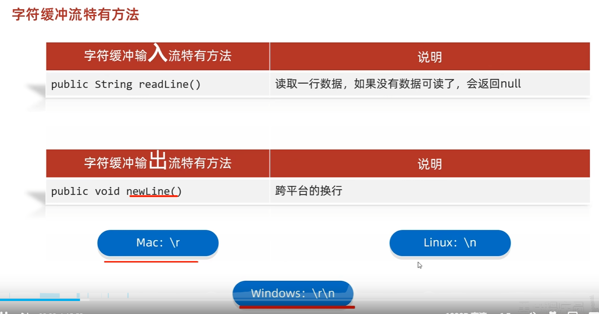


### 转换流：


了解即可：jdk11之后都有替代的方案 FileReader FileWriter


### 序列化流


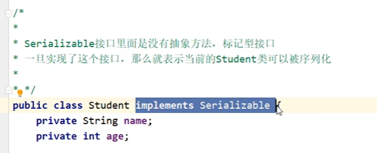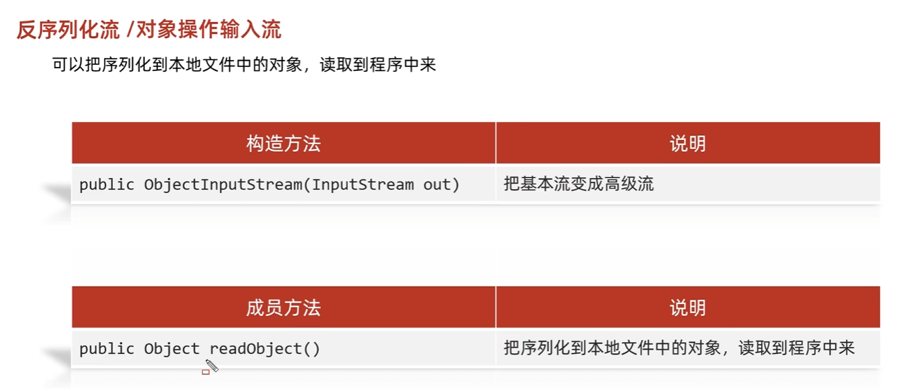


inteliji可以设置


### 打印流
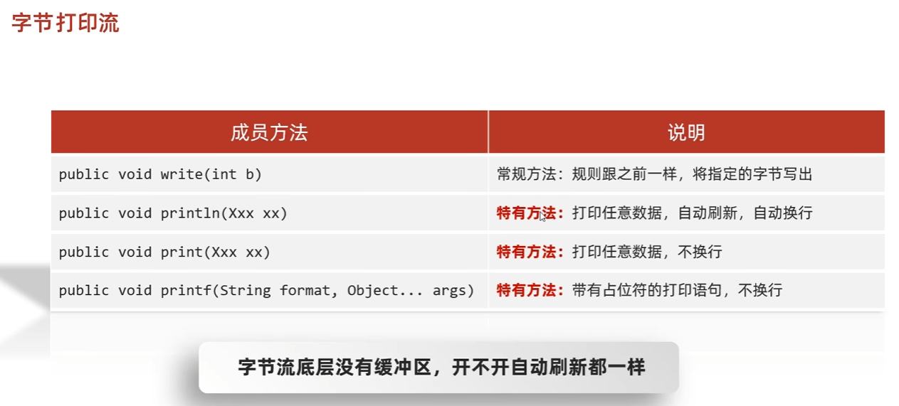

### 解压缩流
java只能识别zip类型


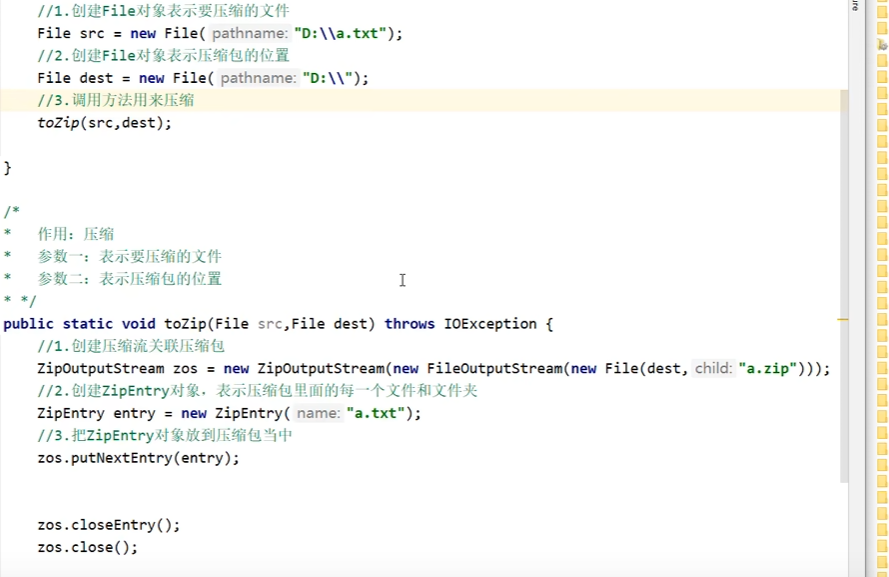


压缩文件夹：

j'a


### Commons-io工具包
### hutool工具包


### 
## 多线程


Thread方法：


守护线程：


出让\礼让线程 -------用的不多：


插入线程---用的不多：  


线程的同步：


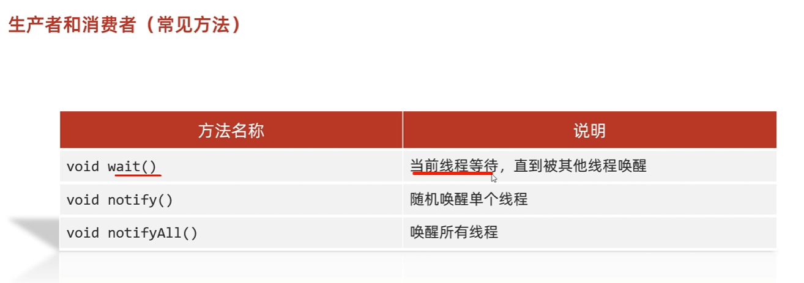


## 网络编程：
## 反编译
javap


## 设计模式
### 适配器模式


## Lambda表达式


## 集合 Collection


### 集合遍历----迭代器，增强for，lambda


### List集合


#### List遍历
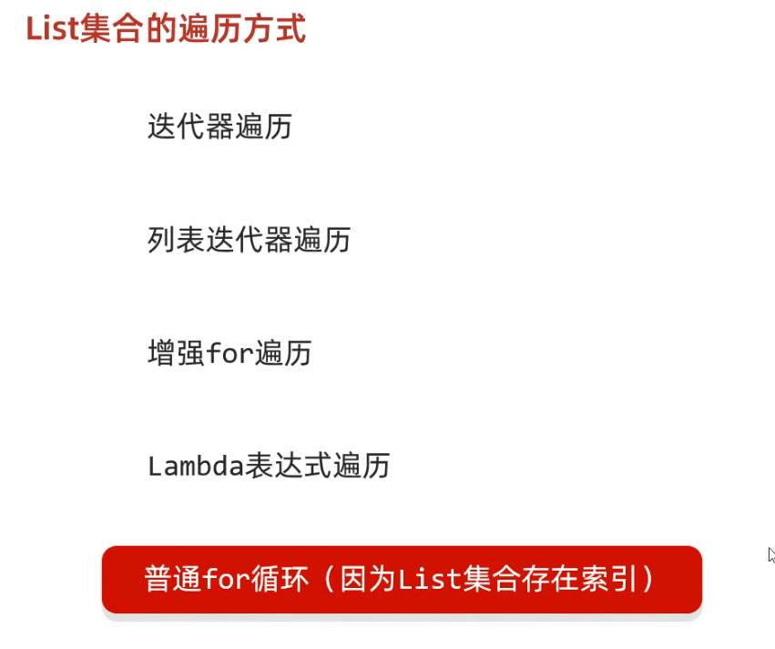


#### ArrayList源码分析


### LinkList集合


### set集合


#### LinkedHashSet


#### TreeSet
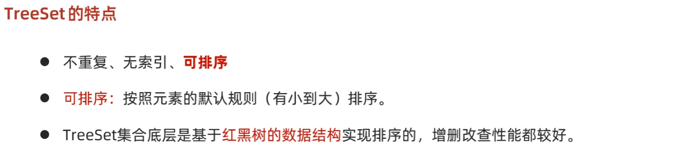


方法二：


### 双列集合


Map的遍历：  


第二种遍历：键值对entry遍历


第三种：lambda遍历：


#### HashMap


HashMap源码分析：[https://www.bilibili.com/video/BV1yW4y1Y7Ms?spm_id_from=333.788.videopod.episodes&vd_source=cd77f29c920fe031e2b46c16d795f999&p=14](https://www.bilibili.com/video/BV1yW4y1Y7Ms?spm_id_from=333.788.videopod.episodes&vd_source=cd77f29c920fe031e2b46c16d795f999&p=14)

#### LinkedHashMap：
#### TreeMap：


### 可变参数 && 泛型


### 
泛型

### 


### Collections


### 不可变集合；


### 泛型的继承和通配符


## 打包exe
[打包exe文档.docx](https://www.yuque.com/attachments/yuque/0/2025/docx/34548170/1741509723754-f477c38f-783c-47d8-a317-ac4de6a053ce.docx)

## String流


```java
package com.itheima.a01mystream;

import java.util.*;
import java.util.function.Function;
import java.util.stream.Collectors;

public class StreamDemo10 {
    public static void main(String[] args) {

        /*
            collect(Collector collector)            收集流中的数据，放到集合中 (List Set Map)

            注意点：
                如果我们要收集到Map集合当中，键不能重复，否则会报错
       */

        ArrayList<String> list = new ArrayList<>();
        Collections.addAll(list, "张无忌-男-15", "周芷若-女-14", "赵敏-女-13", "张强-男-20",
                "张三丰-男-100", "张翠山-男-40", "张良-男-35", "王二麻子-男-37", "谢广坤-男-41");


        //收集List集合当中
        //需求：
        //我要把所有的男性收集起来
        List<String> newList1 = list.stream()
                .filter(s -> "男".equals(s.split("-")[1]))
                .collect(Collectors.toList());
        //System.out.println(newList1);


        //收集Set集合当中
        //需求：
        //我要把所有的男性收集起来
        Set<String> newList2 = list.stream().filter(s -> "男".equals(s.split("-")[1]))
                .collect(Collectors.toSet());
        //System.out.println(newList2);


        //收集Map集合当中
        //谁作为键,谁作为值.
        //我要把所有的男性收集起来
        //键：姓名。 值：年龄
        Map<String, Integer> map = list.stream()
                .filter(s -> "男".equals(s.split("-")[1]))
                /*
                 *   toMap : 参数一表示键的生成规则
                 *           参数二表示值的生成规则
                 *
                 * 参数一：
                 *       Function泛型一：表示流中每一个数据的类型
                 *               泛型二：表示Map集合中键的数据类型
                 *
                 *        方法apply形参：依次表示流里面的每一个数据
                 *               方法体：生成键的代码
                 *               返回值：已经生成的键
                 *
                 *
                 * 参数二：
                 *        Function泛型一：表示流中每一个数据的类型
                 *                泛型二：表示Map集合中值的数据类型
                 *
                 *       方法apply形参：依次表示流里面的每一个数据
                 *               方法体：生成值的代码
                 *               返回值：已经生成的值
                 *
                 * */
                .collect(Collectors.toMap(new Function<String, String>() {
                                              @Override
                                              public String apply(String s) {
                                                  //张无忌-男-15
                                                  return s.split("-")[0];
                                              }
                                          },
                        new Function<String, Integer>() {
                            @Override
                            public Integer apply(String s) {
                                return Integer.parseInt(s.split("-")[2]);
                            }
                        }));


        Map<String, Integer> map2 = list.stream()
                .filter(s -> "男".equals(s.split("-")[1]))
                .collect(Collectors.toMap(
                        s -> s.split("-")[0],
                        s -> Integer.parseInt(s.split("-")[2])));

        System.out.println(map2);


    }
}

```


## 方法引用  ---Mabatis中会大量使用


## jar包导入


# Java杂项
## Junit测试


## 注解
## 
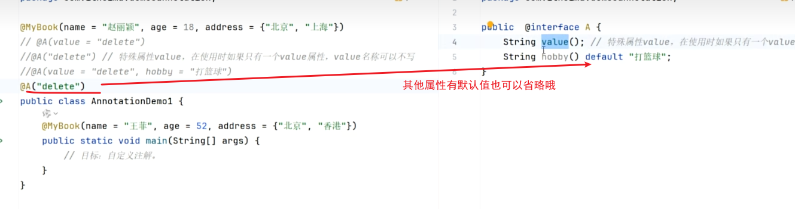


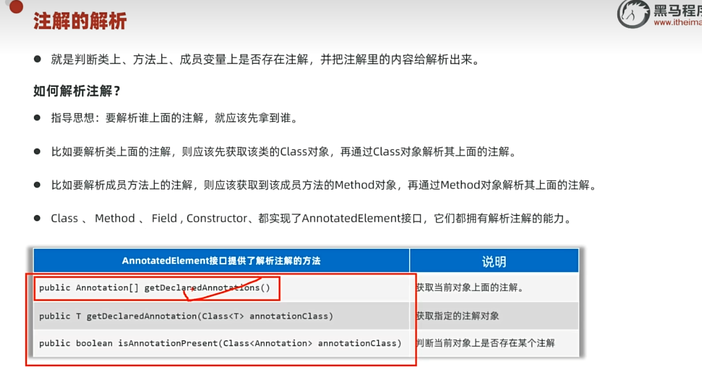

