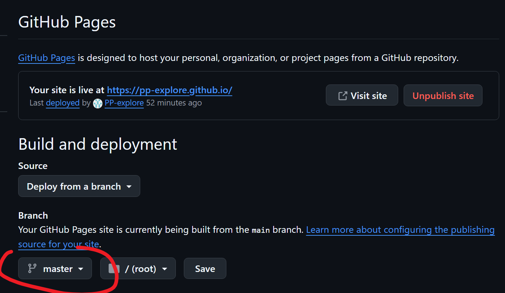
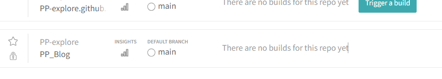
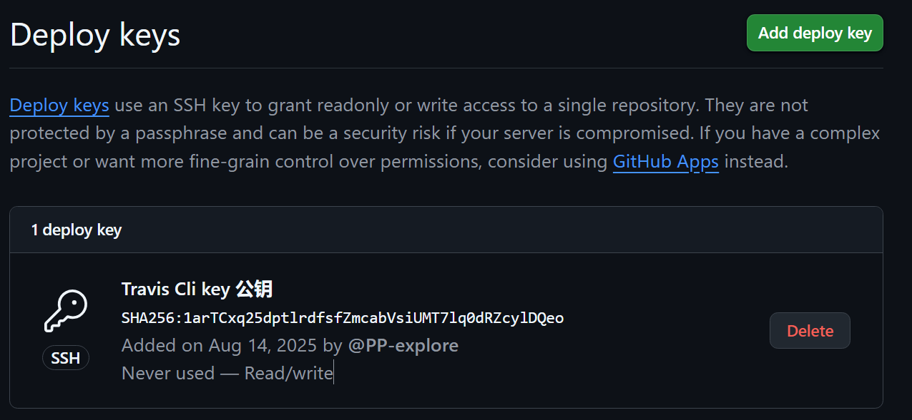
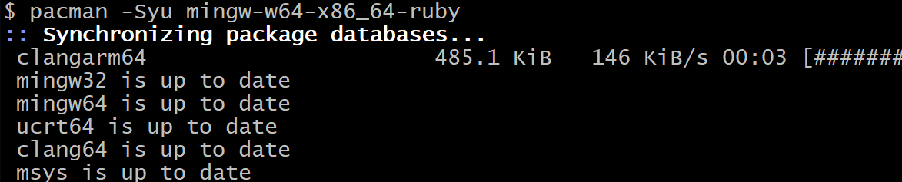
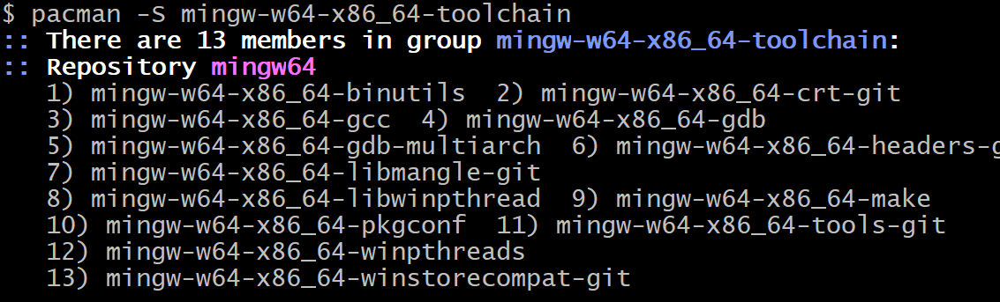
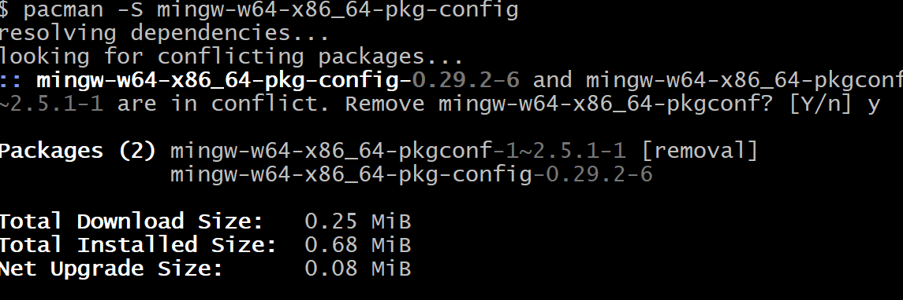
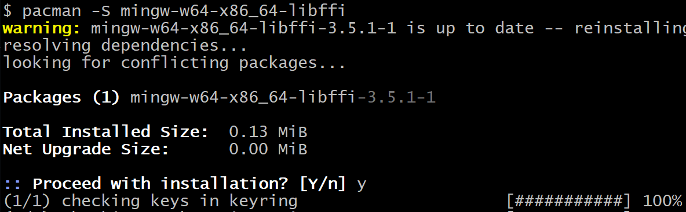
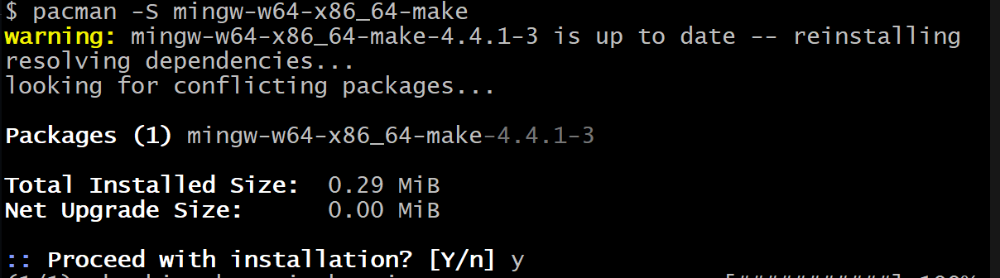

使用ssh连接github

[https://blog.csdn.net/weixin_42310154/article/details/118340458](https://blog.csdn.net/weixin_42310154/article/details/118340458)

注意生成密钥时如果本地存在多个秘钥则需指定名字


多个秘钥存在的情况需要配置.ssh/config文件:

```python
Host github.com
  HostName github.com
  User git
  IdentityFile ~/.ssh/github_rsa
  IdentitiesOnly yes  # 强制只使用指定的密钥
```

Clash TN模式下无法正常使用ssh:

[https://ksh7.com/posts/ssh-connection-errors/index.html](https://ksh7.com/posts/ssh-connection-errors/index.html)

[https://linux.do/t/topic/547965](https://linux.do/t/topic/547965)

## 新建github个人网站
使用master分支构建

[https://segmentfault.com/a/1190000013484231#item-3](https://segmentfault.com/a/1190000013484231#item-3)

配置主题:

[https://blog.csdn.net/qq_56423581/article/details/127389390](https://blog.csdn.net/qq_56423581/article/details/127389390)


[https://zhuanlan.zhihu.com/p/36912355](https://zhuanlan.zhihu.com/p/36912355)


## <font style="color:rgb(25, 27, 31);">使用triavs-ci自动同步</font>
 开启仓库



生成ssh key 配置 github.io项目的deploy keys



安装travis命令行工具

安装Ruby

[https://blog.csdn.net/Gherbirthday0916/article/details/132037220](https://blog.csdn.net/Gherbirthday0916/article/details/132037220)

我的安装版本为2.7

### 打开Mingw64 在MSYS2中安装travis
安装ruby



构建工具链



安装pkg-config



**安装 **`**libffi**`** 的开发库**： `ffi` gem 需要 `libffi` 的头文件和库文件才能编译  



安装make:



<font style="color:#000000;">检查 </font>`<font style="color:#000000;">A:/MSY32/mingw64/bin/</font>`<font style="color:#000000;">下是否有 </font>`<font style="color:#000000;">make.exe</font>`<font style="color:#000000;">或 </font>`<font style="color:#000000;">mingw32-make.exe</font>`<font style="color:#000000;">：</font>

```plain
ls MSY32/mingw64/bin/make.exe
ls MSY32/mingw64/bin/mingw32-make.exe
```

+ <font style="color:#000000;">如果只有</font><font style="color:#000000;"> </font>`<font style="color:#000000;">mingw32-make.exe</font>`<font style="color:#000000;">，但没有</font><font style="color:#000000;"> </font>`<font style="color:#000000;">make.exe</font>`<font style="color:#000000;">，则需要创建符号链接：</font>

```plain
ln -s MSY32/mingw64/bin/mingw32-make.exe MSY32/mingw64/bin/make.exe
```

建立ruby.h的符号链接,避<font style="color:#000000;">免</font><font style="color:#000000;">gem 在编译时找不到 Ruby 的头文件（</font>`<font style="color:#000000;">ruby.h</font>`<font style="color:#000000;">），导致 </font>`<font style="color:#000000;">make</font>`<font style="color:#000000;">失败</font>

`ln -s "A:/MSY32/mingw64/include/ruby-3.4.0" "/mingw64/include/ruby-3.4.0"`


### 使用RubyInstaller安装 travis
:: 确保 DevKit 已初始化

cd D:\Ruby32-x64

ridk enable


:: 验证开发工具

gcc -v

make -v

安装travis

```bash
gem install travis
```


[https://github.com/typhoeus/typhoeus/issues/720](https://github.com/typhoeus/typhoeus/issues/720)


报错

D:/Ruby32-x64/lib/ruby/gems/3.2.0/gems/travis-1.14.0/lib/travis/cli/command.rb:334:in `format': wrong number of arguments (given 5, expected 1..3) (ArgumentError)

改用travis版本

[https://github.com/travis-ci/travis.rb/issues/863](https://github.com/travis-ci/travis.rb/issues/863)


