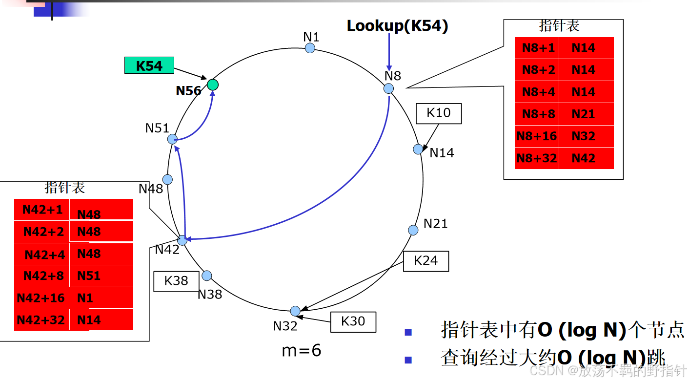
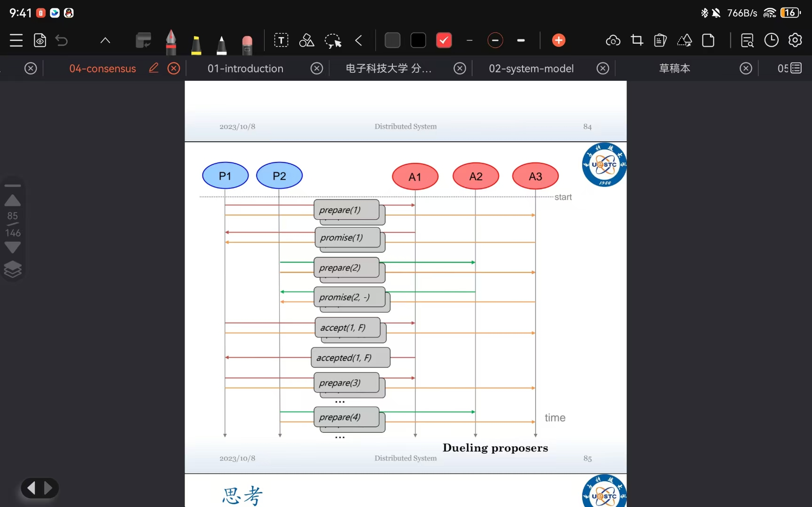
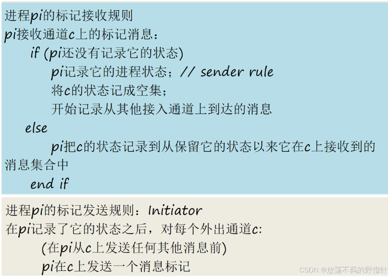
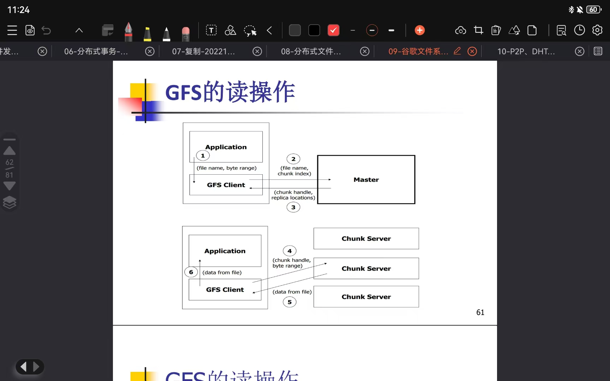
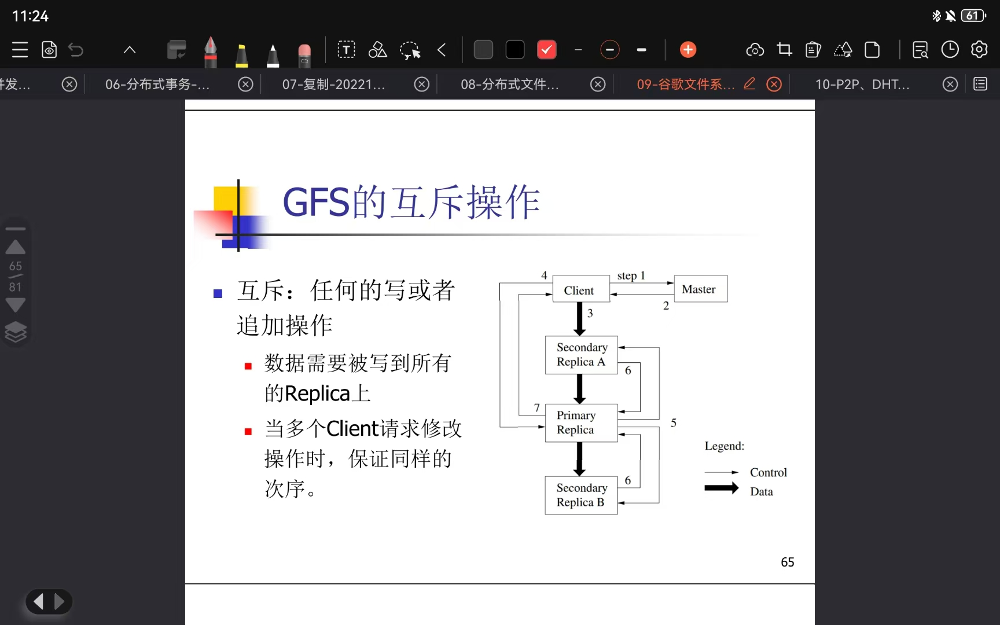
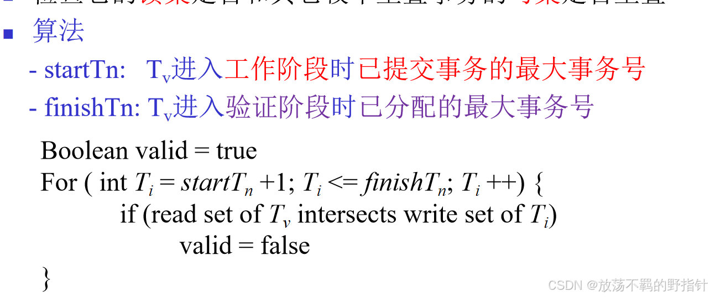
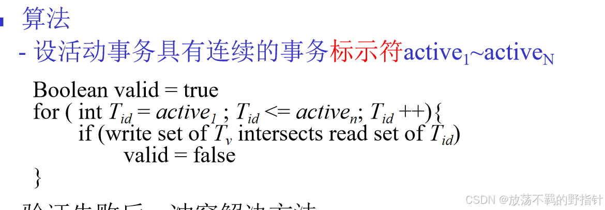

# 大题：
## chord哈希算法，让你填写查询过程 (5分)
Chord原理、Hash表分布规则、基于Finger Table的路由技术

Hash表分布规则：

Hash节点IP地址－>m位节点ID(表示为NID)

Hash内容关键字－>m位K(表示为KID)

节点按ID从小到大顺序排列在一个逻辑环上

`<K, V>`存储在后继节点上

Successor (K)：从K开始顺时针方向距离K最近的节点

**<font style="color:rgb(77, 77, 77);">基于Finger Table的路由技术</font>**  
<font style="color:rgb(77, 77, 77);">如果是一个个链式查，那么复杂度是o(n)</font>  
<font style="color:rgb(77, 77, 77);">但是添加了一个指针标，记录幂次后继的IP</font>




## <font style="color:rgb(25, 27, 31);">简述两阶段提交</font>
两阶段提交协议（设计动机、基本思想、基本操作、过程描述、通信、性能、缺陷）

<font style="color:rgb(77, 77, 77);">设计动机：允许任意一个参与者自行放弃他自己的那部分事务</font>  
<font style="color:rgb(77, 77, 77);">基本思想：</font>  
<font style="color:rgb(77, 77, 77);">分2个阶段完成事务：</font>  
<font style="color:rgb(77, 77, 77);">在第一阶段，协调者询问所有的参与者是否准备好提交</font>  
<font style="color:rgb(77, 77, 77);">在第二阶段，协调者通知所有参与者提交（或放弃）事务</font>

<font style="color:rgb(77, 77, 77);">具体过程：</font>

<font style="color:rgb(77, 77, 77);">阶段1 (投票阶段):</font>

<font style="color:rgb(77, 77, 77);">1.1 协调者向分布式事务的所有参与者发送</font><font style="color:#DF2A3F;">canCommit</font><font style="color:rgb(77, 77, 77);">?请求。</font>

<font style="color:rgb(77, 77, 77);">1.2 当参与者收到canCommit?请求后，它将向协调者回复它的投票（Yes或No）。在投</font>**<font style="color:#DF2A3F;">Yes票之前，它将在持久性存储中保存所有对象</font>**<font style="color:rgb(77, 77, 77);">，准备提交；如果投No票，参与者立即放弃。</font>

<font style="color:rgb(77, 77, 77);">阶段2 (根据投票结果完成事务):</font>

<font style="color:rgb(77, 77, 77);">2.1 协调者收集所有的投票（包括它自己的投票）</font>

<font style="color:rgb(77, 77, 77);">(i) 若不存在故障且所有的投票结果均是Yes时，则协调者决定提交事务并向所有参与者发送</font><font style="color:#DF2A3F;">doCommit</font><font style="color:rgb(77, 77, 77);">请求。</font>

<font style="color:rgb(77, 77, 77);">(ii)否则，协调者决定放弃事务，并向所有投Yes票的参与者发送doAbort请求。</font>

<font style="color:rgb(77, 77, 77);">2.2 投Yes票的参与者等待协调者发送的</font><font style="color:#DF2A3F;">doCommit</font><font style="color:rgb(77, 77, 77);">或者</font><font style="color:#DF2A3F;">doAbort</font><font style="color:rgb(77, 77, 77);">请求。</font>

<font style="color:rgb(77, 77, 77);">一旦参与者收到任何一种请求消息，它根据该请求放弃或者提交事务。</font>

<font style="color:rgb(77, 77, 77);">如果请求是提交事务，那么它还要向协调者发送一个</font><font style="color:#DF2A3F;">haveCommitted</font><font style="color:rgb(77, 77, 77);">来确认事务已经提交。</font>

<font style="color:rgb(77, 77, 77);">两阶段提交协议的缺陷：</font>

<font style="color:rgb(77, 77, 77);">同步阻塞</font>

<font style="color:rgb(77, 77, 77);">在投票Yes与doCommit之间，所有参与者处于阻塞状态，无法进行其他任何操作。</font>

<font style="color:rgb(77, 77, 77);">更甚者，若协调者在发起提议后崩溃，那么投Yes票的参与者阻塞至协调者恢复后发送决议。</font>

<font style="color:rgb(77, 77, 77);">单点故障</font>

<font style="color:rgb(77, 77, 77);">协调者存在性能瓶颈及单点失效问题</font>

<font style="color:rgb(77, 77, 77);">数据不一致</font>

<font style="color:rgb(77, 77, 77);">当协调者发送doCommit后，若发生了局部网络异常或者协调者在尚未完全发送doCommit前自身发生了崩溃，导致只有部分参与者接收到doCommit。</font>

<font style="color:rgb(77, 77, 77);">那么，接收到doCommit的参与者就会进行提交事务，而未收到doCommit的参与者不提交事务，进而形成了数据不一致性。</font>

## <font style="color:rgb(25, 27, 31);">简述gfs文件系统的设计动机</font>


## <font style="color:rgb(25, 27, 31);">paxos共识算法的交互过程</font>
prepare    promise     accept    accepted


## <font style="color:rgb(25, 27, 31);">chandy-lamport快照算法</font>



## <font style="color:rgb(25, 27, 31);">简述互联网上存在的安全威胁</font>
<font style="color:rgb(83, 88, 97);">DoS攻击，移动代码（木马病毒）</font>

## <font style="color:rgb(25, 27, 31);">基本组播与可靠组播的区别是什么，怎么用基本组播实现可靠</font>[<font style="color:rgb(25, 27, 31);">组播</font>](https://zhida.zhihu.com/search?content_id=219612206&content_type=Article&match_order=4&q=%E7%BB%84%E6%92%AD&zhida_source=entity)<font style="color:rgb(25, 27, 31);">；</font>
<font style="color:rgba(0, 0, 0, 0.75);">区别：基本组播只将消息发送给每个进程，而可靠组播保证了消息的完整性、有效性与协定</font>

1. <font style="color:rgba(0, 0, 0, 0.75);">完整性 Integrity  
</font><font style="color:rgba(0, 0, 0, 0.75);">一个</font>**<font style="color:rgba(0, 0, 0, 0.75);">正确的进程</font>**<font style="color:rgba(0, 0, 0, 0.75);">p投递一个消息m至多一次</font>
2. <font style="color:rgba(0, 0, 0, 0.75);">有效性 Validity  
</font><font style="color:rgba(0, 0, 0, 0.75);">如果一个</font>**<font style="color:rgba(0, 0, 0, 0.75);">正确的进程</font>**<font style="color:rgba(0, 0, 0, 0.75);">组播消息m，那么最终自己也将投递m。</font>
3. <font style="color:rgba(0, 0, 0, 0.75);">协定 Agreement  
</font><font style="color:rgba(0, 0, 0, 0.75);">如果一个</font>**<font style="color:rgba(0, 0, 0, 0.75);">正确的进程</font>**<font style="color:rgba(0, 0, 0, 0.75);">投递消息m，那么group中</font>**<font style="color:rgba(0, 0, 0, 0.75);">其它正确的进程</font>**<font style="color:rgba(0, 0, 0, 0.75);">终将投递m。</font>

```cpp
初始化：
　　　  Received:={};
        进程p将R-multicast消息发送给组g：
　　　  B-multicast(g, m);
          
        在进程q进行B-deliver(m)时，其中g=group(m)
        if (m ∉ Received) // 完整性
            Received:=Received ∪ {m}
            if (q≠p) then B-multicast(g, m); end if // 协定
            R-deliver m; // 完整性，有效性
        end if
```

## <font style="color:rgb(25, 27, 31);">GFS中的读，写互斥流程（需要画图)</font>
<font style="color:rgb(83, 88, 97);">读：</font>  
<font style="color:rgb(83, 88, 97);">1.应用程序发起读取请求。</font>  
<font style="color:rgb(83, 88, 97);">2.Client从（文件名，字节范围）->（文件名，</font>[<font style="color:rgb(83, 88, 97);">组块</font>](https://zhida.zhihu.com/search?content_id=219612206&content_type=Article&match_order=1&q=%E7%BB%84%E5%9D%97&zhida_source=entity)<font style="color:rgb(83, 88, 97);">索引）转换请求，并将其发送到Master。</font>  
<font style="color:rgb(83, 88, 97);">3.Master以块句柄和副本位置（即存储副本的Chunkserver）作为响应。</font>  
<font style="color:rgb(83, 88, 97);">4.Client选择一个位置，然后将（块句柄，字节范围）请求发送到该位置。</font>  
<font style="color:rgb(83, 88, 97);">5.Chunkserver将请求的数据发送到Client。</font>  
<font style="color:rgb(83, 88, 97);">6.Client将数据转发到应用程序。</font>

##   
<font style="color:rgb(83, 88, 97);">写：</font>  
<font style="color:rgb(83, 88, 97);">1.Client发送请求到Master；</font>  
<font style="color:rgb(83, 88, 97);">2.Master返回块的句柄和Replica</font>[<font style="color:rgb(83, 88, 97);">位置信息</font>](https://zhida.zhihu.com/search?content_id=219612206&content_type=Article&match_order=1&q=%E4%BD%8D%E7%BD%AE%E4%BF%A1%E6%81%AF&zhida_source=entity)<font style="color:rgb(83, 88, 97);">；</font>  
<font style="color:rgb(83, 88, 97);">3.Client将写数据推送给所有Replica（可以根据</font>[<font style="color:rgb(83, 88, 97);">网络拓扑</font>](https://zhida.zhihu.com/search?content_id=219612206&content_type=Article&match_order=1&q=%E7%BD%91%E7%BB%9C%E6%8B%93%E6%89%91&zhida_source=entity)<font style="color:rgb(83, 88, 97);">）；</font>  
<font style="color:rgb(83, 88, 97);">4.数据存储在Replica的缓存中；</font>  
<font style="color:rgb(83, 88, 97);">5.Client发送写命令到Primary；</font>  
<font style="color:rgb(83, 88, 97);">6.Primary给出写的次序（可能请求来自多个Client）；</font>  
<font style="color:rgb(83, 88, 97);">7.Primary将该次序发送给Secondaries；</font>  
<font style="color:rgb(83, 88, 97);">8.Secondaries响应Primary；</font>  
<font style="color:rgb(83, 88, 97);">9.Primary响应Client。</font><font style="color:rgb(25, 27, 31);">a.向后验证的</font>[<font style="color:rgb(25, 27, 31);">伪代码</font>](https://zhida.zhihu.com/search?content_id=219612206&content_type=Article&match_order=1&q=%E4%BC%AA%E4%BB%A3%E7%A0%81&zhida_source=entity)<font style="color:rgb(25, 27, 31);">； b.用向后验证的方法判断T是否可以提交，并说明理由(这题有图)；</font>


