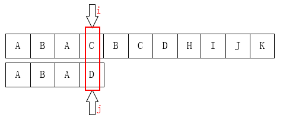
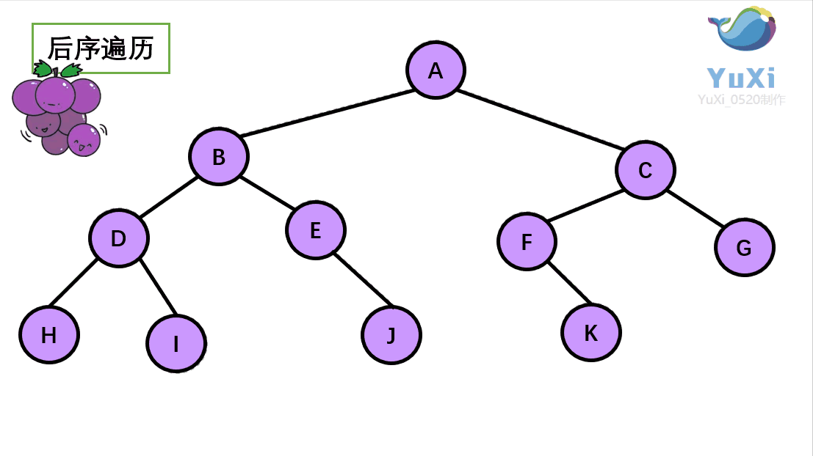
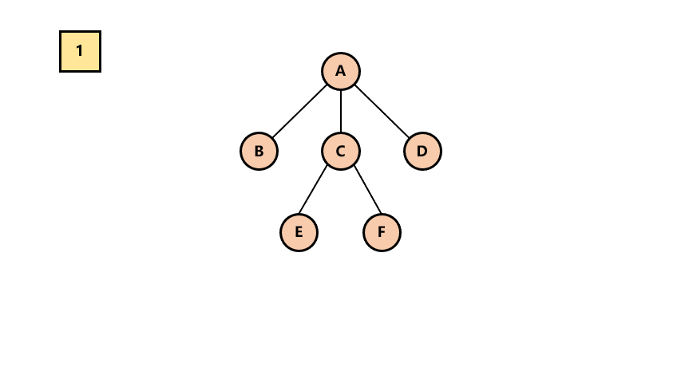
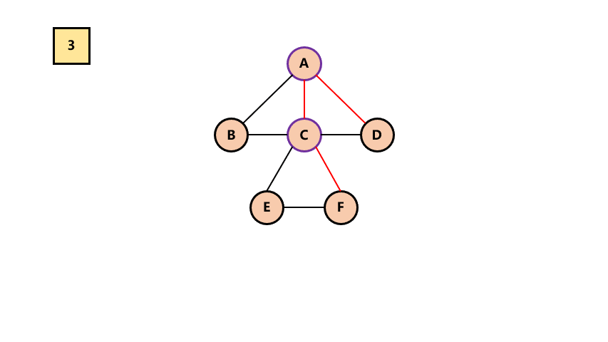

# 一、绪论
1. <font style="background-color:#FADB14;">数据结构：是相互之间存在的一种或多种特定关系的数据元素的集合</font>

              是一门研究非数值计算的程序设计问题中的操作对象，以及他们之间的关系和操作等问题的学科

2. 数据：描述客观事物的符号，计算机中可以操作的对象，如整形、实型等数值类型、声音、图像等非数值类型
3. 数据项：一个<font style="color:#E8323C;">数据元素由若干数据项</font>组成——数据的<font style="color:#E8323C;">最小单位</font>
4. 数据元素：是组成数据的、<font style="color:#E8323C;">有一定意义</font>的基本单位

                      是数据结构中建立数据模型的着眼点，针对数据元素进行分析

5. 数据对象：<u>性质相同</u>的<font style="color:#E8323C;">数据元素的集合</font>，是<u>数据的子集</u>

                 如人与人们，性质相同指据哟相同数量和类型的数据项，人的各种属性为数据项，人为数据元素，人们即为数据对象

               为不产生混淆，视为数据对象为数据

6. 数据结构中的结构？类比分子与原子的排列方式，不同数据元素之间不是独立的，而是存在特定的关系

 数据结构分为：逻辑结构、物理结构

 01：逻辑结构：<font style="background-color:#FADB14;">数据对象中数据元素之间的相互关系           </font>


02.物理结构：数据的逻辑结构在计算机中的<font style="color:#E8323C;">存储形式</font>

+ 存储器主要是针对内存，外部存储如硬盘、光盘等，通常用文件结构来描述
+ 关键点：数据的<font style="color:#E8323C;">存储结构</font>应正确<font style="color:#E8323C;">反映</font>数据元素之间的<font style="color:#E8323C;">逻辑关系</font>
+ <font style="background-color:#FADB14;">重点与难点：如何存储数据元素之间的逻辑关系</font>
+ 数据元素的存储结构形式：<u>顺序存储、链式存储 </u>
+ 逻辑结构是面向问题的，存储结构是面向计算机的

顺序存储结构：数据元素存放在地址连续的存储单元里，逻辑关系与物理关系是一致的，如数组

链式存储结构：数据元素存放在任意的存储单元里，存储关系并不能反映其逻辑关系，需要指针存放数据元素的地址

数据类型：一组性质形同的值的集合及定义在此集合上的一些操作的总称

 分为原子类型（是不可再分的基本类型，如整形、字符型）、结构类型（由若干类型组合而成，可在分解）

+ 抽象：抽取出事物具有的普遍性质
+ 抽象数据类型（ADT）：<u>一个数学模型及定义在该模型的一组操作</u>，抽象数据类型的定义仅取决于一组逻辑特性，而与如何在计算机上实现和表示无关，如手机电脑平板均有”整型类型“，但在每台设备上实现的方式可能不同
+ 抽象数据类型体现出程序设计中问题分解、抽象和信息隐藏的特性
+ 描述抽象数据类型的标准格式：

```plain
ADT 抽象数据结构名称
Data
  数据元素之间逻辑关系的定义
Operation
操作1
     初始条件
    操作结果描述
操作2
.......
endADT
```


# 二、算法：解决特定问题求解步骤的描述
+ 数据结构与算法的关系：算法是对数据结构的运用

## 2.1算法的特性
+ 算法的五个基本特性：输入、输出、有穷性、确定性、可行性
1. 有穷性：算法执行有限的步骤后，自动结束而非无限循环，并且每个步骤在可接受的时间内完成
2. 确定性：算法的每一个步骤都具有明确的定义，不会出现二义性
3. 可行性：算法的每步必须是可行的
+ 算法并不唯一，但相对好的算法值得学习

## 2.2算法设计的要求：正确性、可读性、健壮性、时间效率高和存储低
### 正确性：四个层次
（1）没有语法错误

（2）对于合法输入数据能够产生满足要求的输出结果

（3）对于<u>非法的输入数据能得出满足规格说明的结果</u>

（4）对于精心选择、<u>刁难的测试数据都有满足要求的输出结果</u>

### 可读性：便于阅读、理解和交流
                    好的算法容易理解

### 健壮性：对不合法的输入仍能给出处理
### 时间效率高和存储低：满足时间和空间的高效率


## 2.3算法效率的度量方法
+ 算法时间复杂度 O（）

跟输入量n增长有联系的耗时操作

O（1）：常数阶

O（n）：线性阶

O（logn）：对数阶

O（n^2）：平方阶

O（nlogn）

O（2^n)

O（n！）

+ 最坏情况复杂度与平均情况复杂度
+ 算法空间复杂度

# 三、线性表
1. 线性表的长度：线性表元素的个数
2. 零个或多个数据元素的有限序列
3. 位序：数据元素Ai在线性表中的位置i
4. 线性表的抽象数据类型：

```plain
ADT:线性表（list）
data
线性表的数据对象集合为{a1,a2,…an}，每个元素的类型均为datatype，其中除第一个元素a1和最后一个元素an外每一个元素有且只有一个前驱后继，数据元素都是一一对应的关系
操作
InitList（*L）：初始化操作，建立一个空的线性表L。
ListEmpty（L）：判断一个线性表是否为空，为空返回真，否则返回假。
ClearList（*L）：线性表清空。
GetElem（L,I,*e）：线性表L中的第I个元素值返回给e
LocateEleme（L,e）：线性表L中查找与给定e元素相等的元素，如果查找成功，返回该元素在表中序号，否则返回0表示失败。
ListInsert（*L,I,e）：线性表第i个位置插入新元素e
ListDelete（*L,I,*e）：删除线性表第i个元素，并用e返回其值
ListLength（L）:返回线性表的长度
```

## 线性表的顺序存储结构：用一段地址连续的存储单元依次存储线性表中的数据元素
```cpp
#define MAXSIZE 20
typedef int ElemType;
typedef struct
{
ElemType Data[MAXSIZE];
int Length;
}SqList;

```

+ 描述线性表的顺序存储结构需要的三个属性：
    - 存储空间的起始位置：数组Data
    - 最大存储容量：数组容量MAXSIZE
    - 线性表的当前长度：length


+ 随机存取结构：存取数据需要的时间复杂度为O（1）的存储结构

### 顺序存储结构的插入与删除:  时间复杂度均为O（n）
#### GetElem获取元素操作
```cpp
#define OK 1
#define ERROR 0
//status是函数的类型，其返回值为函数的执行状态结果，如OK
typedef int Status;

Status GetElem(SqList* L,int i,ElemType *e)
{
    if(i>L.length || i<1 ||L.length==0)
    {
        return ERROR;
    }
    *e=L.data[i+1];
    return OK;
}

```


#### ListInsert插入操作
插入算法思路：

    1. 插入位置不合理，抛出异常
    2. 线性表的长度大于等于数组长度，抛出异常或动态增加数组容量
    3. 从最后一个元素遍历到第loc个元素，分别向后移动
    4. 将要插入元素填入loc位置处
    5. 表的长度加1

```c
Status ListInsert(SqList* L,int location,ElemType e)
{
    //插入位置大于最后一个元素位置加1的位置 或 插入位置小于第一位置 或 线性表已满
    if(location>L.length+1 || location<1  || L.length==MAXSIZE)
        return ERROR;

    int i;

    //插入位置小于等于最后一个元位置
    if(location<=L.length)
    {
        for(i=length,i>location,i--)
      {
          L.data[i]=L.data[i-1];
      }
    }
    L.data[location-1]=e;
    L.length++;

    return OK;
}


```


#### ListDelete删除操作：
删除算法思路：

    1. 删除位置不合理，抛出异常
    2. 取出删除元素
    3. 删除元素之后的元素位置前移
    4. 表长减1

```c
Status ListDelete(SqList* L,int loc,ElemType* e)
{
    //删除位置大于最后一个元素位置 或 删除位置小于1 或 线性表为空
    if(loc>L->length || loc<1 || L->length==0  )
        return ERROR;

    *e=L->data[loc-1];

    int k;
    if(loc < L->length)
    {
        for(k=loc,k<L->length,k++)
      {
          L->data[k-1]=L->data[k]; 
      }
    }
    L->length--;
    return OK;
}
```

线性表的顺序存储结构的优缺点：


## 综合应用题
### 1。
```plain

int DeleteElem type(SqList &L,Elemtype e)
{
if L.length ≤0 return  FALSE
if 
for int i =l.length

}
```

## 线性表的链式存储结构：（顺序存储结构不足的解决方法）
### 线性表的链式存储结构特点：用一组任意的存储单元存储线性表的数据元素
+ 数据域：存储数据元素信息的域
+ 指针域：存储直接后继位置的域
+ 指针/链：指针域中存储的信息
+ 结点Node：数据域＋指针域组成数据元素ai的存储映像
+ 线性表的链式存储结构：n个结点（ai的存储映像）链结成一个链表


+ 头指针：链表中第一个节点的存储位置，有头结点则指向的是头结点
+ 头结点：在单链表的第一个结点前附设一个结点

```c
typedef struct Node
{
    Elemtype data；
      struct Node* next;
}Node;
typedef struct Node* LinkList //链表头指针  定义结构体指针为 Linklist
```

### GetElem获取操作：
算法思路：

1. 声明指向链表第一个结点的指针，初始化j从1开始
2. 当j<i时，遍历链表让p执政后移，j累加1
3. 若到链表末尾p为空，则无此结点
4. 否则查找成功，返回结点p的数据

```c
Status GetElem(Linklist L,int loc,Elemtype* e)
{
    Linklist p; //声明结点指针p
    p=L->next;  //指向第一个节点
    int j; //计时器j
    j=1;
    while(p && j<loc) //p不为空且 j未到达location
    {
        p=p->next; //p指向下一个结点
        ++j;
    }
    if(!p || j>loc) //第i个元素不存在
        return ERROR;
    *e=p->data;//取出第1个元素的数据
    return OK;
}
```

### ListInsert插入操作(在loc位置之前插入新节点)：
算法思路：

1. 声明指针p指向表头结点，初始化j=1
2. 判断loc是否为链表首，是则插入结点
3. 当j<loc，遍历链表，使指针p不断后移，j++
4. 若到链表末尾p为空，说明结点不存在
5. 实例化新节点s，赋值s->data
6. 将s插入到loc位置

```cpp
//不带头结点的链表插入
int Listinsert(LinkList *L,int loc,int b)//二级指针形参传递一级指针的地址值(典型案例)
{
    if(loc<1) return ERROR;//插入位置不对
	int j = 1;
	LinkList p, s;
    p = *L;//p指向链表首结点
	if (loc == 1)//表头插入
	{
		s = (LinkList)malloc(sizeof(Node));
		s->data = b;
		s->next = p;
		*L = s;//更改头指针指向新结点
		return 1;
	}

	while (p && j<loc-1)// 寻找loc的前一个结点
	{
		p = p->next;
		++j;
	}

	if (!p )
	{
		cout << "插入失败"<<endl;
		return 0;
	}

	s = (LinkList)malloc(sizeof(Node));
	s->data = b;
	s->next = p->next;
	p->next = s;
	return 1;
}
//在函数内考虑头指针的变化，传入的是二级指针，可在
//二级指针形参的使用典型情况，1.方便对传入的一级指针在函数内进行修改或2.需要传递一级指针的数组时；
  类似的，一级指针形参用于传递非指针数组，或对非指针对象进行修改，当然最好可以用引用形形参
//易混淆：*与&在函数形参中代表指针类型及引用类型，引用形形参传入的为变量本身，相当于变量的别名
            而在实参中*与&是间接寻址运算符及取地址运算符
            而在变量声明中*仅代表左值类型为指针：int* a=&b；
int main()
{
	Node L1 = { 10 };
	Node* List = &L1;
	cout << "结点L1的地址：" << List << endl;
	Listinsert(&List, 1, 20);
	Listinsert(&List, 2, 77);
	cout << List->data<<endl<<List->next->data
		 <<endl<<List->next->next->data;
}

//错误示范1
int Listinsert(LinkList L,int loc,int b)  //错误：一级指针形参，实参传入指针值，可修改形参为LinkList& 引用类型
{
    //由于函数内部形参变量为实参的副本，改变形参变量L的值，并未对实参有实际改变
      可以用return返回L改变实参的值，注意return不要返回在栈内存的指针，否则嘿嘿
    
	int j = 1;

	LinkList p, s;
	cout <<"函数内指针L主席昂的地址：" << L << endl;

    p = L;
	
	if (loc == 1)
	{
		s = (LinkList)malloc(sizeof(Node));
		s->data = b;
		s->next = p;
		L = s;
		return 1;
	}

	while (p && j<loc-1)
	{
		p = p->next;
		++j;
	}


	if (!p || j > loc)
	{
		cout << "插入失败"<<endl;
		return 0;
	}

	s = (LinkList)malloc(sizeof(Node));
	s->next = p->next;
	p->next = s;
	s->data = b;
	return 1;
}

int main()
{
    Node L1 = { 10 };
    Node* List = &L1;
    cout << "结点L1的地址：" << List << endl;
    Listinsert(List, 1, 20);
    Listinsert(List, 2, 77);
    cout << List->data<<endl<<List->next->data
        <<endl<<List->next->next->data;

}

https://www.cnblogs.com/slankka/p/9158564.html
```

### ListDelete删除结点操作：
算法思路：

1. 声明p指向表头结点，初始化j为1；
2. 若删除表头，则修改头指针指向,并释放结点内存
3. 如果j<loc-1，遍历数组，找到删除结点的前继结点，执行删除操作
4. 释放内存

```cpp
Status ListDelete(LinkList *L,int loc)
{
    if(loc<1) return ERROR; //错误输入位置
    
    LinkList p,s;
    p=*L;//指向首结点
    int j=1;
    if(loc==1)//表头删除
    {
        *L=p->next;
        free(p);
    }
    while(p->next && j<loc-1)
    {
        p=p->next;
        ++j;
    }
    if(!(p->next))//loc在表尾后面
        return ERROR;
    s=p->next;
    p->next=s->next;
    s->next=s;
    free(s);
    return OK;
}

```

### 单链表的整表创建：
算法思路：

1. 声明指针p和计数器变量i
2. 初始化一空链表L；
3. 让L的头节点指针指向NULL，即建立一个带头结点的单链表；
4. 循环：
    1. 生成一新结点并赋值给p；
    2. 随机生成一数字赋值给p-》data
    3. 将p插入到头节点与前一节点之间；

```cpp
//include <stdlib.h>
void CreateListTail(LinkList *L,int n)//尾插法
{
    LinkList p,s;
    srand(time(0));//初始化随机数种子
    *L=(LinkList)malloc(sizeof(Node));//创建头结点
    p=*L;//指向表尾结点
    int i=0;
    while(i<n)
    {
        s = (Node*)malloc(sizeof(Node));//生成结点
        s->data=rand()%100+1;
        p->next=s;
        p=s;
        i++;
    }
    p->next=NULL;//链表结束
}
void CreateListHead(LinkList *L,int n)
{
    LinkList p,s;
    srand(time(0));//初始化随机数种子
    *L=(LinkList)malloc(sizeof(Node));//创建头结点
    (*L)->next=NULL;
    p=*L;//指向表头结点
    int i=0;
    while(i<n)
    {
        s = (Node*)malloc(sizeof(Node));//生成结点
        s->data=rand()%100+1;
        s->next=p->next;
        p->next=s;
        i++;
    }
}
    
    
```

注意:C6011错误：取消对NULL指针s的引用。

解决：<font style="color:rgb(77, 77, 77);">在给一个指针分配内存（</font>[malloc](https://so.csdn.net/so/search?q=malloc&spm=1001.2101.3001.7020)<font style="color:rgb(77, 77, 77);">）之后</font><font style="color:rgb(77, 77, 77);background-color:#FADB14;">需要检查</font><font style="color:rgb(77, 77, 77);">还有没有剩余空间</font>

<font style="color:rgb(77, 77, 77);">          如果没有剩余空间，该指针就会返回null。</font>

<font style="color:rgb(77, 77, 77);">          在每次给指针分配内存后，都要加判断分配内存是否成功语句：if( s==nullptr){}</font>

### <font style="color:rgb(77, 77, 77);">单链表整表删除：</font>
```cpp
Status ClearList(LinkList *L)
{
    LinkList p,q;
    p=(*L)->next;
    int j=0;
    while(p->next)
    {
        q=p;
        free(q);
        p=p->next;
    }
    (*L)->next=NULL;
    return OK;

```

## 静态链表：用数组描述的链表
数组的元素有俩个数据域组成，data和cur。data存放数据元素，cur存放该元素的后继在数组中的下标。

对数组第一个和最后一个元素做特殊元素处理，不存放数据。

备用链表：<font style="background-color:#FADB14;">未被使用的数组元素</font>

数组的第一个元素：即下标为0的元素的cur就存<font style="background-color:#FADB14;">放用备用链表的第一个结点的下标</font>

数组最后一个元素：cur存放<font style="background-color:#FADB14;">第一个有数值的元素的下标</font>，相当于单链表的头结点，当链表为空时则为0


```cpp
# define MAXSIZE 1000
typedef struct
{
ElemType data;
int cur;
}Component,StaticLinkList[MAXSIZE];
```

### InitList初始化静态链表：
```cpp
Status InitStaticList(StaticLinkList space)
{
    int i;
    for(i=0,i<MAXSIZE-1,i++)//对数组元素的cur初始化
        space[i].cur=i+1;
    space[MAXSIZE-1].cur=0;//目前静态链表为空，所以cur为0
    return OK;
}
```

### Malloc_SL分配位置操作：
由于静态链表操作的数组，不存在像动态链表时的结点申请和释放问题，但要考虑辨明数组中哪个分量未被使用,并输出分量下表并完成第一个数组元素的cur的更新

```cpp
int Malloc_SL(StaticLinkList space）
｛
    int i=space[0].cur;//存放备用链表的下标值
    if(space[0].cur)
    space[0].cur=space[i].cur;//更新备用链表的第一个下标值

    return i;
｝
```

### Free_SL释放操作：
```cpp
Status Free_SL(StaticLinkList L，int j）
{
    L[j].cur=L[0].cur;//重置删除元素的指针指向备用链表第一个元素；
    L[0].cur=j;//更改数组第一个元素的指针项
}
```

### ListLength表长：
```cpp
Status ListLength(StaticLinkList L)
{
    int j=L[MAXSIZE-1].cur;
    int k=L[0].cur;
    int size=0;
    while(j!=k)
    {
        j=L[j].cur;
        size++;
    }
    return size;
```

### ListInsert插入操作:
```cpp
Status ListInsert(StaticLinkList L,int loc,ElemType e)
{
    int j,k,l;
    k=MAXSIZE-1;
    if(loc<1 || loc>ListLength(L)+1)//判断插入位置是否合理,ListLength链表已使用的长度
        return ERROR;
    j=Malloc_SL(L);//获得空闲分量的下标j
    if(j)
    {
        L[j].data=e;//插入数据
        for(l=1,l<=loc-1,l++)
            k=L[k].cur;//找到loc之前一位的元素下标
        L[j].cur=L[k].cur;//把原本指向loc位置的下标传递给当前插入的元素的指针
        L[k].cur=j;//在改变前一位元素的指针指向插入的元素下标
        return OK;
    }
    return ERROR;

```

### ListDelete删除操作：
```cpp
Status ListDelete(StaticLinkList L,int loc)
{
    int k,j;
    k=MAXSIZE-1;
    if(loc<1 ||loc>ListLength(L))
        return ERROR;
    for(j=1,j<loc,j++)//找到删除位置前一个元素的下标
        k=L(k).cur；
    j=L[k].cur;//找到删除元素的下标
    L[k].cur=L[j].cur;//修改前一个元素的指针指向loc后一个元素
    Free_SL(L,j);//释放
    return OK;
    
}
```

## 循环链表：
合并链表：


终端结点 的指针项由指向NULL改为指向头结点，使头尾循环相接。

为了使空链表和非空链表处理一致，通常设一个头结点。

改进：用指向终端结点的尾指针rear表示循环链表，便于合并链表和查找首尾结点。

## 双向链表
在p和p->next插入结点s：

s->prior=p;

s->next=p->next;

p->next->prior=s;

p->next=s;

注意前后顺序

删除节点p：

p->prior->next=p->next;

p->next->prior=p->prior;

free(p);


# 四、栈与队列
栈是限定仅在表尾进行插入和删除操作的线性表

队列是只允许在一端进行插入操作，而在另一端进行删除操作的线性表

## 4.1栈的概念：后进先出的线性表，简称LIFO结构
栈顶：允许插入和删除的一端

空栈：不含任何数据元素的栈

栈的插入：进栈、入栈、压栈

栈的删除：出栈、弹栈

## 4.2栈的抽象数据类型
:::info
ADT 栈(stack)

	Data

	    同线性表。元素具有相同的类型，相邻元素具有前驱和后继关系。

	Operation

	    InitStack ( *S )：初始化操作.建立一个空栈S。

	    DestroyStack ( *S )：若栈存在，則销毁它。

	    ClearStack (*S)：将栈清空。

	    StackEmpty ( S ):若栈为空，返回true,否則返回 false。

	    GetTop (S,*e)：若栈存在且非空，用e返回S的栈顶元素。

	    Push (*S,e)：若栈S存在，插入新元素e到栈S中并成为栈頂元素。

	    Pop (*S,*e)：删除栈S中栈顶元素，并用e返回其值。

	    StackLength (S)：返回回栈S的元素个数。

	endADT

:::


## 4.3栈的顺序存储结构及实现
### 栈的顺序存储：
+ 实质：线性表顺序结构的简化——顺序栈

线性表是用数组实现的，对于顺序栈，数组下表为0的一端作为栈底比较好，因为首元素都存在栈底，变化最小，所以让他作栈底

+ 定义top变量：指示栈顶元素在数组中的位置

类比游标卡尺的游标，游标无法超出尺的长度

+ 通常把空栈的判定条件定位top==-1，栈中有一个元素时，top==0

####  栈的结构定义
```cpp
typedef int SElemType;//更具情况而定
typedef strct
{
    SElemType data[MAXSIZE];
    int top;
}SqStack;   //SqStack: Sequence Stack  顺序栈
```

##### push进栈操作:O（1）
```cpp
Status Push(SqStack *S,SElemType e)
{
    if(s->top == MAXSZIE-1)//栈满
        return ERROR;
    S->top++;
    S->data[S->top]=e;
    return OK;
}


```

##### pop出栈操作：O（1)
```cpp
Status Pop(SqStack *S,SElemType *e)
{
    if(S->top==0)
        return ERROR;
    *e=S->data[S->top];
    S->top--;
    return OK;
}
```

### 共享栈
前提：对于相同数据类型的俩个栈

通常，俩个栈的空间需求有相反关系的时候，即一个栈增长，另一个栈缩短的情况，才有较大意义

##### 共享栈结构代码：
```cpp
typedef struct
{    
    SelemType data[MAXSIZE];
    int top1;
    int top2;
}SqDoubleStack;
```

Push:

```cpp
Status Push(SqSoubleStack *S,ELemType e,int stackNumber)
{
    if(S->top1+1==S->top2)
        return ERROR;
    if(stackNumber==1)
        S->data[S->top1]=e;
    else
        S->data[--S->top2]=e;
    return OK;
}
```

Pop：

```csharp
Status Pop(SqSoubleStack *S,ElemType *e,int StackNUmber)
{
    //注意栈空的条件
    if(stackNumber==1)
    {
        if(S->top1==-1)
            return ERROR;
        *e=S->data[S->top1*--];
    }
    else
    {
        if(S->top2==MAXSIZE)
            return ERROR;
        *e=S->data[S->top2++];
    }
        return OK;
```

## 4.4栈的链式存储结构及其实现
### 4.4.1 栈的链式存储结构——链栈
通常对于链栈来说，是不需要头结点的

对于链栈来说，基本不存在栈满的情况

对于空栈，链表原定义是头指针指向空，那么链栈的空其实是top==NULL

```cpp
//链栈结构如下
typedef struct StackNode
{
    SElemType data;
    struct StackNode *next;
}StackNode,*LinkStackPtr;
/*
对于C++结构体的声明：Struct Book book1；
指向结构体指针的声明：Struct  Book *book2；
对于typedef关键字使用：给结构体赋予别名，使用别名定义变量声明时不再需要添加struct关键字
                      typedef struct Book
                        {
                        }book,*pbook;
                      book *book3;
                      book book4;
对于指向结构体的指针*pbook：等价于typedef struct Book{}book；
                                book *pbook；
*/
typedef struct
{
    LinkStackPtr top;
    int count;

}LinkStack;

//入栈操作push
Status Push(LinkStack *S,SElemType e){
    LinkStackPtr s=(LinkStackPtr)malloc(sizeof(StackNode));//为指针指向的结构体分配内存
    s->data=e;
    s->next=S->top;
    S->top=s;
    s->count++;
    return OK;
}

//出栈操作pop
Status Pop（LinkStack *S,SElemType *e){
    if(S->count==0)return ERROR;
    *e=S->top->data;
    LinstackPtr p=S->top;
    S->top=S->top->next;
    free(p)
    S->count--;
    return OK;
}
```


## 4.5栈的作用
为什么引入栈数据结构，而不直接用数组和链表实现功能？

栈的引入简化了程序设计的问题，划分了不同关注层次，使得思考范围减小，更加聚焦于我们要解决的问题核心（类似 俩条腿走路 对比 坐汽车、飞机）

## 4.6栈的应用——递归、四则运算表达式求值
### 4.6.1递归的定义
+ 把一个直接调用自己或者通过一系列的调用语句间接的调用自己的函数，叫递归函数
+ 每个递归定义不许至少有一个条件，满足时递归不再进行，即不再引用自身而是返回值退出
+ 迭代使用的是循环结构，递归使用的是选择结构
+ 递归能使程序的结构更加清晰、更简洁、更易理解，但是大量递归调用会建立函数副本耗费时间和内存。迭代则不需要反复调用和占用额外内存

#### 经典递归例子：斐波那契数列(Fibonacci)
特点：前面相邻俩项之和，构成后面一项

```cpp
int Fibo(int n)
{

    if(n=1) return 1;
    if(n=0) return 0;
    return  Fibo(n-1)+Fibo(n-2); 
}

```

### 4.6.2四则运算表达式求值
#### 中辍表达式：标准使用的四则运算表达式
例如：9+（3-1）*3+（10/ 2）

#### 后缀表达式（逆波兰表示）：所有的符号都是在要运算数字的后面出现
例如：9 3 1 - 3 * + 10 2 / +

规则：从左到右遍历数字，遇到数字进栈，遇到符号提取栈顶的俩个数字出栈，进行运算，后将新数字进栈，直到获得最终结果

#### 中辍转化为后辍：  
遇到数字则输出，遇到符号则比较栈顶符号优先级，若右括号或低于不高于栈顶符号，则栈顶元素依次出栈并输出，并将当前符号进栈，一直到最终输出后缀表达式。


## 4.7队列的定义
+ 只允许一段进行插入操作，另一端进行删除操作的线性表
+ 队列是一种先进先出的的线性表，即FIFO。

### 4.7.1 队列的抽象数据结构
```cpp
ADT 队列(Queue)
Data 
    同线性表。元素具有相同的类型，相邻元素具有前驱和后继关系
Operation
    InitQueue(*Q):初始化操作，建立空队列Q
    DestoryQueue(*Q)：若队列存在，则销毁它
    ClearQueue（*Q):将队列Q清空
    QueueEmpty(Q):若队列为空，返回true，否则返回false
    GetHead(Q,*e):若队列存在且非空，用e返回队列Q的队头元素
    EnQueue(*Q,*e):若队列存在，插入新元素e到队列Q中并成为队尾元素
    DeQueue(*Q,*e):删除队列Q中队首元素，并用e返回其值
    QueueLength(Q):返回队列Q的元素个数
endADT
    
    
```

### 4.7.3 循环队列
线性表具有顺序存储和链式存储，同样，队列作为特殊的线性表，也具有这俩中存储方式

#### 队列顺序存储的不足：
+ 顺序存储的队列要建立数组
+ 若队列队首元素出列，则队列中所有元素都得向前移动，此时时间复杂度为O（n）
+ 此时队列和线性表的顺序存储结构完全相同

#### 循环队列的定义：队列的这种头尾相接的顺序存储结构
+ 引入俩个指针，front指针指向队首元素，rear指针指向队尾元素的下一个位置
+ 当front==rear时，此队列不是还剩一个元素，而是空队列
+ 队列头尾相接
+ 当队列满时，front==rear

方法一：设置一个标志变量flag。当front==rear，且flag==0时为空队列，flag为1时为队列满

方法二：当front==rear，必为空队列。修改条件，队列满时，数组实际还保留一个元素空间，不允许出现满队列且front==rear的情况。

那么队列满的条件为：（rear-1）%QueueSize==front（取模%目的是为了整合rear和front大小为一个问题）

另外当rear>front时，队列长度为rear-front

当rear<front时，队列长度为Queue-front和0+rear两段

因此，通用的计算队列长度的公式为：（rear-front+QueueSize）%QueueSize

```cpp
//循环数列的顺序存储结构

typedef int QElemType;
typedef struct
{
    QElemType[] data[MAXSIZE];
    int front;
    int rear;
}SqQueue;
//初始化数列
Status InitQueue(SqQueue *Q)
{
    Q->front=0;
    Q->rear=0;
    return OK;
}
//队列的当前长度
int QueueLength(Q)
{
    return (Q.rear-Q.front+MAXSIZE)%MAXSIZE;
}
//若队列未满，向队列插入元素e
Status EnQueue(SqQueue *Q,QElemType e)
{
    if((Q->rear+1)%MAXSIZE==Q->front)
        return ERROR;
    Q->data[Q->rear]=e;
    Q->rear=(Q->rear+1)%MAXSIZE;
    return OK;
}
//若队列不空，则删除Q中队首元素，用e返回其值
Status DeQueue(SqQueue *Q,QElemType *e)
{
    if(Q->front==Q->rear)
        return ERROR;
    *e=Q->data[Q->front];
    Q->front=(Q->front+1)%MAXSIZE;
    
    return OK;
}


```

### 4.7.4 队列的链式存储结构及实现
+ 队列的链式存储结构，其实就是线性表的单链表，只不过它只能尾进头出——简称 链队列
+ 队头指针指向链队列的头节点，队尾指针指向终端结点
+ 空队列时，front和rear都指向头结点

```cpp
typedef int QElemType;//数据类型
typedef struct QNode//结点结构
{
    QElemType data;
    struct QNOde* next;
}QNode,*QueuePtr;

typedef struct //队列的链表结构
{
    QueuePtr front,rear;
}LinkQueue;


入队操作
Status EnQueue(LinkQueue *Q,QElemType e)
{
    QueuePtr s=(QueuePtr)malloc(sizeof(QNode));
    if(!s)
        exit(OVERFLOW);
    s->data=e;
    s->next=NULL;
    Q->rear->next=s;
    Q->next=s;
    return OK:
}

出列操作
Status DeQueue(LinkQueue *Q,QElemType *e)
{
    QueuePtr p; //创建指针准备释放结点
    if(Q->front==Q->rear)//判断队列非空
        return ERROR;
    *e=Q->rear->data;//赋值
    p=Q->front->next;//队首结点为队首指针指向的下一结点（因为队首指针指向的是头结点）
    Q->front->next=p->next;//头结点移到新位置
   
    if(Q->rear==p)//结点出列后，如果队列为空，应将队尾指针指向头结点（以表示队列为空）
    {
        Q->rear=Q->front;
    }
    
    free(p);//释放结点空间
    return OK;
}
```


# 五、串
串——string ：由零个或多个字符组成的有限序列，又叫字符串

+ 空格串：只包含空格的串，是具有长度的，不是空串
+ 序列：串的相邻字符之间具有前驱和后继的关系
+ 字串：主串内任意连续的字符组成的子序列

## 5.1 串的比较
+ ASCII编码：8位二进制数表示一个字符，一共256个字符
+ Unicode编码：16位二进制数表示一个字符，前256个字符与ASCII相同

## 5.2 串的抽象数据类型
串的逻辑类型和线性表很相似，但串针对的是字符集。因此，对于串的基本操作与线性表有很大的差别。

线性表更关注的是单个元素的操作，比如查找一个元素，插入删除一个元素，但串中更多的是查找子串

得到指定位置字串、替换子串等操作

```cpp
ADT string(串)
DAta
串中元素仅由一个字符组成，相邻元素具有前驱后继关系
Operation
    StrAssign(T,*chars):生成一个其值等于字符常量chars的串T
    StrCopy(T,S):串S存在，由串S复制得串T
    ClearString(S):串S存在，将串清空
    StringEmpty(S):若串为空，返回true，否则为false
    StrLength(S):返回串s 的元素个数，即串的长度
    StrCompare(S,T):若S>T,返回值>0,若S=T，返回0，若S<T,返回值<0
    Concat(T,S1,S2):用T返回由S1和S2连接成的新串
    SubString(Sub,S,pos,len):
        串S存在，1<=pos<=StrLength(S),且0<=len<=StrLength(S)-pos+1,用Sub返回串s的第pos个字符起长度为Len 的字串
    Index(S,T,pos):
        串S和T存在，T是非空串，1<=pos<=StrLength(S).
        若主串S中存在和串T值相同的子串在，则返回它在主串S中第pos个字符之后第一次出现的位置，否则返回0
    Replace(S,T,V):
        串S、T、V存在，且T是非空串。
        用V替换主串S中出现的所有与T相等的不重叠的子串
    StrInsert(S,pos,T):
        串S和T存在，1<=pos<=StrLength(S)-len+1。
        在串S的第pos个字符之前插入串T
    StrDelete(S,pos,len):
        串S存在，1<=pos<=StrLength(S)-len+1
        从串S中删除第pos个字符长度为len的子串

```

对于不同的高级语言，对串的基本操作会有不同的定义方法，但操作实质类似

```cpp
int Index(String S,String T,int pos)
{
    int n,m,i;
    String Sub;
    if(pos>0)
    {
        n=StrLength(S);
        m=StrLength(T);
        i=pos;
        while(i<=n-m+1)//子串出现的最大位置前
            {
                Sub=SubString(sub,s,i,m);//当前位置长度为StrLength(T)的子串
                if(StringCompare(T,Sub)!=0)//比较当前子串和串T是否相等
                    i++;
                else
                    return i;
            }
    }
    return 0;
}
```

## 5.3 串的存储结构
### 5.3.1 串的顺序存储结构
——用一组地址连续的存储单元来存储串中的字符序列

1. 按照预定义的大小，为每个定义的串变量分配一个固定长度的存储区。一般用定长数组来定义
2. 存在一个预定义的最大串长度（因为是定长数组），<font style="color:#DF2A3F;">一般可以将实际的串长度值保存在下标为0的位置</font>

问题：

1. 串的序列长度超过数组长度MAXSIZE：字符串的操作，比如两串的连接（Concat），StrInsert,Replace等会造成串序列长度超过数组长度

解决：

+ 串值的存储空间可在程序执行中动态分配。比如在“堆”区（自由存储区），这个堆由C语言的动态分配函数malloc和free管理

### 5.3.2 串的链式存储结构
1. 链表的结点可以存放一个字符，也可存放多个字符。
2. 最后一个结点若是未被占满时，可以用“#”或其他非串值字符补全


+ 总体来说，串的链式存储，除了连接串有一定方便外，总体，还不如顺序存储灵活，性能也不如顺序存储结构好


## 5.4 模式匹配算法
串的模式匹配：子串的定位操作，如Index算法


不考虑用串的其他操作，只用基本的数组实现Index算法。

假设主串S和要匹配的子串T的长度存在S[0]与T[0]中，实现代码如下

```cpp
int Index(String S,String T,int pos)
{
    int p=pos;//p用于主串S的当前下标，,从pos位置开始匹配
    int i=1;//i用于子串T的当前位置下标值
    while(p<S[0] & i<T[0]) //当p的大小小于主串S的长度 且 i的值小于子串T的长度
    {
            if(S[p]==T[i]){    //若主串S和子串T当前下标值相等
                p++;
                i++;
            }
            else{
                p=p-i+2;  //p退回上次匹配首位的下一位
                i=1;
            }
     }
    
    if(i>=T[0])
        return p-T[0];
    else 
        return 0;
}
```

分析Index：

+ 最好情况下,第一次就匹配成共,时间复杂度为O(n)
+ 最坏的情况下，每次匹配只末尾最后一位才能判定，到队列末尾才匹配成功，时间复杂度为O((m-n+1)*n)

模式匹配算法在计算机中：

由于计算机处理的永远是0或1的串，计算机的运算中，模式匹配随处可见

## 5.5 KMP模式匹配算法


<font style="color:rgb(254, 44, 36);background-color:rgb(243, 243, 244);">KMP算法的核心是利用匹配失败后的信息，尽量减少模式串与主串的匹配次数以达到快速匹配的目的。</font>

<font style="color:rgb(79, 79, 79);background-color:rgb(243, 243, 244);">具体实现就是通过一个next()函数实现，函数本身包含了模式串的局部匹配信息。</font>

<font style="color:rgb(79, 79, 79);background-color:rgb(243, 243, 244);">KMP算法的时间复杂度O(m+n)。</font>

**<font style="color:rgb(79, 79, 79);background-color:rgb(238, 240, 244);">kmp算法完成的任务是</font>**<font style="color:rgb(79, 79, 79);background-color:rgb(238, 240, 244);">：给定两个字符串O和f，长度分别为n和m，判断f是否在O中出现，如果出现则返回出现的位置。常规方法是遍历O的每一个位置，然后从该位置开始和f进行匹配，但是这种方法的复杂度是O(nm)。</font>[kmp](https://so.csdn.net/so/search?q=kmp&spm=1001.2101.3001.7020)<font style="color:rgb(79, 79, 79);background-color:rgb(238, 240, 244);">算法通过一个O(m)的预处理，使匹配的复杂度降为</font>**<font style="color:rgb(79, 79, 79);background-color:rgb(238, 240, 244);">O(n+m)</font>**<font style="color:rgb(79, 79, 79);background-color:rgb(238, 240, 244);">。</font>


### <font style="color:rgb(79, 79, 79);">KMP模式匹配算法原理</font>
**<font style="color:rgb(79, 79, 79);">前缀：</font>**<font style="color:rgb(79, 79, 79);">指的是字符串的子串中从原串最前面开始的子串</font>

**<font style="color:rgb(79, 79, 79);">后缀：</font>**<font style="color:rgb(79, 79, 79);">指的是字符串的子串中在原串结尾处结尾的子串</font>

<font style="color:rgb(79, 79, 79);"></font>

<font style="color:rgb(79, 79, 79);background-color:rgb(238, 240, 244);">整个KMP的重点就在于</font>**<font style="color:rgb(79, 79, 79);background-color:rgb(238, 240, 244);">当某一个字符与主串不匹配时，我们应该知道j指针要移动到哪</font>**<font style="color:rgb(79, 79, 79);background-color:rgb(238, 240, 244);">？</font>



匹配失败时，i值不动，由于要匹配的串内部具有相同的子串，则由于初次匹配时已知ABA匹配成功，即匹配串T内部的相同的串均已经匹配成功，则可将j移动到第二位。

 

注意：数组下标为0存放的是字符的长度


总结规律，可得当匹配失败时，j要移动的下一位置k，存在着这样的性质：

最前面的k-1个字符 和 j之前的最后k-1个字符是一样的（即 T[1~j-1] 前后缀子串存在相等情况）

数学表达式为：T[1~k]==T[j-k~j-1]


### 求Next数组


next[j]=k为匹配失败时，j需要回溯到的位置，k值实际上是j位前的子串的最大相等前后缀串的长度加1

当j=1时，next[1]=0;

当jnext[j]=MAX{k| 1<k<j, "T1……Tk-1"="Tj-k+1……Tj-1"} 时

其他情况，next[j]=1


```cpp
void  get_next(String T，int *next)
{
    int i,k;
    i=1;//用作遍历数组
    k=0;//k为回溯的坐标值
    next[1]=0;//当为1时，表明第一个字符即匹配失败
    while(i<T[0])
    {
        if(k==0 || T[i]=T[k]) //如果k为0，或相等时
        {
            ++i;
            ++k;
            next[i]=k; //下一字符需要回溯的坐标为k //初始next【2】=1，表示第二个字符匹配失败回到第一个字符
        }
        else
            k=next[k]; //返回到他前面的最大前缀串的后一位
    }
}
```


思考上图next 的求解流程：

初始，next[1]=0,

1. i=2时，开始和第一个字符匹配，next【2】=k，意思是2之前的最大重复子串的长度+1？？也即是0+1，
2. else后，k回到0（next【k】），即上一最大重复前缀子串的末位 
3. 开始if判断，第i和k字符是否相等（即第2和第1字符是否相等）
+ 若相等   则   k加一   指向已判定相等的字符的下一位（也即此时最大前缀串的下一位），   i加一指向的字符   为模式匹配时该字符不与主串字符相等时  需要回溯的  字符，且该字符需要回溯到的位置为   它之前最大前后缀串的长度+1，也即最大相等前缀串的下一位（就是上方的k+1）， 得next【3】=2
+ 在该字符之前的最大重复子串的长度加一，也就是该字符的回溯位置，就是next【k】的含义
4. 不相等，k回溯到next【k】即为0时，则经过初始化（即回溯到最首位），next【3】=1
5. 
+ 注意：若k为0，则表示未找到相等的前后缀串，并起到重新初始化的作用，next【i+1】赋值为0+1，即该位置的未匹配字符需回溯到首位。因为当前字符不相等，表明前后缀串到此不再相等（因为后缀串必须包含最后一位）


<font style="color:rgb(55, 65, 81);background-color:rgb(247, 247, 248);">当前字符不匹配，我们需要回溯到之前已经匹配的位置，而这个位置的前缀和后缀的最长公共部分是</font>**<font style="background-color:rgb(247, 247, 248);">next[k]</font>**<font style="color:rgb(55, 65, 81);background-color:rgb(247, 247, 248);">，因此将</font>**<font style="background-color:rgb(247, 247, 248);">k</font>**<font style="color:rgb(55, 65, 81);background-color:rgb(247, 247, 248);">更新为</font>**<font style="background-color:rgb(247, 247, 248);">next[k]</font>**<font style="color:rgb(55, 65, 81);background-color:rgb(247, 247, 248);">即可。</font>


## 个人理解计算过程（第一种方法：适合人工，不适合代码实现）：
例子：模式串（即需要与主串匹配的子串）a b c a b c d

1. 理解部分匹配值

部分匹配值：前缀和后缀最长相等串的<font style="color:#DF2A3F;">长度</font>

| <font style="color:rgb(55, 65, 81);background-color:rgb(247, 247, 248);">编号</font> | <font style="color:rgb(55, 65, 81);background-color:rgb(247, 247, 248);">1</font> | <font style="color:rgb(55, 65, 81);background-color:rgb(247, 247, 248);">2</font> | <font style="color:rgb(55, 65, 81);background-color:rgb(247, 247, 248);">3</font> | <font style="color:rgb(55, 65, 81);background-color:rgb(247, 247, 248);">4</font> | <font style="color:rgb(55, 65, 81);background-color:rgb(247, 247, 248);">5</font> | <font style="color:rgb(55, 65, 81);background-color:rgb(247, 247, 248);">6</font> | <font style="color:rgb(55, 65, 81);background-color:rgb(247, 247, 248);">7</font> |
| --- | --- | --- | --- | --- | --- | --- | --- |
| <font style="color:rgb(55, 65, 81);background-color:rgb(247, 247, 248);">S</font> | <font style="color:rgb(55, 65, 81);background-color:rgb(247, 247, 248);">a</font> | <font style="color:rgb(55, 65, 81);background-color:rgb(247, 247, 248);">b</font> | <font style="color:rgb(55, 65, 81);background-color:rgb(247, 247, 248);">c</font> | <font style="color:rgb(55, 65, 81);background-color:rgb(247, 247, 248);">a</font> | <font style="color:rgb(55, 65, 81);background-color:rgb(247, 247, 248);">b</font> | <font style="color:rgb(55, 65, 81);background-color:rgb(247, 247, 248);">c</font> | <font style="color:rgb(55, 65, 81);background-color:rgb(247, 247, 248);">d</font> |
| <font style="color:rgb(55, 65, 81);background-color:rgb(247, 247, 248);">PM(Particle Match)</font> | <font style="color:rgb(55, 65, 81);background-color:rgb(247, 247, 248);">0</font> | <font style="color:rgb(55, 65, 81);background-color:rgb(247, 247, 248);">0</font> | <font style="color:rgb(55, 65, 81);background-color:rgb(247, 247, 248);">0</font> | <font style="color:rgb(55, 65, 81);background-color:rgb(247, 247, 248);">1</font> | <font style="color:rgb(55, 65, 81);background-color:rgb(247, 247, 248);">2</font> | <font style="color:rgb(55, 65, 81);background-color:rgb(247, 247, 248);">3</font> | <font style="color:rgb(55, 65, 81);background-color:rgb(247, 247, 248);">0</font> |


2. 对于模式匹配发现：

匹配模式串j位失败:

<font style="color:#DF2A3F;">模式串右移的位数</font>=已匹配的字符数（j-1）— 对应的部分匹配值（PM[j-1]）

注意这里部分匹配值是j-1长度的字符串的匹配值，因为j位是匹配失败的字符。

3. 简化公式计算 ，即将PM[j-1]=next[j],公式就变为

<font style="color:#DF2A3F;">模式串右移的位数</font>=已匹配的字符数（j-1）— 对应的部分匹配值（next[j]）

| <font style="color:rgb(55, 65, 81);background-color:rgb(247, 247, 248);">j</font> | <font style="color:rgb(55, 65, 81);background-color:rgb(247, 247, 248);">1</font> | <font style="color:rgb(55, 65, 81);background-color:rgb(247, 247, 248);">2</font> | <font style="color:rgb(55, 65, 81);background-color:rgb(247, 247, 248);">3</font> | <font style="color:rgb(55, 65, 81);background-color:rgb(247, 247, 248);">4</font> | <font style="color:rgb(55, 65, 81);background-color:rgb(247, 247, 248);">5</font> | <font style="color:rgb(55, 65, 81);background-color:rgb(247, 247, 248);">6</font> | <font style="color:rgb(55, 65, 81);background-color:rgb(247, 247, 248);">7</font> |
| --- | --- | --- | --- | --- | --- | --- | --- |
| <font style="color:rgb(55, 65, 81);background-color:rgb(247, 247, 248);">S</font> | <font style="color:rgb(55, 65, 81);background-color:rgb(247, 247, 248);">a</font> | <font style="color:rgb(55, 65, 81);background-color:rgb(247, 247, 248);">b</font> | <font style="color:rgb(55, 65, 81);background-color:rgb(247, 247, 248);">c</font> | <font style="color:rgb(55, 65, 81);background-color:rgb(247, 247, 248);">a</font> | <font style="color:rgb(55, 65, 81);background-color:rgb(247, 247, 248);">b</font> | <font style="color:rgb(55, 65, 81);background-color:rgb(247, 247, 248);">c</font> | <font style="color:rgb(55, 65, 81);background-color:rgb(247, 247, 248);">d</font> |
| <font style="color:rgb(55, 65, 81);background-color:rgb(247, 247, 248);">next【j】</font> | <font style="color:rgb(55, 65, 81);background-color:rgb(247, 247, 248);">-1</font> | <font style="color:rgb(55, 65, 81);background-color:rgb(247, 247, 248);">0</font> | <font style="color:rgb(55, 65, 81);background-color:rgb(247, 247, 248);">0</font> | <font style="color:rgb(55, 65, 81);background-color:rgb(247, 247, 248);">0</font> | <font style="color:rgb(55, 65, 81);background-color:rgb(247, 247, 248);">1</font> | <font style="color:rgb(55, 65, 81);background-color:rgb(247, 247, 248);">2</font> | <font style="color:rgb(55, 65, 81);background-color:rgb(247, 247, 248);">3</font> |


这里的next[1]=-1,是因为我们事先知道匹配第一个字符失败，字符串右移1位，代入公式计算得next【1】=-1。

4. 由于我们实际上不可能移动子串，因为他在内存的位置不可变。我们实际移动的是字串指针的位置，由对应关系得：

指针左移到的位置j=j-模式串右移的位数=j-(j-1)+next[j]=next[j]+1

可以进一步<font style="color:#DF2A3F;">优化next数组</font>为next【j】=next【j】+1

| <font style="color:rgb(55, 65, 81);background-color:rgb(247, 247, 248);">j</font> | <font style="color:rgb(55, 65, 81);background-color:rgb(247, 247, 248);">1</font> | <font style="color:rgb(55, 65, 81);background-color:rgb(247, 247, 248);">2</font> | <font style="color:rgb(55, 65, 81);background-color:rgb(247, 247, 248);">3</font> | <font style="color:rgb(55, 65, 81);background-color:rgb(247, 247, 248);">4</font> | <font style="color:rgb(55, 65, 81);background-color:rgb(247, 247, 248);">5</font> | <font style="color:rgb(55, 65, 81);background-color:rgb(247, 247, 248);">6</font> | <font style="color:rgb(55, 65, 81);background-color:rgb(247, 247, 248);">7</font> |
| --- | --- | --- | --- | --- | --- | --- | --- |
| <font style="color:rgb(55, 65, 81);background-color:rgb(247, 247, 248);">S</font> | <font style="color:rgb(55, 65, 81);background-color:rgb(247, 247, 248);">a</font> | <font style="color:rgb(55, 65, 81);background-color:rgb(247, 247, 248);">b</font> | <font style="color:rgb(55, 65, 81);background-color:rgb(247, 247, 248);">c</font> | <font style="color:rgb(55, 65, 81);background-color:rgb(247, 247, 248);">a</font> | <font style="color:rgb(55, 65, 81);background-color:rgb(247, 247, 248);">b</font> | <font style="color:rgb(55, 65, 81);background-color:rgb(247, 247, 248);">c</font> | <font style="color:rgb(55, 65, 81);background-color:rgb(247, 247, 248);">d</font> |
| <font style="color:rgb(55, 65, 81);background-color:rgb(247, 247, 248);">next【j】</font> | <font style="color:rgb(55, 65, 81);background-color:rgb(247, 247, 248);">0</font> | <font style="color:rgb(55, 65, 81);background-color:rgb(247, 247, 248);">1</font> | <font style="color:rgb(55, 65, 81);background-color:rgb(247, 247, 248);">1</font> | <font style="color:rgb(55, 65, 81);background-color:rgb(247, 247, 248);">1</font> | <font style="color:rgb(55, 65, 81);background-color:rgb(247, 247, 248);">2</font> | <font style="color:rgb(55, 65, 81);background-color:rgb(247, 247, 248);">3</font> | <font style="color:rgb(55, 65, 81);background-color:rgb(247, 247, 248);">4</font> |


综上：最后一个next【j】的含义就变为了：在子串j个字符与主串匹配失败后，字串指针跳转到next【j】的位置，重新与主串当前位置进行匹配。


## 找出next数组的一般公式（也就是数学模型）：
由最前面一步步的<font style="color:#DF2A3F;">推导过程发现和示例观察</font>，next【j】实际上跳转到了j-1长度子串的最大部分匹配的前缀串的后一位。

即匹配第j位失败后，跳转到next[j]=k位的位置继续比较时，前k-1长度的子串满足

p<sub>1</sub> p<sub>2</sub> ...p<sub>k-1</sub> =p<sub>j-k+1</sub> p<sub>j-k+2</sub> ...p<sub>j-1 </sub> 

！！这部分比较的绕，实际上举上方我给的例子就可以看出我说的关系。

当模式串第一个字符（j=1）与主串第i字符匹配失败是，我们规定next[1]=0,将主串的i指针右移一位再与子串第一位继续匹配。

可得，公式

next【0】=0 

next【j】=max{k|1<k<j且p<sub>1</sub> p<sub>2</sub> ...p<sub>k-1</sub> =p<sub>j-k+1</sub> p<sub>j-k+2</sub> ...p<sub>j-1 </sub> }，当此集合不空时

next【j】=1，其他情况，即不存在部分匹配串

## 由一般公式得出的科学步骤(第二种方法）（代码逻辑)（适合代码实现但人工计算较繁琐）：
1. 首先，next【1】=0；
2. 设next【j】=k。此时k满足公式条件p<sub>1</sub> p<sub>2</sub> ...p<sub>k-1</sub> =p<sub>j-k+1</sub> p<sub>j-k+2</sub> ...p<sub>j-1 </sub>。

此时next【j+1】有俩种情况：

    1. pk=pj，则表明满足p<sub>1</sub> p<sub>2</sub> ...p<sub>k</sub> =p<sub>j-k+1</sub> p<sub>j-k+2</sub> ...p<sub>j </sub>  
此时，next【j+1】=next【j】+1
    2. pk≠pj，则表明满足p<sub>1</sub> p<sub>2</sub> ...p<sub>k</sub> ≠p<sub>j-k+1</sub> p<sub>j-k+2</sub> ...p<sub>j</sub>  

那么可以把求next问题转化为另一个模式匹配，即串p<sub>j-k+1</sub> p<sub>j-k+2</sub> ...p<sub>j</sub> 和串p<sub>1</sub> p<sub>2</sub> ...p<sub>k</sub> 匹配的问题。pk≠pj，则p<sub>1</sub> p<sub>2</sub> ...p<sub>k</sub> 要滑动到next【k】再和pj比较，而next【k】我们知道，如果 p<sub>next【k】</sub> 还是≠pj，则继续滑动到next【next【k】】，直到匹配到，得next【k+1】=k<sup>，</sup> +1。（k<sup>，</sup> 为最后匹配到得子串）。

若是匹配不到，则next【k+1】=1。


```cpp
void get_next(SString T,int next[]){
    //T既是主串也是模式串，i为模式串指针，j为模式串指针跳转的位置
    int i=1,k=0;
    next[1]=0;// next[i=1]=j  为匹配第i位失败后，跳转到next【i】
    while(i<T.length){
        if(k==0 || T.ch[i]==T.ch[j]) { //这里代表循环匹配到了pk=pj 或者一直没有匹配到直到k为0
            i++;k++;
            next[i]=k;
        }
        else
            k=next[k]; //第二种情况：pk≠pj
    }
}
```

优化KMP（优化next数组）：  
	对于上面我们得到的next数组求解的一般步骤，我们实际上还忽略了一种情况：

当j+1匹配失败求next【j+1】时，pk≠pj，当p<sub>next【k】 </sub> ≠pj但p<sub>next【k】</sub> =pk，实际上我们重复比较了pk。我们应该再次递归next【next【k】】 直到p<sub>next【next【k】】</sub> 和pk不再相等。更正后的数组为nextval。

```cpp
void get_nextval(SString T,int nextval[]){
    //T既是主串也是模式串，i为模式串指针，j为模式串指针跳转的位置
    int i=1,k=0;
    nextval[1]=0;// next[i=1]=j  为匹配第i位失败后，跳转到next【i】
    while(i<T.length){
        if(k==0 || T.ch[i]==T.ch[j]) { //这里代表循环匹配到了pk=pj 或者一直没有匹配到直到k为0
            i++;k++;
            if(T.ch[i]!=T.ch[k])
                nextval[i]=k;
            nextval[i]=k;
        }
        else
            k=nextval[k]; //第二种情况：pk≠pj
    }
}
```


### KMP算法代码:
```cpp
int Index_KMP(String S,String T,int pos)
{
    int i=pos;//从pos位置开始匹配，i指针
    int j=1;  //模式串指针
    int next[255];
    get_next(T,next);//获取next数组
    while(i<=S.length && j<=T.length){ //
        if(j==0 || S[i]==T[j]) //匹配成功或者，跳转到0
        {
            ++i;
            ++j;
        }
        else
        {
            j=next[j];  //匹配失败，模式串指针j跳转到next【j】
        }
    }
    if(j>T.length)
        return i-T.length;
    else 
        return 0;
}
//下面更符合逻辑
int Index_KMP(String S,String T,int pos)
{
    int i=pos;//从pos位置开始匹配，i指针
    int j=1;  //模式串指针
    int next[255];
    get_next(T,next);//获取next数组
    while(i<=S.length && j<=T.length){ //
        if(j != 0 || S[i] != T[j]) //未匹配成功或者模式串指针不在0
        {
            j=next[j];  //模式串指针j跳转到next【j】
        }
        else   //匹配成功，或者模式串指针j为0
        {
            ++i;
            ++j;
        }
    }
    if(j>T.length)
        return i-T.length;
    else 
        return 0;
}
```

# 六、树
## 6.1 树的定义
+ 数（tree）是n个结点的有限集。n=0时为空树。
+ 在任意一颗非空树有且只有一个根结点
+ 当n>1时，其余结点可分为m（m>0）个互不相交的有限集T1，T2，……Tm，其中每个集合本身也是一棵树，并且称为根的子树（SubTree）
+ m>0时，子树的个数没有限制，但他们一定是互不相交的！如下图的结构就不符合树的定义

### 6.1.1 结点的分类
1. 树的结点包含：一个数据元素  及  若干指向其他子树的分支
2. 结点的度（degree）：结点拥有的子树数
3. 叶结点（Leaf）/终端结点：度为0的结点
4. 分支结点/非终端节点：度不为0的结点 （根结点也是分支结点）
5. <u>除根结点之外</u>，分支结点又叫内部结点
6. 树的度：树内各结点的度的最大值

### 6.1.2 结点间的关系
1. 孩子（child）：结点的子树的根
2. 双亲（parent）：孩子结点的父结点
3. 兄弟（sibling）：同一个双亲的孩子结点
4. 结点的祖先：从根到该结点所经分支上的所有结点
5. 结点的子孙：该结点子树中的任一结点

### 6.1.2 树的其他概念
1. 结点的层次（Level）：从根开始，根为第一层，根的孩子为第二层，以此类推
2. 堂兄弟：双亲在同一层次的结点互为堂兄弟
3. 树的深度（depth）/高度：树中结点的最大层次
4. 有序树（无序树）：树中结点的各子树从左到右是有次序的，不能互换的
5. 森林（forest）：m（m>=0）棵<u>互不相交</u>的树的集合。任何一颗树，删除了根结点就变成了森林


## 6.2 树的抽象数据结构
一些基本和常见的操作：

```cpp
ADT 树(tree)
Data
    树是由一个根结点和若干子树构成的。树中结点具有相同数据结构类型及层次关系
Operation
    InitTree(*T):构造空树T
    DestoryTree(*T):
CreateTree(*T,definition):
ClearTree(*T):
TreeEmpty(T):
TreeDepth(T):
Root(T):
Value(T,cur_e):
Assign(T,cur_e,value):
Parent(T,cur_e):
LeftChild(T,cur_e):
RightSibling(T,cur_e):
InsertChild(*T,*p,i,c):
DeleteChild(*T,*p,i):
endADT
```


## 6.3 树的存储结构
充分利用顺序存储和链式存储的特点

### 树的双亲表示法
假设一一组连续空间存储树的结点，同时在每个结点中，附设一个指示器指示其双亲结点在数组的位置。

它的结点结构如下：

                   data | parent/leftchild/sibling

```cpp
#define MAX_SIZE 100

typedef int TElemType; //树结点的数据类型
typedef struct PTNode //结点结构
{
     TElemType data; 
     int parent;     //双亲位置
}PTNode;

typedef struct
{
    PTNode nodes[MAXSZIE];//结点数组
    int r,n;   //根的位置和结点数
}
```

这样的存储结构，可以根据结点的parent指针 找到结点的双亲结点，时间复杂度为O（1）

可以添加firstchild域，用于查找结点的长子结点（最左边结点）

可以添加右sibling域， 用于查找结点的兄弟节点

存储结构的设计是一个非常灵活的过程。一个存储结构设计得是否合理，取决于基于该存储结构的运算是否适合、是否方便，时间复杂度好不好等


### 孩子表示法（多重链表表示法）
由于树中每个结点可能有多颗子树，可以考虑多重链表：

即每个结点有多个指针域，其中每个指针指向一棵子树的根结点——多重链表表示法

由于： 树的每个结点额度不同

俩种方案：

    1. 方案一
    - 指针域的个数就为树的度。

            data | child1，child2，.....，child n

    - 受到树的各结点的度大小影响，各结点度差别小，则存储空间充分利用。差别大，则浪费空间

b.方案二

    - 每个结点指针域的个数等于该结点的度，专门取一个位置来存储结点指针域的个数

data | degree，child1，child2，.....，child n

    - 克服了浪费空间的缺点，但是由于各结点的链表是不同的结构，加上需要维护结点的度的数值，在运算上有时间的损耗


结合方案：孩子表示法

+ 把每个结点的孩子结点排列起来，以单链表作存储结构，则n个结点由n个孩子链表，若叶子结点则该链表为空。

然后n个头指针组成线性表，采用顺序存储结构，存放在一维数组中。

+ 为此，设计俩种结点结构
    1. 孩子链表的孩子结点
        * child | next
        * child是数据域：用于存储在表头数组的下标。
        * next是指针域：存储指向下一个孩子结点的指针
    2. 表头数组的表头结点
        * data | firstchild
        * data：存储结点的数据信息
        * firstchild：头指针域，存储该结点的孩子链表的头指针


```cpp
//树的孩子表示法的结构定义
#define MAXSIZE 100
typedef int TElemType;//树结点的数据类型
typedef struct CTNode   //孩子结点ChildTreeNode
{
    int child;  //数组下标
    struct CTNode *next; //下一孩子节点的指针
}*ChildPtr;

typedef struct    //表头结构
{
    TElemType data;
    ChildPtr firstchild;    //孩子链表的头指针
}CTBox;

typedef struct        //树结构
{
    CTBox nodes[MAXSIZE];  //结点数组
    int r,n;  //根的位置和结点数
}CTree;
```


问题？如果我想知道该结点的双亲，只能遍历树

解决：吧双亲表示法和孩子表示法结合一下。——双亲孩子表示法

为表头结构添加一个parent域

### 孩子兄弟表示法——二叉树表示法（可以充分利用二叉树的特性和算法）
从树节点的兄弟的角度考虑，对于树这样的层次结构来说，只研究结点的兄弟是不行的。

观察发现，任意一棵树，他的结点的第一个孩子存在就是唯一的，他的右兄弟如果存在也是唯一的。

因此，设俩个指针，指向该节点的第一个孩子和右兄弟

节点结构：

data | firstchild,rightsib

```cpp
typedef struct CSNode
{
    TElemType data;
    struct CSNode *firstchild,*rightsib;
}CSNOde,*CSTree;
```


## 6.4 二叉树的定义
1. 二叉树：n个结点的有限集和，该集合或为空集（空二叉树），或有一个根结点和俩颗互不相交的、分别称为根结点的左子树和右子树的二叉树组成
2. 二叉树的特点：
    1. 每个节点最多有俩个子树
    2. 左子树和右子树是有顺序的，次序不能颠倒
    3. 即使树中某结点只有一棵子树，也要区分是左子树和右子树

### 6.4.1 特殊的二叉树
#### 1.斜树：所有的结点都只有左子树的二叉树叫左斜树。所有结点都只有右子树的二叉树叫右斜树
      线性表结构就可被理解为是一种斜树

#### 2.满二叉树
特点

+ 叶子只能出现在最下一层。
+ 非叶子节点的度必为2
+ 相同深度的二叉树中，满二叉树结点最多，叶子数最多

#### 3.完全二叉树
#### 对一颗具有n个结点的二叉树按层序排号，如果该树的每个结点的编号和满二叉树对应节点的编号相同，则这棵树为完全二叉树。
+ 满二叉树一定是完全二叉树
+ 完全二叉树不一定是满的
+ 是按层序编号的，编号必须连续，不能跳跃  


特点：

+ 叶子结点只能出现在最下俩层
+ 最下层的叶子一定集中在左部连续位置
+ 倒数两层，若有叶子结点，一定都在右部连续位置
+ 如果结点的度为1，则该节点只有左孩子，不存在只有右子树的情况
+ 同样结点树的二叉树，完全二叉树的深度最小

## 6.5 二叉树的性质
### 1.在二叉树的第i层最多有2^(i-1)个结点 （i>=1）
### 2.深度为k的二叉树最多有2^(k) - 1 个结点（k>=1）
### 3.对任何一颗二叉树T，如果其终端结点数为n0，度为2的结点数为n2，则n0=n2+1
### 4.具有n个结点的完全二叉树的深度为


### 5.**<font style="color:rgb(18, 18, 18);">如果对一棵有n个结点的完全二叉树的结点按层序编号（从第1层到最后一层，每层从左到右），则对任一结点i（1<=i<=n)，有：</font>**
<font style="color:rgb(18, 18, 18);">（1）如果i＝1，则结点i无双亲，是二叉树的根；如果i>1，则其双亲是结点。</font>

<font style="color:rgb(18, 18, 18);">（2）如果2i>n，则结点i为叶子结点，无左孩子；否则，其左孩子是结点2i。</font>

<font style="color:rgb(18, 18, 18);">（3）如果2i＋1>n，则结点i无右孩子；否则，其右孩子是结点2i＋1。</font>

<font style="color:rgb(18, 18, 18);"></font>

## <font style="color:rgb(18, 18, 18);">6.6 二叉树的存储结构</font>
### 6.6.1 二叉树的顺序存储结构
用一组数组存储二叉树的结点，并且节点的存储位置（下标）要能体现结点之间的逻辑关系

### 6.6.2 二叉链表
二叉树的每个节点最多有俩个孩子，所以为他设计一个数据和两个指针域

lchild | data |rchild

```cpp
typedef struct BiTNode //二叉树结点结构
{
    TElemType data；
    struct BiTNode *lchild，*rchild；
}BiTNode，*BiTree
```

## 6.7 遍历二叉树
### 6.7.1 二叉树的遍历原理
二叉树的遍历：从根结点出发，按照某种次序依次访问二叉树的所有结点，使得每个结点被访问一次且仅被访问一次

+ 访问
+ 次序

不同于线性结构，最多也就是从头至尾、循环、双向等简单的遍历方式。

树的结点之间不存在唯一的前驱和后继关系，每次访问一个节点后，下一个访问的结点面临选择

### 6.7.2二叉树的遍历方法（遍历二叉树==围绕着树的外围跑一圈））
1. 前序遍历：

         规则：若二叉树为空，则空操作返回；否则访问根结点，然后前序遍历左子树，再前序遍历右子树


2. 中序遍历：（形似把树压扁）  
规则：若树为空，则空操作返回；否则从根节点开始（但并不是先访问根结点），中序遍历根结点的左子树，然后是访问根结点，最后中序遍历右子树。


3. 后序遍历：（形似摘葡萄）

 规则：若树为空，则空操作返回；否则从左到右先叶子后结点的方式遍历访问左右子树，最后访问根结点




4. 层序遍历

规则：若空则返回空；否则从树的第一层，也就是根节点访问，从上而下逐层遍历，在同一层，按从左到右顺序对节点逐一访问。


### 深入理解 ：<font style="color:rgb(79, 79, 79);">绕着外围跑一整圈的真正含义是：遍历所有结点时，都先往左孩子走，再往右孩子走。</font>
<font style="color:rgb(77, 77, 77);">观察上方三种遍历动图</font>

<font style="color:rgb(77, 77, 77);">除了根结点和空结点，遍历过程中每个结点都有三个箭头指向它。</font>  
<font style="color:rgb(77, 77, 77);">一个是从它的父节点指向它，一个是从它的左孩子指向它，一个是从它的右孩子指向它。</font>  
<font style="color:rgb(77, 77, 77);">一个结点有三个箭头指向它，说明每个结点都被经过了三遍。</font>

<font style="color:rgb(77, 77, 77);">一遍是从它的父节点来的时候，一遍是从它的左孩子返回时，一遍是从它的右孩子返回时。</font>

<font style="color:rgb(77, 77, 77);">我们在用递归算法实现</font>[二叉树](https://so.csdn.net/so/search?q=%E4%BA%8C%E5%8F%89%E6%A0%91&spm=1001.2101.3001.7020)<font style="color:rgb(77, 77, 77);">的遍历的时候，不管是先序中序还是后序，程序都是按照上面那个顺序跑遍所有结点的。</font>

<font style="color:rgb(77, 77, 77);"></font>

**先序中序和后序唯一的不同就是，在经过结点的三次中，哪次访问（输出或者打印或者做其他操作）了这个结点。有点像大禹治水三过家门，他会选择一次进去。**

1. 先序遍历顾名思义，就是在第一次经过这个结点的时候访问了它。就是从父节点来的这个箭头的时候，访问了它。
2. 中序遍历也和名字一样，就是在第二次经过这个结点的时候访问了它。就是从左孩子返回的这个箭头的时候，访问了它。
3. 后序遍历，就是在第三次经过这个结点的时候访问了它。就是从右孩子返回的这个箭头的时候，访问了它。


### 6.7.3 二叉树遍历算法（递归）
1. 二叉树的前序遍历

```cpp
void PreOrderTraverse(BiTree T)
{
    if(T==NULL)
        return ;
    print("%c",T->data);  //显示节点数据 ，可以改为其他对节点的操作
    PreOrderTraverse(T->lchild); //先序遍历左子树
     PreOrderTraverse(T->rchild);//先序遍历右子树
}
```


2. 二叉树的中序遍历

```cpp
void InOrderTraverse(BiTree T)
{
    if(T==NULL)
        return;
    InorderTraverse(T->lchid);//中序遍历左子树
    print("%c",T->data); //显示结点数据
    InOrderTraverse(T->rchild); //再遍历右子树
}
```

3. 二叉树的后序遍历

```cpp
void PostOrderTraverse(BiTree T)
{
    if(T==NULL)
        return ;
    PreOrderTraverse(T->lchild); //后序遍历左子树
     PreOrderTraverse(T->rchild);//后序遍历右子树
    print("%c",T->data);  //显示节点数据 ，可以改为其他对节点的操作
}
```


### 6.7.4 推演遍历结果
利用前中后序遍历特点；

找到根结点，找到左子树，找到右子树，找到左孩子，右孩子

注意：已知前序和后序遍历，是不能确定一颗二叉树的

## 6.8二叉树的建立（在内存中生成一棵二叉链表的二叉树）
扩展二叉树：为确定每个结点是否有左右孩子，将二叉树每个结点的空指针引出一个虚结点，其值为一个特定值，比如”#“


### 按前序输入二叉树中结点的值（假设一个字符）
假设#为空树，构造二叉链表表示二叉树T

```cpp
//按前序输入二叉树中结点的值（假设为一个字符）
//“#”表示为空树，构造二叉链表表示二叉树T
void CreateBiTree(BiTree *T)
{
    TElemType ch;
    scanf("%c",&ch);
    ch=str[index++];

    if(ch=="#')
        *T=NULL;
    else
    {
        *T=(BiTree)malloc(sizeof(BiNode));
        if(!*T)
            exit(OVERFLOW);
        (*T)->data=ch;
        CreateBiTree(&(*T)->lchild);
        CreateBiTree(&(*T)->rchild);
    }
}
```

## 6.9 线索二叉树
### 线索二叉树原理


[线索二叉树（图解+完整代码）_～在下小吴的博客-CSDN博客](https://blog.csdn.net/weixin_54186646/article/details/124435916)

### 线索二叉树结构的实现
```cpp
typedef char TElemType;
typedef enum{Link,Thread} PointerTag;
//Link==0表示左右孩子指针
//Thread==1表示前驱后继的线索
typedef struct BiThrNode
{
    TElemtype data;
    struct BiThrNode *lchid,*rchild;//左右孩子指针
    PointerTag LTag;//左右孩子标志
    PointerTag RTag;
}BiThrNode，*BiThrTree；
```

#### 线索化的实质：
<font style="color:#DF2A3F;">将二叉链表中的空指针改为指向前驱或后继的线索。</font>

由于前驱和后继的信息只有在遍历该二叉树的时候才能得到，

所以，<font style="color:#DF2A3F;">线索化的过程就是便利的过程中修改空指针</font>的过程

#### 中序遍历线索化的递归函数：
中序遍历为“<font style="color:#DF2A3F;">左根右</font>”

1. 首先递归到最左边的孩子结点（那就是一直到没有左孩子的结点），
2. 然后对结点的左孩子指针进行判断，然后赋值，
3. 最左边的结点（即每个结点）又作为上一结点的后继结点，即修改上一结点的右孩子（<font style="color:#DF2A3F;">但是！！最左孩子没有上一结点！</font>）
4. 由于最左一个节点必没有右孩子，那么返回到父节点继续执行，<font style="color:#DF2A3F;">返回</font>到父节点<font style="color:#DF2A3F;">前</font>先把pre改为当前结点，即当作父节点的前驱
5. 父节点进行判断，有左孩子，不存储，此时该结点又作为其左孩子的后继节点，即上一结点的后继结点，修改上一个的右孩子，
6. 然后保存自己为pre，进行右子树的递归线索化，或者继续返回到他的父节点

```cpp
BiThrTree pre;//全局变量，始终指向刚刚访问过的结点
//中序遍历进行中徐线索化
void InThreading(BiThrTree p)
{
    if(p)
    {
        InThreading(p->lchid);//递归左子树线索化
        //线索化过程
        if(!p->lchild)//如果没有左孩子，则存储前驱
        {
            p->LTag=Thread;
            p->next=pre;
        }
        if(!pre->rchild)//如果前驱没有右孩子，存储该结点
        {
            pre->RTag=Thread;
            pre->rchild=p;
        }
        pre=p;//保持pre指向上一结点
        InThreading(p->rchild);   //递归右子树线索化     
    }
}
```

#### 中序线索二叉树的遍历：
原理：

和双向链表一样，在二叉树线索链表上添加一个头结点。

头结点的lchid指向二叉树的根结点

头结点的rchild指向中序遍历的最后一个结点

中序遍历的<font style="color:#262626;">第一个</font>节点的lchild指向头结点

中序遍历的最后一个结点的rchild指向头结点

<font style="color:#DF2A3F;">这样，我们就可以从第一个节点顺后继进行遍历，也可以从最后一个结点延前驱进行遍历。</font>

代码：

1. 中序遍历首先找到第一个最左结点（其特征为左Tag==Thread）
    - 无论找到的第一个结点是没有左孩子的父节点，还是左叶子结点
    - 因为中序遍历为“左根右”，第一个结点必为最左或只有右孩子的父结点或根结点的左孩子，特点是都没有左孩子只有前驱
2. 再找右子树，因为当找到该结点时，其也是作为根结点的存在（即位于”左<font style="color:#DF2A3F;">根</font>右“的根处），无论他是否有左右孩子
    - 无论该节点是从前驱结点跳转过来的还是

```cpp
T指向头结点，头结点的左指针指向根结点，头结点的右指针指向中序遍历的最后一个结点
中序遍历二叉线索链表表示的二叉树T
Status InOrderTraverse_Thr(BiThrTree T)
{
    BiThrTree p；
    p=p->lchid;
    while(p!=T){ //空树或遍历结束时，p==T 
        while(p->LTag=Link)
            p=p->lchid;
        print("%c",p->data);//可改为其他对节点的操作
        while(p->rchid==Thread & p!=T){
            p=p->rchild;
            print("%c",p->data);//可改为其他对节点的操作
        }
        p->rchild; //p进入其右子树根
    }
    return OK;
}
```

#### 前序遍历线索化：
因为前序遍历为“更左右”

所以在第一次进入节点时，便直接输出该结点，也就直接线索化，

等第二次递归回到该结点时，说明代码已经执行到进入右子树，来对右孩子进行线索化，

第三次返回时，实际是作为左孩子，本身代码以及执行完毕，准备递归回它的父节点

虽然有时候根结点又是其父节点的左右孩子，但其作为根结点最为重要

```cpp
BiTree pre;
void PreThreading(BiTree p)
{
    if(p)
    {
        if(!p->lchild)
        {
            p->LTag=Thread;
            p->lchid=pre;
        }
        if(!pre->rchild)
        {
            pre->RTag=Thread;
            pre->rchid=p
        }
        pre=p;
        PreThreading(p->lchid);
        PreThreading(p->rchid);
    }
}
```

#### 前序线索二叉树的遍历：
```cpp
T指向头结点，头结点的左指针指向根结点，头结点的右指针指向中序遍历的最后一个结点
中序遍历二叉线索链表表示的二叉树T
Status InOrderTraverse_Thr(BiThrTree T)
{
    BiThrTree p；
    p=p->lchid;
    while(p!=T){ //空树或遍历结束时，p==T 
        while(p->LTag=Link)
            p=p->lchid;
        print("%c",p->data);//可改为其他对节点的操作
        while(p->rchid==Thread & p!=T){
            p=p->rchild;
            print("%c",p->data);//可改为其他对节点的操作
        }
        p->rchild; //p进入其右子树根
    }
    return OK;
}
```

#### 后序遍历线索化
同上。。。。。。

实质上是在递归到没有左右孩子的时候，再执行线索化

```cpp
BiTree pre;
void PreThreading(BiTree p)
{
    if(p)
    {
        PreThreading(p->lchid);
        PreThreading(p->rchid);
        if(!p->lchild)
        {
            p->LTag=Thread;
            p->lchid=pre;
        }
        if(!pre->rchild)
        {
            pre->RTag=Thread;
            pre->rchid=p
        }
        pre=p;
    }
}
```


## 6.10 树、森林、二叉树的转换
[#图解 数据结构：树和森林与二叉树的相互转换](https://zhuanlan.zhihu.com/p/134251528)

### 树转化为二叉树


**<font style="color:rgb(18, 18, 18);">1.加线</font>**<font style="color:rgb(18, 18, 18);">。在所有的兄弟结点之间加一条线。</font>


**<font style="color:rgb(18, 18, 18);">2.去线</font>**<font style="color:rgb(18, 18, 18);">。树中的每个结点，只保留它与</font>**<font style="color:rgb(18, 18, 18);">第一个孩子结点</font>**<font style="color:rgb(18, 18, 18);">的连线，删除其他孩子结点之间的连线。</font>


**<font style="color:rgb(18, 18, 18);">3.调整</font>**<font style="color:rgb(18, 18, 18);">。以树的根结点为轴心，将整个树调节一下（第一个孩子是结点的左孩子，兄弟转过来的孩子是结点的右孩子）</font>


### 二叉树转为树
**<font style="color:rgb(18, 18, 18);">1.调整</font>**<font style="color:rgb(18, 18, 18);">。将二叉树从左上到右下分为若干层。然后调整成水平方向。</font>


<font style="color:rgb(153, 153, 153);">调整</font>

**<font style="color:rgb(18, 18, 18);">2.加线。</font>**<font style="color:rgb(18, 18, 18);">找到每一层节点在</font>**<font style="color:rgb(18, 18, 18);">其上一层的父节点</font>**<font style="color:rgb(18, 18, 18);">，加线。</font>


<font style="color:rgb(153, 153, 153);">加线</font>

<font style="color:rgb(18, 18, 18);">3.</font>**<font style="color:rgb(18, 18, 18);">去线</font>**<font style="color:rgb(18, 18, 18);">。去除兄弟节点之间的连线。</font>



### 二叉树转化为森林
判断一颗二叉树能够转化为一棵树还是森林？

+ 只要看这棵树的根结点有没有右孩子，有就是森林，没有就是一棵树


转化步骤：

1. 从根节点开始，若右孩子存在，则把与右孩子结点的连线删除
2. 再查看分离后的二叉树，继续（1）步骤
3. 再将分离后的二叉树转化为树即可

### 树与森林的遍历
树的遍历——俩种方式

1. 先根遍历树：（等同于相应二叉树的<font style="color:#DF2A3F;">先序</font>遍历）先访问树的根结点，然后依次 先根遍历  根的 每颗子树


2. 后根遍历：（等同于相应二叉树的<font style="color:#DF2A3F;">中序</font>遍历）先依次后跟遍历每颗子树，然后再访问根节点


森林的遍历——俩种方式

1. 前序遍历：（顺序等同于对二叉树的<font style="color:#DF2A3F;">先序</font>遍历）先访问森林中第一棵树的根结点，然后依次先根遍历树的每颗子树


2. 后序遍历：（顺序等同于对二叉树的<font style="color:#DF2A3F;">中序</font>遍历）先访问森林的第一棵树，后根遍历的方式访问每颗子树，然后再访问根节点

###   
总结：当以二叉树作树的存储结构时，树的先根遍历和和后根遍历完全可以借用二叉树的先序遍历和中序遍历的算法来实现！！！


## 6.11哈夫曼树及其应用（压缩编码）
## 6.11 红黑树


# 七、图（Graph）
# 通常表示为G（V，E），G表示一个图，V时图中顶点的集合，E是图中边的集合
## 7.2图的定义
##   

