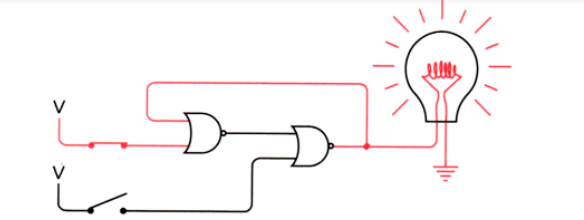
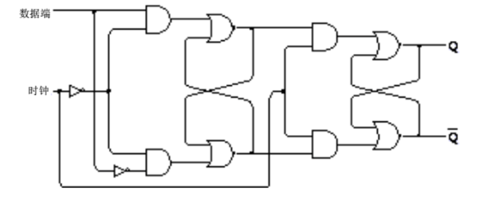
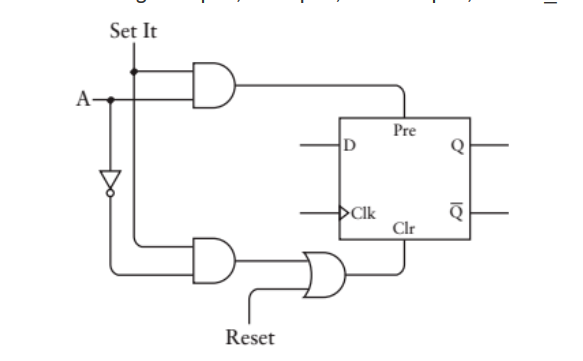
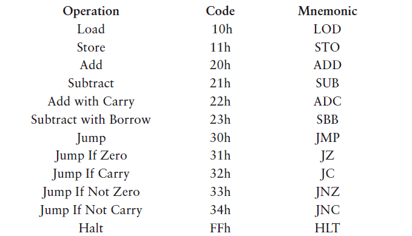

转载别人做好的笔记：

[计算机最最最底层的 工作原理是怎么运行的_计算机底层是 电子运行嘛_a1174858163的博客-CSDN博客](https://blog.csdn.net/a1174858163/article/details/80292062)

通过继电器来理解计算机硬件：

继电器的电流磁效应的原理，使得他能作为一个很好的开关

且由电流控制。

# 进制的转换：
## N—>T 如2,8,16—>10：
N进制的值，如123，他的每一位可以看成上一位的进位数。

第一步，123每一位代表的实际是1xN^2   2xN^1  <u>3xN^0</u>

也可以写成1xN^2   2xN^1  <u>3x1</u>。

也即是说这是一个带权重的数，第一位的权重时1，第二位的权重是N，第三位的权重是N^2。

也可以看成有N^2 的个数为1  N^1的个数为2  <u>1的个数为3</u>。

此处，实际上也可以看成每一位的十进制的数值

第二步，将N进制各位代表的十进制数转化为T进制相加。

各位数相加：1xN^2  + 2xN^1 + 3xN^0。此处的加法符号代表的是T进制的加法，所以N进制的每一位代表的值相加时要以T进制的进位法则来计算。

总结：这么看起来，在进制转换的时候好像都是要把任意进制的值转化为10进制这个中间进制。实际上不是的，此处10进制数值的意义在于其计数系统（阿拉伯数字系统）代表的现实意义。看起来是转化为10进制实际上，由于一直以来我们习惯以阿拉伯数字作为数学的数字系统。并且我们从小到大已经潜移默化得将阿拉伯数字的加减乘除简单运算表熟记于心，熟练地看到阿拉伯数字便能知道它代表的现实意义。例如：对于10进制123，他代表的是有123个苹果或者其他物品的意思，也即是这个数值具有的计数能力。得益于我们从小便背诵的加减乘除表，下意识便知道简单运算的10进制结果如123+10=133。

因此，我们根深蒂固地以十进制看待世间万物，而忽视了阿拉伯数字乃至任何计数系统的最原始的计数意义。反过来说，如果我们从小熟背N进制的基本运算表，那么我们也总会将其他进制转换为N进制来计算。

## 10—>2 ,8,16
反除法：除商反向取余法

## 2的幂次方特殊进制的转换 8,16<-->2
1、八进制数转换成二进制  
原理：八进制数的一位是二进制数的三位

如1010001，拆为1   010   001   得    121

2、十六进制数转换成二进制  
原理：十六进制数的一位是二进制数的四位

# 逻辑门电路
## 或
| OR | 0 | 1 |
| --- | --- | --- |
| 0 | 0 | 1 |
| 1 | 1 | 0 |

## 与
| AND | 0 | 1 |
| --- | --- | --- |
| 0 | 0 | 0 |
| 1 | 0 | 1 |

## 反向器
## 
## 与非门
| NAND | 0 | 1 |
| --- | --- | --- |
| 0 | 1 | 1 |
| 1 | 1 | 0 |

## 或非门
| NOR | 0 | 1 |
| --- | --- | --- |
| 0 | 1 | 0 |
| 1 | 0 | 0 |

## 异或门
| XOR | 0 | 1 |
| --- | --- | --- |
| 0 | 0 | 1 |
| 1 | 1 | 0 |

异或门

## 同或门
| XNOR | 0 | 1 |
| --- | --- | --- |
| 0 | 1 | 0 |
| 1 | 0 | 1 |

[通过与非门构建异或门 · 从零开始打造一台简易计算机](https://www.xiaogd.net/book/spcp/gate/xor-gate-by-nand-gate.html)

## 半加器
二进制加法会产生进位位和加法为，俩个的真值表为

| +加和 | 0 | 1 | | +进位 | 0 | 1 |
| --- | --- | --- | --- | --- | --- | --- |
| 0 | 0 | 1 | | 0 | 0 | 0 |
| 1 | 1 | 0 | | 1 | 0 | 1 |

可以由逻辑门的异或门和与门得到半加器

因为半加器只做到的最低有效位的加法，但是无法对带进位的二进制加法进行计算，因为他缺少一个进位输入

## 全加器

AB半加后的加和输出再和CI进位半加，俩个半加的进位输出则通过或门连接。！！这里使用或门，是因为俩个半加器的进位输出是不可能同时为1的。

## （行波进位）八位加法器
八个全加器的进位输出是下一个的进位输入

行波进位加法器的速度取决于位数乘以一个全加器的速度

## （超前进位）加法器
[【HDL系列】超前进位加法器原理与设计](https://zhuanlan.zhihu.com/p/101332501)

[数电——超前进位加法器 - 一曲挽歌 - 博客园](https://www.cnblogs.com/yiquwange/p/14988026.html)

# 二进制减法
减法涉及到对前一位借位。

## （十进制）对9求补数
从一串9中减去一个数。

减法变为：被减数-减数

                 =被减数-减数+1000-1000

                 =被减数+（999-减数）+1-1000

                 =被减数+9的补数+1-1000

结尾减法变为了俩个加法和俩个减法，避借位。

！！注意这里需要减数要小于被减数，如果大于则要交换被减数，结果取负数。

## （二进制）对1求补数
从一串1中减去一个数

因为二进制对一求补数不需要用到减法，只需要相应位数取反即可。

所以对一求补数也被称为反码（verse）或者相反数（negation）

同理：被减数-减数

          =被减数-（减数的反码）+1-100000

## 求补器（反码）

## 

SUB为减法转换开关，为1则表示减法。

这里最精华的一点就在于，SUB信号同时作为加法器的CI进位输入，他同时完成了取反和+1俩个操作。

CO进位输出信号，加法时，表示加法结果大于255。

减法时，CO为0表示减数大于被减数，结果为负数，异或门输出为1。

CO为1表示被减数大于减数，在减法的最后一步要减去100000000，异或门输出为0

## 以下假设我们能够预知所使用的数字的位数或范围，则我们可以利用补数，大于这个位数的数被忽略或被表示为负数
## （十进制）对10求补数
我的理解：对于正数，999+正数+1

   对于负数，999+负数+1

对于正数，补码和原码不变，表示000-999

对于负数，补码为反码加1，这里利用了负数的负号，-1~-999表示为999~1

所以，综合来说0~999即表示正数也表示负数的范围是-500~499

## （二进制）对2求补数
同理，补码=反码+1

比如8位二进制，最高位为符号位，则能表示的数字为-128~127

如果符号位相同，即负数和负数相加或正数和正数相加，符号位不同，即溢出了，我们认为结果是无效的。

## 减法思路：
（200-150） 10           （11001000 -10010110）2

=200+（150的补码）   11001000+ 01101010

=200+106                     11001000+ 01101010

=306                             1<u>00110010</u>

=低八位即为结果，进位输出为1

实际上减法的进位输出通常为1 

# 振荡器（时钟）
输出同时作为输入：

# 反馈与触发器——一个能计数的电路必然需要触发器
## 反馈：
闭合或断开上的开关：

闭合或断开下面的开关

从结果看，当俩个开关都断开时，电路有俩个稳定态，这类电路统称为触发器（Flip-Flop）。触发器可以保持信息。

实际上这类触发器保持信息依旧需要电源的供电。	

## RS触发器

[【基础】RS触发器_外来物种的博客-CSDN博客](https://blog.csdn.net/dmlk31/article/details/115773484)

RS触发器能记住哪一个输入端的最终状态为1.

## 电平触发的D型触发器：（锁存器）
增设一个保持位，当保持位位1时，电路能存储数据。需要俩个与门。

将S端设为数据输入端，R端为S反向。而保持位通常标记为时钟信号。

## 2-1选择器：  
	利用与门的特性（最小的输入为输出）和或门特性（最大的输入为输出）。

选择端S为1，则输出f为w1的输入

## 边沿触发的D型触发器（由倆级RS触发器组成）

注：小三角表示为边沿触发的D触发器

边沿触发的D型触发器：

只有当时钟信号从0跳变为1时，才会引起输入的改变.

原理：  
	第一级RS触发器由时钟信号取反控制，Clk为0，为开放状态，Clk为1，则为锁存状态。

第二级RS触发器由Clk直接控制，Clk为0，为开锁存状态，Clk为1，为开放状态。

当Clk为0时，一级RS开放，但二级为锁存，一级影响不了二级，此时数据端输入和一级RS的Q逆端同步。

当Clk从0跳变为1时，一级RS锁死，存储跳变之前的数据位，二级RS开放，受一级RS的输入影响。此时数据端影响不了一级RS，所以也就影响不了二级输出。

当Clk为1时，同理，数据端无法改变一级，即使二级为开放状态，输出也为1级锁存的数据。

当Clk从1跳变为0，一级开放的同时，二级锁死。且由于clk经过反向后才输入到一级RS，所以信号传播速度小于二级RS。二级同样保持之前Clk从0跳变为1时的数据。

## 带清零和预置的D型边缘触发器：

清零或者预置一个为1的时候，带入图片很好理解，清零为1， 则Q为0，预置为1，则Q为1，都不受时钟和D影响。  
难理解的是当清零和预置都设为0的时候，时钟为0或1是怎么阻断D的。为了方便观察，我们去掉为0的清零和预置的所有线路，得到我画的图。  
1、当时钟为0，经过非门输出1，输入到G4和G5或非门，输出的Q4和Q5一定都为0，这时候G1和G2门输入端都是打开状态，所以输入的D不会影响Q。深入理解下，这个时候Q6=非D，Q3=非Q6=非非D=D。（由于G4和G5锁定了,所以无法继续传输下去）  
2、当时钟从0转变为1时，可以理解为G3和G4门被打开了，这时候Q3和Q6就能决定G4和G5的输出端了！Q4=非Q3=非D，Q5=非Q6=D。说明Q4和Q5一个为0，另一个就一定是1！经过一个最基本G1和G2的触发器，最后的Q=Q1=Q5=D！  
3、当时钟为1时，从第2条中已经看出Q4和Q5一定相反，  
（1）那我们就假设Q4=1时，这时候G3和G5门被锁定，不受Q6的输入影响！也就不受D输入影响！  
（2）假设Q5=1时，G6门被锁定，不受D输入影响！  
4、当时钟从1转变为0时，G4和G5邮被重新锁定，Q4和Q5又被重置为0，处于打开状态，所以不会影响Q！  
总结，只有当时钟从0转变为1时，输出端的Q才会有可能发生转变！

## 分频器

| 输入 | | 输出 |
| --- | --- | --- |
| D | Clk | Q | Q逆 |
| 1 | 0 | 0 | 1 |
| 1 | ⬆ | 1 | 0 |
| 0 | 1 | 1 | 0 |
| 0 | 0 | 1 | 0 |
| 1 | ⬆ | 0 | 1 |
| 1 | 1 | 0 | 1 |

从上图真值表可以看出，每当时钟从0到1时，Q段输出就会发生变化。且 Q端为0和1持续的时间相同。

## 八位行波计数器

将分频器串联，得出如下各输出信号

充分利用了D型触发器俩个输出端相反、反馈以及振荡器的特点。

上方输出信号旋转90度，发现得到的是二进制数

# 存储器

利用电平触发的D型触发器当作1位锁存器并联

得到八位锁存器

## 8-1选择器：
上方我们已经知道8位锁存器的结构，那么我们接下来如果想要知道这八位锁存器的某一位该怎么办呢？

由三个开关S、八个4输入端与门、一个8端口输入或门组成。

那么我们可以利用三个开关S的8中不同状态，代表8位，再利用了与门的特性，八个状态中每次只有一个与门的输入全为1，其他与门都为0.

## 3-8译码器
现在我们还想把锁存器的8个并行数据输入端口和8个写入信号。因为我们可能需要单独向某一个寄存器进行写入，所以需要一个独立的写入信号，能够按照规定线路发送到任意一位锁存器。

发现这个线路和上方的8-3选择器十分相似，8-3选择器时8个输入信号，只有一个输出。

但他只有 一个数据输入信号（写入信号），却又八个输出信号，而且只有一个输出信号为1，每次只能写入某一个特定的锁存器

## 随机访问存储器（RAM：Random Access memory）

这边的选择信号S，也被称为地址端口（address），长度为3的地址决定了8个锁存器的哪一个被引用

这样哦我们获得了一个8x1的RAM阵列

同理：  
	我们如果想要得到16x1的RAM阵列，我们只需要i将俩个8X1RAM再通过一个2-1选择器连接起来

可以发现：RAM阵列的存储容量和地址输入端的数量有直接关系：  
			RAM容量=2地址输入端个数 x存储单位

上方，RAM存储64K*8个bit信息，而且由于有八个数据输入信号，相当于8bit为一组，同时有16位地址输入端，有64K个组，即64KB

# 自动操作
如何利用累加器和存储器实现自动累加呢？

利用振荡器和16位计数器。

振荡器作为时钟信号，16位计数器既可以从地址0000h开始传递信号给存储器。振荡器从0跳变为1时，计数器加1，同时累加器中的8bit锁存器锁存数据，再循环累加，重复操作。

再改变一下电路，让累加后的结果能存储回RAM存储器：

但是，具有缺点：

    1. 这样只能启动但不能停止累加。
    2. 只能做加法运算，而且加法的结果只能小于255

## 机器指令
因此，我们需要一种来控制RAM写入信号的方法。

让自动加法器能做到，Load，Add，Store，Halt指令

我们就可以将代码指令和数据分离开存放在俩个存储器中

上方的电路已经可以做到Save：自动加法器的8位锁存器的输出作为RAM的数据输入。

为实现Load和Add：（Load指令时）数据RAM的输出作为也要作为锁存器的输入，（Add指令是）8位锁存器的输入是加法器的输出，这里利用了2-1选择器来实现。

上方电路缺少的是控制所有这些组件的信号线路，他们统称为控制信号。这些信号可以通过逻辑门的各种组合来实现。

## 减法操作Subtract指令：
实现减法操作时，我们需要将RAM传出的数据取反，同时加法器的进位输入置1，而其它操作和加法操作相同。

所以只要继续在电路中加入一个取反器，而何时取反？则是根据控制信号C0实现，也即使操作码Add（20h）和Subtract（21h）的最低一位有效位来控制.  

## 进位锁存：（实现多字节加减法）
我们现在的电路是8位的数据带宽，那么我们如果需要进行16位加法或减法，该如何进行呢？

虽然一般设备的设备都有俩个加法器连在一起，构成16位设备.但是，我们依旧可以通过增加进位锁存器来实现。

对于多字节加法：

低字节的8位相加后进位锁存器用来存储进位输出，用于高字节的相加的进位输入。

低字节使用Add指令后，进位输出被锁存进进位锁存器。高字节相加时，则需要使用Add with Carry指令，利用进位锁存器作为进位输入。

对于多字节减法：

通常，Subtract需要将减数取反然后进位输入置1.而且！！进位输出通常为1，因此被忽略。

但对于多字节减法，进位输出因该保存在进位锁存器中，作为高字节减法进位输入，使用Subtract with Borrow指令

## 机器指令的操作数（目的地址和源地址）

目前我们设计的电路以及代码实际上是不完善的，当前设计的自动加法器不允许在随后的计算中重复使用前面的计算结果，因为他的代码存储器和数据存储器是同步的，顺序的。代码指令始终只能操作当前所在的地址的数据，而不能跳转。

再次改变我们的设计：

这次，我们把指令（代码和数据的地址称为一条指令，先得到数据的地址，在根据地址取数据）放在一个RAM中，把数据存在另一个RAM中，并加了3个8位锁存器（临时存放8位数据），示意图只画出了改变的部分，其余部分与原来保持一致（累加器和代码解析器还有相应的控制信号）。指令占1个字节，16位的数据地址占2个字节，一条指令共占用3个字节，每次从RAM中取出1个字节，所以每次取出一条完整指令需要3次计数，数据地址再次传给存储器（这里多加了一个RAM），RAM取出数据传给加法器，而代码的解析与数据传输到加法器进行计算操作也需要1次计数，这必然需要更加复杂的控制信号。

从存储器中取出一条完整指令的过程叫做取指令，机器响应指令码的一系列操作的过程叫做执行指令。

## JUMP指令
对于上方的电路图中，指令还是机械的顺序的往下执行，会不会出现这种情况，顺序执行指令，可是数据和指令地址冲突（要存指令的地址处已经有了重要的数据，需要跳过），指令能否跳过某一段区域，继续执行呢？

这涉及到指令寻址方式的改变

首先我们还是来修改一下带预置和清零功能的D型边沿触发器，如下，A代表地址。

一般来说单纯的带预置和清零功能的D型边沿触发器S和R不能同时为1，S为1，则Q为1，R为1，则Q为0 

此处，我们将S预置设为1，而R清零始终为0.  利用地址A来控制S和R。这样可以得到，A为1则Pre为1，Clr为0，A为0则Pre为0，Clr为1.

于是在上一步电路基础之上，为16位计数器的每一位都设置一个这样的触发器。一旦加载了某个特定的值，计数器就开始从该值开始计数，增加了一条从锁存器到计数器的数据通路，实现了Jump指令

## 零标志位及条件跳转

这种锁存器叫零锁存器，当8位加法器输出为零时他锁存的值才是1。

再利用halt指令为FFh，一个数与FFh相加，结果为原数减一，可以为指令表新增4条指令。

需要记住的是Store不会影响0标志位的值，只有ADD|，ADC，SUB，SBB才能影响0标志位的值

对于非零跳转指令JNZ只有在零锁存器输出为0时（即上述操作输出部位1时）才会跳转到指定的地址，如果上一步的加法、减法、进位加法或者借位减法运算结果为0时，将不会发生跳转。只需要在常规的跳转命令的控制信号之上再加一个控制信号。

现在可以说，我们这台不断完善的机器真的可以称得上是一台真正意义上的computer了！条件跳转指令将计算器和计算机真正区分开来。

## **汇编语言**
把上述机器码表示成助记符的形式

