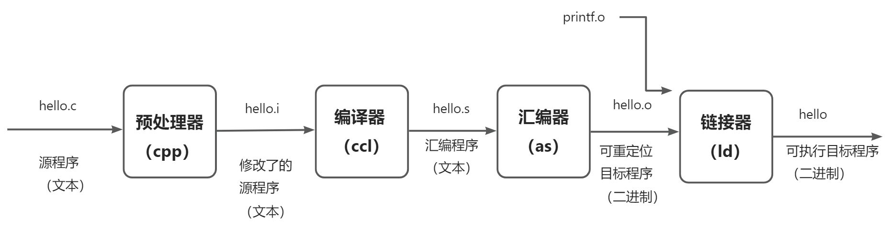
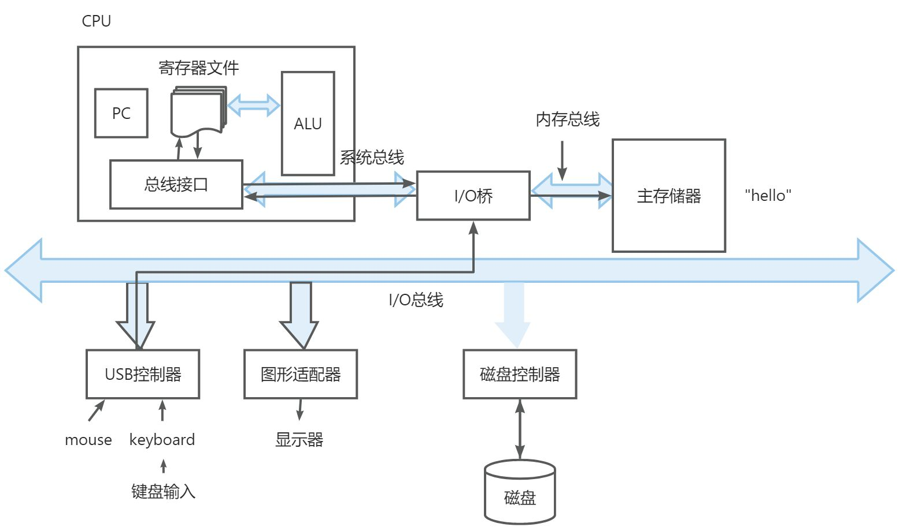
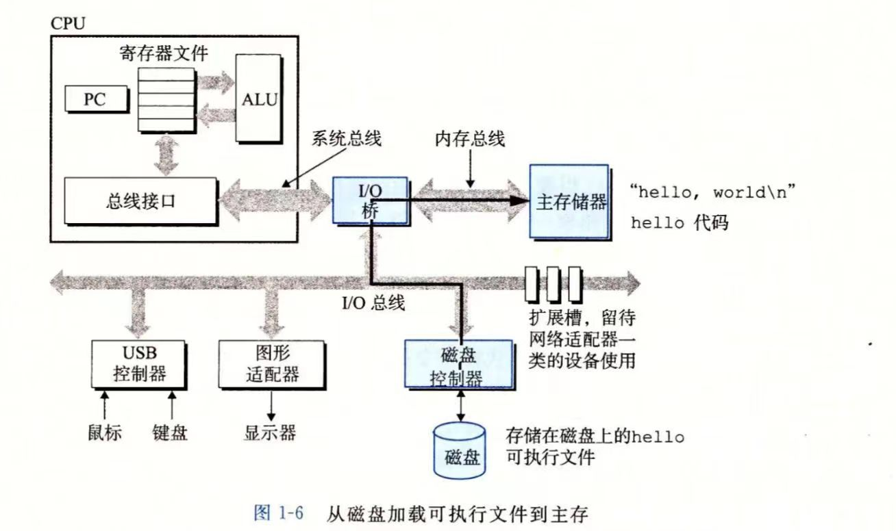
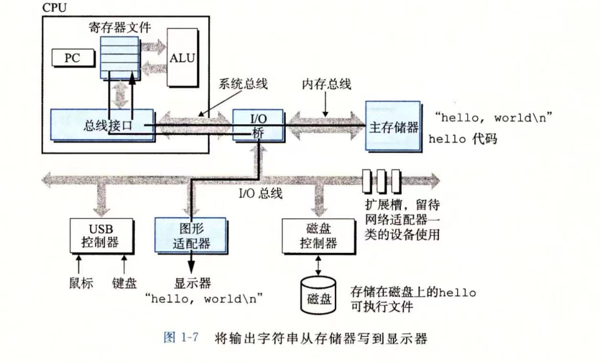
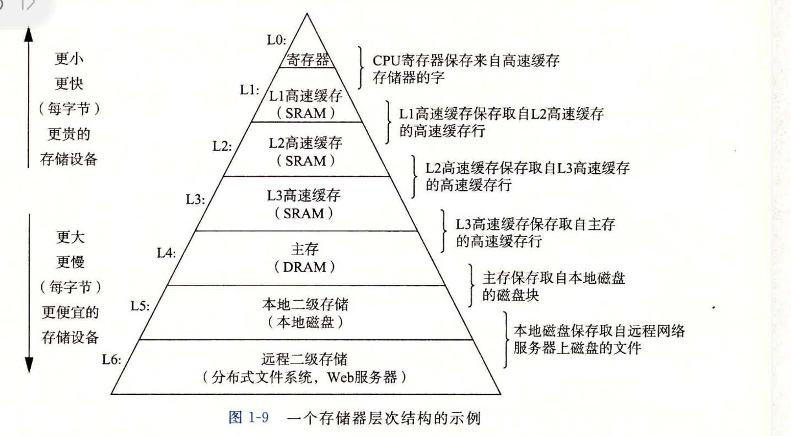

# 一、计算机系统概况
计算机系统是由硬件和软件系统组陈大哥，共同工作来运行应用程序

## 1.1 信息就是 位＋上下文
以hellow world 为例

```c
#include <stdio.h>
int main()
{
    printf("Hello World!");
    return 0;
}
```

### 源程序/源文件：
+ 通过编译器创建并保存的文本文件，为 .c 文件。
+ 源程序实际上是由值0和1组成的 位（比特）序列 ，8比特（位）为一个字节
+ ASCII标准：利用一个唯一的 单字节 大小的 整数值 来表示每一个字符
+ .c程序以字节序列存储在文件夹中，每个字节都有一个整数值，对应某个字符
+ 文本文件：像hello.c这样<font style="background-color:#FADB14;">只有ASCII字符构成的文件</font>称为文本文件，所有<font style="background-color:#FADB14;">其他文件</font>都叫<font style="background-color:#FADB14;">二进制文件</font>

### 基本思想：系统中的所有信息——包括磁盘文件、内存中的程序、网络上传送的数据，都是由一串比特串表示的。区分不同数据对象的唯一方法就是 我们读取到的数据对象的上下文。不同的上下文，一个相同字节序列可能为整数、浮点数、字符串或机器指令。
<font style="color:#E8323C;">理解数字的机器表示方式！！！机器表示的数字与实际的整数和实数不同，是对真值的有限近似值</font>

## 1.2程序的翻译过程
### 编译系统的四个阶段：执行<font style="background-color:#FADB14;">预处理器、编译器、汇编器、链接器</font>这四个阶段的程序一起<font style="background-color:#FADB14;">构成了汇编系统</font>


#### 预处理阶段：
+ 预处理器（cpp）根据字符#开头的命令，修改原始c程序。如头文件stdio会被读取并插入到程序文本中。得到 .i 文件

#### 编译阶段：
+ 编译器（ccl）将.i文件翻译成文本文件.s, <font style="background-color:#FADB14;">转换为汇编语言</font>程序 ，以文本格式描述汇编语言

#### 汇编阶段：
+ 汇编器（as）将.s文件翻译成机器语言指令，并把这些指令打包成一种叫做可重定位目标程序的格式，并将结果保存在.o文件中。.o是二进制文件。

#### 链接阶段：
+ 链接器（ld）负责处理机器语言中的合并，如hello程序调用了printf函数，printf函数存在于一个名为printf.o的预编译好的目标文件中，该文件需合并到hello.o文件中

## 1.3为什么需要了解编译系统工作原理
1. 优化程序性能：第3、6章
2. 理解链接时出现的错误：第7章
3. 避免安全漏洞：第三章

## 1.4处理器读到并解释存储在内存中指令
可执行文件hello.o经编译系统后存放在磁盘，Linux系统上运行需要把文件输入到Shell（命令解释器）中

### 1.4.1系统的硬件组成
#### 总线：贯穿系统的一组电子管道，携带信息字节并负责在各个部件间传递。一般传送定长的字节快，即字（word）。字中的字节数一般为32位或64位
#### I/O设备：系统与外界的联系通道，每个I/O设备都通过控制器/适配器与I/O总线相连来传递信息。
#### 控制器：I/O设备本身或主板上的芯片组
#### 适配器：插在主板插槽上的卡
#### 主存：临时存储设备，用来存放程序和程序处理的数据。<font style="background-color:#FADB14;">由DRAM（动态随机存取存储器）芯片组成</font>。逻辑上，每个存储器是一个线性的字节数组，每个字节都有其唯一的地址（数组索引）。
#### 处理器：中央处理单元（CPU），解释和执行存储在主存中指令的引擎。CPU的<font style="background-color:#FADB14;">核心</font>是以一个大小为<font style="background-color:#FADB14;">一个字的寄存器</font>（或存储设备），称为<font style="background-color:#FADB14;">程序计数器（PC</font>-ProgramcCountor）。任何时刻，P<font style="background-color:#FADB14;">C都指向内存中某条机器语言指令</font>（即含有该指令的地址）。处理器按照一个<font style="background-color:#FADB14;">指令执行模型</font>来操作的，该模型由<font style="background-color:#FADB14;">指令集架构</font>决定。模型中，指令按严格的顺序执行，执行一条指令包含执行一系列的步骤。处理器<font style="background-color:#FADB14;">从PC指向的内存读取指令</font>，解释指令中的位，执行该指令指示的简单操作，然后更新PC，使其指向下一条指令，而这条指令并不一定与刚执行的指令相邻。
+ 简单操作：围绕主存、寄存器堆（寄存器文件）和算数/逻辑单元（ALU）进行。寄存器堆里的每个寄存器都有唯一的名字。ALU计算新的数据和地址值。
+ 例如：CPU在指令的要求下可能会执行这些操作
    1. 加载：从内存复制一个字节或一个字到寄存器，以覆盖寄存器原本的内容。
    2. 存储：从寄存器复制一个字或字节到主存某个位置，以覆盖该位置原本内容。
    3. 操作：把俩个寄存器的内容复制到ALU，ALU进行算术运算，将结果存放在一个寄存器中，以覆盖该寄存器原本内容。
    4. 跳转：从指令本身提取一个字，并将其复制到PC中，以覆盖PC中原本的值

#### 处理器<font style="background-color:#FADB14;">看上去</font>是他的指令集架构的简单实现。实际，现代计算机处理器使用非常复杂的机制来加速程序的执行。因此，将<font style="background-color:#FADB14;">处理器的指令集架构</font>和<font style="background-color:#FADB14;">微处理器的微体系架构</font>区分开来：
+ 处理器的指令集架构：描述的是每条机器代码指令的效果——第三章
+ 微处理器的微体系架构：处理器实际上如何实现的——第四章

### 1.4.2运行程序时 系统的操作
键盘读取hello命令：初始，Shell等待用户输入指令，输入字符串“./hellow"后，shell逐一将字符串读入寄存器，然后把他们存放到内存



磁盘加载到内存：将hello目标文件中的代码和数据从磁盘复制到内存。数据包括最终会输出的”hello world\n“




将输出字符串从存储器写到显示器：一旦目标文件代码和数据加载到内存，处理器就开始执行hello程序机器语言指令。这些指令将”hello world“字符串中的字节从主存复制到寄存器文件再从寄存器文件复制到显示设备，最终显示在屏幕上




## 1.5高速缓存
高速缓存：静态随机访问处理器（SRAM）的硬件技术

针对处理器与内存之间读取速度的差异

## 1.6存储器层次结构：上一层的存储器作为下一层存储器的高速缓存
从上至下，设备的访问速度越来越慢、容量愈来愈大




## 1.7操作系统管理硬件
### 操作系统的俩个基本功能：
1. 防止硬件被失控的程序滥用
2. 向应用程序提供简单一致的机制来控制复杂而又通常各不相同的低级硬件设备

操作系统<font style="color:#E8323C;">通过几个基本的抽象概念来实现这些功能</font>：进程、虚拟内存、文件

    - 文件是对I/O设备的抽象
    - 虚拟内存是对主存和磁盘I/O设备的抽象表示<font style="color:#E8323C;"></font>
    - 进程是对处理器、主存和I/O设备的抽象表示。

### 1.7.1进程   *****
1. <u>进程是对一个正在运行的程序的一种抽象</u>。
2. <u>并发运行</u>：一个进程的指令和另一进程的指令是交错执行的。一个CPU看上去像是再并发的执行多个进程，这是<u>通过处理器在进程间切换来实现的</u>
3. <font style="background-color:#FADB14;">上下文切换：操作系统实现这种交错执行的机制</font>
4. 上下文：操作系统保持跟踪进程运行所需的所有状态信息。

任何时刻，单处理器系统都只执行一个进程的代码。当操作系统决定把控制权从当前进程转移到某个新进程是，就会<font style="background-color:#FADB14;">进行上下文切换</font>，<font style="color:#E8323C;">即保存当前进程的上下文，恢复新进程的上下文，然后传递控制权给新进程。新进程就会从它上次停止的地方开始。</font>

1. 系统调用函数：用于进程切换。系统调用会将控制权传递给操作系统。操作系统进行上下文切换
2. 操作系统的<font style="background-color:#FADB14;">内核（kernel）</font>：操作系统代码常驻内存的部分。<u>从一个进程到另一个进程的转换是由内核管理的。</u>当应用程序需要操作系统的某些操作时，<u>就会执行</u><u><font style="color:#E8323C;">系统调用</font></u><u>指令</u>，将控制权传递给内核，然后内核执行被请求的操作并返回应用程序。

注意，<u><font style="color:#E8323C;">内核</font></u><u>不是一个独立的进程</u>，相反，<font style="background-color:#FADB14;">是系统管理全部进程所用代码和数据结构的集合。</font>

### 1.7.2线程
现代系统中，一个进程实际上可以由多个称为<u>线程</u>的<u>执行单元</u>组成，每个线程都运行在进程的上下文中，并共享同样的代码和全局数据，所以多线程比多进程之间更容易共享数据。当有多处理器可用时，多线程也是使程序运行更快的方法。

### 1.7.3虚拟内存


